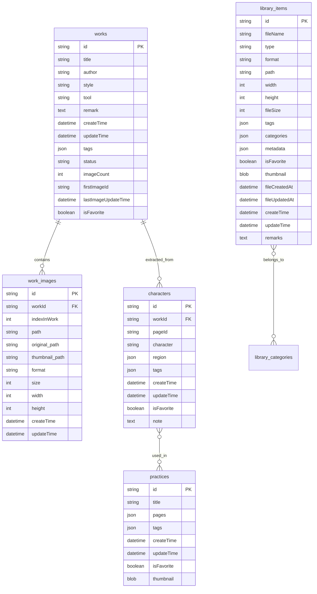
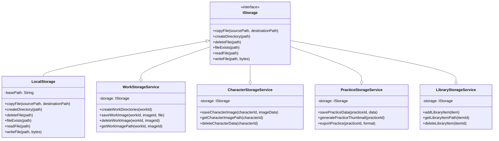
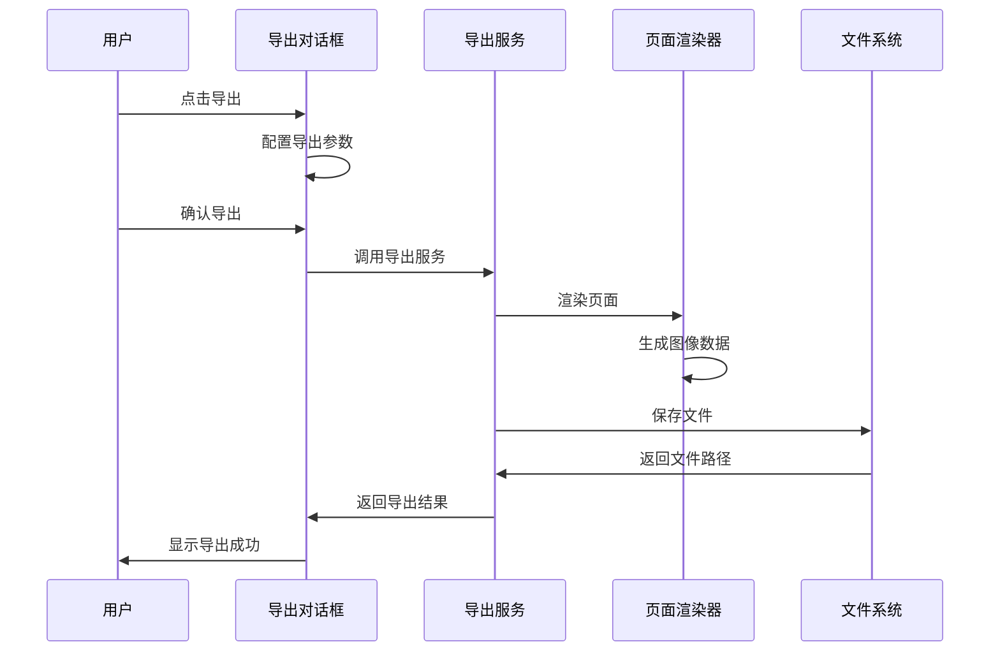

# Flutter书法练习应用数据关系分析及导出功能设计方案

## 1. 项目概述

本文档分析Flutter书法练习应用的数据存储架构，包括数据库设计、文件存储结构以及导出功能的完整设计方案。

### 1.1 项目特点

- **应用类型**: 书法练习与作品管理应用
- **技术架构**: Flutter + SQLite + 本地文件存储
- **核心功能**: 作品管理、集字功能、字帖编辑、图库管理
- **状态管理**: Riverpod
- **架构模式**: 清洁架构 (Clean Architecture)

## 2. 数据库设计分析

### 2.1 数据库概述

项目使用SQLite作为本地数据库，采用17个版本的渐进式迁移脚本进行数据库结构演进。

### 2.2 核心数据表

#### 2.2.1 作品表 (works)

```sql
CREATE TABLE works (
  id TEXT PRIMARY KEY,              -- 作品唯一标识(UUID)
  title TEXT NOT NULL,              -- 作品标题
  author TEXT,                      -- 作者
  style TEXT,                       -- 书法风格(动态配置)
  tool TEXT,                        -- 书写工具(动态配置)
  remark TEXT,                      -- 备注
  createTime TEXT NOT NULL,         -- 创建时间(ISO8601)
  updateTime TEXT NOT NULL,         -- 更新时间(ISO8601)
  tags TEXT,                        -- 标签列表(JSON字符串)
  status TEXT NOT NULL DEFAULT 'draft', -- 状态
  imageCount INTEGER DEFAULT 0,     -- 图片数量
  firstImageId TEXT,                -- 首图ID
  lastImageUpdateTime TEXT,         -- 图片最后更新时间
  isFavorite INTEGER NOT NULL DEFAULT 0 -- 是否收藏
);
```

**关键特性**:
- 支持多图片管理
- 动态配置的风格和工具
- 自动维护图片计数和首图信息

#### 2.2.2 作品图片表 (work_images)

```sql
CREATE TABLE work_images (
  id TEXT PRIMARY KEY,              -- 图片唯一标识
  workId TEXT NOT NULL,             -- 关联作品ID
  indexInWork INTEGER NOT NULL,     -- 在作品中的索引
  path TEXT NOT NULL,               -- 文件路径
  original_path TEXT,               -- 原始路径
  thumbnail_path TEXT,              -- 缩略图路径
  format TEXT NOT NULL,             -- 文件格式
  size INTEGER NOT NULL,            -- 文件大小
  width INTEGER NOT NULL,           -- 图片宽度
  height INTEGER NOT NULL,          -- 图片高度
  createTime TEXT NOT NULL,         -- 创建时间
  updateTime TEXT NOT NULL,         -- 更新时间
  FOREIGN KEY (workId) REFERENCES works (id) ON DELETE CASCADE
);
```

**关键特性**:
- 支持多种图片格式
- 维护图片在作品中的顺序
- 包含完整的图片元数据

#### 2.2.3 集字表 (characters)

```sql
CREATE TABLE characters (
  id TEXT PRIMARY KEY,              -- 字符唯一标识
  workId TEXT NOT NULL,             -- 关联作品ID
  pageId TEXT NOT NULL,             -- 页面ID
  character TEXT NOT NULL,          -- 汉字内容
  region TEXT NOT NULL,             -- 区域信息(JSON)
  tags TEXT,                        -- 标签列表
  createTime TEXT NOT NULL,         -- 创建时间
  updateTime TEXT NOT NULL,         -- 更新时间
  isFavorite INTEGER DEFAULT 0,     -- 是否收藏
  note TEXT,                        -- 备注
  FOREIGN KEY (workId) REFERENCES works (id) ON DELETE CASCADE
);
```

**关键特性**:
- 存储从作品中提取的汉字
- 包含位置和区域信息
- 支持收藏和标签管理

#### 2.2.4 字帖表 (practices)

```sql
CREATE TABLE practices (
  id TEXT PRIMARY KEY,              -- 字帖唯一标识
  title TEXT NOT NULL,              -- 字帖标题
  pages TEXT NOT NULL,              -- 页面数据(JSON)
  tags TEXT,                        -- 标签列表
  createTime TEXT NOT NULL,         -- 创建时间
  updateTime TEXT NOT NULL,         -- 更新时间
  isFavorite INTEGER DEFAULT 0,     -- 是否收藏
  thumbnail BLOB                    -- 缩略图数据
);
```

**关键特性**:
- 存储完整的页面内容和布局
- 支持缩略图预览
- 灵活的JSON格式存储

#### 2.2.5 图库表 (library_items)

```sql
CREATE TABLE library_items (
  id TEXT PRIMARY KEY,              -- 项目唯一标识
  fileName TEXT NOT NULL,           -- 文件名
  type TEXT NOT NULL,               -- 文件类型
  format TEXT NOT NULL,             -- 文件格式
  path TEXT NOT NULL,               -- 文件路径
  width INTEGER NOT NULL,           -- 宽度
  height INTEGER NOT NULL,          -- 高度
  fileSize INTEGER NOT NULL,        -- 文件大小
  tags TEXT,                        -- 标签列表
  categories TEXT,                  -- 分类列表
  metadata TEXT,                    -- 元数据(JSON)
  isFavorite INTEGER DEFAULT 0,     -- 是否收藏
  thumbnail BLOB,                   -- 缩略图
  fileCreatedAt TEXT NOT NULL,      -- 文件创建时间
  fileUpdatedAt TEXT NOT NULL,      -- 文件更新时间
  createTime TEXT NOT NULL,         -- 记录创建时间
  updateTime TEXT NOT NULL,         -- 记录更新时间
  remarks TEXT                      -- 备注
);
```

#### 2.2.6 其他支持表

- **library_categories**: 图库分类管理
- **settings**: 应用配置存储
- **tags**: 标签管理

### 2.3 数据关系设计



### 2.4 数据库特性

#### 2.4.1 自动触发器

```sql
-- 自动更新作品图片计数
CREATE TRIGGER update_work_image_count_insert
AFTER INSERT ON work_images
BEGIN
  UPDATE works SET imageCount = (
    SELECT COUNT(*) FROM work_images WHERE workId = NEW.workId
  ) WHERE id = NEW.workId;
END;

-- 自动更新首图信息
CREATE TRIGGER update_work_first_image_on_insert
AFTER INSERT ON work_images
BEGIN
  UPDATE works SET 
    firstImageId = (
      SELECT id FROM work_images 
      WHERE workId = NEW.workId 
      ORDER BY indexInWork ASC LIMIT 1
    ),
    lastImageUpdateTime = strftime('%Y-%m-%dT%H:%M:%fZ', 'now')
  WHERE id = NEW.workId;
END;
```

#### 2.4.2 数据视图

```sql
-- 字符视图，包含作品信息
CREATE VIEW CharacterView AS
SELECT 
  c.id,
  c.character,
  c.isFavorite,
  c.createTime AS collectionTime,
  c.updateTime,
  c.pageId,
  c.workId,
  c.tags,
  c.region,
  c.note,
  w.style,
  w.tool,
  w.title,
  w.author
FROM characters c
LEFT JOIN works w ON c.workId = w.id;
```

## 3. 文件存储架构

### 3.1 存储目录结构

```
storage/
├── works/                          # 作品文件存储
│   ├── {workId}/                   # 单个作品目录
│   │   ├── cover/                  # 封面目录
│   │   │   ├── imported.png        # 处理后封面
│   │   │   └── thumbnail.jpg       # 封面缩略图
│   │   ├── images/                 # 图片目录
│   │   │   ├── {imageId}/          # 单张图片目录
│   │   │   │   ├── original.{ext}  # 原始图片
│   │   │   │   ├── imported.png    # 处理后图片
│   │   │   │   └── thumbnail.jpg   # 缩略图
│   │   │   └── ...
│   │   └── metadata.json          # 作品元数据
│   └── ...
├── characters/                     # 集字文件存储
│   ├── {workId}/                   # 按作品分组
│   │   ├── {characterId}/          # 单个字符目录
│   │   │   ├── original.png        # 原始裁剪图
│   │   │   ├── binary.png          # 二值化图像
│   │   │   ├── thumbnail.jpg       # 缩略图
│   │   │   └── outline.svg         # SVG轮廓(可选)
│   │   └── ...
│   └── ...
├── practices/                      # 字帖文件存储
│   ├── {practiceId}/               # 单个字帖目录
│   │   ├── practice.json           # 字帖数据
│   │   ├── thumbnail.jpg           # 缩略图
│   │   └── pages/                  # 页面资源
│   │       ├── page_1.png          # 页面预览图
│   │       └── ...
│   └── ...
├── library/                        # 图库文件存储
│   ├── items/                      # 图库项目
│   │   ├── {itemId}/               # 单个项目目录
│   │   │   ├── original.{ext}      # 原始文件
│   │   │   ├── thumbnail.jpg       # 缩略图
│   │   │   └── metadata.json       # 项目元数据
│   │   └── ...
│   └── categories/                 # 分类数据
├── cache/                          # 缓存目录
│   ├── images/                     # 图片缓存
│   ├── processing/                 # 处理缓存
│   └── temp/                       # 临时文件
├── backups/                        # 备份文件
│   ├── backup_20241201_120000.zip  # 自动备份
│   └── ...
└── exports/                        # 导出文件
    ├── works_export_20241201.zip   # 作品导出
    ├── practices_export.pdf        # 字帖导出
    └── ...
```

### 3.2 文件命名规范

#### 3.2.1 图片文件命名

- `original.{ext}`: 保留原始格式和质量
- `imported.png`: 统一PNG格式处理图
- `thumbnail.jpg`: 统一JPG格式缩略图

#### 3.2.2 UUID命名策略

- 所有目录使用UUID命名确保唯一性
- 数据库ID与文件系统目录名保持一致
- 支持跨平台文件系统兼容性

#### 3.2.3 版本管理

- 保留原始文件避免质量损失
- 生成标准化处理版本
- 自动生成多尺寸缩略图

### 3.3 存储服务架构



## 4. 现有导出功能分析

### 4.1 字帖导出功能

#### 4.1.1 支持格式

- **PDF导出**: 支持A4、A3等标准页面格式
- **图片导出**: PNG、JPG格式，可调节质量
- **页面范围**: 全部页面、当前页面、自定义范围

#### 4.1.2 导出配置

```dart
class ExportOptions {
  final ExportType exportType;        // 导出格式
  final PageRangeType pageRangeType;  // 页面范围
  final double pixelRatio;            // 像素比例
  final PdfPageFormat? pageFormat;    // PDF页面格式
  final Map<String, dynamic> extraParams; // 额外参数
}

enum ExportType {
  pdf('pdf'),
  png('png'),
  jpg('jpg');
}

enum PageRangeType {
  all,      // 全部页面
  current,  // 当前页面
  custom    // 自定义范围
}
```

#### 4.1.3 导出流程



### 4.2 备份系统

#### 4.2.1 备份范围

- **数据库**: 完整的SQLite数据库文件
- **应用数据**: works、characters、practices、library目录
- **配置信息**: 应用设置和用户偏好

#### 4.2.2 备份格式

```
backup_YYYYMMDD_HHMMSS.zip
├── database/
│   └── app.db                    # 数据库文件
├── data/
│   ├── works/                    # 作品文件
│   ├── characters/               # 集字文件
│   ├── practices/                # 字帖文件
│   └── library/                  # 图库文件
└── backup_info.json             # 备份信息
```

#### 4.2.3 备份功能

- **自动备份**: 可配置间隔时间
- **手动备份**: 支持即时创建备份
- **备份管理**: 自动清理旧备份，保持指定数量
- **导入导出**: 支持备份文件的导入导出
- **完整恢复**: 支持从备份完全恢复数据

## 5. 导出功能设计方案

### 5.1 设计目标

#### 5.1.1 功能目标

- **统一导出接口**: 为不同数据类型提供一致的导出体验
- **多格式支持**: 支持JSON、CSV、PDF、图片、ZIP等格式
- **灵活配置**: 支持自定义导出范围和格式参数
- **批量操作**: 支持批量导出和批量处理
- **进度反馈**: 提供详细的进度信息和状态反馈

#### 5.1.2 技术目标

- **可扩展性**: 易于添加新的导出格式和数据类型
- **性能优化**: 支持大数据量的高效导出
- **错误处理**: 完善的错误处理和恢复机制
- **内存管理**: 避免大文件导出时的内存溢出

### 5.2 架构设计

#### 5.2.1 核心接口

```dart
/// 导出服务接口
abstract class IExportService<T> {
  /// 导出数据
  Future<ExportResult> export(
    List<T> data,
    ExportOptions options,
    String outputPath, {
    ProgressCallback? onProgress,
  });
  
  /// 获取支持的导出格式
  List<ExportFormat> getSupportedFormats();
  
  /// 验证导出选项
  bool validateOptions(ExportOptions options);
}

/// 导出结果
class ExportResult {
  final bool success;
  final String? filePath;
  final String? errorMessage;
  final Map<String, dynamic>? metadata;
  
  const ExportResult({
    required this.success,
    this.filePath,
    this.errorMessage,
    this.metadata,
  });
}

/// 导出选项
class ExportOptions {
  final ExportFormat format;
  final Map<String, dynamic> parameters;
  final ExportRange? range;
  final CompressionLevel compression;
  
  const ExportOptions({
    required this.format,
    this.parameters = const {},
    this.range,
    this.compression = CompressionLevel.medium,
  });
}

/// 导出格式
enum ExportFormat {
  json,
  csv,
  pdf,
  png,
  jpg,
  zip,
  excel,
}

/// 导出范围
class ExportRange {
  final int? startIndex;
  final int? endIndex;
  final List<String>? specificIds;
  final DateTime? startDate;
  final DateTime? endDate;
  
  const ExportRange({
    this.startIndex,
    this.endIndex,
    this.specificIds,
    this.startDate,
    this.endDate,
  });
}
```

#### 5.2.2 导出管理器

```dart
/// 导出管理器
class ExportManager {
  final Map<Type, IExportService> _services = {};
  
  /// 注册导出服务
  void registerService<T>(IExportService<T> service) {
    _services[T] = service;
  }
  
  /// 导出数据
  Future<ExportResult> export<T>(
    List<T> data,
    ExportOptions options,
    String outputPath, {
    ProgressCallback? onProgress,
  }) async {
    final service = _services[T] as IExportService<T>?;
    if (service == null) {
      throw UnsupportedError('No export service registered for type $T');
    }
    
    return await service.export(data, options, outputPath, onProgress: onProgress);
  }
  
  /// 获取支持的格式
  List<ExportFormat> getSupportedFormats<T>() {
    final service = _services[T] as IExportService<T>?;
    return service?.getSupportedFormats() ?? [];
  }
}
```

### 5.3 具体导出服务实现

#### 5.3.1 作品导出服务

```dart
/// 作品导出服务
class WorkExportService implements IExportService<WorkEntity> {
  final WorkRepository _workRepository;
  final WorkStorageService _workStorage;
  
  WorkExportService(this._workRepository, this._workStorage);
  
  @override
  Future<ExportResult> export(
    List<WorkEntity> works,
    ExportOptions options,
    String outputPath, {
    ProgressCallback? onProgress,
  }) async {
    switch (options.format) {
      case ExportFormat.json:
        return await _exportToJson(works, options, outputPath, onProgress);
      case ExportFormat.zip:
        return await _exportToZip(works, options, outputPath, onProgress);
      case ExportFormat.csv:
        return await _exportToCsv(works, options, outputPath, onProgress);
      default:
        throw UnsupportedError('Format ${options.format} not supported for works');
    }
  }
  
  /// 导出为JSON格式
  Future<ExportResult> _exportToJson(
    List<WorkEntity> works,
    ExportOptions options,
    String outputPath,
    ProgressCallback? onProgress,
  ) async {
    try {
      final exportData = {
        'metadata': {
          'version': '1.0',
          'exportTime': DateTime.now().toIso8601String(),
          'totalWorks': works.length,
        },
        'works': await Future.wait(
          works.asMap().entries.map((entry) async {
            final index = entry.key;
            final work = entry.value;
            
            onProgress?.call(index + 1, works.length, '正在处理作品: ${work.title}');
            
            return {
              'id': work.id,
              'title': work.title,
              'author': work.author,
              'style': work.style,
              'tool': work.tool,
              'createTime': work.createTime.toIso8601String(),
              'updateTime': work.updateTime.toIso8601String(),
              'tags': work.tags,
              'status': work.status.name,
              'isFavorite': work.isFavorite,
              'images': await _exportWorkImages(work),
            };
          }),
        ),
      };
      
      final jsonString = const JsonEncoder.withIndent('  ').convert(exportData);
      final file = File(outputPath);
      await file.writeAsString(jsonString, encoding: utf8);
      
      return ExportResult(
        success: true,
        filePath: outputPath,
        metadata: {
          'format': 'json',
          'size': await file.length(),
          'workCount': works.length,
        },
      );
    } catch (e, stack) {
      return ExportResult(
        success: false,
        errorMessage: 'JSON导出失败: $e',
      );
    }
  }
  
  /// 导出为ZIP格式(包含文件)
  Future<ExportResult> _exportToZip(
    List<WorkEntity> works,
    ExportOptions options,
    String outputPath,
    ProgressCallback? onProgress,
  ) async {
    try {
      final archive = Archive();
      int processedCount = 0;
      
      for (final work in works) {
        onProgress?.call(
          processedCount + 1,
          works.length,
          '正在打包作品: ${work.title}',
        );
        
        // 添加作品元数据
        final workMetadata = {
          'id': work.id,
          'title': work.title,
          'author': work.author,
          'style': work.style,
          'tool': work.tool,
          'createTime': work.createTime.toIso8601String(),
          'updateTime': work.updateTime.toIso8601String(),
          'tags': work.tags,
          'status': work.status.name,
          'isFavorite': work.isFavorite,
        };
        
        final metadataJson = jsonEncode(workMetadata);
        archive.addFile(ArchiveFile(
          'works/${work.id}/metadata.json',
          metadataJson.length,
          utf8.encode(metadataJson),
        ));
        
        // 添加作品图片文件
        await _addWorkFilesToArchive(work, archive);
        
        processedCount++;
      }
      
      // 编码并保存ZIP文件
      final zipData = ZipEncoder().encode(archive);
      final file = File(outputPath);
      await file.writeAsBytes(zipData);
      
      return ExportResult(
        success: true,
        filePath: outputPath,
        metadata: {
          'format': 'zip',
          'size': await file.length(),
          'workCount': works.length,
          'fileCount': archive.length,
        },
      );
    } catch (e, stack) {
      return ExportResult(
        success: false,
        errorMessage: 'ZIP导出失败: $e',
      );
    }
  }
  
  @override
  List<ExportFormat> getSupportedFormats() {
    return [ExportFormat.json, ExportFormat.zip, ExportFormat.csv];
  }
  
  @override
  bool validateOptions(ExportOptions options) {
    return getSupportedFormats().contains(options.format);
  }
}
```

#### 5.3.2 集字导出服务

```dart
/// 集字导出服务
class CharacterExportService implements IExportService<CharacterEntity> {
  final CharacterRepository _characterRepository;
  final CharacterStorageService _characterStorage;
  
  CharacterExportService(this._characterRepository, this._characterStorage);
  
  @override
  Future<ExportResult> export(
    List<CharacterEntity> characters,
    ExportOptions options,
    String outputPath, {
    ProgressCallback? onProgress,
  }) async {
    switch (options.format) {
      case ExportFormat.csv:
        return await _exportToCsv(characters, options, outputPath, onProgress);
      case ExportFormat.json:
        return await _exportToJson(characters, options, outputPath, onProgress);
      case ExportFormat.zip:
        return await _exportToZip(characters, options, outputPath, onProgress);
      default:
        throw UnsupportedError('Format ${options.format} not supported for characters');
    }
  }
  
  /// 导出为CSV格式
  Future<ExportResult> _exportToCsv(
    List<CharacterEntity> characters,
    ExportOptions options,
    String outputPath,
    ProgressCallback? onProgress,
  ) async {
    try {
      final csvData = StringBuffer();
      
      // CSV标题行
      csvData.writeln('ID,字符,作品ID,页面ID,创建时间,更新时间,是否收藏,标签,备注');
      
      for (int i = 0; i < characters.length; i++) {
        final character = characters[i];
        onProgress?.call(i + 1, characters.length, '正在处理字符: ${character.character}');
        
        csvData.writeln([
          character.id,
          character.character,
          character.workId,
          character.pageId,
          character.createTime.toIso8601String(),
          character.updateTime.toIso8601String(),
          character.isFavorite ? '是' : '否',
          character.tags.join(';'),
          character.note ?? '',
        ].map((e) => '"${e.toString().replaceAll('"', '""')}"').join(','));
      }
      
      final file = File(outputPath);
      await file.writeAsString(csvData.toString(), encoding: utf8);
      
      return ExportResult(
        success: true,
        filePath: outputPath,
        metadata: {
          'format': 'csv',
          'size': await file.length(),
          'characterCount': characters.length,
        },
      );
    } catch (e) {
      return ExportResult(
        success: false,
        errorMessage: 'CSV导出失败: $e',
      );
    }
  }
  
  @override
  List<ExportFormat> getSupportedFormats() {
    return [ExportFormat.csv, ExportFormat.json, ExportFormat.zip];
  }
}
```

#### 5.3.3 字帖导出服务增强

```dart
/// 增强的字帖导出服务
class EnhancedPracticeExportService implements IExportService<PracticeEntity> {
  final PracticeRepository _practiceRepository;
  final PracticeStorageService _practiceStorage;
  final ExportService _exportService; // 现有的导出服务
  
  EnhancedPracticeExportService(
    this._practiceRepository,
    this._practiceStorage,
    this._exportService,
  );
  
  @override
  Future<ExportResult> export(
    List<PracticeEntity> practices,
    ExportOptions options,
    String outputPath, {
    ProgressCallback? onProgress,
  }) async {
    switch (options.format) {
      case ExportFormat.pdf:
        return await _exportToPdf(practices, options, outputPath, onProgress);
      case ExportFormat.png:
      case ExportFormat.jpg:
        return await _exportToImages(practices, options, outputPath, onProgress);
      case ExportFormat.json:
        return await _exportToJson(practices, options, outputPath, onProgress);
      default:
        throw UnsupportedError('Format ${options.format} not supported for practices');
    }
  }
  
  /// 导出为PDF（支持多个字帖）
  Future<ExportResult> _exportToPdf(
    List<PracticeEntity> practices,
    ExportOptions options,
    String outputPath,
    ProgressCallback? onProgress,
  ) async {
    try {
      final pdf = pw.Document();
      int totalPages = 0;
      int processedPages = 0;
      
      // 计算总页数
      for (final practice in practices) {
        totalPages += practice.pages.length;
      }
      
      for (final practice in practices) {
        onProgress?.call(
          processedPages,
          totalPages,
          '正在处理字帖: ${practice.title}',
        );
        
        // 为每个字帖添加标题页
        pdf.addPage(
          pw.Page(
            build: (pw.Context context) {
              return pw.Center(
                child: pw.Column(
                  mainAxisAlignment: pw.MainAxisAlignment.center,
                  children: [
                    pw.Text(
                      practice.title,
                      style: pw.TextStyle(fontSize: 24, fontWeight: pw.FontWeight.bold),
                    ),
                    pw.SizedBox(height: 20),
                    pw.Text('创建时间: ${practice.createTime.toString()}'),
                    pw.Text('页面数量: ${practice.pages.length}'),
                  ],
                ),
              );
            },
          ),
        );
        
        // 使用现有的导出服务渲染字帖页面
        // 这里需要适配现有的ExportService
        // ...实现页面渲染逻辑...
        
        processedPages += practice.pages.length;
      }
      
      // 保存PDF文件
      final file = File(outputPath);
      await file.writeAsBytes(await pdf.save());
      
      return ExportResult(
        success: true,
        filePath: outputPath,
        metadata: {
          'format': 'pdf',
          'size': await file.length(),
          'practiceCount': practices.length,
          'totalPages': totalPages,
        },
      );
    } catch (e) {
      return ExportResult(
        success: false,
        errorMessage: 'PDF导出失败: $e',
      );
    }
  }
  
  @override
  List<ExportFormat> getSupportedFormats() {
    return [ExportFormat.pdf, ExportFormat.png, ExportFormat.jpg, ExportFormat.json];
  }
}
```

### 5.4 用户界面设计

#### 5.4.1 统一导出对话框

```dart
/// 统一导出对话框
class UniversalExportDialog<T> extends StatefulWidget {
  final List<T> data;
  final String dataTypeName;
  final ExportManager exportManager;
  final Function(ExportResult) onComplete;
  
  const UniversalExportDialog({
    Key? key,
    required this.data,
    required this.dataTypeName,
    required this.exportManager,
    required this.onComplete,
  }) : super(key: key);
  
  @override
  State<UniversalExportDialog<T>> createState() => _UniversalExportDialogState<T>();
}

class _UniversalExportDialogState<T> extends State<UniversalExportDialog<T>> {
  ExportFormat _selectedFormat = ExportFormat.json;
  ExportRange? _exportRange;
  bool _isExporting = false;
  double _progress = 0.0;
  String _statusMessage = '';
  
  @override
  Widget build(BuildContext context) {
    return AlertDialog(
      title: Text('导出${widget.dataTypeName}'),
      content: SingleChildScrollView(
        child: Column(
          mainAxisSize: MainAxisSize.min,
          crossAxisAlignment: CrossAxisAlignment.start,
          children: [
            // 格式选择
            Text('导出格式', style: Theme.of(context).textTheme.subtitle1),
            Wrap(
              spacing: 8.0,
              children: widget.exportManager
                  .getSupportedFormats<T>()
                  .map((format) => ChoiceChip(
                        label: Text(format.name.toUpperCase()),
                        selected: _selectedFormat == format,
                        onSelected: (selected) {
                          if (selected) {
                            setState(() => _selectedFormat = format);
                          }
                        },
                      ))
                  .toList(),
            ),
            
            const SizedBox(height: 16),
            
            // 范围选择
            Text('导出范围', style: Theme.of(context).textTheme.subtitle1),
            _buildRangeSelector(),
            
            const SizedBox(height: 16),
            
            // 进度显示
            if (_isExporting) ...[
              LinearProgressIndicator(value: _progress),
              const SizedBox(height: 8),
              Text(_statusMessage),
            ],
          ],
        ),
      ),
      actions: [
        TextButton(
          onPressed: _isExporting ? null : () => Navigator.of(context).pop(),
          child: const Text('取消'),
        ),
        ElevatedButton(
          onPressed: _isExporting ? null : _startExport,
          child: Text(_isExporting ? '导出中...' : '开始导出'),
        ),
      ],
    );
  }
  
  Future<void> _startExport() async {
    // 选择导出路径
    final outputPath = await FilePicker.platform.saveFile(
      dialogTitle: '选择导出位置',
      fileName: '${widget.dataTypeName}_${DateTime.now().millisecondsSinceEpoch}.${_selectedFormat.name}',
    );
    
    if (outputPath == null) return;
    
    setState(() {
      _isExporting = true;
      _progress = 0.0;
      _statusMessage = '准备导出...';
    });
    
    final options = ExportOptions(
      format: _selectedFormat,
      range: _exportRange,
    );
    
    try {
      final result = await widget.exportManager.export<T>(
        widget.data,
        options,
        outputPath,
        onProgress: (current, total, message) {
          setState(() {
            _progress = current / total;
            _statusMessage = message;
          });
        },
      );
      
      widget.onComplete(result);
      if (mounted) Navigator.of(context).pop();
    } catch (e) {
      setState(() {
        _isExporting = false;
        _statusMessage = '导出失败: $e';
      });
    }
  }
}
```

### 5.5 Provider配置

```dart
/// 导出相关Provider
final exportManagerProvider = Provider<ExportManager>((ref) {
  final manager = ExportManager();
  
  // 注册各种导出服务
  manager.registerService<WorkEntity>(
    WorkExportService(
      ref.watch(workRepositoryProvider),
      ref.watch(workStorageServiceProvider),
    ),
  );
  
  manager.registerService<CharacterEntity>(
    CharacterExportService(
      ref.watch(characterRepositoryProvider),
      ref.watch(characterStorageServiceProvider),
    ),
  );
  
  manager.registerService<PracticeEntity>(
    EnhancedPracticeExportService(
      ref.watch(practiceRepositoryProvider),
      ref.watch(practiceStorageServiceProvider),
      ref.watch(exportServiceProvider),
    ),
  );
  
  return manager;
});

/// 工作存储服务Provider
final workStorageServiceProvider = Provider<WorkStorageService>((ref) {
  return WorkStorageService(
    storage: ref.watch(initializedStorageProvider),
  );
});

/// 字符存储服务Provider
final characterStorageServiceProvider = Provider<CharacterStorageService>((ref) {
  return CharacterStorageService(
    storage: ref.watch(initializedStorageProvider),
  );
});

/// 字帖存储服务Provider
final practiceStorageServiceProvider = Provider<PracticeStorageService>((ref) {
  return PracticeStorageService(
    storage: ref.watch(initializedStorageProvider),
  );
});
```

## 6. 实施计划

### 6.1 开发阶段

#### 阶段1: 基础架构(2周)
- [ ] 实现核心导出接口和抽象类
- [ ] 创建导出管理器
- [ ] 设计统一的导出选项和结果模型
- [ ] 建立基础的错误处理机制

#### 阶段2: 核心导出服务(3周)
- [ ] 实现作品导出服务(JSON, CSV, ZIP)
- [ ] 实现集字导出服务(CSV, JSON, ZIP)
- [ ] 增强现有字帖导出服务
- [ ] 集成现有备份系统

#### 阶段3: 高级功能(2周)
- [ ] 实现批量导出功能
- [ ] 添加导出预览功能
- [ ] 实现导出模板系统
- [ ] 优化大数据量导出性能

#### 阶段4: 用户界面(2周)
- [ ] 设计统一导出对话框
- [ ] 实现进度显示和状态反馈
- [ ] 添加导出历史记录
- [ ] 实现导出任务管理

### 6.2 测试计划

#### 单元测试
- [ ] 导出服务单元测试
- [ ] 数据转换逻辑测试
- [ ] 错误处理测试
- [ ] 性能基准测试

#### 集成测试
- [ ] 端到端导出流程测试
- [ ] 多格式导出兼容性测试
- [ ] 大数据量导出测试
- [ ] 跨平台兼容性测试

#### 用户验收测试
- [ ] 用户界面可用性测试
- [ ] 导出质量验证
- [ ] 性能指标验证
- [ ] 错误恢复能力测试

### 6.3 性能优化

#### 内存优化
- 流式处理大文件避免内存溢出
- 分批处理大数据集
- 及时释放临时资源

#### 并发优化
- 多线程处理图像转换
- 异步I/O操作
- 并行压缩和编码

#### 缓存策略
- 缓存常用的转换结果
- 预生成缩略图和预览
- 智能清理策略

## 7. 安全考虑

### 7.1 文件安全
- 验证输出路径的安全性
- 防止路径遍历攻击
- 限制文件大小和数量

### 7.2 数据安全
- 导出前数据脱敏选项
- 敏感信息过滤
- 导出权限控制

### 7.3 隐私保护
- 用户同意机制
- 导出数据清单显示
- 临时文件安全清理

## 8. 扩展计划

### 8.1 云端导出
- 集成云存储服务
- 支持在线协作导出
- 远程导出任务管理

### 8.2 格式扩展
- 支持Excel格式
- 支持Word文档格式
- 支持SVG矢量格式

### 8.3 自动化导出
- 定时导出任务
- 触发器导出机制
- API接口导出

## 9. 总结

本设计方案为Flutter书法练习应用提供了完整的数据导出解决方案，包括：

1. **统一的导出架构**: 基于接口的可扩展设计
2. **多格式支持**: 涵盖JSON、CSV、PDF、图片等主流格式
3. **完善的用户体验**: 直观的界面和详细的进度反馈
4. **高性能实现**: 支持大数据量的高效导出
5. **安全可靠**: 完善的错误处理和安全防护

该方案充分利用了现有的备份系统和字帖导出功能，通过统一的架构设计，为用户提供了强大而易用的数据导出功能。方案具有良好的可扩展性，可以根据未来需求轻松添加新的导出格式和功能。 