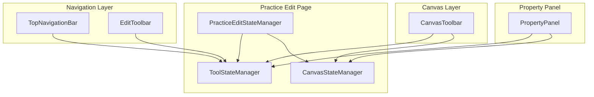

# 导航栏工具按钮集成到新Canvas架构方案

## 概述

本文档详细描述如何将现有的导航栏工具按钮（M3TopNavigationBar和M3EditToolbar）集成到新的Canvas架构中，实现统一的工具管理系统。

## 当前架构分析

### 现有导航栏组件

1. **M3TopNavigationBar** - 顶部导航栏
   - 撤销/重做按钮
   - 预览模式切换
   - 保存操作
   - 文件操作（新建、打开、导出）

2. **M3EditToolbar** - 编辑工具栏
   - 元素工具（文本、图像、集字）
   - 编辑操作（复制、粘贴、删除）
   - 层级操作（置前、置后、上移、下移）
   - 辅助功能（网格、对齐）

3. **新Canvas工具栏** - CanvasToolbar
   - 基础工具（选择、移动、缩放）
   - 创建工具（文本、图像、集字）
   - 高级工具（移动、调整、旋转）

## 集成架构设计

### 1. 统一工具管理系统



### 2. 工具分类重组

#### 2.1 顶部导航栏工具 (TopNavigationBar)

- **文档操作类**
  - 撤销/重做 (Undo/Redo)
  - 保存 (Save)
  - 预览模式切换 (Preview Mode)
  
- **文件操作类**
  - 新建 (New)
  - 打开 (Open)
  - 导出 (Export)

#### 2.2 编辑工具栏 (EditToolbar)

- **快速操作类**
  - 复制/粘贴 (Copy/Paste)
  - 删除 (Delete)
  - 全选/取消选择 (Select All/Deselect)

- **层级操作类**
  - 置前/置后 (Bring To Front/Send To Back)
  - 上移/下移 (Move Up/Move Down)
  - 编组/取消编组 (Group/Ungroup)

#### 2.3 Canvas工具栏 (CanvasToolbar)

- **基础工具类**
  - 选择工具 (Select)
  - 移动工具 (Pan)
  - 缩放工具 (Zoom)

- **创建工具类**
  - 文本工具 (Text)
  - 图像工具 (Image)
  - 集字工具 (Collection)

- **高级工具类**
  - 移动元素 (Move Element)
  - 调整大小 (Resize)
  - 旋转工具 (Rotate)

### 3. 核心组件设计

#### 3.1 PracticeEditToolManager

```dart
/// 字帖编辑工具管理器
/// 统一管理所有工具栏的状态和操作
class PracticeEditToolManager extends ChangeNotifier {
  final ToolStateManager _toolStateManager;
  final CanvasStateManager _canvasStateManager;
  final PracticeEditController _controller;
  
  // 工具栏状态
  bool _gridVisible = false;
  bool _snapEnabled = true;
  bool _previewMode = false;
  String? _currentTool;
  
  // 剪贴板状态
  bool _canPaste = false;
  Map<String, dynamic>? _clipboardContent;
  
  PracticeEditToolManager({
    required ToolStateManager toolStateManager,
    required CanvasStateManager canvasStateManager,
    required PracticeEditController controller,
  }) : _toolStateManager = toolStateManager,
       _canvasStateManager = canvasStateManager,
       _controller = controller {
    _initializeListeners();
  }
  
  // Getters
  bool get gridVisible => _gridVisible;
  bool get snapEnabled => _snapEnabled;
  bool get previewMode => _previewMode;
  String? get currentTool => _currentTool;
  bool get canPaste => _canPaste;
  bool get hasSelection => _controller.state.selectedElementIds.isNotEmpty;
  bool get canUndo => _controller.state.canUndo;
  bool get canRedo => _controller.state.canRedo;
  
  // 工具操作
  void selectTool(String toolName) {
    _currentTool = toolName;
    _toolStateManager.selectTool(ToolType.fromString(toolName));
    notifyListeners();
  }
  
  // 文档操作
  void undo() => _controller.undo();
  void redo() => _controller.redo();
  void save() => _controller.save();
  
  // 编辑操作
  void copy() {
    final selectedElements = _getSelectedElements();
    if (selectedElements.isNotEmpty) {
      _clipboardContent = _serializeElements(selectedElements);
      _canPaste = true;
      notifyListeners();
    }
  }
  
  void paste() {
    if (_clipboardContent != null) {
      _controller.pasteElements(_clipboardContent!);
    }
  }
  
  void delete() {
    if (hasSelection) {
      _controller.deleteSelectedElements();
    }
  }
  
  // 层级操作
  void bringToFront() => _controller.bringToFront();
  void sendToBack() => _controller.sendToBack();
  void moveUp() => _controller.moveUp();
  void moveDown() => _controller.moveDown();
  
  // 辅助功能
  void toggleGrid() {
    _gridVisible = !_gridVisible;
    _canvasStateManager.setGridVisible(_gridVisible);
    notifyListeners();
  }
  
  void toggleSnap() {
    _snapEnabled = !_snapEnabled;
    _canvasStateManager.setSnapEnabled(_snapEnabled);
    notifyListeners();
  }
  
  void togglePreviewMode() {
    _previewMode = !_previewMode;
    notifyListeners();
  }
  
  // 私有方法
  void _initializeListeners() {
    _controller.addListener(_onControllerStateChanged);
    _toolStateManager.addListener(_onToolStateChanged);
  }
  
  void _onControllerStateChanged() {
    notifyListeners();
  }
  
  void _onToolStateChanged() {
    final selectedTool = _toolStateManager.currentTool;
    _currentTool = selectedTool.value;
    notifyListeners();
  }
  
  List<Map<String, dynamic>> _getSelectedElements() {
    return _controller.state.currentPageElements
        .where((e) => _controller.state.selectedElementIds.contains(e['id']))
        .toList();
  }
  
  Map<String, dynamic> _serializeElements(List<Map<String, dynamic>> elements) {
    return {
      'type': 'clipboard',
      'elements': elements,
      'timestamp': DateTime.now().millisecondsSinceEpoch,
    };
  }
  
  @override
  void dispose() {
    _controller.removeListener(_onControllerStateChanged);
    _toolStateManager.removeListener(_onToolStateChanged);
    super.dispose();
  }
}
```

#### 3.2 统一的TopNavigationBar

```dart
/// 统一的顶部导航栏
/// 集成所有顶部工具按钮
class UnifiedTopNavigationBar extends StatelessWidget implements PreferredSizeWidget {
  final PracticeEditToolManager toolManager;
  final String? practiceId;
  final VoidCallback? onTitleEdit;
  final VoidCallback? onBackPressed;
  
  const UnifiedTopNavigationBar({
    super.key,
    required this.toolManager,
    this.practiceId,
    this.onTitleEdit,
    this.onBackPressed,
  });
  
  @override
  Size get preferredSize => const Size.fromHeight(kToolbarHeight);
  
  @override
  Widget build(BuildContext context) {
    return ListenableBuilder(
      listenable: toolManager,
      builder: (context, child) {
        return M3PageNavigationBar(
          title: _buildTitle(context),
          titleActions: _buildTitleActions(context),
          onBackPressed: onBackPressed,
          actions: _buildActions(context),
        );
      },
    );
  }
  
  Widget _buildTitle(BuildContext context) {
    final l10n = AppLocalizations.of(context);
    // 构建标题逻辑
  }
  
  List<Widget>? _buildTitleActions(BuildContext context) {
    return [
      if (onTitleEdit != null)
        IconButton(
          icon: const Icon(Icons.edit),
          tooltip: 'Edit Title',
          onPressed: onTitleEdit,
        ),
    ];
  }
  
  List<Widget> _buildActions(BuildContext context) {
    final l10n = AppLocalizations.of(context);
    
    return [
      // 撤销/重做按钮组
      Row(
        mainAxisSize: MainAxisSize.min,
        children: [
          IconButton(
            icon: const Icon(Icons.undo),
            tooltip: 'Undo (Ctrl+Z)',
            onPressed: toolManager.canUndo ? toolManager.undo : null,
          ),
          IconButton(
            icon: const Icon(Icons.redo),
            tooltip: 'Redo (Ctrl+Y)',
            onPressed: toolManager.canRedo ? toolManager.redo : null,
          ),
        ],
      ),
      
      const VerticalDivider(),
      
      // 预览/保存按钮组
      Row(
        mainAxisSize: MainAxisSize.min,
        children: [
          IconButton(
            icon: Icon(toolManager.previewMode 
                ? Icons.edit 
                : Icons.visibility),
            tooltip: toolManager.previewMode 
                ? 'Exit Preview' 
                : 'Preview Mode',
            onPressed: toolManager.togglePreviewMode,
          ),
          FilledButton(
            onPressed: toolManager.save,
            child: Text(l10n.save),
          ),
        ],
      ),
      
      const VerticalDivider(),
      
      // 文件操作按钮组
      PopupMenuButton<String>(
        icon: const Icon(Icons.more_vert),
        onSelected: _handleMenuAction,
        itemBuilder: (context) => [
          PopupMenuItem(
            value: 'new',
            child: Row(
              children: [
                const Icon(Icons.add),
                const SizedBox(width: 8),
                Text(l10n.newPractice),
              ],
            ),
          ),
          PopupMenuItem(
            value: 'open',
            child: Row(
              children: [
                const Icon(Icons.folder_open),
                const SizedBox(width: 8),
                Text(l10n.openPractice),
              ],
            ),
          ),
          PopupMenuItem(
            value: 'export',
            child: Row(
              children: [
                const Icon(Icons.download),
                const SizedBox(width: 8),
                Text(l10n.exportPractice),
              ],
            ),
          ),
        ],
      ),
    ];
  }
  
  void _handleMenuAction(String action) {
    switch (action) {
      case 'new':
        // 处理新建操作
        break;
      case 'open':
        // 处理打开操作
        break;
      case 'export':
        // 处理导出操作
        break;
    }
  }
}
```

#### 3.3 统一的EditToolbar

```dart
/// 统一的编辑工具栏
/// 集成Canvas工具栏和编辑操作
class UnifiedEditToolbar extends StatelessWidget implements PreferredSizeWidget {
  final PracticeEditToolManager toolManager;
  final ToolStateManager toolStateManager;
  final CanvasStateManager canvasStateManager;
  final Function(BuildContext, String)? onDragElementStart;
  
  const UnifiedEditToolbar({
    super.key,
    required this.toolManager,
    required this.toolStateManager,
    required this.canvasStateManager,
    this.onDragElementStart,
  });
  
  @override
  Size get preferredSize => const Size.fromHeight(kToolbarHeight);
  
  @override
  Widget build(BuildContext context) {
    return ListenableBuilder(
      listenable: toolManager,
      builder: (context, child) {
        return Container(
          width: double.infinity,
          padding: const EdgeInsets.symmetric(
            vertical: AppSizes.xs, 
            horizontal: AppSizes.s
          ),
          decoration: BoxDecoration(
            color: Theme.of(context).colorScheme.surfaceContainerLow,
            border: Border(
              bottom: BorderSide(
                color: Theme.of(context).colorScheme.outlineVariant,
                width: 1,
              ),
            ),
          ),
          child: Row(
            children: [
              // Canvas工具栏（左侧）
              Expanded(
                flex: 2,
                child: CanvasToolbar(
                  stateManager: canvasStateManager,
                  toolStateManager: toolStateManager,
                  onToolSelected: (tool) => toolManager.selectTool(tool.value),
                  onDragElementStart: onDragElementStart,
                  direction: Axis.horizontal,
                  style: ToolbarStyle.compact,
                ),
              ),
              
              const VerticalDivider(),
              
              // 编辑操作工具（中间）
              _buildEditOperationTools(context),
              
              const VerticalDivider(),
              
              // 层级操作工具（右侧）
              _buildLayerOperationTools(context),
              
              const VerticalDivider(),
              
              // 辅助功能工具（最右侧）
              _buildHelperTools(context),
            ],
          ),
        );
      },
    );
  }
  
  Widget _buildEditOperationTools(BuildContext context) {
    final l10n = AppLocalizations.of(context);
    
    return Row(
      mainAxisSize: MainAxisSize.min,
      children: [
        IconButton(
          icon: const Icon(Icons.copy),
          tooltip: l10n.copy,
          onPressed: toolManager.hasSelection ? toolManager.copy : null,
        ),
        IconButton(
          icon: const Icon(Icons.paste),
          tooltip: l10n.paste,
          onPressed: toolManager.canPaste ? toolManager.paste : null,
        ),
        IconButton(
          icon: const Icon(Icons.delete),
          tooltip: l10n.delete,
          onPressed: toolManager.hasSelection ? toolManager.delete : null,
        ),
      ],
    );
  }
  
  Widget _buildLayerOperationTools(BuildContext context) {
    final l10n = AppLocalizations.of(context);
    
    return Row(
      mainAxisSize: MainAxisSize.min,
      children: [
        IconButton(
          icon: const Icon(Icons.vertical_align_top),
          tooltip: l10n.bringToFront,
          onPressed: toolManager.hasSelection ? toolManager.bringToFront : null,
        ),
        IconButton(
          icon: const Icon(Icons.vertical_align_bottom),
          tooltip: l10n.sendToBack,
          onPressed: toolManager.hasSelection ? toolManager.sendToBack : null,
        ),
        IconButton(
          icon: const Icon(Icons.arrow_upward),
          tooltip: l10n.moveUp,
          onPressed: toolManager.hasSelection ? toolManager.moveUp : null,
        ),
        IconButton(
          icon: const Icon(Icons.arrow_downward),
          tooltip: l10n.moveDown,
          onPressed: toolManager.hasSelection ? toolManager.moveDown : null,
        ),
      ],
    );
  }
  
  Widget _buildHelperTools(BuildContext context) {
    final l10n = AppLocalizations.of(context);
    
    return Row(
      mainAxisSize: MainAxisSize.min,
      children: [
        IconButton(
          icon: Icon(toolManager.gridVisible 
              ? Icons.grid_on 
              : Icons.grid_off),
          tooltip: toolManager.gridVisible 
              ? l10n.hideGrid 
              : l10n.showGrid,
          onPressed: toolManager.toggleGrid,
        ),
        IconButton(
          icon: const Icon(Icons.format_line_spacing),
          tooltip: toolManager.snapEnabled 
              ? l10n.disableSnap 
              : l10n.enableSnap,
          onPressed: toolManager.toggleSnap,
        ),
      ],
    );
  }
}
```

### 4. 集成实现步骤

#### 第一阶段：创建统一工具管理器（1周）

1. **实现PracticeEditToolManager**
   - 整合现有的工具状态管理
   - 统一工具操作接口
   - 实现状态同步机制

2. **适配现有控制器**
   - 修改PracticeEditController接口
   - 确保向后兼容性
   - 添加新的工具操作方法

#### 第二阶段：重构导航栏组件（1周）

1. **创建UnifiedTopNavigationBar**
   - 合并现有的M3TopNavigationBar功能
   - 集成新的工具管理器
   - 保持UI一致性

2. **创建UnifiedEditToolbar**
   - 整合M3EditToolbar和CanvasToolbar
   - 实现响应式布局
   - 优化工具按钮排列

#### 第三阶段：集成Canvas系统（1周）

1. **实现工具状态同步**
   - Canvas工具栏与编辑工具栏同步
   - 工具选择状态一致性
   - 快捷键操作集成

2. **测试和优化**
   - 功能测试
   - 性能优化
   - UI体验改进

### 5. 兼容性方案

#### 5.1 渐进式迁移

```dart
/// 兼容性包装器
class ToolbarCompatibilityWrapper extends StatelessWidget {
  final bool useNewArchitecture;
  final Widget legacyToolbar;
  final Widget newToolbar;
  
  const ToolbarCompatibilityWrapper({
    super.key,
    required this.useNewArchitecture,
    required this.legacyToolbar,
    required this.newToolbar,
  });
  
  @override
  Widget build(BuildContext context) {
    return useNewArchitecture ? newToolbar : legacyToolbar;
  }
}
```

#### 5.2 功能特性开关

```dart
/// 功能特性配置
class FeatureFlags {
  static const bool enableUnifiedToolbar = true;
  static const bool enableCanvasIntegration = true;
  static const bool enableAdvancedTools = false;
}
```

### 6. 测试策略

#### 6.1 单元测试

- PracticeEditToolManager测试
- 工具状态同步测试
- 操作方法测试

#### 6.2 集成测试

- 导航栏工具按钮集成测试
- Canvas工具栏集成测试
- 端到端操作流程测试

#### 6.3 UI测试

- 工具栏布局测试
- 响应式设计测试
- 交互体验测试

### 7. 性能优化

#### 7.1 状态管理优化

- 使用ChangeNotifier实现精准更新
- 避免不必要的rebuild
- 实现状态缓存机制

#### 7.2 UI渲染优化

- 工具按钮复用
- 延迟加载不常用工具
- 优化动画性能

### 8. 迁移时间线

| 阶段 | 时间 | 任务 | 里程碑 |
|------|------|------|--------|
| 第1周 | 第1-2天 | 创建PracticeEditToolManager | 工具管理器可用 |
| | 第3-5天 | 适配现有控制器和状态管理 | 状态同步正常 |
| 第2周 | 第1-3天 | 实现UnifiedTopNavigationBar | 顶部导航栏重构完成 |
| | 第4-5天 | 实现UnifiedEditToolbar | 编辑工具栏重构完成 |
| 第3周 | 第1-3天 | 集成Canvas工具栏系统 | Canvas集成完成 |
| | 第4-5天 | 测试和问题修复 | 基本功能测试通过 |

### 9. 风险评估和缓解

#### 9.1 主要风险

1. **功能回归** - 新架构可能影响现有功能
2. **性能下降** - 状态管理复杂度增加
3. **用户体验** - UI变化可能影响用户习惯

#### 9.2 缓解措施

1. **保持向后兼容** - 实现兼容性包装器
2. **渐进式迁移** - 分阶段启用新功能
3. **充分测试** - 完整的测试覆盖
4. **用户反馈** - 收集用户使用反馈

### 10. 总结

通过统一的工具管理系统，我们可以：

1. **简化架构** - 统一管理所有工具状态和操作
2. **提升体验** - 一致的UI和交互体验  
3. **增强可维护性** - 清晰的职责分离和接口设计
4. **支持扩展** - 易于添加新工具和功能
5. **保证兼容性** - 平滑迁移，最小化破坏性变更

这个集成方案将现有的导航栏工具按钮与新的Canvas架构完美融合，为用户提供统一、高效的编辑体验。
