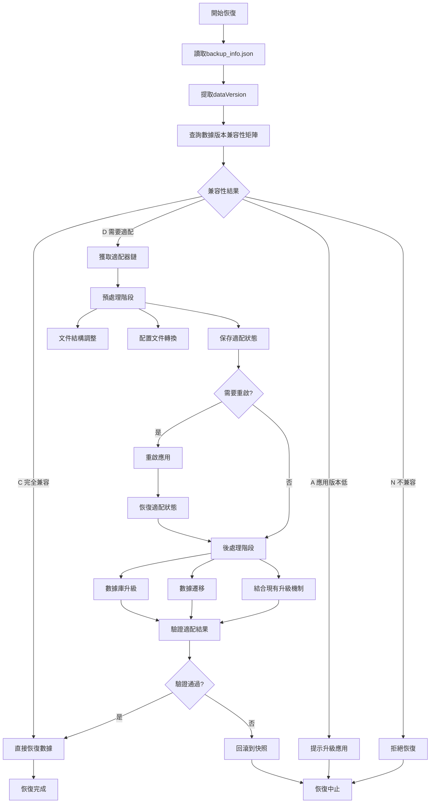

# 數據備份與恢復功能設計文檔

## 重要說明

**本文檔已與 `unified_upgrade_system_design.md` 統一，請參考統一升級系統設計文檔獲取最新的完整設計。**

## 1. 概述

### 1.1 設計目標

- 建立基於數據版本兼容性矩陣的數據恢復系統
- 在應用層面實現不同版本數據的適配處理邏輯
- 提供可擴展的版本數據處理框架
- 確保數據恢復的安全性和可靠性
- 與應用升級系統統一管理

### 1.2 核心原則

- **應用內適配**: 在應用中處理不同版本的數據，而非修改備份文件
- **數據版本獨立**: 使用獨立的數據版本管理，減少維護複雜度
- **鏈式升級**: 支持跨版本升級鏈（v1→v2→v3）
- **兼容現有機制**: 與現有 migrations.dart 無縫集成
- **三階段處理**: 預處理→重啟→後處理的完整流程

## 2. 數據版本管理系統

### 2.1 數據版本概念

- **數據版本**: 獨立於應用版本的數據結構版本號
- **應用版本映射**: 建立應用版本與數據版本的對應關係
- **兼容性簡化**: 使用數據版本進行兼容性判斷，大幅減少維護工作量

### 2.2 優化的backup_info.json結構

```json
{
  "timestamp": "2024-01-01T00:00:00.000Z",
  "description": "用戶描述或自動生成",
  "appVersion": "1.3.5",
  "dataVersion": "v3",
  "platform": "windows",
  "dataIntegrity": {
    "checksum": "sha256_hash",
    "fileCount": 1234,
    "totalSize": 567890
  }
}
```

### 2.3 統一的數據版本定義（與統一升級系統一致）

```dart
class DataVersionDefinition {
  static const Map<String, DataVersionInfo> versions = {
    'v1': DataVersionInfo(
      version: 'v1',
      description: '基础数据结构',
      appVersions: ['1.0.0', '1.0.1', '1.0.2'],
      databaseVersion: 5,  // 对应 migrations.dart 中的版本
      features: ['基础作品管理', '字符收集'],
    ),
    'v2': DataVersionInfo(
      version: 'v2',
      description: '练习功能',
      appVersions: ['1.1.0', '1.1.1', '1.2.0'],
      databaseVersion: 10,
      features: ['练习模式', '用户偏好设置'],
    ),
    'v3': DataVersionInfo(
      version: 'v3',
      description: '增强作品管理',
      appVersions: ['1.3.0', '1.3.5', '1.3.6'],
      databaseVersion: 15,
      features: ['高级作品管理', '元数据支持'],
    ),
    'v4': DataVersionInfo(
      version: 'v4',
      description: '高级功能',
      appVersions: ['1.4.0', '1.5.0'],
      databaseVersion: 18,
      features: ['库管理', '高级导出'],
    ),
  };
}

class DataVersionMappingService {
  /// 获取应用版本对应的数据版本
  static String getDataVersion(String appVersion) {
    for (final entry in DataVersionDefinition.versions.entries) {
      if (entry.value.appVersions.contains(appVersion)) {
        return entry.key;
      }
    }
    return 'unknown';
  }

  /// 获取数据版本对应的数据库版本
  static int getDatabaseVersion(String dataVersion) {
    return DataVersionDefinition.versions[dataVersion]?.databaseVersion ?? 0;
  }

  /// 获取升级路径
  static List<String> getUpgradePath(String fromVersion, String toVersion) {
    final versions = ['v1', 'v2', 'v3', 'v4'];
    final fromIndex = versions.indexOf(fromVersion);
    final toIndex = versions.indexOf(toVersion);

    if (fromIndex == -1 || toIndex == -1 || fromIndex >= toIndex) {
      return [];
    }

    return versions.sublist(fromIndex, toIndex + 1);
  }
}
```

## 3. 兼容性矩陣系統

### 3.1 兼容性分類

```text
C: 完全兼容 - 數據結構相同，可直接使用
D: 兼容但需要數據適配 - 需要在應用中進行版本適配處理
A: 需要升級應用 - 當前應用版本過低，無法處理該數據
N: 不兼容 - 數據版本過舊，當前應用不再支持
```

### 3.2 基於數據版本的兼容性矩陣

```text
當前數據版本 \ 備份數據版本   v1    v2    v3    v4
v1                        C     A     A     A
v2                        D     C     A     A
v3                        D     D     C     A
v4                        N     D     D     C


**矩陣說明**:

- **v1**: 對應應用版本 1.0.0-1.0.2 (基礎數據結構)
- **v2**: 對應應用版本 1.1.0-1.2.0 (添加練習功能)
- **v3**: 對應應用版本 1.3.0-1.3.6 (增強作品管理)
- **v4**: 對應應用版本 1.4.0-1.5.0 (新增高級功能)

```

## 4. 數據恢復流程設計

### 4.1 恢復流程概覽



### 4.2 詳細恢復步驟

#### 4.2.1 第一階段：兼容性檢查

1. **提取版本信息**: 從backup_info.json讀取appVersion
2. **查詢兼容性矩陣**: 確定當前應用與備份數據的兼容性
3. **生成處理計劃**: 根據兼容性結果制定恢復策略

#### 4.2.2 第二階段：數據適配處理（D類型）

**預處理階段**:

1. **識別數據版本**: 從backup_info.json讀取dataVersion
2. **選擇適配器**: 根據數據版本選擇對應的適配器鏈
3. **預處理數據**: 執行文件結構調整、配置轉換等預處理步驟
4. **準備重啟**: 保存預處理狀態，準備應用重啟

**重啟應用階段**:
5. **應用重啟**: 重啟應用以加載新的數據結構
6. **狀態恢復**: 恢復預處理階段的狀態信息

**後處理階段**:
7. **數據庫升級**: 結合現有數據庫升級機制進行schema調整
8. **數據遷移**: 執行數據格式轉換和內容遷移
9. **完整性驗證**: 驗證所有適配步驟的結果

#### 4.2.3 第三階段：數據恢復

1. **備份當前數據**: 創建當前數據的安全備份
2. **清理目標位置**: 準備恢復目標目錄
3. **恢復數據文件**: 將適配後的數據寫入目標位置
4. **更新數據庫**: 恢復數據庫內容
5. **驗證完整性**: 檢查恢復後的數據完整性

## 5. 版本適配架構設計

### 5.1 統一的數據版本適配器接口（與統一升級系統一致）

```dart
abstract class DataVersionAdapter {
  /// 源數據版本
  String get sourceDataVersion;

  /// 目標數據版本
  String get targetDataVersion;

  /// 預處理階段
  Future<PreProcessResult> preProcess(String dataPath);

  /// 後處理階段（重啟後執行）
  Future<PostProcessResult> postProcess(String dataPath);

  /// 驗證適配結果
  Future<bool> validateAdaptation(String dataPath);

  /// 與現有數據庫遷移集成
  Future<void> integrateDatabaseMigration(String dataPath);
}

/// 預處理結果
class PreProcessResult {
  final bool success;
  final bool needsRestart;
  final Map<String, dynamic> stateData;
  final String? errorMessage;

  const PreProcessResult({
    required this.success,
    this.needsRestart = false,
    this.stateData = const {},
    this.errorMessage,
  });
}

/// 後處理結果
class PostProcessResult {
  final bool success;
  final List<String> executedSteps;
  final String? errorMessage;

  const PostProcessResult({
    required this.success,
    this.executedSteps = const [],
    this.errorMessage,
  });
}
```

### 5.2 數據版本適配器管理器

```dart
class DataVersionAdapterManager {
  /// 註冊的適配器列表 (數據版本 -> 適配器)
  final Map<String, DataVersionAdapter> _adapters = {};

  /// 註冊適配器
  void registerAdapter(DataVersionAdapter adapter) {
    final key = '${adapter.sourceDataVersion}_to_${adapter.targetDataVersion}';
    _adapters[key] = adapter;
  }

  /// 獲取適配器鏈
  List<DataVersionAdapter> getAdapterChain(String sourceDataVersion, String targetDataVersion) {
    // 實現適配器鏈邏輯，支持跨版本適配
    // 例如: v1 -> v3 需要 v1->v2 和 v2->v3 兩個適配器
  }

  /// 執行數據適配
  Future<bool> executeAdaptation(String sourceDataVersion, String dataPath);
}
```

### 5.3 具體適配器實現示例

```dart
class DataAdapter_v1_to_v2 implements DataVersionAdapter {
  @override
  String get sourceDataVersion => 'v1';

  @override
  String get targetDataVersion => 'v2';

  @override
  Future<PreProcessResult> preProcess(String dataPath) async {
    try {
      // 預處理：文件結構調整
      await _adjustFileStructure(dataPath);

      // 預處理：配置文件轉換
      await _convertConfiguration(dataPath);

      return PreProcessResult(
        success: true,
        needsRestart: true,
        stateData: {'processedAt': DateTime.now().toIso8601String()},
      );
    } catch (e) {
      return PreProcessResult(
        success: false,
        errorMessage: e.toString(),
      );
    }
  }

  @override
  Future<PostProcessResult> postProcess(String dataPath) async {
    try {
      final steps = <String>[];

      // 後處理：數據庫升級（結合現有升級機制）
      await _upgradeDatabaseSchema(dataPath);
      steps.add('database_upgrade');

      // 後處理：數據遷移
      await _migrateData(dataPath);
      steps.add('data_migration');

      return PostProcessResult(
        success: true,
        executedSteps: steps,
      );
    } catch (e) {
      return PostProcessResult(
        success: false,
        errorMessage: e.toString(),
      );
    }
  }
}
```

## 6. 應用架構擴展性設計

### 6.1 基於數據版本的模塊結構

lib/
├── application/
│   ├── services/
│   │   ├── backup_service.dart
│   │   ├── restore_service.dart
│   │   ├── data_version_service.dart
│   │   └── restart_coordination_service.dart
│   └── adapters/
│       ├── data_version_adapter_manager.dart
│       ├── base_data_version_adapter.dart
│       └── data_versions/
│           ├── adapter_v1_to_v2.dart
│           ├── adapter_v2_to_v3.dart
│           ├── adapter_v3_to_v4.dart
│           └── database_upgrade_integration.dart
├── domain/
│   ├── models/
│   │   ├── backup_info.dart
│   │   ├── data_version_mapping.dart
│   │   ├── compatibility_matrix.dart
│   │   └── adaptation_result.dart
│   └── interfaces/
│       ├── data_version_adapter.dart
│       └── database_upgrade_coordinator.dart

### 6.2 數據版本適配器註冊機制

```dart
class DataVersionAdapterRegistry {
  static void registerAllAdapters(DataVersionAdapterManager manager) {
    // 註冊數據版本適配器（維護量大幅減少）
    manager.registerAdapter(DataAdapter_v1_to_v2());
    manager.registerAdapter(DataAdapter_v2_to_v3());
    manager.registerAdapter(DataAdapter_v3_to_v4());
  }

  static String getCurrentDataVersion() {
    // 獲取當前應用支持的數據版本
    const currentAppVersion = '1.5.0';
    return AppDataVersionMapping.getDataVersion(currentAppVersion);
  }
}
```

### 6.3 與現有數據庫升級機制的整合

```dart
class DatabaseUpgradeIntegration {
  /// 整合數據版本適配與現有數據庫升級
  static Future<void> integrateWithExistingUpgrade(
    String sourceDataVersion,
    String targetDataVersion,
    String databasePath,
  ) async {
    // 1. 確定需要的數據庫升級步驟
    final upgradeSteps = _getRequiredUpgradeSteps(sourceDataVersion, targetDataVersion);

    // 2. 執行現有的數據庫升級邏輯
    for (final step in upgradeSteps) {
      await _executeExistingUpgradeStep(step, databasePath);
    }

    // 3. 執行數據版本特定的調整
    await _executeDataVersionSpecificAdjustments(sourceDataVersion, targetDataVersion, databasePath);
  }

  static List<DatabaseUpgradeStep> _getRequiredUpgradeSteps(String from, String to) {
    // 根據數據版本差異確定需要的數據庫升級步驟
    switch ('${from}_to_${to}') {
      case 'v1_to_v2':
        return [
          DatabaseUpgradeStep.addPracticesTable(),
          DatabaseUpgradeStep.addUserPreferences(),
        ];
      case 'v2_to_v3':
        return [
          DatabaseUpgradeStep.enhanceWorksTable(),
          DatabaseUpgradeStep.addMetadataFields(),
        ];
      case 'v3_to_v4':
        return [
          DatabaseUpgradeStep.addAdvancedFeatures(),
          DatabaseUpgradeStep.optimizeIndexes(),
        ];
      default:
        return [];
    }
  }
}
```

## 7. D類型處理的核心邏輯（基於數據版本）

### 7.1 三階段處理原則

- **預處理階段**: 文件結構調整、配置轉換，準備重啟
- **重啟階段**: 應用重啟以加載新的數據結構
- **後處理階段**: 數據庫升級、數據遷移，結合現有升級機制

### 7.2 完整的適配執行流程

```dart
class DataVersionAdaptationService {
  Future<bool> executeDataAdaptation(String sourceDataVersion, String dataPath) async {
    try {
      // 1. 創建數據快照
      final snapshot = await createDataSnapshot(dataPath);

      // 2. 獲取數據版本適配器鏈
      final adapters = _adapterManager.getAdapterChain(
        sourceDataVersion,
        _getCurrentDataVersion()
      );

      // 3. 執行預處理階段
      final preProcessResults = <PreProcessResult>[];
      for (final adapter in adapters) {
        final result = await adapter.preProcess(dataPath);
        preProcessResults.add(result);

        if (!result.success) {
          await restoreFromSnapshot(snapshot);
          return false;
        }
      }

      // 4. 檢查是否需要重啟
      final needsRestart = preProcessResults.any((r) => r.needsRestart);
      if (needsRestart) {
        await _saveAdaptationState(adapters, preProcessResults);
        await _restartApplication();
        return true; // 重啟後繼續處理
      }

      // 5. 執行後處理階段（如果不需要重啟）
      return await _executePostProcessing(adapters, dataPath);

    } catch (e) {
      await restoreFromSnapshot(snapshot);
      return false;
    }
  }

  /// 重啟後恢復處理
  Future<bool> resumeAfterRestart() async {
    final state = await _loadAdaptationState();
    if (state == null) return true;

    return await _executePostProcessing(state.adapters, state.dataPath);
  }

  Future<bool> _executePostProcessing(
    List<DataVersionAdapter> adapters,
    String dataPath
  ) async {
    for (final adapter in adapters) {
      final result = await adapter.postProcess(dataPath);
      if (!result.success) {
        return false;
      }
    }

    // 最終驗證
    return await _validateFinalResult(dataPath);
  }
}
```

## 8. 具體實現考慮

### 8.1 數據庫適配處理

```dart
class DatabaseAdapter {
  Future<void> adaptDatabaseSchema(String dbPath, String fromVersion, String toVersion) async {
    final db = await openDatabase(dbPath);

    // 根據版本差異執行相應的SQL腳本
    switch ('${fromVersion}_to_${toVersion}') {
      case '1.0.0_to_1.3.5':
        await _execute_100_to_135_migration(db);
        break;
      case '1.3.5_to_1.5.0':
        await _execute_135_to_150_migration(db);
        break;
    }
  }

  Future<void> _execute_100_to_135_migration(Database db) async {
    // 添加新表
    await db.execute('CREATE TABLE IF NOT EXISTS new_features (...)');

    // 修改現有表結構
    await db.execute('ALTER TABLE works ADD COLUMN new_field TEXT');

    // 數據遷移
    await db.execute('UPDATE works SET new_field = default_value WHERE new_field IS NULL');
  }
}
```

### 8.2 文件結構適配處理

```dart
class FileStructureAdapter {
  Future<void> adaptFileStructure(String dataPath, String fromVersion, String toVersion) async {
    switch ('${fromVersion}_to_${toVersion}') {
      case '1.0.0_to_1.3.5':
        await _restructure_100_to_135(dataPath);
        break;
      case '1.3.5_to_1.5.0':
        await _restructure_135_to_150(dataPath);
        break;
    }
  }

  Future<void> _restructure_100_to_135(String dataPath) async {
    // 創建新的目錄結構
    await Directory('$dataPath/practices').create(recursive: true);

    // 移動文件到新位置
    final oldFiles = Directory('$dataPath/old_practices').listSync();
    for (final file in oldFiles) {
      await file.rename('$dataPath/practices/${file.path.split('/').last}');
    }

    // 刪除舊目錄
    await Directory('$dataPath/old_practices').delete(recursive: true);
  }
}
```

### 8.3 配置文件適配處理

```dart
class ConfigurationAdapter {
  Future<void> adaptConfiguration(String configPath, String fromVersion, String toVersion) async {
    final configFile = File('$configPath/config.json');
    if (!await configFile.exists()) return;

    final config = jsonDecode(await configFile.readAsString());

    switch ('${fromVersion}_to_${toVersion}') {
      case '1.0.0_to_1.3.5':
        await _adaptConfig_100_to_135(config);
        break;
      case '1.3.5_to_1.5.0':
        await _adaptConfig_135_to_150(config);
        break;
    }

    await configFile.writeAsString(jsonEncode(config));
  }

  Future<void> _adaptConfig_100_to_135(Map<String, dynamic> config) async {
    // 添加新的配置項
    config['newFeatures'] = {
      'enableAdvancedMode': false,
      'autoSave': true,
    };

    // 重命名配置項
    if (config.containsKey('oldSettingName')) {
      config['newSettingName'] = config.remove('oldSettingName');
    }

    // 更新配置值格式
    if (config['theme'] is String) {
      config['theme'] = {'name': config['theme'], 'mode': 'light'};
    }
  }
}
```

### 8.4 作品數據適配處理

```dart
class WorksDataAdapter {
  Future<void> adaptWorksData(String worksPath, String fromVersion, String toVersion) async {
    final worksDir = Directory(worksPath);
    if (!await worksDir.exists()) return;

    await for (final entity in worksDir.list()) {
      if (entity is File && entity.path.endsWith('.json')) {
        await _adaptWorkFile(entity, fromVersion, toVersion);
      }
    }
  }

  Future<void> _adaptWorkFile(File workFile, String fromVersion, String toVersion) async {
    final workData = jsonDecode(await workFile.readAsString());

    switch ('${fromVersion}_to_${toVersion}') {
      case '1.0.0_to_1.3.5':
        await _adaptWork_100_to_135(workData);
        break;
      case '1.3.5_to_1.5.0':
        await _adaptWork_135_to_150(workData);
        break;
    }

    await workFile.writeAsString(jsonEncode(workData));
  }

  Future<void> _adaptWork_100_to_135(Map<String, dynamic> workData) async {
    // 添加新字段
    workData['metadata'] = {
      'createdAt': workData['timestamp'] ?? DateTime.now().toIso8601String(),
      'version': '1.3.5',
    };

    // 轉換數據格式
    if (workData['pages'] is List) {
      for (final page in workData['pages']) {
        if (page['elements'] is List) {
          for (final element in page['elements']) {
            // 更新元素結構
            if (element['type'] == 'text' && element['style'] is Map) {
              element['style']['fontWeight'] = element['style']['bold'] == true ? 'bold' : 'normal';
              element['style'].remove('bold');
            }
          }
        }
      }
    }
  }
}
```

## 9. 錯誤處理和回滾機制

### 9.1 適配失敗處理

```dart
class AdaptationErrorHandler {
  Future<void> handleAdaptationFailure(
    String dataPath,
    String snapshotPath,
    Exception error,
  ) async {
    AppLogger.error('數據適配失敗', error: error);

    // 恢復到適配前狀態
    await restoreFromSnapshot(dataPath, snapshotPath);

    // 清理臨時文件
    await cleanupTempFiles(dataPath);

    // 通知用戶
    throw DataAdaptationException(
      '數據適配失敗，已恢復到原始狀態',
      originalError: error,
    );
  }
}
```

### 9.2 數據完整性驗證

```dart
class DataIntegrityValidator {
  Future<bool> validateAdaptedData(String dataPath, String targetVersion) async {
    try {
      // 驗證數據庫完整性
      await _validateDatabase(dataPath);

      // 驗證文件結構
      await _validateFileStructure(dataPath, targetVersion);

      // 驗證配置文件
      await _validateConfiguration(dataPath, targetVersion);

      // 驗證作品數據
      await _validateWorksData(dataPath, targetVersion);

      return true;
    } catch (e) {
      AppLogger.error('數據完整性驗證失敗', error: e);
      return false;
    }
  }
}
```

## 10. 擴展性和維護性

### 10.1 新版本適配器開發指南

1. **創建適配器類**: 繼承`DataVersionAdapter`接口
2. **實現適配邏輯**: 針對具體的數據變更實現適配方法
3. **添加驗證邏輯**: 確保適配結果的正確性
4. **註冊適配器**: 在`AdapterRegistry`中註冊新適配器
5. **編寫測試**: 為適配器編寫完整的單元測試

### 10.2 版本兼容性矩陣維護

- **定期更新**: 每個新版本發布時更新兼容性矩陣
- **測試驗證**: 對每個兼容性組合進行測試驗證
- **文檔同步**: 保持文檔與實際實現的同步

### 10.3 監控和日誌

```dart
class AdaptationMonitor {
  void logAdaptationStart(String fromVersion, String toVersion) {
    AppLogger.info('開始數據適配', data: {
      'fromVersion': fromVersion,
      'toVersion': toVersion,
      'timestamp': DateTime.now().toIso8601String(),
    });
  }

  void logAdaptationStep(String stepName, Duration elapsed) {
    AppLogger.info('適配步驟完成', data: {
      'step': stepName,
      'elapsed': elapsed.inMilliseconds,
    });
  }

  void logAdaptationComplete(Duration totalTime) {
    AppLogger.info('數據適配完成', data: {
      'totalTime': totalTime.inMilliseconds,
    });
  }
}
```

## 11. 與統一升級系統的關係

### 11.1 設計統一性

本文檔中的備份恢復功能已完全整合到統一升級系統設計中：

- **數據版本定義**: 使用相同的 `DataVersionDefinition` 類
- **適配器接口**: 使用統一的 `DataVersionAdapter` 接口
- **兼容性矩陣**: 使用相同的數據版本兼容性矩陣
- **三階段處理**: 採用統一的預處理→重啟→後處理流程
- **數據庫集成**: 與現有 migrations.dart 機制統一集成

### 11.2 功能分工

- **統一升級系統**: 負責應用啟動時的自動升級和跨版本升級處理
- **備份恢復系統**: 負責用戶主動的數據備份和恢復操作
- **共同基礎**: 兩者共享相同的數據版本管理和適配器架構

### 11.3 實現建議

建議在實際實現時：

1. 優先參考 `unified_upgrade_system_design.md` 的完整設計
2. 將備份恢復功能作為統一升級系統的一個應用場景
3. 復用統一升級系統中的所有核心組件和服務
4. 保持兩個系統的設計一致性和代碼復用

---

*文檔生成時間: 2025-07-25*
*版本: 2.0 (已與統一升級系統統一)*
*設計重點: 備份恢復功能與統一升級系統的集成*
