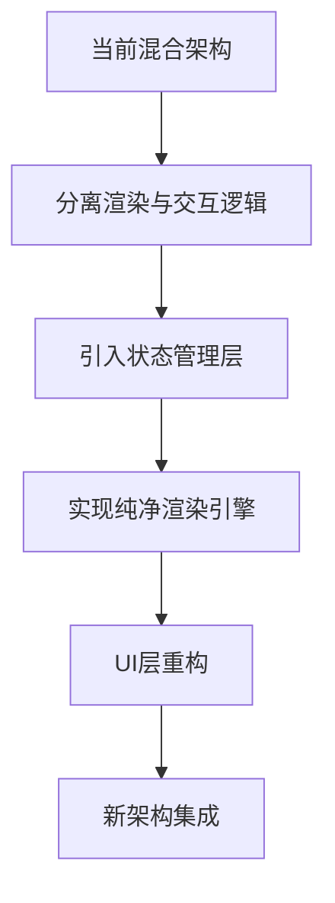

# 技术路线图

## 1. 重构阶段规划

### 1.1 阶段一：架构设计与原型验证（4周）

* **架构设计完善**：详细设计分层架构
* **状态管理方案制定**：确定状态管理策略
* **关键组件原型开发**：实现核心组件原型
* **性能基准测试**：建立性能测试基准
* **成果**：详细设计文档、技术原型、性能基准

### 1.2 阶段二：核心引擎实现（6周）

* **渲染引擎开发**：实现纯Dart渲染引擎
* **交互引擎开发**：实现与UI分离的交互引擎
* **状态管理系统实现**：构建集中式状态管理
* **缓存系统实现**：开发多级缓存策略
* **成果**：可测试的核心引擎组件

### 1.3 阶段三：UI集成与重构（5周）

* **UI层对接新引擎**：将UI组件对接到新引擎
* **逐步替换现有组件**：增量替换旧组件
* **性能调优**：针对UI层的性能优化
* **回归测试**：确保功能完整性
* **成果**：完整的UI集成

### 1.4 阶段四：优化与稳定（3周）

* **全面性能测试**：各场景性能测试
* **内存优化**：内存使用优化
* **稳定性测试**：长时间运行测试
* **Bug修复**：解决发现的问题
* **成果**：稳定的生产版本

## 2. 技术实施路线

### 2.1 架构转换路线

1. **分离渲染与交互逻辑**
   * 提取纯渲染逻辑到独立类
   * 将交互逻辑移至专用处理器

2. **引入状态管理层**
   * 实现集中式状态管理
   * 建立状态变更通知机制

3. **实现纯净渲染引擎**
   * 开发与框架无关的渲染核心
   * 实现纹理管理和缓存系统

4. **UI层重构**
   * 重构UI组件以使用新引擎
   * 实现UI与引擎的松耦合接口

5. **新架构集成**
   * 整合所有组件
   * 实施全面测试

### 2.2 代码迁移策略

* **渐进式替换**：逐个组件替换而非全部重写
* **并行维护**：重构期间维持旧系统可用
* **功能对等检查**：每次替换后验证功能对等
* **性能比较**：每次替换后进行性能对比
* **回滚机制**：保持能够回滚到旧实现

## 3. 关键技术选择

### 3.1 状态管理方案

| 方案 | 优势 | 劣势 | 适用场景 |
|------|------|------|----------|
| ValueNotifier + InheritedWidget | 轻量级，与Flutter紧密集成 | 复杂状态管理较困难 | 局部状态管理 |
| Provider | 中等复杂度，易于使用 | 大规模应用可能性能问题 | 中小规模应用 |
| Riverpod | 类型安全，可测试性好 | 学习曲线较陡 | 大型复杂应用 |
| Redux | 可预测性强，状态追踪好 | 模板代码多 | 需要严格状态管理 |
| BLoC | 清晰的数据流向，响应式 | 复杂度较高 | 复杂业务逻辑 |

**建议选择**：基于Riverpod的状态管理，结合ValueNotifier用于高频更新的渲染状态

### 3.2 渲染优化技术

* **局部重绘**：只重绘发生变化的区域
* **层次化渲染**：分层渲染不同类型的内容
* **异步资源加载**：后台线程加载资源
* **智能缓存**：多级缓存策略
* **预渲染**：可预见的内容提前渲染

### 3.3 性能监测工具

* **Flutter DevTools**：官方性能分析工具
* **自定义性能记录器**：针对特定场景的性能监测
* **Memory Profiler**：内存使用分析
* **Frame Timeline**：帧时间线分析
* **自动化性能测试**：CI/CD集成的性能测试

## 4. 风险与缓解策略

### 4.1 技术风险

| 风险 | 影响 | 可能性 | 缓解策略 |
|------|------|--------|----------|
| 渲染性能未达预期 | 高 | 中 | 渐进式优化，性能基准测试 |
| 重构引入新Bug | 高 | 高 | 完善测试，增量发布，回滚机制 |
| 开发周期延长 | 中 | 中 | 明确里程碑，优先级管理 |
| 与现有代码兼容性问题 | 中 | 高 | 接口设计，适配层模式 |
| 团队技术适应问题 | 中 | 低 | 技术培训，文档完善 |

### 4.2 风险监控与管理

* **持续集成测试**：自动化测试确保质量
* **性能基准监控**：定期性能测试并对比
* **代码评审**：严格代码审查流程
* **增量发布**：小批量功能发布与验证
* **用户反馈收集**：收集实际使用反馈

## 5. 资源与依赖

### 5.1 人力资源需求

* **架构师**：1名，负责整体架构设计
* **高级开发**：2名，核心引擎开发
* **中级开发**：2名，UI集成与测试
* **QA工程师**：1名，测试与质量保障
* **产品经理**：0.5名，功能验证与需求确认

### 5.2 技术依赖

* **Flutter版本**：确保兼容最新稳定版
* **Dart版本**：使用支持隔离的最新版本
* **第三方库依赖**：最小化外部依赖
* **性能测试工具**：DevTools与自定义工具
* **CI/CD工具**：自动化测试与部署

## 6. 交付物与里程碑

### 6.1 主要交付物

* **设计文档**：详细架构设计文档
* **核心引擎**：独立可测试的引擎组件
* **UI组件**：重构后的UI组件
* **测试套件**：全面的测试用例
* **性能报告**：详细的性能对比报告
* **用户文档**：更新的API文档

### 6.2 关键里程碑

| 里程碑 | 预计时间 | 验收标准 |
|--------|----------|----------|
| 架构设计完成 | 第4周 | 设计文档评审通过 |
| 核心引擎完成 | 第10周 | 引擎组件测试通过 |
| UI集成完成 | 第15周 | UI功能验证通过 |
| 优化阶段完成 | 第18周 | 性能指标达标 |
| 项目交付 | 第20周 | 全部验收测试通过 |
