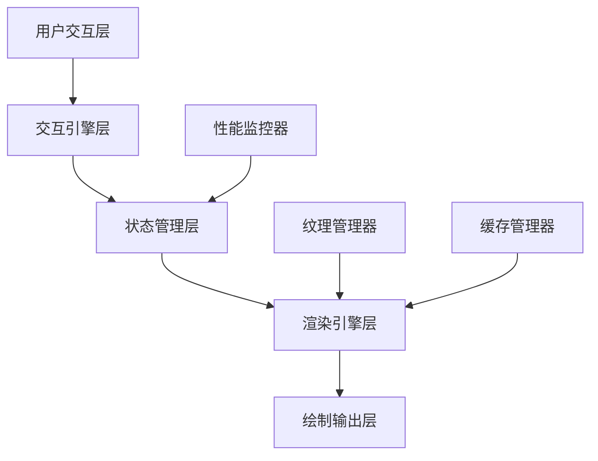
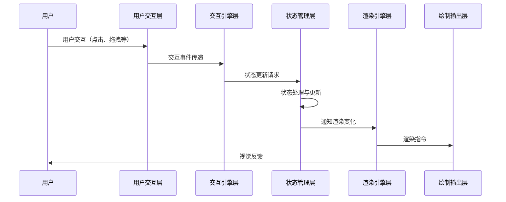

# 架构分层策略

## 1. 架构总览

新的画布系统采用严格的分层架构，通过明确的职责划分和接口定义，实现各层之间的松耦合，提高系统的可维护性、可测试性和性能。

### 1.1 架构图



### 1.2 数据流向



## 2. 分层详细说明

### 2.1 用户交互层

**职责**：
* 捕获并处理用户的输入事件（触摸、点击、拖拽等）
* 提供可视化UI控件与交互反馈
* 将用户操作转换为交互引擎可理解的事件

**关键组件**：
* `M3PracticeEditCanvas`：主画布组件
* `CanvasControlPoints`：控制点UI
* `CanvasToolbar`：工具栏组件
* `PropertyPanel`：属性编辑面板

**设计原则**：
* 只负责UI渲染与事件捕获，不包含业务逻辑
* 所有状态通过状态管理层获取，不直接修改状态
* 使用`Consumer`模式响应状态变化
* 最小化重建范围，合理使用`RepaintBoundary`

### 2.2 交互引擎层

**职责**：
* 处理复杂的用户交互逻辑
* 将低级事件转换为高级命令
* 实现交互行为（选择、移动、调整大小等）
* 处理手势识别与冲突解决

**关键组件**：
* `CanvasInteractionEngine`：核心交互引擎
* `GestureProcessor`：手势处理器
* `SelectionHandler`：选择处理器
* `TransformHandler`：变换处理器

**设计原则**：
* 纯Dart实现，无Flutter依赖
* 通过接口与状态管理层交互
* 不直接修改渲染状态
* 可独立测试

### 2.3 状态管理层

**职责**：
* 集中管理所有画布状态
* 处理状态更新与通知
* 实现命令模式支持撤销/重做
* 状态持久化与恢复

**关键组件**：
* `CanvasStateManager`：状态管理器
* `CanvasCommandProcessor`：命令处理器
* `UndoRedoManager`：撤销/重做管理器
* `StateChangeNotifier`：状态变更通知器

**设计原则**：
* 单一数据源
* 不可变状态模型
* 状态分层（UI状态、渲染状态、持久状态）
* 高效的状态更新通知机制

### 2.4 渲染引擎层

**职责**：
* 高效绘制画布内容
* 管理渲染资源（纹理、字体等）
* 实现渲染优化策略
* 提供抽象渲染接口

**关键组件**：
* `CanvasRenderingEngine`：渲染引擎
* `ElementRenderer`：元素渲染器
* `RenderStrategyManager`：渲染策略管理器
* `RenderCache`：渲染缓存

**设计原则**：
* 纯Dart实现，无Flutter依赖
* 增量渲染策略
* 渲染任务优先级管理
* 可扩展的渲染器架构

### 2.5 绘制输出层

**职责**：
* 提供平台特定的绘制实现
* 桥接渲染引擎与Flutter Canvas
* 处理平台特定的渲染优化

**关键组件**：
* `FlutterCanvasAdapter`：Flutter画布适配器
* `CustomPainterImplementation`：自定义绘制实现
* `RepaintBoundaryManager`：重绘边界管理器

**设计原则**：
* 薄适配层设计
* 高效转换渲染指令
* 利用平台特性优化渲染

## 3. 辅助系统

### 3.1 纹理管理器

**职责**：
* 异步加载与管理纹理资源
* 实现多级纹理缓存
* 提供纹理预处理功能
* 管理纹理生命周期

**关键功能**：
* 纹理异步加载
* 纹理缓存管理
* 纹理预处理（调整大小、颜色处理等）
* 内存占用优化

### 3.2 缓存管理器

**职责**：
* 管理渲染缓存策略
* 实现多级缓存机制
* 优化缓存命中率
* 智能缓存失效策略

**关键功能**：
* 图层缓存
* 区域缓存
* 变换缓存
* 缓存优先级管理

### 3.3 性能监控器

**职责**：
* 收集性能指标
* 监控渲染性能
* 提供性能调试信息
* 自动调整渲染策略

**关键功能**：
* 帧率监控
* 渲染时间统计
* 内存使用分析
* 性能瓶颈识别

## 4. 层间通信机制

### 4.1 接口定义

各层之间通过明确定义的接口进行通信，确保层间松耦合：

```dart
/// 交互引擎与状态管理层接口
abstract class InteractionToStateInterface {
  void updateElementPosition(String id, Offset newPosition);
  void selectElements(List<String> elementIds);
  void applyTransformation(String id, Matrix4 transform);
  CommandResult executeCommand(CanvasCommand command);
}

/// 状态管理层与渲染引擎接口
abstract class StateToRenderInterface {
  void invalidateElement(String elementId);
  void invalidateRegion(Rect region);
  void requestFullRedraw();
  Future<void> preloadResources(List<ResourceDescriptor> resources);
}
```

### 4.2 事件传递机制

采用观察者模式和响应式编程实现高效的事件传递：

* **状态变更通知**：使用`ValueNotifier`和`Stream`
* **命令模式**：交互转换为命令传递给状态层
* **渲染请求**：状态变化触发渲染请求

### 4.3 数据流向控制

实施严格的单向数据流原则：

* 数据始终从上层向下层流动
* 事件和通知从下层向上层传递
* 禁止跨层直接通信
* 使用适配器模式处理特殊情况

## 5. 实施策略

### 5.1 接口优先策略

* 先定义层间接口，再实现各层功能
* 使用接口模拟器进行早期测试
* 接口稳定后再并行开发各层实现

### 5.2 增量实施计划

1. **建立基础框架**：定义接口和基础抽象类
2. **状态管理层实现**：作为系统核心优先实现
3. **渲染引擎层实现**：在状态层基础上实现
4. **交互引擎层实现**：基于稳定的状态接口实现
5. **UI层适配**：最后实现UI适配层

### 5.3 验证与测试策略

* 每层单独编写单元测试
* 实现层间集成测试
* 使用模拟对象测试层间交互
* 性能基准测试验证设计目标
