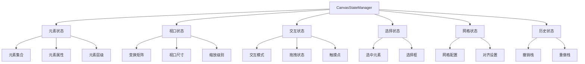

# 状态管理设计

## 1. 状态管理概述

### 1.1 设计目标

* **集中式状态管理**：建立单一数据源，避免状态分散和不一致
* **状态分层**：明确区分UI状态、业务状态和渲染状态
* **高效更新**：减少重建范围，实现细粒度更新
* **可追踪性**：支持状态变更跟踪和调试
* **可测试性**：便于单元测试和状态模拟

### 1.2 状态管理结构



## 2. 状态类型与结构

### 2.1 元素状态

```dart
/// 元素渲染数据
class ElementRenderData {
  final String id;
  final String type;
  final Rect bounds;
  final double rotation;
  final double opacity;
  final int zIndex;
  final Map<String, dynamic> properties;
  
  // 不可变数据模型
  ElementRenderData({
    required this.id,
    required this.type,
    required this.bounds,
    this.rotation = 0.0,
    this.opacity = 1.0,
    this.zIndex = 0,
    Map<String, dynamic>? properties,
  }) : properties = properties ?? {};
  
  // 创建更新后的副本（不可变模式）
  ElementRenderData copyWith({
    Rect? bounds,
    double? rotation,
    double? opacity,
    int? zIndex,
    Map<String, dynamic>? properties,
  }) {
    return ElementRenderData(
      id: this.id,
      type: this.type,
      bounds: bounds ?? this.bounds,
      rotation: rotation ?? this.rotation,
      opacity: opacity ?? this.opacity,
      zIndex: zIndex ?? this.zIndex,
      properties: properties ?? Map.from(this.properties),
    );
  }
}

/// 元素集合状态
class ElementCollectionState {
  final Map<String, ElementRenderData> elements;
  final Set<String> dirtyElementIds;
  
  ElementCollectionState({
    Map<String, ElementRenderData>? elements,
    Set<String>? dirtyElementIds,
  }) : 
    elements = elements ?? {},
    dirtyElementIds = dirtyElementIds ?? {};
  
  // 不可变更新方法
  ElementCollectionState copyWith({
    Map<String, ElementRenderData>? elements,
    Set<String>? dirtyElementIds,
  }) {
    return ElementCollectionState(
      elements: elements ?? Map.from(this.elements),
      dirtyElementIds: dirtyElementIds ?? Set.from(this.dirtyElementIds),
    );
  }
  
  // 获取按Z轴排序的元素列表
  List<ElementRenderData> getOrderedElements() {
    final list = elements.values.toList();
    list.sort((a, b) => a.zIndex.compareTo(b.zIndex));
    return list;
  }
}
```

### 2.2 视口状态

```dart
/// 视口状态
class ViewportState {
  final Matrix4 transform;
  final Size viewportSize;
  final Size contentSize;
  final double scale;
  
  ViewportState({
    Matrix4? transform,
    this.viewportSize = Size.zero,
    this.contentSize = Size.zero,
    this.scale = 1.0,
  }) : transform = transform ?? Matrix4.identity();
  
  // 不可变更新方法
  ViewportState copyWith({
    Matrix4? transform,
    Size? viewportSize,
    Size? contentSize,
    double? scale,
  }) {
    return ViewportState(
      transform: transform ?? this.transform.clone(),
      viewportSize: viewportSize ?? this.viewportSize,
      contentSize: contentSize ?? this.contentSize,
      scale: scale ?? this.scale,
    );
  }
  
  // 视口坐标转内容坐标
  Offset viewportToContent(Offset viewportOffset) {
    final vec = Vector3(viewportOffset.dx, viewportOffset.dy, 0);
    final inverseMatrix = Matrix4.inverted(transform);
    final transformed = inverseMatrix.transform3(vec);
    return Offset(transformed.x, transformed.y);
  }
  
  // 内容坐标转视口坐标
  Offset contentToViewport(Offset contentOffset) {
    final vec = Vector3(contentOffset.dx, contentOffset.dy, 0);
    final transformed = transform.transform3(vec);
    return Offset(transformed.x, transformed.y);
  }
}
```

### 2.3 选择状态

```dart
/// 选择状态
class SelectionState {
  final Set<String> selectedElementIds;
  final Rect? selectionBox;
  final bool isSelecting;
  
  SelectionState({
    Set<String>? selectedElementIds,
    this.selectionBox,
    this.isSelecting = false,
  }) : selectedElementIds = selectedElementIds ?? {};
  
  // 不可变更新方法
  SelectionState copyWith({
    Set<String>? selectedElementIds,
    Rect? selectionBox,
    bool? isSelecting,
  }) {
    return SelectionState(
      selectedElementIds: selectedElementIds ?? Set.from(this.selectedElementIds),
      selectionBox: selectionBox ?? this.selectionBox,
      isSelecting: isSelecting ?? this.isSelecting,
    );
  }
  
  // 判断元素是否被选中
  bool isElementSelected(String elementId) {
    return selectedElementIds.contains(elementId);
  }
  
  // 是否有元素被选中
  bool get hasSelection => selectedElementIds.isNotEmpty;
}
```

## 3. 状态管理器实现

### 3.1 状态管理器基础结构

```dart
/// 画布状态管理器
class CanvasStateManager extends ChangeNotifier {
  // 状态分层
  ElementCollectionState _elementState;
  ViewportState _viewportState;
  SelectionState _selectionState;
  InteractionState _interactionState;
  GridState _gridState;
  
  // 脏区域跟踪
  final Set<Rect> _dirtyRegions = {};
  bool _needsFullRepaint = false;
  
  // 构造函数
  CanvasStateManager({
    ElementCollectionState? elementState,
    ViewportState? viewportState,
    SelectionState? selectionState,
    InteractionState? interactionState,
    GridState? gridState,
  }) : 
    _elementState = elementState ?? ElementCollectionState(),
    _viewportState = viewportState ?? ViewportState(),
    _selectionState = selectionState ?? SelectionState(),
    _interactionState = interactionState ?? InteractionState(),
    _gridState = gridState ?? GridState();
  
  // 状态访问器
  ElementCollectionState get elementState => _elementState;
  ViewportState get viewportState => _viewportState;
  SelectionState get selectionState => _selectionState;
  InteractionState get interactionState => _interactionState;
  GridState get gridState => _gridState;
  
  // 渲染状态
  Set<Rect> get dirtyRegions => Set.from(_dirtyRegions);
  bool get needsFullRepaint => _needsFullRepaint;
  
  // 元素操作方法
  void addElement(ElementRenderData element) {
    final newElements = Map<String, ElementRenderData>.from(_elementState.elements);
    newElements[element.id] = element;
    
    _elementState = _elementState.copyWith(
      elements: newElements,
      dirtyElementIds: {..._elementState.dirtyElementIds, element.id},
    );
    
    _dirtyRegions.add(element.bounds);
    notifyListeners();
  }
  
  // 更新元素
  void updateElement(String id, ElementRenderData Function(ElementRenderData) updater) {
    final elements = Map<String, ElementRenderData>.from(_elementState.elements);
    final oldElement = elements[id];
    
    if (oldElement != null) {
      final newElement = updater(oldElement);
      elements[id] = newElement;
      
      _elementState = _elementState.copyWith(
        elements: elements,
        dirtyElementIds: {..._elementState.dirtyElementIds, id},
      );
      
      // 添加新旧区域到脏区域
      _dirtyRegions.add(oldElement.bounds);
      _dirtyRegions.add(newElement.bounds);
      
      notifyListeners();
    }
  }
  
  // 请求全部重绘
  void requestFullRepaint() {
    _needsFullRepaint = true;
    notifyListeners();
  }
  
  // 清理脏状态标记
  void clearDirtyFlags() {
    _dirtyRegions.clear();
    _needsFullRepaint = false;
    _elementState = _elementState.copyWith(dirtyElementIds: {});
  }
}
```

### 3.2 状态通知优化

```dart
/// 细粒度通知机制
class CanvasStateManager extends ChangeNotifier {
  // 其他代码省略...
  
  // 专用通知对象
  final ValueNotifier<ElementCollectionState> elementStateNotifier = ValueNotifier(ElementCollectionState());
  final ValueNotifier<ViewportState> viewportStateNotifier = ValueNotifier(ViewportState());
  final ValueNotifier<SelectionState> selectionStateNotifier = ValueNotifier(SelectionState());
  
  @override
  void notifyListeners() {
    // 更新专用通知对象
    elementStateNotifier.value = _elementState;
    viewportStateNotifier.value = _viewportState;
    selectionStateNotifier.value = _selectionState;
    
    // 调用父类通知
    super.notifyListeners();
  }
  
  // 低频率更新（避免频繁触发完整重建）
  void updateViewportTransform(Matrix4 transform) {
    _viewportState = _viewportState.copyWith(transform: transform);
    
    // 直接更新通知器，不触发完整重建
    viewportStateNotifier.value = _viewportState;
    
    // 设置节流更新标志
    _scheduleNotification();
  }
  
  // 节流通知逻辑
  Timer? _notificationTimer;
  void _scheduleNotification() {
    _notificationTimer?.cancel();
    _notificationTimer = Timer(Duration(milliseconds: 16), () {
      super.notifyListeners();
    });
  }
}
```

## 4. 状态访问机制

### 4.1 消费者模式

```dart
/// 渲染器使用状态
class CanvasPainter extends CustomPainter {
  final CanvasStateManager stateManager;
  final CanvasRenderingEngine renderingEngine;
  
  CanvasPainter({
    required this.stateManager,
    required this.renderingEngine,
  }) : super(repaint: stateManager);
  
  @override
  void paint(Canvas canvas, Size size) {
    // 使用状态数据进行渲染
    renderingEngine.renderToCanvas(canvas, size);
  }
  
  @override
  bool shouldRepaint(covariant CanvasPainter oldDelegate) {
    // 优化重绘决策
    return stateManager != oldDelegate.stateManager || 
           renderingEngine != oldDelegate.renderingEngine;
  }
}

/// UI组件使用状态
class SelectionToolbar extends StatelessWidget {
  final CanvasStateManager stateManager;
  
  const SelectionToolbar({Key? key, required this.stateManager}) : super(key: key);
  
  @override
  Widget build(BuildContext context) {
    // 使用ValueListenableBuilder实现细粒度重建
    return ValueListenableBuilder<SelectionState>(
      valueListenable: stateManager.selectionStateNotifier,
      builder: (context, selectionState, child) {
        // 只有选择状态变化时重建
        return _buildToolbar(selectionState);
      },
    );
  }
  
  Widget _buildToolbar(SelectionState state) {
    if (!state.hasSelection) {
      return SizedBox.shrink();
    }
    
    // 构建选择工具栏...
    return Row(
      // 工具栏UI...
    );
  }
}
```

### 4.2 状态监听

```dart
class CanvasEditor extends StatefulWidget {
  @override
  _CanvasEditorState createState() => _CanvasEditorState();
}

class _CanvasEditorState extends State<CanvasEditor> {
  late CanvasStateManager stateManager;
  
  @override
  void initState() {
    super.initState();
    stateManager = CanvasStateManager();
    
    // 监听全局状态变化
    stateManager.addListener(_handleStateChange);
    
    // 监听特定状态变化
    stateManager.elementStateNotifier.addListener(_handleElementStateChange);
    stateManager.selectionStateNotifier.addListener(_handleSelectionStateChange);
  }
  
  void _handleStateChange() {
    // 处理整体状态变化
    setState(() {
      // 全局UI更新
    });
  }
  
  void _handleElementStateChange() {
    // 只处理元素状态变化
    _updatePropertyPanel();
  }
  
  void _handleSelectionStateChange() {
    // 只处理选择状态变化
    _updateSelectionControls();
  }
  
  void _updatePropertyPanel() {
    // 更新属性面板，不触发整体重建
  }
  
  void _updateSelectionControls() {
    // 更新选择控制，不触发整体重建
  }
  
  @override
  void dispose() {
    stateManager.removeListener(_handleStateChange);
    stateManager.elementStateNotifier.removeListener(_handleElementStateChange);
    stateManager.selectionStateNotifier.removeListener(_handleSelectionStateChange);
    super.dispose();
  }
  
  @override
  Widget build(BuildContext context) {
    // 构建编辑器UI
    return Column(
      children: [
        Expanded(
          child: CanvasView(stateManager: stateManager),
        ),
        PropertyPanel(stateManager: stateManager),
      ],
    );
  }
}
```

## 5. 状态持久化

### 5.1 序列化与反序列化

```dart
extension CanvasStateSerialize on CanvasStateManager {
  /// 序列化状态到JSON
  Map<String, dynamic> toJson() {
    return {
      'elements': _serializeElements(),
      'viewport': _serializeViewport(),
      'grid': _serializeGrid(),
    };
  }
  
  /// 从JSON恢复状态
  void fromJson(Map<String, dynamic> json) {
    if (json.containsKey('elements')) {
      _deserializeElements(json['elements']);
    }
    
    if (json.containsKey('viewport')) {
      _deserializeViewport(json['viewport']);
    }
    
    if (json.containsKey('grid')) {
      _deserializeGrid(json['grid']);
    }
    
    // 请求完全重绘
    requestFullRepaint();
  }
  
  /// 序列化元素集合
  Map<String, dynamic> _serializeElements() {
    final elementsJson = <String, dynamic>{};
    
    for (final entry in _elementState.elements.entries) {
      elementsJson[entry.key] = entry.value.toJson();
    }
    
    return elementsJson;
  }
  
  /// 反序列化元素集合
  void _deserializeElements(Map<String, dynamic> json) {
    final elements = <String, ElementRenderData>{};
    
    for (final entry in json.entries) {
      final elementData = _deserializeElement(entry.value);
      if (elementData != null) {
        elements[entry.key] = elementData;
      }
    }
    
    _elementState = _elementState.copyWith(elements: elements);
  }
  
  /// 反序列化单个元素
  ElementRenderData? _deserializeElement(Map<String, dynamic> json) {
    final type = json['type'] as String?;
    
    if (type == null) return null;
    
    // 根据类型创建对应的元素数据
    switch (type) {
      case 'text':
        return TextElementData.fromJson(json);
      case 'image':
        return ImageElementData.fromJson(json);
      case 'shape':
        return ShapeElementData.fromJson(json);
      case 'character':
        return CharacterElementData.fromJson(json);
      default:
        return null;
    }
  }
}
```

### 5.2 状态快照

```dart
/// 状态快照管理
class StateSnapshotManager {
  final CanvasStateManager stateManager;
  final List<Map<String, dynamic>> _snapshots = [];
  int _currentSnapshotIndex = -1;
  
  StateSnapshotManager(this.stateManager);
  
  /// 创建状态快照
  void takeSnapshot() {
    // 删除当前索引之后的所有快照（如果有）
    if (_currentSnapshotIndex < _snapshots.length - 1) {
      _snapshots.removeRange(_currentSnapshotIndex + 1, _snapshots.length);
    }
    
    // 添加当前状态快照
    final snapshot = stateManager.toJson();
    _snapshots.add(snapshot);
    _currentSnapshotIndex = _snapshots.length - 1;
  }
  
  /// 回退到上一个状态
  bool goToPreviousState() {
    if (_currentSnapshotIndex <= 0) {
      return false;
    }
    
    _currentSnapshotIndex--;
    stateManager.fromJson(_snapshots[_currentSnapshotIndex]);
    return true;
  }
  
  /// 前进到下一个状态
  bool goToNextState() {
    if (_currentSnapshotIndex >= _snapshots.length - 1) {
      return false;
    }
    
    _currentSnapshotIndex++;
    stateManager.fromJson(_snapshots[_currentSnapshotIndex]);
    return true;
  }
  
  /// 保存状态到文件
  Future<void> saveToFile(String filePath) async {
    // 实现保存逻辑...
  }
  
  /// 从文件加载状态
  Future<void> loadFromFile(String filePath) async {
    // 实现加载逻辑...
  }
}
```

## 6. 状态管理最佳实践

### 6.1 状态隔离原则

* **单一数据源**：所有状态都从CanvasStateManager获取
* **不可变状态**：状态对象不可直接修改，只能通过copyWith创建新实例
* **分层状态**：将不同类型的状态分开管理，减少不必要的更新
* **细粒度通知**：使用专用通知对象实现细粒度UI更新

### 6.2 性能优化策略

* **状态更新批处理**：批量处理多个状态更新
* **脏区域跟踪**：只重绘发生变化的区域
* **延迟通知**：对高频状态更新使用节流通知
* **分层监听**：UI组件只监听所需的特定状态
* **计算缓存**：缓存复杂计算结果，避免重复计算

### 6.3 状态调试支持

```dart
/// 状态调试扩展
extension CanvasStateDebug on CanvasStateManager {
  /// 启用调试模式
  void enableDebugMode() {
    _isDebugMode = true;
  }
  
  /// 禁用调试模式
  void disableDebugMode() {
    _isDebugMode = false;
  }
  
  /// 记录状态变更
  void _logStateChange(String action, {Map<String, dynamic>? details}) {
    if (!_isDebugMode) return;
    
    final timestamp = DateTime.now();
    final entry = StateChangeLogEntry(
      timestamp: timestamp,
      action: action,
      details: details,
    );
    
    _stateChangeLog.add(entry);
    
    print('[$timestamp] $action: ${details ?? ''}');
  }
  
  /// 获取状态变更日志
  List<StateChangeLogEntry> getStateChangeLog() {
    return List.unmodifiable(_stateChangeLog);
  }
  
  /// 清除状态变更日志
  void clearStateChangeLog() {
    _stateChangeLog.clear();
  }
  
  /// 导出状态变更日志
  String exportStateChangeLog() {
    return jsonEncode(_stateChangeLog.map((e) => e.toJson()).toList());
  }
  
  bool _isDebugMode = false;
  final List<StateChangeLogEntry> _stateChangeLog = [];
}

/// 状态变更日志条目
class StateChangeLogEntry {
  final DateTime timestamp;
  final String action;
  final Map<String, dynamic>? details;
  
  StateChangeLogEntry({
    required this.timestamp,
    required this.action,
    this.details,
  });
  
  Map<String, dynamic> toJson() {
    return {
      'timestamp': timestamp.toIso8601String(),
      'action': action,
      'details': details,
    };
  }
}
```
