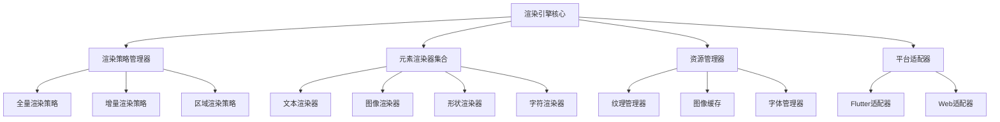

# 渲染引擎设计

## 1. 渲染引擎概述

### 1.1 设计目标

* **高性能渲染**：优化绘制流程，提高渲染效率
* **增量渲染**：只重绘变化的部分，减少不必要的绘制
* **资源管理**：高效的纹理和资源管理
* **框架无关**：核心渲染逻辑与UI框架解耦
* **可扩展性**：支持新元素类型和渲染效果的扩展

### 1.2 架构设计

渲染引擎采用分层设计，包括渲染策略层、渲染器层、资源管理层和平台适配层。



## 2. 核心组件设计

### 2.1 渲染引擎核心

```dart
/// 渲染引擎核心类
class CanvasRenderingEngine {
  final CanvasStateManager stateManager;
  final Map<String, ElementRenderer> _renderers = {};
  final TextureManager _textureManager;
  final RenderCache _renderCache;
  final RenderStrategyManager _strategyManager;
  
  CanvasRenderingEngine(this.stateManager) 
    : _textureManager = TextureManager(),
      _renderCache = RenderCache(),
      _strategyManager = RenderStrategyManager();
  
  /// 主渲染方法
  void renderToCanvas(Canvas canvas, Size size) {
    final strategy = _determineRenderStrategy();
    strategy.render(canvas, size, this);
  }
  
  /// 确定渲染策略
  RenderStrategy _determineRenderStrategy() {
    if (stateManager.needsFullRepaint) {
      return _strategyManager.getStrategy(RenderStrategyType.full);
    } else if (stateManager.dirtyRegions.isNotEmpty) {
      return _strategyManager.getStrategy(RenderStrategyType.region);
    } else {
      return _strategyManager.getStrategy(RenderStrategyType.incremental);
    }
  }
  
  /// 渲染单个元素
  void renderElement(Canvas canvas, ElementRenderData element) {
    final renderer = _getRendererForElement(element);
    renderer.renderElement(canvas, element);
  }
  
  /// 获取元素专用渲染器
  ElementRenderer _getRendererForElement(ElementRenderData element) {
    final type = element.type;
    if (!_renderers.containsKey(type)) {
      _renderers[type] = _createRenderer(type);
    }
    return _renderers[type]!;
  }
  
  /// 创建渲染器
  ElementRenderer _createRenderer(String type) {
    switch (type) {
      case 'text':
        return TextElementRenderer(_textureManager);
      case 'image':
        return ImageElementRenderer(_textureManager);
      case 'shape':
        return ShapeElementRenderer();
      case 'character':
        return CharacterElementRenderer(_textureManager);
      default:
        return DefaultElementRenderer();
    }
  }
  
  /// 预加载资源
  Future<void> preloadResources(List<ResourceDescriptor> resources) async {
    for (final resource in resources) {
      switch (resource.type) {
        case ResourceType.texture:
          await _textureManager.preloadTexture(resource.path);
          break;
        case ResourceType.font:
          // 字体预加载...
          break;
        case ResourceType.other:
          // 其他资源预加载...
          break;
      }
    }
  }
}
```

### 2.2 渲染策略

```dart
/// 渲染策略接口
abstract class RenderStrategy {
  void render(Canvas canvas, Size size, CanvasRenderingEngine engine);
}

/// 全量渲染策略
class FullRenderStrategy implements RenderStrategy {
  @override
  void render(Canvas canvas, Size size, CanvasRenderingEngine engine) {
    final stateManager = engine.stateManager;
    final elements = stateManager.elementState.getOrderedElements();
    
    // 清除画布
    canvas.save();
    canvas.clipRect(Offset.zero & size);
    canvas.drawColor(Colors.transparent, BlendMode.clear);
    
    // 应用全局变换
    final transform = stateManager.viewportState.transform;
    canvas.transform(transform.storage);
    
    // 渲染所有元素
    for (final element in elements) {
      engine.renderElement(canvas, element);
    }
    
    canvas.restore();
  }
}

/// 增量渲染策略
class IncrementalRenderStrategy implements RenderStrategy {
  @override
  void render(Canvas canvas, Size size, CanvasRenderingEngine engine) {
    final stateManager = engine.stateManager;
    final dirtyElements = stateManager.getDirtyElements();
    
    canvas.save();
    
    // 应用全局变换
    final transform = stateManager.viewportState.transform;
    canvas.transform(transform.storage);
    
    // 只渲染脏元素
    for (final element in dirtyElements) {
      // 清除元素区域
      final rect = element.bounds;
      canvas.save();
      canvas.clipRect(rect);
      canvas.drawColor(Colors.transparent, BlendMode.clear);
      
      // 重绘元素
      engine.renderElement(canvas, element);
      canvas.restore();
    }
    
    canvas.restore();
  }
}

/// 区域渲染策略
class RegionRenderStrategy implements RenderStrategy {
  @override
  void render(Canvas canvas, Size size, CanvasRenderingEngine engine) {
    final stateManager = engine.stateManager;
    final dirtyRegions = stateManager.dirtyRegions;
    final elements = stateManager.elementState.getOrderedElements();
    
    canvas.save();
    
    // 应用全局变换
    final transform = stateManager.viewportState.transform;
    canvas.transform(transform.storage);
    
    // 处理每个脏区域
    for (final region in dirtyRegions) {
      canvas.save();
      canvas.clipRect(region);
      canvas.drawColor(Colors.transparent, BlendMode.clear);
      
      // 渲染与区域相交的元素
      for (final element in elements) {
        if (element.bounds.overlaps(region)) {
          engine.renderElement(canvas, element);
        }
      }
      
      canvas.restore();
    }
    
    canvas.restore();
  }
}
```

### 2.3 元素渲染器

```dart
/// 元素渲染器接口
abstract class ElementRenderer {
  /// 渲染元素到画布
  void renderElement(Canvas canvas, ElementRenderData data);
  
  /// 判断点是否在元素内
  bool isPointInElement(Offset point, ElementRenderData data);
  
  /// 获取元素变换矩阵
  Matrix4 getElementTransform(ElementRenderData data);
  
  /// 预加载元素资源
  Future<void> preloadResources(ElementRenderData data);
}

/// 文本元素渲染器
class TextElementRenderer implements ElementRenderer {
  final TextureManager textureManager;
  
  TextElementRenderer(this.textureManager);
  
  @override
  void renderElement(Canvas canvas, ElementRenderData data) {
    final textData = data as TextElementData;
    final textStyle = textData.style;
    final text = textData.text;
    
    canvas.save();
    
    // 应用元素变换
    final transform = getElementTransform(data);
    canvas.transform(transform.storage);
    
    // 绘制文本
    final textPainter = TextPainter(
      text: TextSpan(text: text, style: textStyle),
      textDirection: TextDirection.ltr,
    );
    
    textPainter.layout(maxWidth: data.bounds.width);
    textPainter.paint(canvas, Offset.zero);
    
    canvas.restore();
  }
  
  @override
  bool isPointInElement(Offset point, ElementRenderData data) {
    // 实现点击检测...
    return data.bounds.contains(point);
  }
  
  @override
  Matrix4 getElementTransform(ElementRenderData data) {
    final matrix = Matrix4.identity();
    final center = data.bounds.center;
    
    // 平移到原点
    matrix.translate(-center.dx, -center.dy);
    
    // 应用旋转
    if (data.rotation != 0) {
      matrix.rotateZ(data.rotation);
    }
    
    // 平移回原位置
    matrix.translate(center.dx, center.dy);
    
    // 应用平移
    matrix.translate(data.bounds.left, data.bounds.top);
    
    return matrix;
  }
  
  @override
  Future<void> preloadResources(ElementRenderData data) async {
    // 预加载字体等资源...
  }
}
```

## 3. 纹理管理系统

### 3.1 纹理管理器

```dart
/// 纹理管理器
class TextureManager {
  final Map<String, ui.Image> _imageCache = {};
  final Map<String, Completer<ui.Image>> _loadingImages = {};
  final LruCache<String, ui.Image> _lruCache = LruCache<String, ui.Image>(maxSize: 50);
  
  /// 加载纹理
  Future<ui.Image> loadTexture(String path) async {
    // 检查内存缓存
    if (_imageCache.containsKey(path)) {
      return _imageCache[path]!;
    }
    
    // 检查LRU缓存
    final cachedImage = _lruCache.get(path);
    if (cachedImage != null) {
      _imageCache[path] = cachedImage;
      return cachedImage;
    }
    
    // 检查是否正在加载
    if (_loadingImages.containsKey(path)) {
      return _loadingImages[path]!.future;
    }
    
    // 开始加载
    final completer = Completer<ui.Image>();
    _loadingImages[path] = completer;
    
    try {
      // 异步加载图像
      final data = await _loadImageData(path);
      final codec = await ui.instantiateImageCodec(data);
      final frameInfo = await codec.getNextFrame();
      final image = frameInfo.image;
      
      // 更新缓存
      _imageCache[path] = image;
      _lruCache.put(path, image);
      
      completer.complete(image);
      _loadingImages.remove(path);
      
      return image;
    } catch (e) {
      completer.completeError(e);
      _loadingImages.remove(path);
      rethrow;
    }
  }
  
  /// 预加载纹理
  Future<void> preloadTexture(String path) async {
    try {
      await loadTexture(path);
    } catch (e) {
      print('Failed to preload texture: $path, $e');
    }
  }
  
  /// 清理未使用的纹理
  void cleanupUnusedTextures(Set<String> activePaths) {
    final keysToRemove = _imageCache.keys
        .where((key) => !activePaths.contains(key))
        .toList();
    
    for (final key in keysToRemove) {
      final image = _imageCache.remove(key);
      // 在某些平台需要显式释放资源
      // image.dispose();
    }
  }
  
  /// 加载图像数据
  Future<Uint8List> _loadImageData(String path) async {
    if (path.startsWith('http')) {
      // 从网络加载
      final response = await http.get(Uri.parse(path));
      return response.bodyBytes;
    } else if (path.startsWith('asset')) {
      // 从资源加载
      final assetPath = path.replaceFirst('asset:', '');
      final data = await rootBundle.load(assetPath);
      return data.buffer.asUint8List();
    } else {
      // 从文件系统加载
      final file = File(path);
      return await file.readAsBytes();
    }
  }
}
```

### 3.2 缓存系统

```dart
/// LRU缓存实现
class LruCache<K, V> {
  final int maxSize;
  final LinkedHashMap<K, V> _map = LinkedHashMap<K, V>();
  
  LruCache({required this.maxSize});
  
  /// 获取缓存项
  V? get(K key) {
    final value = _map.remove(key);
    if (value != null) {
      // 移到最后（最近使用）
      _map[key] = value;
    }
    return value;
  }
  
  /// 添加缓存项
  void put(K key, V value) {
    // 移除已存在的项
    _map.remove(key);
    
    // 如果达到最大容量，移除最久未使用的项
    if (_map.length >= maxSize && _map.isNotEmpty) {
      final oldestKey = _map.keys.first;
      _map.remove(oldestKey);
    }
    
    // 添加新项
    _map[key] = value;
  }
  
  /// 移除缓存项
  V? remove(K key) {
    return _map.remove(key);
  }
  
  /// 清空缓存
  void clear() {
    _map.clear();
  }
  
  /// 获取当前大小
  int get size => _map.length;
}

/// 渲染缓存
class RenderCache {
  final Map<String, ui.Image> _elementCache = {};
  final Map<Rect, ui.Image> _regionCache = {};
  
  /// 获取元素缓存
  ui.Image? getElementCache(String elementId) {
    return _elementCache[elementId];
  }
  
  /// 设置元素缓存
  void setElementCache(String elementId, ui.Image image) {
    _elementCache[elementId] = image;
  }
  
  /// 获取区域缓存
  ui.Image? getRegionCache(Rect region) {
    // 找到匹配的区域缓存
    return _regionCache.entries
        .where((entry) => entry.key == region)
        .map((entry) => entry.value)
        .firstOrNull;
  }
  
  /// 设置区域缓存
  void setRegionCache(Rect region, ui.Image image) {
    _regionCache[region] = image;
  }
  
  /// 清理缓存
  void invalidateCache(String? elementId, Rect? region) {
    if (elementId != null) {
      _elementCache.remove(elementId);
    }
    
    if (region != null) {
      // 移除与区域相交的所有缓存
      final regionsToRemove = _regionCache.keys
          .where((cachedRegion) => cachedRegion.overlaps(region))
          .toList();
      
      for (final regionToRemove in regionsToRemove) {
        _regionCache.remove(regionToRemove);
      }
    }
  }
  
  /// 清空所有缓存
  void clearCache() {
    _elementCache.clear();
    _regionCache.clear();
  }
}
```

## 4. 平台适配层

### 4.1 Flutter适配器

```dart
/// Flutter画布适配器
class FlutterCanvasAdapter {
  final CanvasRenderingEngine engine;
  
  FlutterCanvasAdapter(this.engine);
  
  /// 创建CustomPainter
  CustomPainter createPainter(CanvasStateManager stateManager) {
    return _EnginePainter(engine, stateManager);
  }
}

/// 引擎绘制器
class _EnginePainter extends CustomPainter {
  final CanvasRenderingEngine engine;
  final CanvasStateManager stateManager;
  
  _EnginePainter(this.engine, this.stateManager) : super(repaint: stateManager);
  
  @override
  void paint(Canvas canvas, Size size) {
    engine.renderToCanvas(canvas, size);
  }
  
  @override
  bool shouldRepaint(covariant _EnginePainter oldDelegate) {
    return oldDelegate.engine != engine || 
           oldDelegate.stateManager != stateManager;
  }
}
```

## 5. 性能优化策略

### 5.1 渲染优化

* **层次化渲染**：不同类型的内容分层渲染
* **视口裁剪**：只渲染视口内可见的元素
* **复杂度自适应**：根据设备性能调整渲染复杂度
* **缓存静态内容**：缓存不变的渲染结果
* **后台线程预处理**：在后台线程进行纹理和图像处理

### 5.2 资源管理优化

* **延迟加载**：按需加载资源
* **预加载策略**：预测并预加载即将需要的资源
* **资源池化**：复用常用资源
* **压缩纹理**：使用适当的纹理压缩格式
* **生命周期管理**：及时释放不再需要的资源

## 6. 实现示例

### 6.1 引擎初始化与使用

```dart
class CanvasWidget extends StatefulWidget {
  @override
  _CanvasWidgetState createState() => _CanvasWidgetState();
}

class _CanvasWidgetState extends State<CanvasWidget> {
  late CanvasStateManager stateManager;
  late CanvasRenderingEngine renderingEngine;
  late FlutterCanvasAdapter adapter;
  
  @override
  void initState() {
    super.initState();
    
    // 初始化状态管理器
    stateManager = CanvasStateManager();
    
    // 初始化渲染引擎
    renderingEngine = CanvasRenderingEngine(stateManager);
    
    // 初始化适配器
    adapter = FlutterCanvasAdapter(renderingEngine);
    
    // 预加载资源
    _preloadResources();
  }
  
  Future<void> _preloadResources() async {
    final resources = [
      ResourceDescriptor(type: ResourceType.texture, path: 'assets/textures/background.png'),
      ResourceDescriptor(type: ResourceType.texture, path: 'assets/textures/character.png'),
    ];
    
    await renderingEngine.preloadResources(resources);
  }
  
  @override
  Widget build(BuildContext context) {
    return CustomPaint(
      painter: adapter.createPainter(stateManager),
      child: Container(),
    );
  }
}
```
