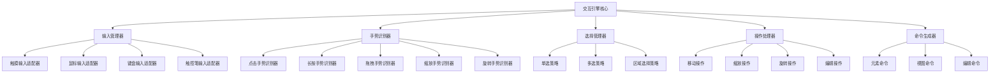

# 交互引擎设计

## 1. 交互引擎概述

交互引擎负责处理用户输入事件，识别手势，管理元素选择与操作，并将用户交互转换为具体的命令。

### 1.1 设计目标

* **响应灵敏**：提供流畅、低延迟的交互体验
* **可扩展性**：易于添加新的交互方式和手势
* **模块化**：清晰的责任边界，与其他系统松耦合
* **多平台支持**：适配不同输入设备和平台特性
* **可测试性**：交互逻辑易于单元测试和自动化测试

### 1.2 架构设计

交互引擎采用分层设计，包括输入处理层、手势识别层、选择管理层、操作处理层和命令生成层。



## 2. 核心组件设计

### 2.1 交互引擎核心

```dart
/// 交互引擎核心类
class CanvasInteractionEngine {
  final CanvasStateManager stateManager;
  final InputManager _inputManager;
  final GestureRecognizer _gestureRecognizer;
  final SelectionManager _selectionManager;
  final ManipulationManager _manipulationManager;
  final CommandGenerator _commandGenerator;
  
  CanvasInteractionEngine(this.stateManager) 
    : _inputManager = InputManager(),
      _gestureRecognizer = GestureRecognizer(),
      _selectionManager = SelectionManager(),
      _manipulationManager = ManipulationManager(),
      _commandGenerator = CommandGenerator();
  
  /// 初始化
  void initialize() {
    _setupInputHandlers();
    _setupGestureRecognizers();
    _setupSelectionStrategies();
    _setupManipulationHandlers();
  }
  
  /// 设置输入处理器
  void _setupInputHandlers() {
    _inputManager.registerHandler(InputType.touch, TouchInputHandler());
    _inputManager.registerHandler(InputType.mouse, MouseInputHandler());
    _inputManager.registerHandler(InputType.keyboard, KeyboardInputHandler());
    _inputManager.registerHandler(InputType.stylus, StylusInputHandler());
    
    // 订阅输入事件
    _inputManager.onInputEvent.listen(_handleInputEvent);
  }
  
  /// 设置手势识别器
  void _setupGestureRecognizers() {
    _gestureRecognizer.registerRecognizer(GestureType.tap, TapGestureRecognizer());
    _gestureRecognizer.registerRecognizer(GestureType.longPress, LongPressGestureRecognizer());
    _gestureRecognizer.registerRecognizer(GestureType.drag, DragGestureRecognizer());
    _gestureRecognizer.registerRecognizer(GestureType.scale, ScaleGestureRecognizer());
    _gestureRecognizer.registerRecognizer(GestureType.rotate, RotateGestureRecognizer());
    
    // 订阅手势事件
    _gestureRecognizer.onGestureDetected.listen(_handleGesture);
  }
  
  /// 设置选择策略
  void _setupSelectionStrategies() {
    _selectionManager.registerStrategy(SelectionType.single, SingleSelectionStrategy());
    _selectionManager.registerStrategy(SelectionType.multi, MultiSelectionStrategy());
    _selectionManager.registerStrategy(SelectionType.area, AreaSelectionStrategy());
  }
  
  /// 设置操作处理器
  void _setupManipulationHandlers() {
    _manipulationManager.registerHandler(ManipulationType.move, MoveManipulationHandler());
    _manipulationManager.registerHandler(ManipulationType.scale, ScaleManipulationHandler());
    _manipulationManager.registerHandler(ManipulationType.rotate, RotateManipulationHandler());
    _manipulationManager.registerHandler(ManipulationType.edit, EditManipulationHandler());
  }
  
  /// 处理输入事件
  void _handleInputEvent(InputEvent event) {
    // 根据当前交互模式决定如何处理输入
    final mode = stateManager.interactionState.currentMode;
    
    switch (mode) {
      case InteractionMode.select:
        _gestureRecognizer.processInputEvent(event);
        break;
      case InteractionMode.draw:
        _handleDrawInput(event);
        break;
      case InteractionMode.text:
        _handleTextInput(event);
        break;
      case InteractionMode.pan:
        _handlePanInput(event);
        break;
      case InteractionMode.zoom:
        _handleZoomInput(event);
        break;
    }
  }
  
  /// 处理手势
  void _handleGesture(GestureEvent gesture) {
    // 检测点击的元素
    if (gesture.type == GestureType.tap) {
      final hitResult = _hitTest(gesture.position);
      if (hitResult != null) {
        _selectionManager.selectElement(hitResult.elementId);
      } else {
        _selectionManager.clearSelection();
      }
    } 
    // 处理拖拽手势
    else if (gesture.type == GestureType.drag) {
      final selectedElements = _selectionManager.selectedElements;
      if (selectedElements.isNotEmpty) {
        _manipulationManager.startManipulation(
          ManipulationType.move, 
          selectedElements, 
          gesture.position
        );
      }
    }
    // 处理其他手势...
  }
  
  /// 点击测试
  HitTestResult? _hitTest(Offset position) {
    final elements = stateManager.elementState.getElementsAtPoint(position);
    if (elements.isEmpty) return null;
    
    // 返回最上层的元素
    return HitTestResult(
      elementId: elements.last.id,
      position: position,
    );
  }
  
  /// 处理绘制输入
  void _handleDrawInput(InputEvent event) {
    if (event.type == InputEventType.down) {
      final command = _commandGenerator.createDrawStartCommand(event.position);
      stateManager.commandManager.executeCommand(command);
    } 
    else if (event.type == InputEventType.move) {
      final command = _commandGenerator.createDrawUpdateCommand(event.position);
      stateManager.commandManager.executeCommand(command);
    }
    else if (event.type == InputEventType.up) {
      final command = _commandGenerator.createDrawEndCommand();
      stateManager.commandManager.executeCommand(command);
    }
  }
  
  /// 处理文本输入
  void _handleTextInput(InputEvent event) {
    // 实现文本输入处理...
  }
  
  /// 处理平移输入
  void _handlePanInput(InputEvent event) {
    if (event.type == InputEventType.down) {
      _lastPanPosition = event.position;
    } 
    else if (event.type == InputEventType.move && _lastPanPosition != null) {
      final delta = event.position - _lastPanPosition!;
      final command = _commandGenerator.createPanCommand(delta);
      stateManager.commandManager.executeCommand(command);
      _lastPanPosition = event.position;
    }
    else if (event.type == InputEventType.up) {
      _lastPanPosition = null;
    }
  }
  
  /// 处理缩放输入
  void _handleZoomInput(InputEvent event) {
    // 实现缩放输入处理...
  }
  
  Offset? _lastPanPosition;
}
```

### 2.2 输入管理系统

```dart
/// 输入类型
enum InputType {
  touch,
  mouse,
  keyboard,
  stylus,
}

/// 输入事件类型
enum InputEventType {
  down,
  move,
  up,
  wheel,
  keyDown,
  keyUp,
}

/// 输入事件
class InputEvent {
  final InputType sourceType;
  final InputEventType type;
  final Offset position;
  final double? pressure;
  final int? pointer;
  final LogicalKeyboardKey? key;
  final Set<LogicalKeyboardKey>? modifiers;
  
  InputEvent({
    required this.sourceType,
    required this.type,
    required this.position,
    this.pressure,
    this.pointer,
    this.key,
    this.modifiers,
  });
}

/// 输入处理器接口
abstract class InputHandler {
  /// 处理原始输入事件
  InputEvent? processRawInput(dynamic rawEvent);
}

/// 输入管理器
class InputManager {
  final Map<InputType, InputHandler> _handlers = {};
  final StreamController<InputEvent> _eventController = StreamController<InputEvent>.broadcast();
  
  /// 输入事件流
  Stream<InputEvent> get onInputEvent => _eventController.stream;
  
  /// 注册输入处理器
  void registerHandler(InputType type, InputHandler handler) {
    _handlers[type] = handler;
  }
  
  /// 处理原始输入
  void handleRawInput(InputType type, dynamic rawEvent) {
    final handler = _handlers[type];
    if (handler != null) {
      final event = handler.processRawInput(rawEvent);
      if (event != null) {
        _eventController.add(event);
      }
    }
  }
  
  /// 销毁
  void dispose() {
    _eventController.close();
  }
}
```

### 2.3 手势识别系统

```dart
/// 手势类型
enum GestureType {
  tap,
  doubleTap,
  longPress,
  drag,
  scale,
  rotate,
}

/// 手势事件
class GestureEvent {
  final GestureType type;
  final Offset position;
  final Offset? delta;
  final double? scale;
  final double? rotation;
  final int? pointer;
  
  GestureEvent({
    required this.type,
    required this.position,
    this.delta,
    this.scale,
    this.rotation,
    this.pointer,
  });
}

/// 手势识别器接口
abstract class GestureRecognizerBase {
  /// 处理输入事件
  void handleInput(InputEvent event);
  
  /// 手势识别成功时调用
  void onGestureRecognized(GestureEvent event);
}

/// 手势识别管理器
class GestureRecognizer {
  final Map<GestureType, GestureRecognizerBase> _recognizers = {};
  final StreamController<GestureEvent> _gestureController = StreamController<GestureEvent>.broadcast();
  
  /// 手势事件流
  Stream<GestureEvent> get onGestureDetected => _gestureController.stream;
  
  /// 注册识别器
  void registerRecognizer(GestureType type, GestureRecognizerBase recognizer) {
    _recognizers[type] = recognizer;
    
    // 设置识别成功回调
    recognizer.onGestureRecognized = (event) {
      _gestureController.add(event);
    };
  }
  
  /// 处理输入事件
  void processInputEvent(InputEvent event) {
    // 将输入事件分发给所有识别器
    for (final recognizer in _recognizers.values) {
      recognizer.handleInput(event);
    }
  }
  
  /// 销毁
  void dispose() {
    _gestureController.close();
  }
}
```

### 2.4 选择管理系统

```dart
/// 选择类型
enum SelectionType {
  single,
  multi,
  area,
}

/// 选择策略接口
abstract class SelectionStrategy {
  /// 执行选择
  List<String> select(
    List<ElementData> elements, 
    dynamic selectionParameters
  );
  
  /// 验证选择是否有效
  bool validateSelection(List<String> selectedIds);
}

/// 选择管理器
class SelectionManager {
  final Map<SelectionType, SelectionStrategy> _strategies = {};
  final ValueNotifier<List<String>> _selectedElements = ValueNotifier<List<String>>([]);
  
  /// 当前选中的元素ID列表
  List<String> get selectedElements => _selectedElements.value;
  
  /// 选择变化通知
  ValueNotifier<List<String>> get selectionNotifier => _selectedElements;
  
  /// 注册选择策略
  void registerStrategy(SelectionType type, SelectionStrategy strategy) {
    _strategies[type] = strategy;
  }
  
  /// 选择单个元素
  void selectElement(String elementId) {
    final strategy = _strategies[SelectionType.single];
    if (strategy != null) {
      final selection = [elementId];
      if (strategy.validateSelection(selection)) {
        _selectedElements.value = selection;
      }
    }
  }
  
  /// 选择多个元素
  void selectElements(List<String> elementIds) {
    final strategy = _strategies[SelectionType.multi];
    if (strategy != null) {
      if (strategy.validateSelection(elementIds)) {
        _selectedElements.value = List.from(elementIds);
      }
    }
  }
  
  /// 按区域选择
  void selectByArea(Rect area, List<ElementData> elements) {
    final strategy = _strategies[SelectionType.area];
    if (strategy != null) {
      final selection = strategy.select(elements, area);
      if (strategy.validateSelection(selection)) {
        _selectedElements.value = selection;
      }
    }
  }
  
  /// 添加到当前选择
  void addToSelection(String elementId) {
    if (!_selectedElements.value.contains(elementId)) {
      final newSelection = List<String>.from(_selectedElements.value)..add(elementId);
      _selectedElements.value = newSelection;
    }
  }
  
  /// 从当前选择中移除
  void removeFromSelection(String elementId) {
    if (_selectedElements.value.contains(elementId)) {
      final newSelection = List<String>.from(_selectedElements.value)..remove(elementId);
      _selectedElements.value = newSelection;
    }
  }
  
  /// 清除选择
  void clearSelection() {
    _selectedElements.value = [];
  }
  
  /// 是否已选中
  bool isSelected(String elementId) {
    return _selectedElements.value.contains(elementId);
  }
}
```

### 2.5 操作处理系统

```dart
/// 操作类型
enum ManipulationType {
  move,
  scale,
  rotate,
  edit,
}

/// 操作处理器接口
abstract class ManipulationHandler {
  /// 开始操作
  void startManipulation(List<String> elementIds, Offset position);
  
  /// 更新操作
  void updateManipulation(Offset position);
  
  /// 结束操作
  void endManipulation();
  
  /// 取消操作
  void cancelManipulation();
}

/// 操作管理器
class ManipulationManager {
  final Map<ManipulationType, ManipulationHandler> _handlers = {};
  ManipulationHandler? _activeHandler;
  
  /// 注册操作处理器
  void registerHandler(ManipulationType type, ManipulationHandler handler) {
    _handlers[type] = handler;
  }
  
  /// 开始操作
  void startManipulation(
    ManipulationType type, 
    List<String> elementIds,
    Offset position
  ) {
    final handler = _handlers[type];
    if (handler != null) {
      _activeHandler = handler;
      handler.startManipulation(elementIds, position);
    }
  }
  
  /// 更新操作
  void updateManipulation(Offset position) {
    _activeHandler?.updateManipulation(position);
  }
  
  /// 结束操作
  void endManipulation() {
    _activeHandler?.endManipulation();
    _activeHandler = null;
  }
  
  /// 取消操作
  void cancelManipulation() {
    _activeHandler?.cancelManipulation();
    _activeHandler = null;
  }
}
```

### 2.6 命令生成系统

```dart
/// 命令生成器
class CommandGenerator {
  /// 创建绘制开始命令
  Command createDrawStartCommand(Offset position) {
    return DrawStartCommand(position: position);
  }
  
  /// 创建绘制更新命令
  Command createDrawUpdateCommand(Offset position) {
    return DrawUpdateCommand(position: position);
  }
  
  /// 创建绘制结束命令
  Command createDrawEndCommand() {
    return DrawEndCommand();
  }
  
  /// 创建选择命令
  Command createSelectCommand(String elementId) {
    return SelectElementCommand(elementId: elementId);
  }
  
  /// 创建多选命令
  Command createMultiSelectCommand(List<String> elementIds) {
    return MultiSelectCommand(elementIds: elementIds);
  }
  
  /// 创建移动命令
  Command createMoveCommand(List<String> elementIds, Offset delta) {
    return MoveElementsCommand(elementIds: elementIds, delta: delta);
  }
  
  /// 创建缩放命令
  Command createScaleCommand(List<String> elementIds, double scale, Offset center) {
    return ScaleElementsCommand(
      elementIds: elementIds, 
      scale: scale, 
      center: center
    );
  }
  
  /// 创建旋转命令
  Command createRotateCommand(List<String> elementIds, double angle, Offset center) {
    return RotateElementsCommand(
      elementIds: elementIds, 
      angle: angle, 
      center: center
    );
  }
  
  /// 创建平移命令
  Command createPanCommand(Offset delta) {
    return PanViewportCommand(delta: delta);
  }
  
  /// 创建缩放视图命令
  Command createZoomCommand(double scale, Offset center) {
    return ZoomViewportCommand(scale: scale, center: center);
  }
}
```

## 3. 交互处理流程

### 3.1 点击与选择流程

1. 用户点击屏幕
2. InputManager 捕获触摸事件并转换为 InputEvent
3. 将 InputEvent 传递给 GestureRecognizer
4. GestureRecognizer 识别为 Tap 手势并创建 GestureEvent
5. InteractionEngine 处理 GestureEvent，执行点击测试
6. 如果点击到元素，通过 SelectionManager 选择元素
7. SelectionManager 更新选择状态并通知状态变化
8. 界面响应选择变化并更新视觉反馈

### 3.2 拖拽与移动流程

1. 用户按下并移动
2. InputManager 捕获一系列触摸事件
3. GestureRecognizer 识别为 Drag 手势
4. InteractionEngine 检查是否有选中元素
5. 如有选中元素，通过 ManipulationManager 启动移动操作
6. 随着用户拖拽，更新操作状态
7. 拖拽结束时，通过 CommandGenerator 创建移动命令
8. 命令提交到 CommandManager 执行
9. 状态更新，界面重绘

## 4. 多设备输入适配

### 4.1 触摸设备适配

```dart
/// 触摸输入处理器
class TouchInputHandler implements InputHandler {
  @override
  InputEvent? processRawInput(dynamic rawEvent) {
    if (rawEvent is! PointerEvent) return null;
    
    InputEventType type;
    switch (rawEvent.runtimeType) {
      case PointerDownEvent:
        type = InputEventType.down;
        break;
      case PointerMoveEvent:
        type = InputEventType.move;
        break;
      case PointerUpEvent:
        type = InputEventType.up;
        break;
      default:
        return null;
    }
    
    return InputEvent(
      sourceType: InputType.touch,
      type: type,
      position: rawEvent.position,
      pressure: rawEvent.pressure,
      pointer: rawEvent.pointer,
    );
  }
}
```

### 4.2 鼠标适配

```dart
/// 鼠标输入处理器
class MouseInputHandler implements InputHandler {
  @override
  InputEvent? processRawInput(dynamic rawEvent) {
    if (rawEvent is! PointerEvent) return null;
    
    InputEventType type;
    switch (rawEvent.runtimeType) {
      case PointerDownEvent:
        type = InputEventType.down;
        break;
      case PointerMoveEvent:
        type = InputEventType.move;
        break;
      case PointerUpEvent:
        type = InputEventType.up;
        break;
      case PointerScrollEvent:
        type = InputEventType.wheel;
        break;
      default:
        return null;
    }
    
    return InputEvent(
      sourceType: InputType.mouse,
      type: type,
      position: rawEvent.position,
      pointer: rawEvent.pointer,
    );
  }
}
```

## 5. 性能优化策略

### 5.1 输入优化

* **事件节流**：限制高频输入事件的处理速率
* **事件合并**：合并短时间内的连续事件
* **延迟处理**：推迟非关键事件的处理
* **异步处理**：在后台线程处理复杂计算

### 5.2 选择与操作优化

* **空间分区**：使用四叉树等数据结构加速点击测试
* **视口裁剪**：只处理视口内的元素
* **惰性评估**：推迟重新计算直到必要时刻
* **结果缓存**：缓存常用操作的结果

## 6. 实现示例

### 6.1 与Flutter整合

```dart
class InteractiveCanvasWidget extends StatefulWidget {
  @override
  _InteractiveCanvasWidgetState createState() => _InteractiveCanvasWidgetState();
}

class _InteractiveCanvasWidgetState extends State<InteractiveCanvasWidget> {
  late CanvasStateManager stateManager;
  late CanvasRenderingEngine renderingEngine;
  late CanvasInteractionEngine interactionEngine;
  
  @override
  void initState() {
    super.initState();
    
    // 初始化状态管理器
    stateManager = CanvasStateManager();
    
    // 初始化渲染引擎
    renderingEngine = CanvasRenderingEngine(stateManager);
    
    // 初始化交互引擎
    interactionEngine = CanvasInteractionEngine(stateManager);
    interactionEngine.initialize();
  }
  
  @override
  Widget build(BuildContext context) {
    return Listener(
      onPointerDown: _handlePointerDown,
      onPointerMove: _handlePointerMove,
      onPointerUp: _handlePointerUp,
      child: CustomPaint(
        painter: CanvasPainter(renderingEngine),
        size: Size.infinite,
      ),
    );
  }
  
  void _handlePointerDown(PointerDownEvent event) {
    interactionEngine._inputManager.handleRawInput(
      InputType.touch, 
      event
    );
  }
  
  void _handlePointerMove(PointerMoveEvent event) {
    interactionEngine._inputManager.handleRawInput(
      InputType.touch, 
      event
    );
  }
  
  void _handlePointerUp(PointerUpEvent event) {
    interactionEngine._inputManager.handleRawInput(
      InputType.touch, 
      event
    );
  }
  
  @override
  void dispose() {
    interactionEngine._inputManager.dispose();
    super.dispose();
  }
}
```
