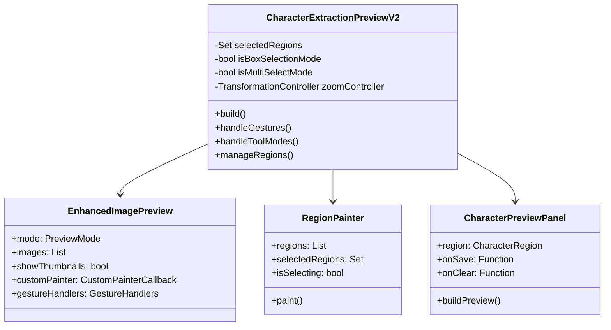

# CharacterExtractionPreview Detailed Migration Analysis

## Key Challenges

1. Complex State Management

- Multiple selection modes
- Region state tracking
- Tool state coordination
- Side panel synchronization

2. Custom Interaction Handling

- Box selection gestures
- Region manipulation
- Zoom and pan coordination
- Multi-select operations

3. Integration with Enhanced Preview

- Custom painting over images
- Gesture conflict resolution
- Thumbnail navigation addition
- Zoom behavior customization

## Detailed Component Structure



## Detailed Implementation

### 1. State Management

```dart
class _ExtractionState {
  final Set<CharacterRegion> selectedRegions;
  final bool isBoxSelectionMode;
  final bool isMultiSelectMode;
  final Offset? selectionStart;
  final Offset? selectionCurrent;
  final CharacterRegion? activeRegion;
  final bool isDragging;
  final bool isZoomed;
  
  // Computed properties
  bool get isSelecting => selectionStart != null && selectionCurrent != null;
  bool get hasSelection => selectedRegions.isNotEmpty;
  
  // State transitions
  _ExtractionState copyWith({...});
  
  // Validation
  bool canStartSelection();
  bool canModifyRegion(CharacterRegion region);
}
```

### 2. Gesture System

```dart
class _GestureHandler {
  // Box Selection
  void handleBoxSelectionStart(DragStartDetails details) {
    if (!state.isBoxSelectionMode) return;
    if (state.isZoomed) return;
    
    setState(() {
      state = state.copyWith(
        selectionStart: details.localPosition,
        selectionCurrent: details.localPosition,
      );
    });
  }

  void handleBoxSelectionUpdate(DragUpdateDetails details) {
    if (!state.isBoxSelectionMode) return;
    
    setState(() {
      state = state.copyWith(
        selectionCurrent: details.localPosition,
      );
    });
  }

  void handleBoxSelectionEnd(DragEndDetails details) {
    if (!state.isBoxSelectionMode) return;
    
    final rect = Rect.fromPoints(
      state.selectionStart!,
      state.selectionCurrent!,
    );
    
    if (rect.width >= minRegionSize && rect.height >= minRegionSize) {
      createRegion(rect);
    }
    
    clearSelection();
  }

  // Region Manipulation
  void handleRegionDragStart(CharacterRegion region, DragStartDetails details) {
    if (state.isBoxSelectionMode) return;
    
    setState(() {
      state = state.copyWith(
        activeRegion: region,
        isDragging: true,
      );
    });
  }

  void handleRegionDragUpdate(DragUpdateDetails details) {
    if (!state.isDragging) return;
    
    updateRegionPosition(
      state.activeRegion!,
      details.delta,
    );
  }

  void handleRegionDragEnd(DragEndDetails details) {
    setState(() {
      state = state.copyWith(
        isDragging: false,
        activeRegion: null,
      );
    });
  }
}
```

### 3. Zoom Coordination

```dart
class _ZoomCoordinator {
  // Constants
  static const double minScale = 0.5;
  static const double maxScale = 4.0;

  // State
  final TransformationController controller;
  bool isZoomed = false;

  void handleZoomStart(ScaleStartDetails details) {
    if (details.pointerCount > 1) {
      isZoomed = true;
    }
  }

  void handleZoomUpdate(ScaleUpdateDetails details) {
    final scale = details.scale.clamp(minScale, maxScale);
    controller.value = Matrix4.identity()..scale(scale);
  }

  void handleZoomEnd(ScaleEndDetails details) {
    if (controller.value == Matrix4.identity()) {
      isZoomed = false;
    }
  }

  void resetZoom() {
    controller.value = Matrix4.identity();
    isZoomed = false;
  }
}
```

### 4. Region Management

```dart
class _RegionManager {
  // Region operations
  void createRegion(Rect bounds) {
    final region = CharacterRegion(
      pageIndex: currentPageIndex,
      rect: bounds,
      label: null,
    );
    
    widget.onRegionCreated?.call(region);
    selectRegion(region);
  }

  void selectRegion(CharacterRegion region) {
    if (state.isMultiSelectMode) {
      setState(() {
        if (state.selectedRegions.contains(region)) {
          state.selectedRegions.remove(region);
        } else {
          state.selectedRegions.add(region);
        }
      });
    } else {
      setState(() {
        state.selectedRegions.clear();
        state.selectedRegions.add(region);
      });
    }
    
    widget.onRegionSelected?.call(region);
  }

  void deleteSelectedRegions() async {
    final confirmed = await showDeleteConfirmation();
    if (!confirmed) return;
    
    widget.onRegionsDeleted?.call(state.selectedRegions.toList());
    
    setState(() {
      state.selectedRegions.clear();
    });
  }
}
```

## Integration Strategy

### 1. Phase 1: Base Integration

- Integrate EnhancedImagePreview
- Add thumbnail navigation
- Keep existing region functionality

### 2. Phase 2: Gesture System

- Implement new gesture system
- Handle zoom coordination
- Resolve gesture conflicts

### 3. Phase 3: State Management

- Migrate to new state system
- Update tool modes
- Improve error handling

### 4. Phase 4: UI Enhancement

- Add new visual feedback
- Improve accessibility
- Optimize performance

## Risk Assessment

### 1. Technical Risks

- Gesture conflict resolution
- State management complexity
- Performance impact
- Integration challenges

### 2. User Experience Risks

- Tool mode confusion
- Gesture learning curve
- Performance perception
- Feature discoverability

### 3. Mitigation Strategies

- Comprehensive testing
- User feedback sessions
- Performance monitoring
- Phased rollout
- Clear documentation
- Tutorial implementation

## Success Criteria

### 1. Functionality

- All existing features work
- New features integrated
- No regression issues
- Smooth transitions

### 2. Performance

- Smooth region manipulation
- Responsive zoom/pan
- Efficient region rendering
- Quick thumbnail loading

### 3. User Experience

- Intuitive interactions
- Clear visual feedback
- Consistent behavior
- Improved accessibility

## Testing Requirements

### 1. Unit Tests

- State management
- Region calculations
- Gesture handling
- Tool mode logic

### 2. Widget Tests

- Component rendering
- User interactions
- State transitions
- Error scenarios

### 3. Integration Tests

- Full workflow tests
- Cross-component interaction
- State persistence
- Error recovery

## Monitoring Plan

1. Performance Metrics

- Frame timing
- Memory usage
- Gesture latency
- Loading times

2. Error Tracking

- Exception logging
- State inconsistencies
- User reported issues
- Crash reports

3. Usage Analytics

- Feature adoption
- Error rates
- User patterns
- Performance trends
