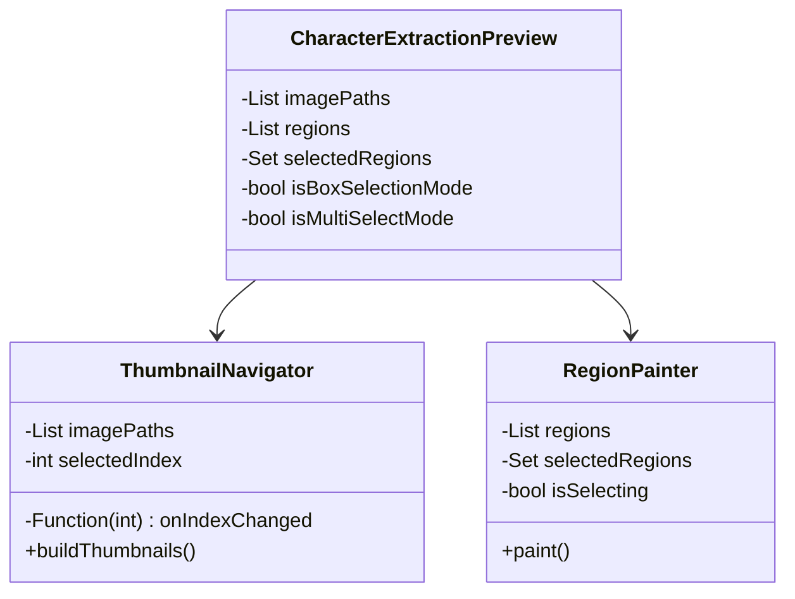

# Simplified CharacterExtractionPreview Approach

## Rationale for Keeping Separate

1. **Specialized Requirements**
   - Complex region selection system
   - Custom gesture handling
   - Tool mode management
   - Specialized UI requirements

2. **Integration Complexity**
   - High risk of gesture conflicts
   - Complex state management needs
   - Potential performance impact
   - Increased testing complexity

3. **Maintenance Considerations**
   - Easier to maintain as separate component
   - Clearer responsibility boundaries
   - Simpler testing requirements
   - More focused updates

## Proposed Solution



### 1. Add ThumbnailNavigator Component

```dart
class ThumbnailNavigator extends StatelessWidget {
  final List<String> imagePaths;
  final int selectedIndex;
  final Function(int) onIndexChanged;
  final double height;
  final bool isEnabled;

  const ThumbnailNavigator({
    super.key,
    required this.imagePaths,
    required this.selectedIndex,
    required this.onIndexChanged,
    this.height = 100,
    this.isEnabled = true,
  });

  @override
  Widget build(BuildContext context) {
    return SizedBox(
      height: height,
      child: ThumbnailStrip<String>(
        images: imagePaths,
        selectedIndex: selectedIndex,
        onTap: isEnabled ? onIndexChanged : null,
        pathResolver: (path) => path,
        keyResolver: (path) => path,
      ),
    );
  }
}
```

### 2. Update CharacterExtractionPreview

```dart
class CharacterExtractionPreview extends StatefulWidget {
  @override
  State<CharacterExtractionPreview> createState() => 
      _CharacterExtractionPreviewState();
}

class _CharacterExtractionPreviewState 
    extends State<CharacterExtractionPreview> {
  int _currentIndex = 0;

  @override
  Widget build(BuildContext context) {
    return Column(
      children: [
        Expanded(
          child: Row(
            children: [
              // Main content (75%)
              Expanded(
                flex: 75,
                child: Column(
                  children: [
                    _buildToolbar(),
                    Expanded(
                      child: _buildMainArea(),
                    ),
                  ],
                ),
              ),
              // Side panel (25%)
              SizedBox(
                width: 300,
                child: CharacterPreviewPanel(...),
              ),
            ],
          ),
        ),
        // Add thumbnail navigation
        if (widget.imagePaths.length > 1)
          ThumbnailNavigator(
            imagePaths: widget.imagePaths,
            selectedIndex: _currentIndex,
            onIndexChanged: _handleIndexChanged,
            isEnabled: !_isProcessing,
          ),
      ],
    );
  }

  Widget _buildMainArea() {
    return Stack(
      children: [
        // Main image
        _buildImage(),
        // Region overlay
        CustomPaint(
          painter: RegionPainter(
            regions: _getRegionsForCurrentPage(),
            selectedRegions: _selectedRegions,
            isSelecting: _isBoxSelectionMode,
          ),
        ),
        // Gesture detector
        GestureDetector(
          onPanStart: _handlePanStart,
          onPanUpdate: _handlePanUpdate,
          onPanEnd: _handlePanEnd,
          child: Container(color: Colors.transparent),
        ),
      ],
    );
  }

  void _handleIndexChanged(int index) {
    if (index == _currentIndex) return;
    
    setState(() {
      _currentIndex = index;
      _selectedRegions.clear();
      _resetToolStates();
    });
  }

  // Keep existing gesture and tool handling methods
}
```

## Benefits of This Approach

1. **Reduced Complexity**
   - Maintains existing gesture system
   - Keeps current state management
   - Preserves tool mode logic
   - Simpler testing requirements

2. **Better Maintainability**
   - Clear separation of concerns
   - Focused component responsibilities
   - Easier to debug
   - Simpler to extend

3. **Lower Risk**
   - Minimal changes to core functionality
   - Reduced integration testing
   - Easier rollback if needed
   - Better performance control

4. **Enhanced User Experience**
   - Maintains familiar interactions
   - Adds thumbnail navigation
   - Keeps specialized features
   - No gesture conflicts

## Implementation Steps

1. **Create ThumbnailNavigator**
   - Implement basic component
   - Add keyboard navigation
   - Handle disabled state
   - Add tests

2. **Update CharacterExtractionPreview**
   - Add thumbnail integration
   - Update layout
   - Handle index changes
   - Update tests

3. **Testing**
   - Unit tests for navigation
   - Integration tests for page switching
   - Performance testing
   - Accessibility testing

## Migration Timeline

1. Day 1:
   - Create ThumbnailNavigator
   - Basic integration

2. Day 2:
   - Update state management
   - Add tests

3. Day 3:
   - Polish UI
   - Performance optimization

4. Day 4:
   - Testing and fixes
   - Documentation

## Success Metrics

1. **Functionality**
   - Smooth navigation
   - No region selection issues
   - Tool modes work correctly
   - State preserved during navigation

2. **Performance**
   - Quick thumbnail loading
   - Smooth transitions
   - No memory leaks
   - Stable frame rate

3. **User Experience**
   - Intuitive navigation
   - Clear visual feedback
   - Consistent behavior
   - No regressions
