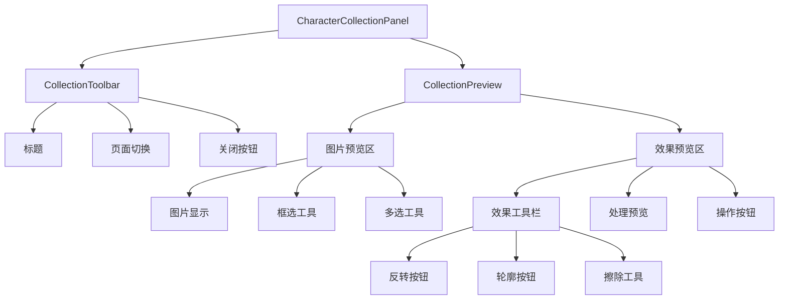
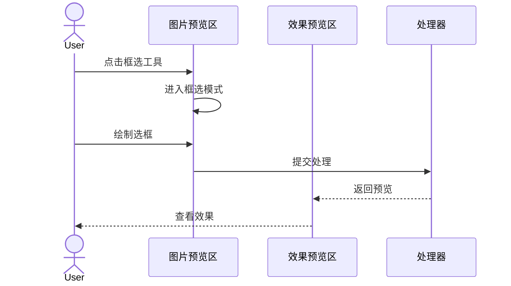
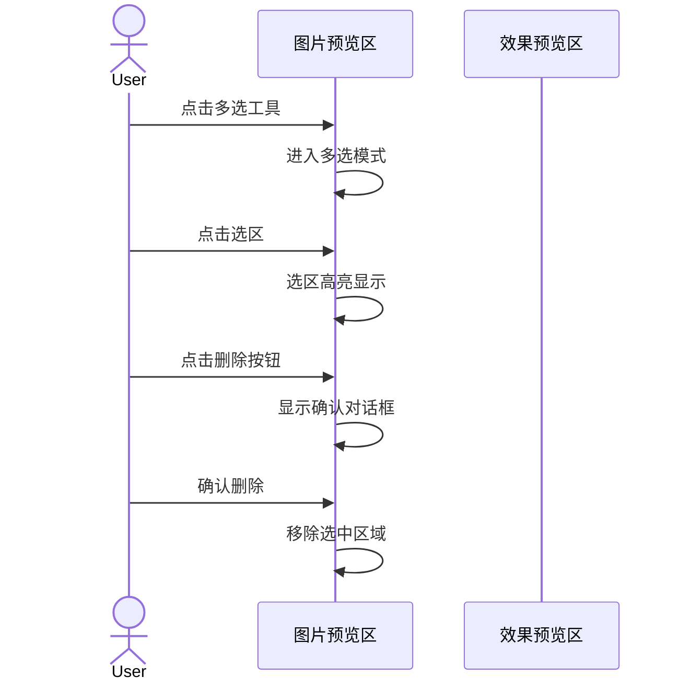
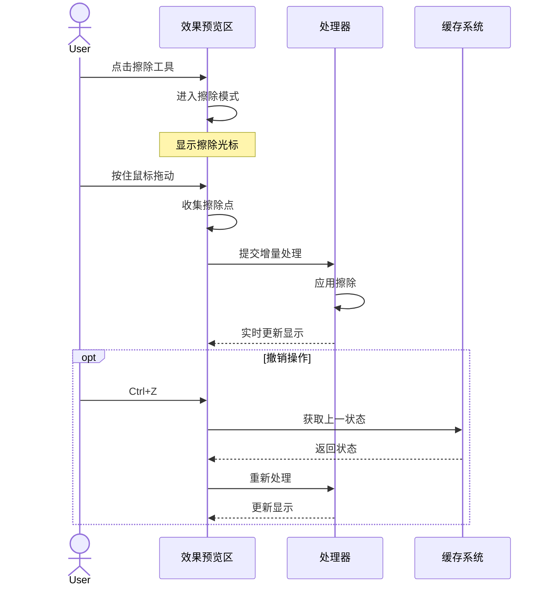
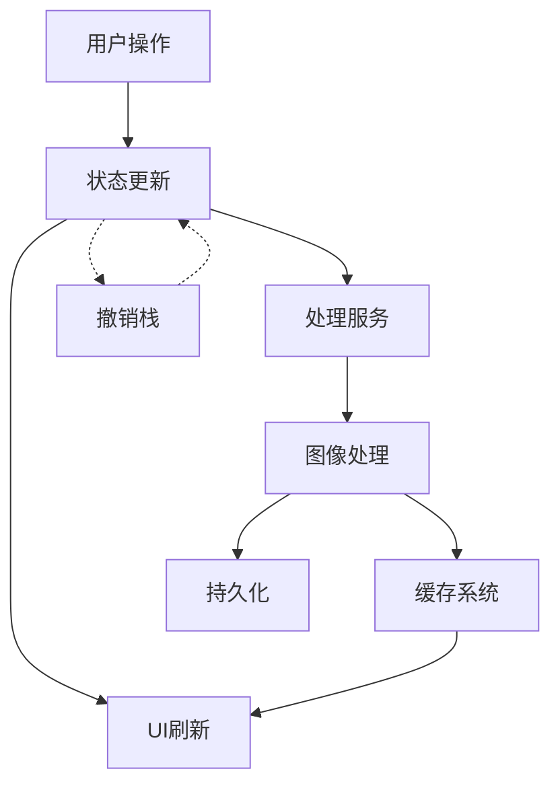

# 集字功能完整方案

## 一、组件结构

### 1. 界面层次



### 2. 工具栏状态

#### 2.1 图片预览区工具栏

```
默认状态：
[✋] [□] [▣] [🗑️]  标准鼠标指针
 ↑   ↑   ↑   ↑
拖动 框选 多选 删除

框选模式：
[✋] [■] [▣] [🗑️]  十字光标
      ↑
    激活状态

多选模式：
[✋] [□] [▤] [🗑️]  指针光标
          ↑
        激活状态

多选激活时：
[✋] [□] [▤] [🗑️*]  指针光标
              ↑
            可用状态

* 删除按钮仅在有选中内容时可用
```

#### 2.2 效果预览区工具栏

```
[◐反转] [☆轮廓] [✎擦除]
```

## 二、界面布局

### 1. 整体布局

```
+------------------------------------------+
|  标题栏                  [最小化] [关闭]  |
+------------------------------------------+
|                     |                     |
|    图片预览区        |     效果预览区      |
|                     |                     |
| [工具栏]            | [反转 轮廓 擦除]    |
| +----------------+  | +----------------+  |
| |                |  | |                |  |
| |   原始图片     |  | |   处理效果     |  |
| |                |  | |                |  |
| |  * 缩放平移    |  | |  * 实时预览    |  |
| |  * 框选工具    |  | |  * 轮廓显示    |  |
| |  * 已选区域    |  | |  * 擦除操作    |  |
| |                |  | |                |  |
| |                |  | +----------------+  |
| |                |  | [   保存  取消   ]  |
| +----------------+  |                     |
+------------------------------------------+
```

## 三、界面状态

### 1. 默认状态

```
+------------------+  +------------------+
|   图片预览区     |  |   效果预览区     |
| [✋] [□] [▣] [🗑️]|  | [◐] [☆] [✎]    |
|                  |  |                  |
|   原始图片显示   |  |   效果图显示     |
|   框选区域高亮   |  |   黑字透明底     |
|                  |  |                  |
+------------------+  +------------------+
```

### 2. 框选状态

```
+------------------+  +------------------+
|   图片预览区     |  |   效果预览区     |
| [✋] [■] [▣] [🗑️]|  | [◐] [☆] [✎]    |
|                  |  |                  |
|   显示选框       |  |   预览空白       |
|   十字光标       |  |   等待处理       |
|                  |  |                  |
+------------------+  +------------------+
```

### 3. 多选状态

```
+------------------+  +------------------+
|   图片预览区     |  |   效果预览区     |
| [✋] [□] [▤] [🗑️]|  | [已禁用工具栏]   |
|                  |  |                  |
|   多个选区       |  |   --            |
|   蓝色边框       |  |   请先保存修改   |
|                  |  |                  |
+------------------+  +------------------+

删除确认对话框：
+------------------------+
|      删除选中区域？     |
|                        |
| 将删除3个已选中的区域   |
| 此操作不可撤销         |
|                        |
| [  删除  ]  [  取消  ] |
+------------------------+
```

### 4. 处理状态

```
+------------------+  +------------------+
|   图片预览区     |  |   效果预览区     |
| [✋] [□] [▣] [🗑️]|  | [◐] [★] [✎]    |
|                  |  |                  |
|   显示选区       |  |   效果预览       |
|   选区边框       |  |   蓝色轮廓线     |
|                  |  |                  |
+------------------+  +------------------+
```

### 5. 擦除状态

```
+------------------+  +------------------+
|   图片预览区     |  |   效果预览区     |
| [✋] [□] [▣] [🗑️]|  | [◐] [☆] [✏]    |
|                  |  |                  |
|   显示选区       |  |   效果预览       |
|   选区边框       |  |   显示擦除轨迹   |
|                  |  |   实时更新       |
+------------------+  +------------------+
```

## 四、交互流程

### 1. 基本操作流程



### 2. 多选操作流程



### 3. 擦除操作流程



## 五、快捷键

### 1. 工具切换

- V: 选择工具（默认）
- B: 框选工具
- M: 多选工具
- E: 橡皮擦

### 2. 编辑操作

- Delete/Backspace: 删除选中
- Ctrl + Z: 撤销
- Ctrl + Y: 重做
- Ctrl + S: 保存

### 3. 视图控制

- Ctrl + -: 缩小
- Ctrl + +: 放大
- Ctrl + 0: 适应窗口
- 空格 + 拖动: 平移视图

## 六、代码组织

### 1. 文件结构

```
lib/
├── presentation/
│   ├── pages/
│   │   └── works/
│   │       ├── character_collection_page.dart     # 集字功能页面
│   │       └── work_detail_page.dart             # 作品详情页面
│   └── widgets/
│       ├── character_collection/
│       │   ├── character_collection_panel.dart    # 主面板
│       │   ├── collection_toolbar.dart           # 工具栏
│       │   ├── collection_preview.dart           # 预览区域
│       │   ├── image_preview.dart               # 图片预览
│       │   └── preview_panel.dart               # 效果预览
│       └── common/
│           └── loading_indicator.dart            # 加载指示器
├── application/
│   ├── services/
│   │   └── character/
│   │       ├── character_service.dart           # 业务服务
│   │       └── processing_service.dart          # 处理服务
│   └── providers/
│       └── character_collection_provider.dart    # 状态管理
├── infrastructure/
│   ├── image/
│   │   ├── character_image_processor.dart       # 图像处理器
│   │   ├── cache_manager.dart                  # 缓存管理
│   │   └── svg_generator.dart                  # SVG生成
│   └── repositories/
│       └── character_repository_impl.dart       # 仓储实现
└── domain/
    ├── models/
    │   ├── character_region.dart               # 区域模型
    │   └── processing_options.dart             # 处理选项
    └── repositories/
        └── character_repository.dart           # 仓储接口
```

### 2. 依赖注入

```dart
// 服务注册
@riverpod
CharacterService characterService(CharacterServiceRef ref) {
  return CharacterService(
    repository: ref.watch(characterRepositoryProvider),
    processor: ref.watch(imageProcessorProvider),
    cache: ref.watch(cacheManagerProvider),
  );
}

// 状态管理
@riverpod
class CharacterCollectionNotifier extends _$CharacterCollectionNotifier {
  late final _service = ref.read(characterServiceProvider);
  
  @override
  Future<CharacterCollectionState> build() async {
    return const CharacterCollectionState();
  }
  
  // 状态更新方法...
}
```

## 七、数据结构

### 1. 模型定义

```dart
// 区域数据
class CharacterRegion {
  final String id;
  final String pageId;
  final Rect rect;
  final double rotation;
  final ProcessingOptions options;
  final List<Offset>? erasePoints;
}

// 处理选项
class ProcessingOptions {
  final bool inverted;
  final bool showContour;
  final double threshold;
  final double noiseReduction;
}

// 状态数据
class CharacterCollectionState {
  final List<CharacterRegion> regions;
  final Set<String> selectedIds;
  final String? currentId;
  final Tool currentTool;
  final ProcessingOptions options;
  final List<String> undoStack;
  final bool processing;
  final String? error;
}
```

### 2. 数据流转



## 八、存储设计

### 1. 数据结构修改

```dart
// 修改 CharacterImage 类，增加 SVG 支持
class CharacterImage {
  final String path;           // 原图路径
  final String binary;         // 二值化图路径
  final String thumbnail;      // 缩略图路径
  final String? svg;          // SVG路径（新增）
  final ImageSize size;
  final ProcessingOptions? processingOptions;  // 处理参数（新增）
}

// 修改 SourceRegion 类，支持擦除数据
class SourceRegion {
  final int pageIndex;
  final Rect rect;
  final double rotation;
  final List<Offset>? erasePoints;  // 擦除点（新增）
}
```

### 2. 文件存储结构

```
appData/
├── characters/
│   └── {charId}/
│       ├── original.png     # 原图切割
│       ├── binary.png       # 处理后图像
│       ├── thumbnail.jpg    # 缩略图
│       └── path.svg         # SVG文件
└── cache/
    └── processing/          # 处理缓存
        ├── binary/          # 二值化缓存
        └── svg/             # SVG缓存
```

### 3. 数据库表结构

```sql
-- 修改 characters 表
ALTER TABLE characters ADD COLUMN svg_path TEXT;
ALTER TABLE characters ADD COLUMN processing_options TEXT;

-- 创建 character_regions 表
CREATE TABLE character_regions (
    id TEXT PRIMARY KEY,
    char_id TEXT NOT NULL,
    page_index INTEGER NOT NULL,
    rect_left REAL NOT NULL,
    rect_top REAL NOT NULL,
    rect_width REAL NOT NULL,
    rect_height REAL NOT NULL,
    rotation REAL DEFAULT 0,
    erase_points TEXT,  -- JSON格式存储擦除点
    FOREIGN KEY (char_id) REFERENCES characters (id)
);

-- 创建处理缓存表
CREATE TABLE processing_cache (
    key TEXT PRIMARY KEY,
    result BLOB NOT NULL,
    created_at INTEGER NOT NULL,
    accessed_at INTEGER NOT NULL,
    size INTEGER NOT NULL
);
```

## 九、性能优化

### 1. 显示优化

- 延迟加载
- 预览图缓存
- 增量更新
- 局部刷新

### 2. 处理优化

- 异步处理
- 后台计算
- 结果缓存
- 队列管理

### 3. 内存管理

- 图片预加载
- 缓存清理
- 资源释放
- 内存监控

## 十、错误处理

### 1. 错误类型

```dart
abstract class ProcessingError extends Error {
  final String message;
  final String code;
  final Map<String, dynamic> details;
}

class ImageLoadError extends ProcessingError { ... }
class ProcessingTimeoutError extends ProcessingError { ... }
class MemoryLimitError extends ProcessingError { ... }
class InvalidInputError extends ProcessingError { ... }
```

### 2. 错误恢复

```dart
class ErrorHandler {
  Future<ProcessingResult> handleError(
    ProcessingError error,
    ProcessingOptions options
  ) async {
    switch (error.runtimeType) {
      case MemoryLimitError:
        return await _handleMemoryError(error, options);
      case ProcessingTimeoutError:
        return await _handleTimeoutError(error, options);
      default:
        throw error;
    }
  }
}
```

### 3. 错误提示

```
+------------------+
|    处理失败      |
|                  |
|  ⚠ 处理超时      |
|  点击重新处理    |
|                  |
+------------------+
