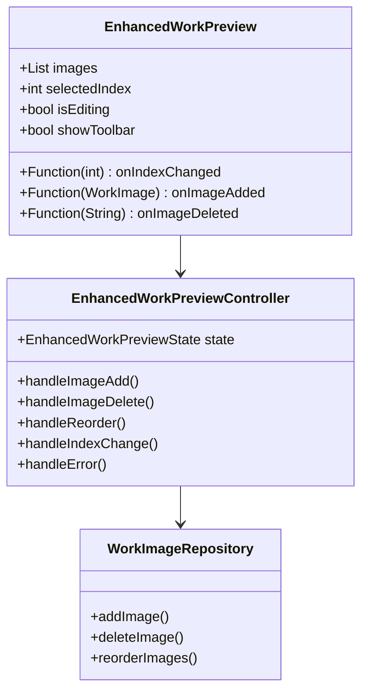

# EnhancedWorkPreview State Management Design

## State Structure

```dart
@freezed
class EnhancedWorkPreviewState with _$EnhancedWorkPreviewState {
  const factory EnhancedWorkPreviewState({
    required List<WorkImage> images,
    required int selectedIndex,
    required bool isProcessing,
    required bool isZoomed,
    String? error,
    // UI States
    bool? isDragging,
    bool? isToolbarVisible,
  }) = _EnhancedWorkPreviewState;
}
```

## Component Architecture



## State Management Implementation

### 1. Controller

```dart
class EnhancedWorkPreviewController extends StateNotifier<EnhancedWorkPreviewState> {
  final WorkImageRepository _repository;
  final WorkImageService _imageService;

  EnhancedWorkPreviewController({
    required WorkImageRepository repository,
    required WorkImageService imageService,
    required List<WorkImage> initialImages,
    int initialIndex = 0,
  }) : _repository = repository,
       _imageService = imageService,
       super(EnhancedWorkPreviewState(
         images: initialImages,
         selectedIndex: initialIndex,
         isProcessing: false,
         isZoomed: false,
       ));

  // Image Operations
  Future<void> addImage() async {
    state = state.copyWith(isProcessing: true, error: null);
    try {
      final newImage = await _imageService.pickAndProcessImage();
      if (newImage != null) {
        await _repository.addImage(newImage);
        state = state.copyWith(
          images: [...state.images, newImage],
          selectedIndex: state.images.length,
        );
      }
    } catch (e) {
      state = state.copyWith(error: e.toString());
      rethrow;
    } finally {
      state = state.copyWith(isProcessing: false);
    }
  }

  Future<void> deleteImage(String imageId) async {
    state = state.copyWith(isProcessing: true, error: null);
    try {
      await _repository.deleteImage(imageId);
      final newImages = state.images
          .where((img) => img.id != imageId)
          .toList();
      final newIndex = state.selectedIndex >= newImages.length
          ? newImages.length - 1
          : state.selectedIndex;
      
      state = state.copyWith(
        images: newImages,
        selectedIndex: newIndex,
      );
    } catch (e) {
      state = state.copyWith(error: e.toString());
      rethrow;
    } finally {
      state = state.copyWith(isProcessing: false);
    }
  }

  Future<void> reorderImages(int oldIndex, int newIndex) async {
    if (oldIndex < newIndex) newIndex--;
    
    state = state.copyWith(isProcessing: true, error: null);
    try {
      final images = List<WorkImage>.from(state.images);
      final item = images.removeAt(oldIndex);
      images.insert(newIndex, item);
      
      await _repository.reorderImages(images);
      state = state.copyWith(
        images: images,
        selectedIndex: newIndex,
      );
    } catch (e) {
      state = state.copyWith(error: e.toString());
      rethrow;
    } finally {
      state = state.copyWith(isProcessing: false);
    }
  }

  // UI State Management
  void setZoomed(bool isZoomed) {
    state = state.copyWith(isZoomed: isZoomed);
  }

  void selectImage(int index) {
    if (index != state.selectedIndex &&
        index >= 0 &&
        index < state.images.length) {
      state = state.copyWith(
        selectedIndex: index,
        isZoomed: false,
      );
    }
  }
}
```

### 2. Provider Setup

```dart
// Providers
final enhancedWorkPreviewControllerProvider = StateNotifierProvider.family<
    EnhancedWorkPreviewController,
    EnhancedWorkPreviewState,
    String
>((ref, workId) {
  final repository = ref.watch(workImageRepositoryProvider);
  final imageService = ref.watch(workImageServiceProvider);
  final workImages = ref.watch(workImagesProvider(workId));
  
  return EnhancedWorkPreviewController(
    repository: repository,
    imageService: imageService,
    initialImages: workImages,
  );
});

// Usage in components
class WorkImagesManagementView extends ConsumerWidget {
  final String workId;

  @override
  Widget build(BuildContext context, WidgetRef ref) {
    final controller = ref.watch(enhancedWorkPreviewControllerProvider(workId));
    
    return EnhancedWorkPreview(
      state: controller,
      onImageAdded: () => controller.addImage(),
      onImageDeleted: (id) => controller.deleteImage(id),
      onImagesReordered: (old, new) => controller.reorderImages(old, new),
      onZoomChanged: (zoomed) => controller.setZoomed(zoomed),
    );
  }
}
```

## Error Handling

```dart
class EnhancedWorkPreviewError extends StateError {
  final String operation;
  final String details;

  EnhancedWorkPreviewError({
    required this.operation,
    required this.details,
  }) : super('$operation failed: $details');
}

// Usage in controller
try {
  // Operation
} on WorkImageServiceError catch (e) {
  throw EnhancedWorkPreviewError(
    operation: 'Image Processing',
    details: e.toString(),
  );
} on WorkRepositoryError catch (e) {
  throw EnhancedWorkPreviewError(
    operation: 'Storage Operation',
    details: e.toString(),
  );
}
```

## State Updates and Events

1. **Image Operations**
   - Add: Processing → Success/Error → Update UI
   - Delete: Confirm → Process → Update UI
   - Reorder: Process → Update UI → Select

2. **UI States**
   - Zoom: Update state → Disable navigation if zoomed
   - Selection: Update index → Reset zoom → Update UI
   - Toolbar: Show/hide based on actions

3. **Error States**
   - Operation errors: Show in UI
   - Loading errors: Retry mechanism
   - File errors: Clear and reload

## Performance Considerations

1. **State Updates**
   - Minimize rebuilds
   - Batch related changes
   - Use selective rebuilds

2. **Image Loading**
   - Lazy loading
   - Caching
   - Progress indicators

3. **Memory Management**
   - Clear unused resources
   - Dispose controllers
   - Handle large collections
