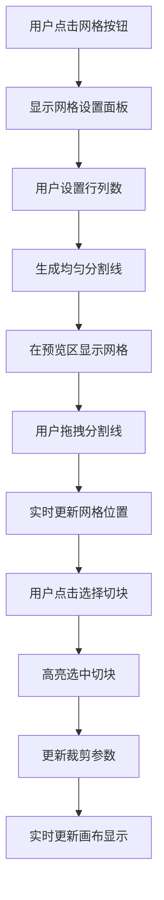
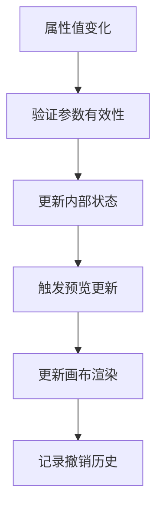

# 字帖编辑页图像元素属性面板功能优化设计

## 1. 设计理解与分析

### 1.1 当前实现分析

基于代码分析，当前图像元素属性面板包含以下主要功能：

- **几何属性控制**：位置、大小、旋转
- **视觉属性控制**：透明度、背景色
- **图像选择**：本地文件、图库选择
- **适配模式**：contain、cover、fill、none
- **图像预览**：基础预览功能
- **图像变换**：裁剪、翻转、旋转、滤镜
- **变换应用**：应用变换、重置变换按钮

### 1.2 优化需求理解

您提出的优化需求主要集中在以下几个方面：

1. **图像预览增强**：支持缩放、平移、网格切分
2. **智能切分功能**：n行m列切分，辅助线拖拽
3. **裁剪方式改进**：从百分比改为像素位置
4. **交互优化**：取消应用按钮，实时更新
5. **复制粘贴支持**：图像元素的复制粘贴
6. **适配模式扩展**：覆盖模式的锚定和对齐
7. **溢出内容显示**：半透明显示超出区域

## 2. 功能架构设计

### 2.1 整体架构

```
图像元素属性面板
├── 基础属性区域
│   ├── 几何属性（位置、大小、旋转）
│   └── 视觉属性（透明度、背景色）
├── 图像选择区域
│   ├── 本地文件选择
│   ├── 图库选择
│   └── 集字选择
├── 增强预览区域 ⭐ 新增
│   ├── 缩放平移控制
│   ├── 网格切分功能
│   ├── 辅助线拖拽
│   └── 切块选择
├── 智能适配区域 ⭐ 优化
│   ├── 适配模式选择
│   ├── 锚定方向设置
│   └── 对齐位置设置
├── 精确裁剪区域 ⭐ 优化
│   ├── 像素级裁剪控制
│   ├── 切块数据同步
│   └── 实时预览更新
└── 操作控制区域 ⭐ 优化
    ├── 重置按钮
    ├── 复制粘贴功能
    └── 实时更新机制
```

### 2.2 数据模型扩展

```dart
// 图像元素内容扩展
class ImageElementContent {
  // 现有属性
  String imageUrl;
  String fitMode;
  double cropTop, cropBottom, cropLeft, cropRight;
  
  // 新增属性
  GridSplitConfig? gridSplit;        // 网格切分配置
  SelectedTile? selectedTile;        // 选中的切块
  AnchorDirection anchorDirection;   // 锚定方向
  AlignmentPosition alignPosition;   // 对齐位置
  bool showOverflow;                 // 显示溢出内容
}

// 网格切分配置
class GridSplitConfig {
  int rows;                          // 行数
  int columns;                       // 列数
  List<double> rowDividers;          // 行分割线位置
  List<double> columnDividers;       // 列分割线位置
}

// 选中的切块
class SelectedTile {
  int row;                           // 行索引
  int column;                        // 列索引
  Rect pixelRect;                    // 在原图中的像素位置
}

// 锚定方向
enum AnchorDirection {
  auto,                              // 自动
  vertical,                          // 纵向
  horizontal,                        // 横向
}

// 对齐位置
enum AlignmentPosition {
  topLeft,                           // 左上角
  topRight,                          // 右上角
  center,                            // 中心点
  bottomLeft,                        // 左下角
  bottomRight,                       // 右下角
}
```

## 3. 界面设计详图

### 3.1 整体布局设计

```
┌─────────────────────────────────────┐
│ 图像元素属性面板                      │
├─────────────────────────────────────┤
│ 📐 几何属性                          │
│ [X: 100] [Y: 50] [W: 200] [H: 150]  │
│ [旋转: 0°]                          │
├─────────────────────────────────────┤
│ 🎨 视觉属性                          │
│ [透明度: ████████░░ 80%]             │
│ [背景色: ⬜]                         │
├─────────────────────────────────────┤
│ 🖼️ 图像选择                          │
│ [选择图片] [从图库] [从集字]          │
├─────────────────────────────────────┤
│ 🔍 增强预览区域 ⭐                    │
│ ┌─────────────────────────────────┐ │
│ │ 预览工具栏                      │ │
│ │ [🔍+] [🔍-] [📐] [重置] [⚙️]    │ │
│ ├─────────────────────────────────┤ │
│ │                                 │ │
│ │     图像预览与切分区域            │ │
│ │                                 │ │
│ └─────────────────────────────────┘ │
├─────────────────────────────────────┤
│ 📏 智能适配 ⭐                        │
│ [模式: 覆盖 ▼] [锚定: 自动 ▼]        │
│ [对齐: 中心 ▼]                      │
├─────────────────────────────────────┤
│ ✂️ 精确裁剪 ⭐                        │
│ [左: 0px] [上: 0px]                 │
│ [右: 0px] [下: 0px]                 │
├─────────────────────────────────────┤
│ 🔧 操作控制                          │
│ [📋复制] [📄粘贴] [🔄重置]           │
└─────────────────────────────────────┘
```

### 3.2 增强预览区域详细设计

```
┌─────────────────────────────────────┐
│ 预览工具栏                           │
│ [🔍+] [🔍-] [📐网格] [🔄重置] [⚙️设置] │
├─────────────────────────────────────┤
│ 网格设置面板 (可折叠)                 │
│ 行数: [3 ▼] 列数: [4 ▼] [应用网格]   │
├─────────────────────────────────────┤
│ ┌─────────────────────────────────┐ │
│ │ 图像预览区域                    │ │
│ │ ┌─┬─┬─┬─┐ ← 可拖拽的分割线      │ │
│ │ │ │ │ │ │                     │ │
│ │ ├─┼─┼─┼─┤                     │ │
│ │ │ │█│ │ │ ← 选中的切块(高亮)   │ │
│ │ ├─┼─┼─┼─┤                     │ │
│ │ │ │ │ │ │                     │ │
│ │ └─┴─┴─┴─┘                     │ │
│ │                               │ │
│ │ 支持：                         │ │
│ │ • 鼠标滚轮缩放                  │ │
│ │ • 拖拽平移                     │ │
│ │ • 分割线拖拽调整                │ │
│ │ • 点击选择切块                  │ │
│ └─────────────────────────────────┘ │
├─────────────────────────────────────┤
│ 选中切块信息                         │
│ 位置: (行2,列2) 像素: (150,100,50,75) │
└─────────────────────────────────────┘
```

## 4. 交互流程设计

### 4.1 网格切分交互流程



### 4.2 实时更新机制



## 5. 技术实现要点

### 5.1 核心组件设计

```dart
// 增强预览组件
class EnhancedImagePreview extends StatefulWidget {
  final String imageUrl;
  final GridSplitConfig? gridConfig;
  final Function(SelectedTile) onTileSelected;
  final Function(GridSplitConfig) onGridChanged;
}

// 网格分割器
class GridSplitter extends CustomPainter {
  final GridSplitConfig config;
  final Size imageSize;
  final SelectedTile? selectedTile;
  
  @override
  void paint(Canvas canvas, Size size) {
    // 绘制分割线
    // 绘制选中高亮
    // 绘制拖拽手柄
  }
}

// 智能适配渲染器
class SmartFitRenderer {
  static Widget renderWithOverflow(
    Widget image,
    AnchorDirection anchor,
    AlignmentPosition align,
    bool showOverflow,
  ) {
    // 根据锚定和对齐方式渲染
    // 处理溢出内容的半透明显示
  }
}
```

### 5.2 数据同步机制

```dart
class ImagePropertyController {
  // 网格切分状态
  ValueNotifier<GridSplitConfig?> gridConfig;
  ValueNotifier<SelectedTile?> selectedTile;
  
  // 实时更新裁剪参数
  void updateCropFromTile(SelectedTile tile) {
    final pixelRect = tile.pixelRect;
    updateProperty('cropLeft', pixelRect.left);
    updateProperty('cropTop', pixelRect.top);
    updateProperty('cropRight', imageSize.width - pixelRect.right);
    updateProperty('cropBottom', imageSize.height - pixelRect.bottom);
  }
  
  // 复制粘贴功能
  Map<String, dynamic> copyElement() {
    return {
      'type': 'image',
      'content': element['content'],
      'geometry': {
        'x': element['x'],
        'y': element['y'],
        'width': element['width'],
        'height': element['height'],
        'rotation': element['rotation'],
      }
    };
  }
}
```

## 6. 用户体验优化

### 6.1 操作便利性

- **一键网格**：预设常用网格（2x2, 3x3, 4x4等）
- **智能对齐**：分割线自动吸附到关键位置
- **快捷键支持**：Ctrl+C复制，Ctrl+V粘贴
- **撤销重做**：支持所有操作的撤销重做

### 6.2 视觉反馈

- **实时预览**：所有调整立即在预览区显示
- **高亮提示**：选中切块、悬停分割线高亮显示
- **半透明溢出**：超出区域内容以50%透明度显示
- **动画过渡**：缩放、平移使用平滑动画

### 6.3 性能优化

- **延迟更新**：拖拽过程中降低更新频率
- **缓存机制**：缓存网格计算结果
- **异步处理**：大图像的处理使用异步操作
- **内存管理**：及时释放不需要的图像资源

## 7. 详细交互说明图示

### 7.1 网格切分操作流程图示

```
步骤1: 启用网格模式
┌─────────────────┐    点击    ┌─────────────────┐
│   原始图像      │  ────────→ │  显示网格设置    │
│                 │            │  [行:3] [列:4]  │
└─────────────────┘            └─────────────────┘

步骤2: 应用网格分割
┌─────────────────┐    应用    ┌─┬─┬─┬─┐
│  网格设置面板    │  ────────→ │ │ │ │ │
│  [行:3] [列:4]  │            ├─┼─┼─┼─┤
│  [应用网格]     │            │ │ │ │ │
└─────────────────┘            ├─┼─┼─┼─┤
                               │ │ │ │ │
                               └─┴─┴─┴─┘

步骤3: 拖拽调整分割线
┌─┬─┬─┬─┐    拖拽    ┌─┬──┬─┬─┐
│ │ │ │ │  ────────→ │ │  │ │ │  (列线右移)
├─┼─┼─┼─┤            ├─┼──┼─┼─┤
│ │ │ │ │            │ │  │ │ │
├─┼─┼─┼─┤            ├─┼──┼─┼─┤
│ │ │ │ │            │ │  │ │ │
└─┴─┴─┴─┘            └─┴──┴─┴─┘

步骤4: 选择切块
┌─┬──┬─┬─┐    点击    ┌─┬──┬─┬─┐
│ │  │ │ │  ────────→ │ │██│ │ │  (选中切块高亮)
├─┼──┼─┼─┤            ├─┼██┼─┼─┤
│ │  │ │ │            │ │██│ │ │
├─┼──┼─┼─┤            ├─┼──┼─┼─┤
│ │  │ │ │            │ │  │ │ │
└─┴──┴─┴─┘            └─┴──┴─┴─┘
```

### 7.2 适配模式对比图示

```
覆盖模式 + 不同锚定方向:

纵向锚定 (保证纵向完整显示)
┌─────────────┐  图像元素框
│┌───────────┐│
││    图像    ││  ← 图像高度完全显示
││           ││
│└───────────┘│
└─────────────┘  ← 左右可能被裁切

横向锚定 (保证横向完整显示)
┌─────────────┐
│ ┌─────────┐ │  ← 上下可能被裁切
│ │   图像   │ │
│ │         │ │
│ │         │ │
│ └─────────┘ │
└─────────────┘  ← 图像宽度完全显示

自动锚定 (智能选择)
根据图像和容器的宽高比自动选择最佳锚定方向
```

### 7.3 对齐位置示意图

```
┌─────────────────┐  图像元素容器
│ TL    TC    TR  │  TL=左上角, TC=顶部中心, TR=右上角
│                 │
│ ML    MC    MR  │  ML=左中, MC=中心, MR=右中
│                 │
│ BL    BC    BR  │  BL=左下角, BC=底部中心, BR=右下角
└─────────────────┘

对齐位置影响图像在容器中的定位基准点
```

### 7.4 溢出内容显示示意图

```
正常显示 (图像完全在容器内)
┌─────────────────┐
│  ┌───────────┐  │
│  │    图像    │  │  ← 完全可见
│  │           │  │
│  └───────────┘  │
└─────────────────┘

溢出显示 (图像超出容器)
┌─────────────────┐
│▓▓┌───────────┐▓▓│  ▓ = 半透明显示的溢出部分
│▓▓│    图像    │▓▓│
│▓▓│           │▓▓│  ← 中间部分正常显示
│▓▓└───────────┘▓▓│
└─────────────────┘
```

## 8. 实现优先级与阶段规划

### 8.1 第一阶段 (核心功能)

- ✅ 增强预览区域的缩放平移功能
- ✅ 网格切分基础功能 (固定行列)
- ✅ 切块选择与高亮显示
- ✅ 像素级裁剪参数替换百分比

### 8.2 第二阶段 (交互优化)

- ✅ 分割线拖拽调整功能
- ✅ 实时更新机制 (取消应用按钮)
- ✅ 重置按钮功能优化
- ✅ 复制粘贴基础功能

### 8.3 第三阶段 (高级功能)

- ✅ 智能适配模式扩展
- ✅ 锚定方向与对齐位置
- ✅ 溢出内容半透明显示
- ✅ 性能优化与用户体验提升

## 9. 技术难点与解决方案

### 9.1 分割线拖拽检测

```dart
class DividerDragDetector {
  static const double DRAG_THRESHOLD = 10.0; // 拖拽检测阈值

  bool isNearDivider(Offset position, List<double> dividers, bool isVertical) {
    for (double divider in dividers) {
      double distance = isVertical
        ? (position.dx - divider).abs()
        : (position.dy - divider).abs();
      if (distance <= DRAG_THRESHOLD) return true;
    }
    return false;
  }
}
```

### 9.2 实时性能优化

```dart
class PerformanceOptimizer {
  Timer? _updateTimer;
  static const Duration UPDATE_DELAY = Duration(milliseconds: 16); // 60fps

  void scheduleUpdate(VoidCallback callback) {
    _updateTimer?.cancel();
    _updateTimer = Timer(UPDATE_DELAY, callback);
  }
}
```

### 9.3 内存管理策略

```dart
class ImageMemoryManager {
  static const int MAX_CACHE_SIZE = 50 * 1024 * 1024; // 50MB
  final Map<String, ui.Image> _imageCache = {};

  void cacheImage(String key, ui.Image image) {
    // 检查缓存大小，必要时清理
    if (_getCacheSize() > MAX_CACHE_SIZE) {
      _clearOldestImages();
    }
    _imageCache[key] = image;
  }
}
```

这个完整的设计文档涵盖了您提出的所有功能需求，包括详细的界面设计图示、交互流程说明、技术实现方案和分阶段实施计划。设计重点关注用户体验的提升和功能的实用性，同时考虑了技术实现的可行性和性能优化。

您觉得这个设计方案如何？是否需要我对某些特定功能进行更深入的设计或调整？
