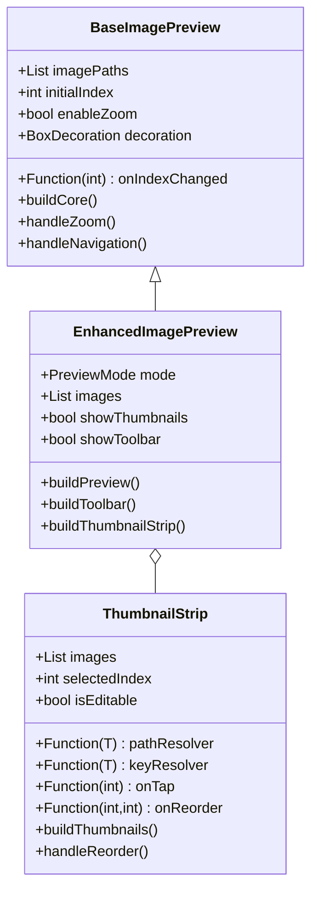

# Image Preview Component Specification

## Component Relationships



## Component Details

### 1. BaseImagePreview

Base component providing core image preview functionality.

#### Features

- **Image Display**
  - Full-screen image display using InteractiveViewer
  - Proper aspect ratio maintenance
  - Fit to container options

- **Zoom Functionality**
  - Pinch-to-zoom gestures
  - Double-tap to zoom
  - Programmatic zoom control
  - Configurable min/max zoom levels

- **Navigation**
  - Swipe left/right
  - Tap edges to navigate
  - Index-based navigation
  - Navigation event callbacks

- **Error Handling**
  - File existence checking
  - Loading error display
  - Fallback UI for errors

### 2. ThumbnailStrip

Independent component for thumbnail list display and management.

#### Features

- **Thumbnail Display**
  - Horizontally scrolling list
  - Fixed height thumbnails
  - Selected state indication
  - Loading states for thumbnails

- **Interaction**
  - Tap to select
  - Drag to reorder (optional)
  - Smooth scrolling
  - Center active thumbnail

- **Customization**
  - Custom thumbnail size
  - Custom item builder
  - Editable mode toggle
  - Visual style configuration

### 3. EnhancedImagePreview

Extended component combining BaseImagePreview with additional features.

#### Features

- **Core Preview**
  - Inherits all BaseImagePreview features
  - Enhanced zoom controls:
    - Mouse wheel support
    - Keyboard modifiers
    - UI controls for zoom
  - Advanced error handling:
    - Detailed error messages
    - Retry mechanisms
    - Loading indicators

- **Thumbnail Integration**
  - Optional ThumbnailStrip display
  - Synchronized selection
  - Thumbnail visibility toggle
  - Reorder support when editing

- **Toolbar Functions**
  - Add/remove images
  - Zoom controls
  - Mode-specific actions
  - Processing indicators

## Feature Implementation Details

### 1. Zoom Enhancement

```dart
class ZoomFeature {
  // Mouse wheel zoom
  void handleMouseWheel(PointerScrollEvent event) {
    if (HardwareKeyboard.instance.isControlPressed) {
      final delta = event.scrollDelta.dy * 0.001;
      final newScale = currentScale - delta;
      setScale(newScale.clamp(minScale, maxScale));
    }
  }

  // Touch zoom
  void handlePinchZoom(ScaleUpdateDetails details) {
    final newScale = _baseScale * details.scale;
    setScale(newScale.clamp(minScale, maxScale));
  }
}
```

### 2. Navigation Enhancement

```dart
class NavigationFeature {
  // Gesture navigation
  void handleSwipe(DragEndDetails details) {
    if (_isZoomed) return; // Prevent navigation while zoomed
    
    if (details.primaryVelocity! > 0) {
      navigateToPrevious();
    } else {
      navigateToNext();
    }
  }

  // Thumbnail navigation
  void handleThumbnailTap(int index) {
    resetZoom();
    animateToPage(index);
  }
}
```

### 3. Toolbar Integration

```dart
class ToolbarFeature {
  List<Widget> buildToolbarItems() {
    return [
      if (enableEditing) ...[
        IconButton(
          icon: Icon(Icons.add_photo_alternate),
          onPressed: handleAddImage,
        ),
        IconButton(
          icon: Icon(Icons.delete),
          onPressed: handleDeleteImage,
        ),
      ],
      if (_isZoomed)
        IconButton(
          icon: Icon(Icons.zoom_out_map),
          onPressed: resetZoom,
        ),
    ];
  }
}
```

## Usage Examples

### 1. Basic Usage

```dart
BaseImagePreview(
  imagePaths: images,
  initialIndex: 0,
  enableZoom: true,
  onIndexChanged: handleIndexChange,
)
```

### 2. Enhanced Usage

```dart
EnhancedImagePreview(
  mode: PreviewMode.edit,
  images: workImages,
  showThumbnails: true,
  showToolbar: true,
  onImagesChanged: handleImagesChange,
)
```

### 3. Thumbnail Strip Usage

```dart
ThumbnailStrip<WorkImage>(
  images: workImages,
  selectedIndex: currentIndex,
  isEditable: true,
  pathResolver: (image) => image.thumbnailPath,
  onTap: handleThumbnailTap,
  onReorder: handleReorder,
)
```

## Integration Guidelines

1. **State Management**
   - Use Riverpod for state management
   - Keep preview state separate from business logic
   - Handle mode-specific state properly

2. **Performance Optimization**
   - Lazy load images
   - Cache thumbnails
   - Optimize zoom calculations
   - Handle large image collections efficiently

3. **Error Handling**
   - Provide clear error messages
   - Implement retry mechanisms
   - Handle edge cases gracefully
   - Log errors appropriately
