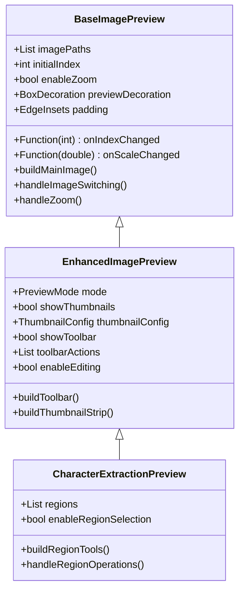

# Image Preview Controls Unification Plan

## Current Implementation Analysis

### 1. Base Implementation (BaseImagePreview)

- Provides core image preview functionality
- Features:
  - Zoom and pan support through InteractiveViewer
  - Image switching through swipe/tap
  - Error handling for missing/corrupted images
  - File existence checking
  - Basic decoration and padding customization

### 2. Work Import Dialog (WorkImportPreview)

- Uses BaseImagePreview with additional features:
  - Toolbar for adding more images
  - Image count display
  - Thumbnail strip for navigation
  - Customized for import workflow with editing capabilities
  - Drag-and-drop support

### 3. View Mode Image Preview (ViewModeImagePreview)

- Simpler implementation focused on viewing
- Features:
  - Basic image display
  - Thumbnail strip navigation
  - File existence verification
  - Error handling with retry option
  - Uses WorkImage model instead of raw file paths

### 4. Character Extraction Preview (CharacterExtractionPreview)

- Specialized implementation with advanced features:
  - Region selection and manipulation tools
  - Box selection mode
  - Multi-select capability
  - Region editing and properties
  - Side preview panel for selected regions
  - Advanced mouse interactions
  - Accessibility support

### 5. Work Edit Page (WorkImagesManagementView)

- Advanced editing implementation with state management
- Features:
  - PageView-based image switching
  - Toolbar with add/delete actions
  - Advanced zoom controls with mouse wheel support
  - Loading indicators and error states
  - Smooth animations for page transitions
  - Image reordering capabilities
  - Progress indicators for processing states
  - State management integration with Riverpod

## Unified Architecture



## Implementation Plan

### 1. Core Architecture

```dart
enum PreviewMode {
  view,      // Basic viewing only
  import,    // Import workflow with editing
  edit,      // Full editing capabilities
  extract    // Character extraction features
}

class PreviewConfig {
  final PreviewMode mode;
  final bool showThumbnails;
  final bool enableZoom;
  final bool enableEditing;
  final bool showProcessingIndicator;
  final bool enableRegionSelection;
  // Additional configuration options
}
```

### 2. Feature Integration Strategy

1. Base Layer (Common Features)
   - Image loading and display
   - Basic zoom/pan functionality
   - Error handling
   - File existence verification
   - Loading indicators
   - Image switching gestures
   - Mouse wheel zoom support
   - Consistent animation transitions

2. Enhanced Layer (Mode-specific Features)
   - Thumbnail strip (configurable)
   - Toolbar options
   - Editing capabilities
   - Region selection tools
   - State management integration
   - Processing indicators

3. Specialized Layer (Advanced Features)
   - Character region manipulation
   - Multi-select functionality
   - Side panel integration
   - Advanced mouse interactions
   - Custom controls per mode

### 3. Benefits of Unification

1. Code Maintenance
   - Reduced duplication
   - Centralized bug fixes
   - Easier feature additions
   - Consistent error handling
   - Unified state management

2. User Experience
   - Consistent behavior across modes
   - Predictable interactions
   - Unified loading states
   - Common gesture support
   - Standardized toolbar layouts

3. Development Efficiency
   - Reusable components
   - Simplified testing
   - Better documentation
   - Easier onboarding
   - Faster feature implementation

### 4. Migration Steps

1. Phase 1: Enhancement
   - Enhance BaseImagePreview with additional configuration options
   - Add support for mode-based feature toggling
   - Implement unified error handling
   - Add standardized loading indicators
   - Integrate mouse wheel zoom support

2. Phase 2: Integration
   - Create EnhancedImagePreview component
   - Migrate existing preview implementations
   - Add comprehensive tests
   - Implement state management patterns
   - Add toolbar customization

3. Phase 3: Refinement
   - Gather user feedback
   - Optimize performance
   - Update documentation
   - Add accessibility features
   - Standardize animations

4. Phase 4: Deployment
   - Gradual rollout
   - Monitor for issues
   - Collect metrics
   - Provide migration guides

## Timeline and Resources

1. Development Timeline
   - Phase 1: 1-2 weeks
   - Phase 2: 2-3 weeks
   - Phase 3: 1-2 weeks
   - Phase 4: 1 week

2. Required Resources
   - Frontend developers
   - QA engineers
   - UI/UX designers
   - Technical writers

## Risks and Mitigation

1. Potential Risks
   - Performance impact
   - Migration complexity
   - Feature regression
   - User adaptation
   - State management conflicts

2. Mitigation Strategies
   - Comprehensive testing
   - Phased rollout
   - Feature flags
   - User documentation
   - Support channels
   - Performance monitoring
   - Fallback options
