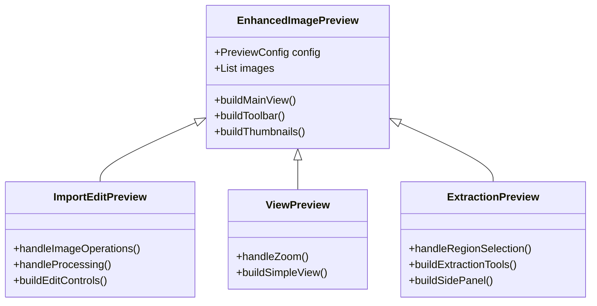

# Revised Image Preview Controls Unification Plan

## Unification Goals

1. **Work Import and Edit Page Unification**
   - Combine WorkImportPreview and WorkImagesManagementView functionality
   - Maintain advanced features from WorkImagesManagementView:
     - Mouse wheel zoom support
     - Loading indicators
     - Advanced error handling
   - Keep shared features:
     - Thumbnail navigation
     - Image reordering
     - Add/remove capabilities

2. **Work Preview Page Enhancement**
   - Add zoom functionality to ViewModeImagePreview
   - Implement InteractiveViewer with:
     - Basic zoom controls
     - Pan support
     - Reset zoom capability
   - Maintain simple viewing focus

3. **Character Extraction Page Enhancement**
   - Add thumbnail navigation to CharacterExtractionPreview
   - Keep specialized features:
     - Region selection
     - Multi-select capability
     - Side panel integration

## Implementation Approach

### 1. Enhanced Base Component

```dart
class EnhancedImagePreview extends StatefulWidget {
  final PreviewMode mode;
  final List<WorkImage> images;
  final int selectedIndex;
  final bool enableZoom;
  final bool showThumbnails;
  final bool enableEditing;
  final Function(int)? onIndexChanged;
  final Function(List<WorkImage>)? onImagesChanged;
  
  // Mode specific callbacks
  final Function(WorkImage)? onImageAdded;
  final Function(String)? onImageDeleted;
  final Function(int, int)? onImagesReordered;
}
```

### 2. Mode-Specific Configurations

```dart
enum PreviewMode {
  import,    // Work import dialog
  edit,      // Work edit page
  view,      // Work preview page
  extract    // Character extraction
}

class PreviewConfig {
  // Common features
  final bool enableZoom;
  final bool showThumbnails;
  final bool enableEditing;
  
  // Mode-specific features
  final bool enableRegionSelection;
  final bool showProcessingIndicator;
  final bool enableMouseWheelZoom;
}
```

### 3. Implementation Priority

1. Phase 1: Base Functionality
   - Create EnhancedImagePreview component
   - Implement core image display and navigation
   - Add zoom support
   - Add thumbnail strip

2. Phase 2: Work Import/Edit Unification
   - Merge import and edit functionality
   - Implement shared toolbar
   - Add advanced features from edit mode
   - Ensure smooth transitions

3. Phase 3: Preview Enhancement
   - Add zoom to ViewModeImagePreview
   - Optimize performance
   - Maintain simple interface

4. Phase 4: Character Extraction Update
   - Add thumbnail navigation
   - Ensure no conflicts with region selection
   - Maintain specialized features

## Component Structure



## Benefits

1. **Code Reuse**
   - Shared zoom functionality
   - Common thumbnail navigation
   - Unified image loading
   - Consistent error handling

2. **User Experience**
   - Consistent zoom behavior
   - Standard thumbnail navigation
   - Familiar controls across modes
   - Better feature availability

3. **Maintenance**
   - Centralized improvements
   - Easier bug fixes
   - Simplified testing
   - Better documentation

## Migration Plan

1. **Create Base Components**
   - Build EnhancedImagePreview
   - Implement shared features
   - Add configuration system

2. **Migrate Import/Edit**
   - Convert WorkImportPreview
   - Update WorkImagesManagementView
   - Verify feature parity

3. **Enhance Preview**
   - Add zoom to ViewModeImagePreview
   - Test performance
   - Verify usability

4. **Update Extraction**
   - Add thumbnail navigation
   - Test with region selection
   - Verify specialized features

## Timeline

- Phase 1 (Base): 1 week
- Phase 2 (Import/Edit): 1 week
- Phase 3 (Preview): 3 days
- Phase 4 (Extraction): 4 days

Total: 3 weeks

## Testing Strategy

1. **Unit Tests**
   - Core functionality
   - Mode-specific features
   - Edge cases

2. **Integration Tests**
   - Mode transitions
   - Feature interactions
   - State management

3. **Performance Tests**
   - Image loading
   - Zoom operations
   - Thumbnail handling

## Success Metrics

1. **Code Quality**
   - Reduced duplication
   - Improved maintainability
   - Better test coverage

2. **User Experience**
   - Consistent behavior
   - Improved performance
   - Feature availability

3. **Development Efficiency**
   - Faster feature implementation
   - Reduced bug frequency
   - Easier onboarding
