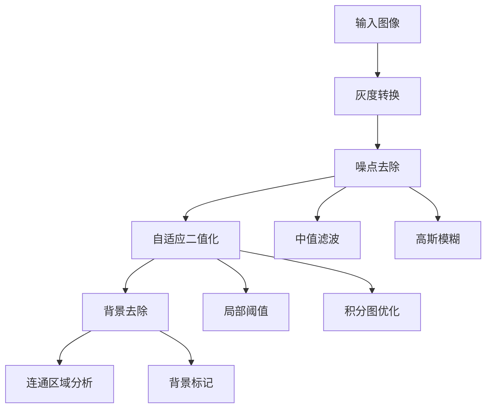
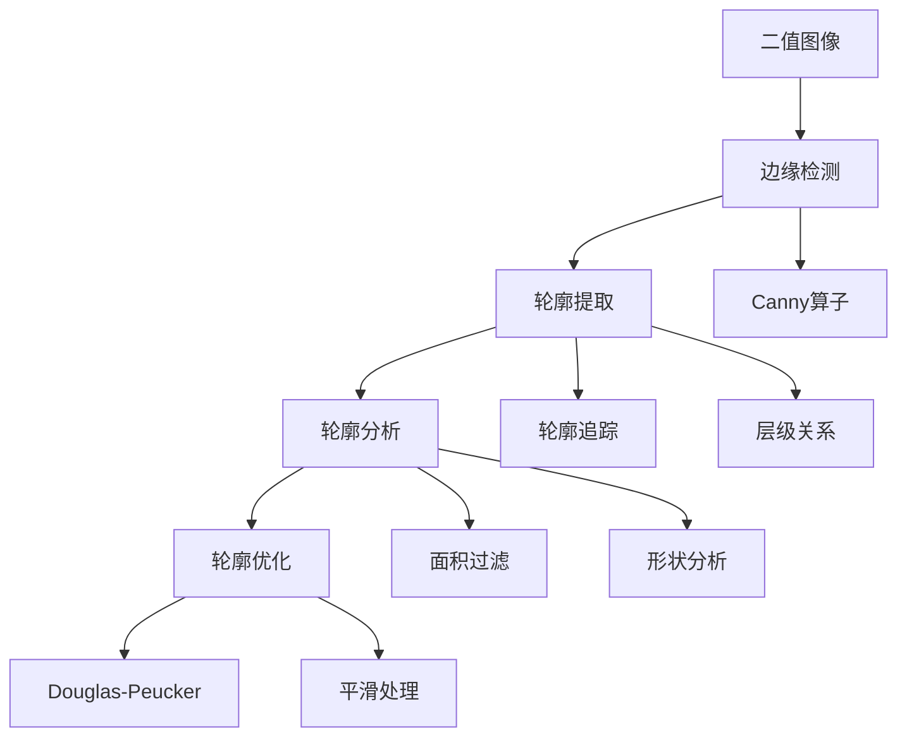
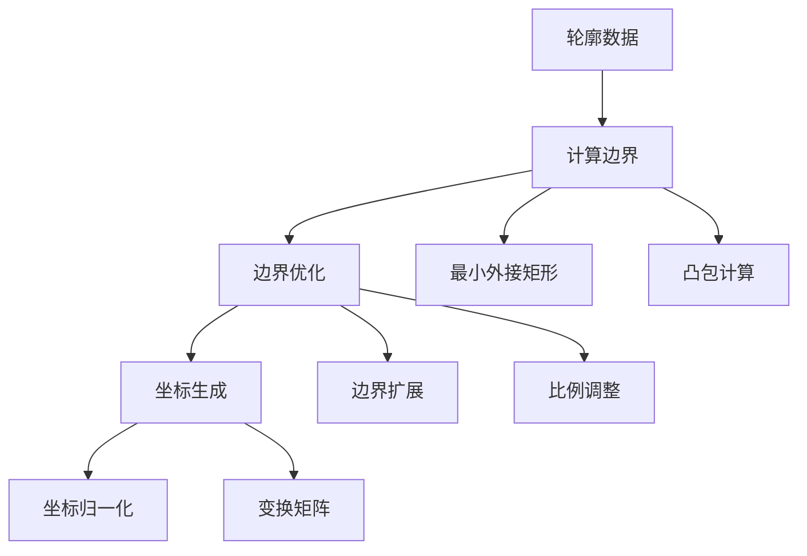

# 集字图像处理技术规范

## 一、处理流程

### 1. 图像预处理



### 2. 轮廓处理



### 3. 边界计算



## 二、核心算法

### 1. 自适应二值化

```dart
class AdaptiveThresholder {
  Future<Uint8List> process(
    Uint8List input, {
    required int width,
    required int height,
    int windowSize = 11,
    int t = 15,
  }) async {
    // 使用积分图优化
    final integralImg = await _computeIntegralImage(input, width, height);
    // 应用局部阈值
    return _applyLocalThreshold(input, integralImg, width, height, windowSize, t);
  }
}
```

### 2. 轮廓检测

```dart
class ContourDetector {
  Future<List<List<Point>>> detectContours(
    Uint8List binaryImage, {
    required int width,
    required int height,
    double minArea = 100.0,
    double maxArea = 10000.0,
  }) async {
    // 1. 边缘检测
    final edges = await _detectEdges(binaryImage, width, height);
    
    // 2. 轮廓追踪
    final contours = await _traceContours(edges);
    
    // 3. 轮廓过滤
    return _filterContours(contours, minArea, maxArea);
  }
}
```

### 3. SVG路径生成

```dart
class SvgPathGenerator {
  String generatePath(List<Point> points, {
    double simplifyTolerance = 0.5,
    bool smoothPath = true,
  }) {
    // 1. 简化点集
    final simplified = _simplifyPoints(points, simplifyTolerance);
    
    // 2. 平滑处理
    final smoothed = smoothPath ? _smoothPoints(simplified) : simplified;
    
    // 3. 生成SVG路径
    return _buildSvgPath(smoothed);
  }
}
```

## 三、性能优化

### 1. 并行处理

```dart
class ParallelProcessor {
  // 工作线程池
  final _workers = List<Worker>.filled(
    Platform.numberOfProcessors - 1,
    null
  );
  
  // 任务分发
  Future<List<T>> process<T>(
    List<ProcessTask> tasks,
    ProcessingOptions options
  ) async {
    // 1. 任务分块
    final chunks = _splitTasks(tasks);
    
    // 2. 并行处理
    final futures = chunks.map((chunk) => _processChunk(chunk));
    
    // 3. 结果合并
    return _mergeResults(await Future.wait(futures));
  }
}
```

### 2. 缓存系统

```dart
class ProcessingCache {
  // 内存缓存
  final _memoryCache = LruCache<String, ProcessingResult>(
    maxSize: 100 * 1024 * 1024  // 100MB
  );
  
  // 磁盘缓存
  final _diskCache = DiskCache(
    directory: 'processing_cache',
    maxSize: 500 * 1024 * 1024  // 500MB
  );
  
  Future<ProcessingResult?> get(String key) async {
    // 1. 检查内存缓存
    final memResult = _memoryCache.get(key);
    if (memResult != null) return memResult;
    
    // 2. 检查磁盘缓存
    final diskResult = await _diskCache.get(key);
    if (diskResult != null) {
      _memoryCache.put(key, diskResult);
      return diskResult;
    }
    
    return null;
  }
}
```

### 3. 增量更新

```dart
class IncrementalProcessor {
  Future<ProcessingResult> updateRegion(
    ProcessingResult previous,
    Rect changedRegion,
    ProcessingOptions options
  ) async {
    // 1. 计算影响区域
    final affectedArea = _calculateAffectedArea(changedRegion);
    
    // 2. 局部处理
    final partialResult = await _processRegion(
      previous,
      affectedArea,
      options
    );
    
    // 3. 合并结果
    return _mergeResults(previous, partialResult);
  }
}
```

## 四、输出格式

### 1. 处理结果

```dart
class ProcessingResult {
  final Uint8List binaryImage;      // 二值化图像
  final String svgPath;             // SVG路径
  final Rect boundingBox;          // 边界框
  final List<Point> contourPoints;  // 轮廓点集
  final ProcessingMetrics metrics;  // 处理指标
  
  // 缓存控制
  final String cacheKey;
  final DateTime timestamp;
  final int memorySize;
}
```

### 2. 处理指标

```dart
class ProcessingMetrics {
  final Duration processingTime;    // 处理时间
  final int peakMemoryUsage;       // 内存峰值
  final double contourConfidence;   // 轮廓置信度
  final Map<String, double> scores; // 各阶段得分
}
```

## 五、错误处理

### 1. 异常类型

```dart
abstract class ProcessingError extends Error {
  final String message;
  final String code;
  final Map<String, dynamic> details;
}

class ImageLoadError extends ProcessingError { ... }
class ProcessingTimeoutError extends ProcessingError { ... }
class MemoryLimitError extends ProcessingError { ... }
class InvalidInputError extends ProcessingError { ... }
```

### 2. 恢复策略

```dart
class ErrorHandler {
  Future<ProcessingResult> handleError(
    ProcessingError error,
    ProcessingOptions options
  ) async {
    switch (error.runtimeType) {
      case MemoryLimitError:
        return await _handleMemoryError(error, options);
      case ProcessingTimeoutError:
        return await _handleTimeoutError(error, options);
      default:
        throw error;
    }
  }
}
```

## 六、监控指标

### 1. 性能指标

- 处理时间分布
- 内存使用曲线
- 缓存命中率
- CPU使用率

### 2. 质量指标

- 轮廓检测准确率
- 边界框拟合度
- SVG路径平滑度
- 二值化质量分
