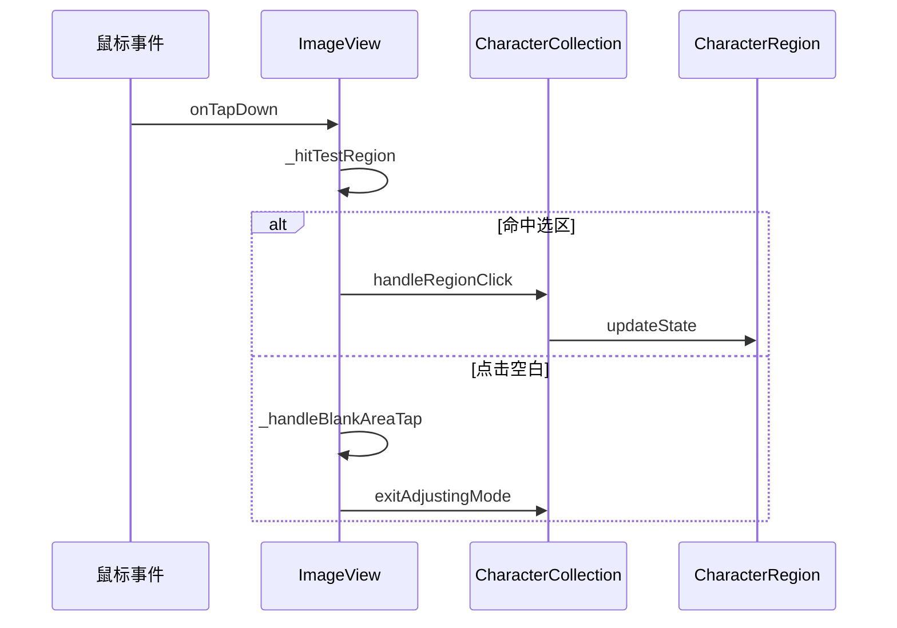
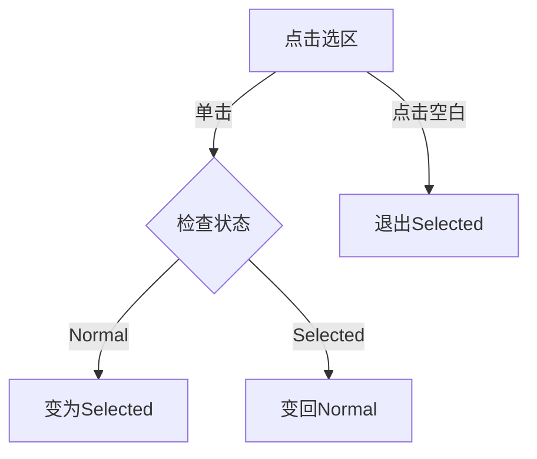
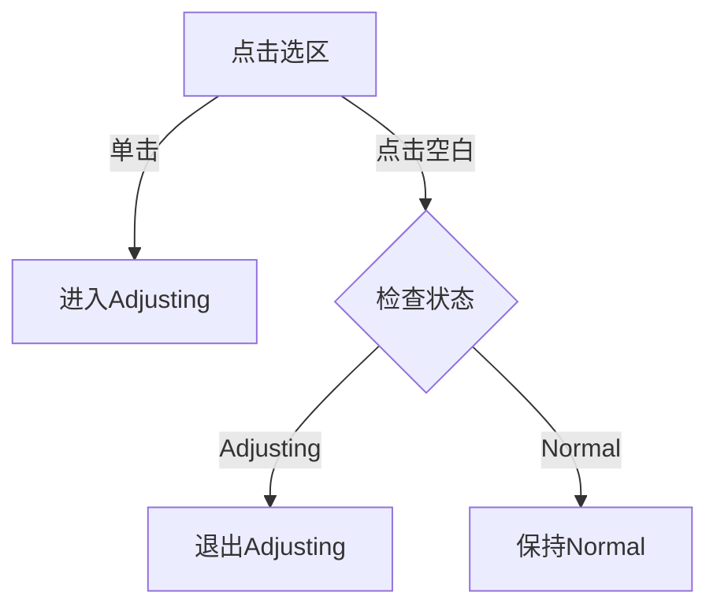
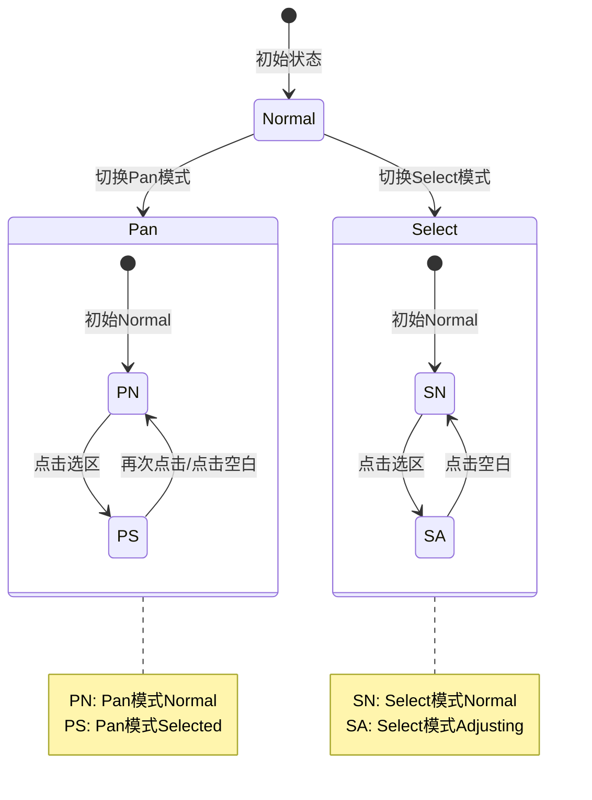
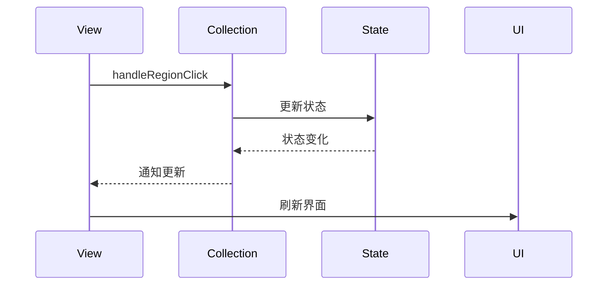
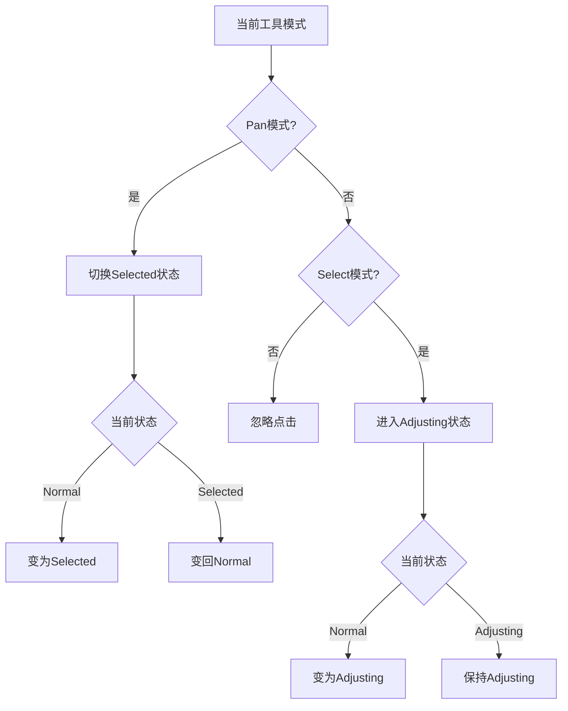

# 鼠标交互分析

## 1. 点击响应流程

### 1.1 基础点击处理



### 1.2 工具模式对应的点击行为

1. Pan模式：



2. Select模式：



### 1.3 状态转换触发点



## 2. 点击响应机制

### 2.1 命中测试

```dart
CharacterRegion? _hitTestRegion(Offset position, List<CharacterRegion> regions) {
  // 从后向前检测，使最上层的选区优先响应
  for (final region in regions.reversed) {
    final rect = _transformer.imageRectToViewportRect(region.rect);
    if (rect.contains(position)) {
      return region;
    }
  }
  return null;
}
```

### 2.2 点击处理函数

```dart
void _onTapDown(TapDownDetails details) {
  final hitRegion = _hitTestRegion(details.localPosition, regions);
  
  if (collection.isAdjusting && hitRegion == null) {
    _handleBlankAreaTap();
    return;
  }

  if (hitRegion != null) {
    _handleRegionTap(hitRegion.id);
  } else {
    if (collection.isAdjusting) {
      _handleBlankAreaTap();
    }
  }
}
```

## 3. 点击状态同步

### 3.1 Provider状态更新



### 3.2 状态切换条件



## 4. 特殊情况处理

### 4.1 调整模式冲突

1. 点击新区域时：
   - 自动退出当前调整状态
   - 进入新区域的调整状态

2. 切换工具模式时：
   - 保存当前调整结果
   - 重置调整状态

### 4.2 多选处理

1. Pan模式下：
   - 支持多个选区同时处于Selected状态
   - 可以批量删除Selected状态的选区

2. Select模式下：
   - 同时只能有一个区域处于Adjusting状态
   - 切换选区时自动保存之前的调整

### 4.3 边界情况

1. 选区重叠：
   - 优先响应最上层选区
   - 通过 regions.reversed 实现

2. 快速点击：
   - 确保状态正确切换
   - 避免状态混乱

## 5. 性能优化

### 5.1 点击响应优化

1. 减少不必要的状态更新：
   - 检查状态是否真正改变
   - 避免重复触发相同状态

2. 命中测试优化：
   - 使用四叉树优化（TODO）
   - 实现空间索引（TODO）

### 5.2 视觉反馈优化

1. 即时反馈：
   - 点击时立即更新视觉状态
   - 等待Provider确认后再更新数据状态

2. 动画过渡：
   - 状态切换时添加动画效果
   - 提供更流畅的用户体验
