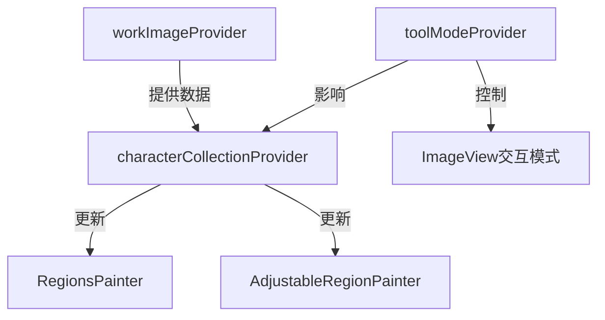
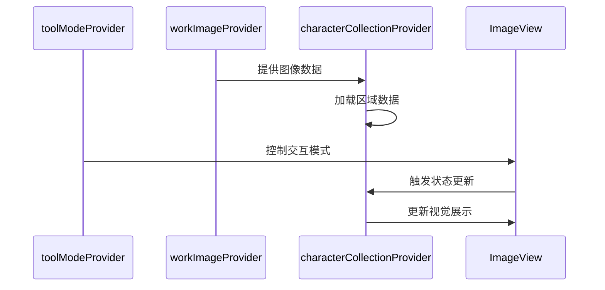
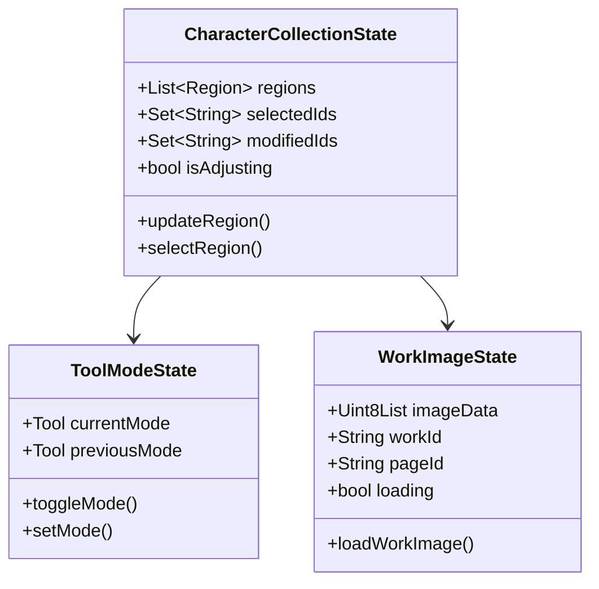
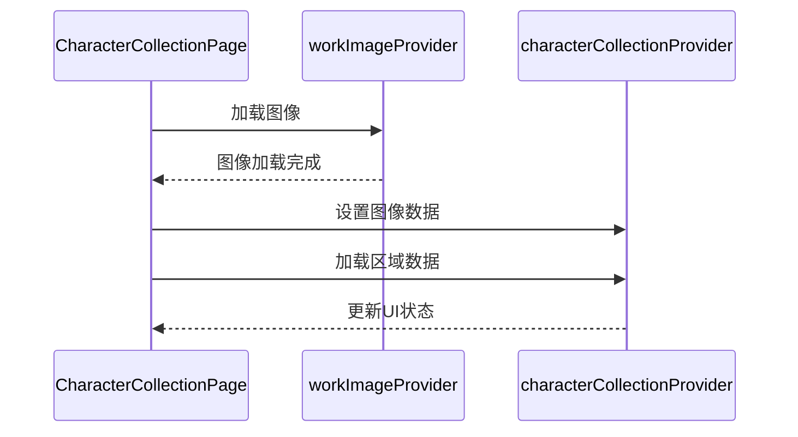
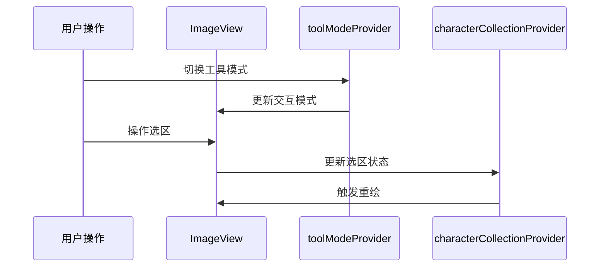

# Provider状态分析

## 1. Provider 概览

### 1.1 核心Provider

1. toolModeProvider
   - 类型：`StateNotifierProvider<ToolModeNotifier, Tool>`
   - 功能：管理工具模式状态
   - 状态：
     - pan: 拖拽模式
     - select: 框选模式
     - multiSelect: 多选模式
     - erase: 擦除模式

2. characterCollectionProvider
   - 类型：管理字符集合状态
   - 主要数据：
     - regions: 区域列表
     - selectedIds: 选中的区域ID集合
     - modifiedIds: 已修改但未保存的区域ID集合
     - isAdjusting: 是否处于调整状态
   - 功能：
     - 加载工作数据
     - 管理区域选择状态
     - 处理区域修改
     - 保存区域数据

3. workImageProvider
   - 类型：管理工作图像状态
   - 主要数据：
     - imageData: 图像数据
     - workId: 当前工作ID
     - currentPageId: 当前页面ID
     - imageWidth/imageHeight: 图像尺寸
   - 功能：
     - 加载图像数据
     - 管理图像加载状态
     - 处理图像验证

## 2. 状态关系

### 2.1 数据流

### 2.2 状态依赖

## 3. 状态同步机制

### 3.1 初始化流程

### 3.2 状态更新流程

## 4. 错误处理

### 4.1 图像加载错误

- workImageProvider 负责处理:
  - 图像数据验证
  - 加载状态管理
  - 错误信息传递

### 4.2 状态同步错误

- characterCollectionProvider 负责处理:
  - 数据加载失败
  - 状态更新冲突
  - 保存失败处理

## 5. 性能优化

### 5.1 状态更新优化

- 批量更新机制
- 选择性刷新
- 延迟处理

### 5.2 数据加载优化

- 图像数据缓存
- 选区数据延迟加载
- 状态变更防抖

## 6. 调试支持

### 6.1 调试模式

- debugOptionsProvider
  - 控制网格显示
  - 显示坐标信息
  - 显示区域中心点
  - 控制日志级别
