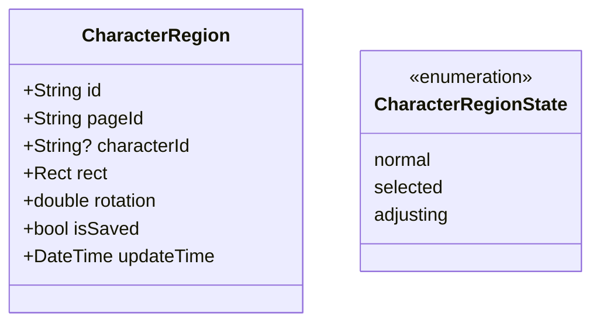
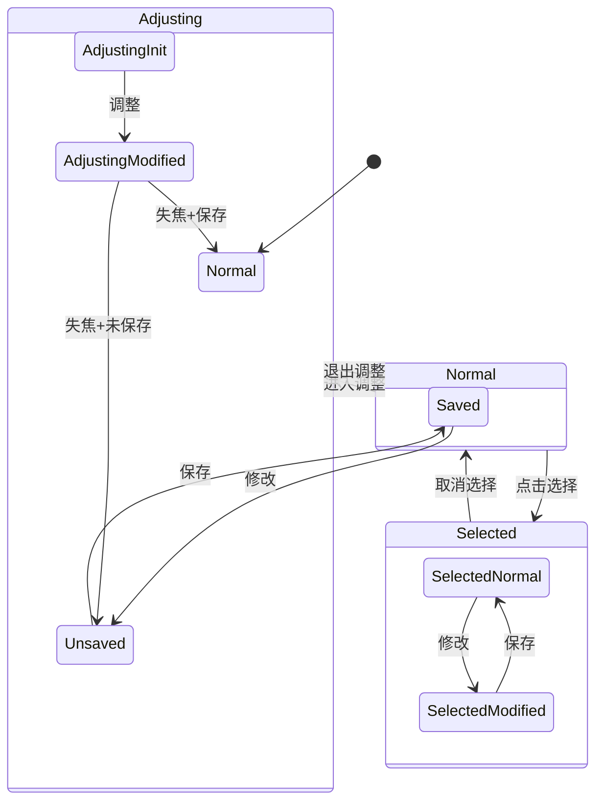
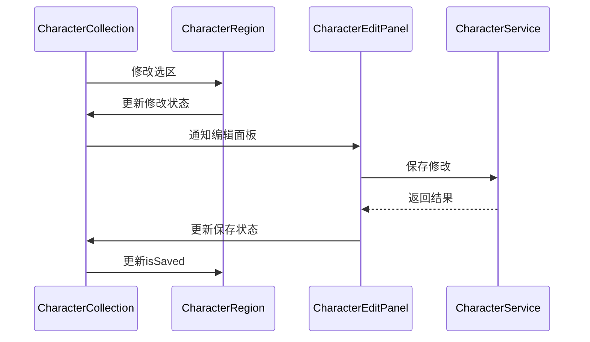

# ImagePreviewPanel 重构方案

## 1. 状态定义与转换

### 1.1 核心状态



### 1.2 颜色状态变迁



### 1.3 颜色映射关系

```dart
class RegionColorScheme {
  static const normalSaved = Colors.green;
  static const normalUnsaved = Colors.blue;
  static const selected = Colors.red;
  static const adjusting = Colors.blue;
  
  static const normalSavedOpacity = 0.05;
  static const normalUnsavedOpacity = 0.1;
  static const selectedOpacity = 0.2;
  static const adjustingOpacity = 0.2;
}
```

## 2. 保存状态同步

### 2.1 同步流程



### 2.2 保存状态管理

```dart
extension SaveStateManagement on CharacterCollectionProvider {
  // 标记修改
  void markAsModified(String regionId) {
    state = state.copyWith(
      modifiedIds: {...state.modifiedIds, regionId},
    );
    // 通知相关组件更新
    notifyListeners();
  }

  // 标记已保存
  void markAsSaved(String regionId) {
    final region = regions.firstWhere((r) => r.id == regionId);
    final updatedRegion = region.copyWith(
      isSaved: true,
      updateTime: DateTime.now(),
    );
    
    // 更新区域
    updateRegion(updatedRegion);
    
    // 从修改集合中移除
    state = state.copyWith(
      modifiedIds: {...state.modifiedIds}..remove(regionId),
    );
  }
}
```

### 2.3 编辑面板同步

```dart
class CharacterEditSyncHandler {
  // 处理保存完成
  void handleSaveComplete(String regionId) {
    // 更新选区状态
    ref.read(characterCollectionProvider.notifier)
      .markAsSaved(regionId);
      
    // 更新编辑面板状态
    ref.read(characterEditProvider.notifier)
      .updateSaveState(true);
  }
  
  // 处理修改
  void handleModification(String regionId) {
    // 更新选区状态
    ref.read(characterCollectionProvider.notifier)
      .markAsModified(regionId);
      
    // 更新编辑面板状态
    ref.read(characterEditProvider.notifier)
      .updateSaveState(false);
  }
}
```

## 3. 实现步骤

### 3.1 阶段一：状态系统改造

1. 定义CharacterRegionState枚举
2. 实现颜色映射系统
3. 添加保存状态追踪机制

### 3.2 阶段二：同步机制实现

1. 构建保存状态管理器
2. 实现编辑面板同步逻辑
3. 优化状态转换流程

### 3.3 阶段三：UI更新

1. 更新RegionsPainter的绘制逻辑
2. 优化视觉反馈系统
3. 完善交互体验

## 4. 关键代码示例

### 4.1 选区状态管理

```dart
class CharacterRegionStateManager {
  void updateState(String regionId, CharacterRegionState newState) {
    final region = getRegion(regionId);
    if (region == null) return;
    
    switch (newState) {
      case CharacterRegionState.normal:
        exitAdjustingMode();
        clearSelection();
        break;
      case CharacterRegionState.selected:
        if (currentToolMode == Tool.pan) {
          selectRegion(regionId);
        }
        break;
      case CharacterRegionState.adjusting:
        if (currentToolMode == Tool.select) {
          enterAdjustingMode(regionId);
        }
        break;
    }
  }
}
```

### 4.2 保存状态监听

```dart
class SaveStateListener {
  void initialize() {
    // 监听编辑面板的保存事件
    ref.listen<SaveState>(characterEditProvider, (previous, next) {
      if (next.isSuccess && previous?.isSuccess != true) {
        final regionId = ref.read(selectedRegionProvider)?.id;
        if (regionId != null) {
          ref.read(characterCollectionProvider.notifier)
            .markAsSaved(regionId);
        }
      }
    });
    
    // 监听选区修改
    ref.listen<CharacterCollectionState>(
      characterCollectionProvider,
      (previous, next) {
        final modifiedIds = next.modifiedIds;
        if (modifiedIds != previous?.modifiedIds) {
          _updateEditPanelState(modifiedIds.isNotEmpty);
        }
      }
    );
  }
}
```

## 5. 测试计划

### 5.1 状态转换测试

1. 测试所有可能的状态转换
2. 验证颜色变化的正确性
3. 检查边界情况处理

### 5.2 保存同步测试

1. 测试保存流程
2. 验证状态同步
3. 测试错误处理

### 5.3 集成测试

1. 工具模式切换
2. 选区状态更新
3. 编辑面板交互

## 6. 注意事项

### 6.1 性能优化

1. 减少不必要的状态更新
2. 优化渲染性能
3. 实现状态缓存

### 6.2 错误处理

1. 保存失败恢复
2. 状态同步异常处理
3. 用户操作容错

### 6.3 兼容性

1. 保持现有功能
2. 向后兼容
3. 平滑过渡
