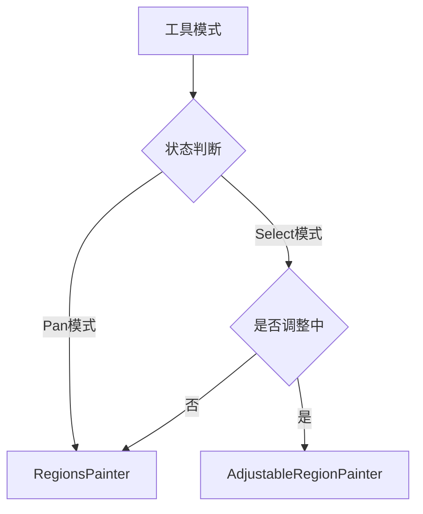
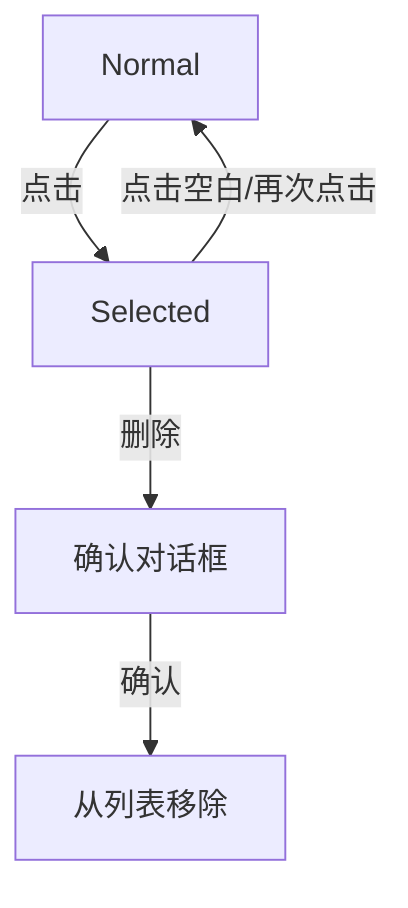
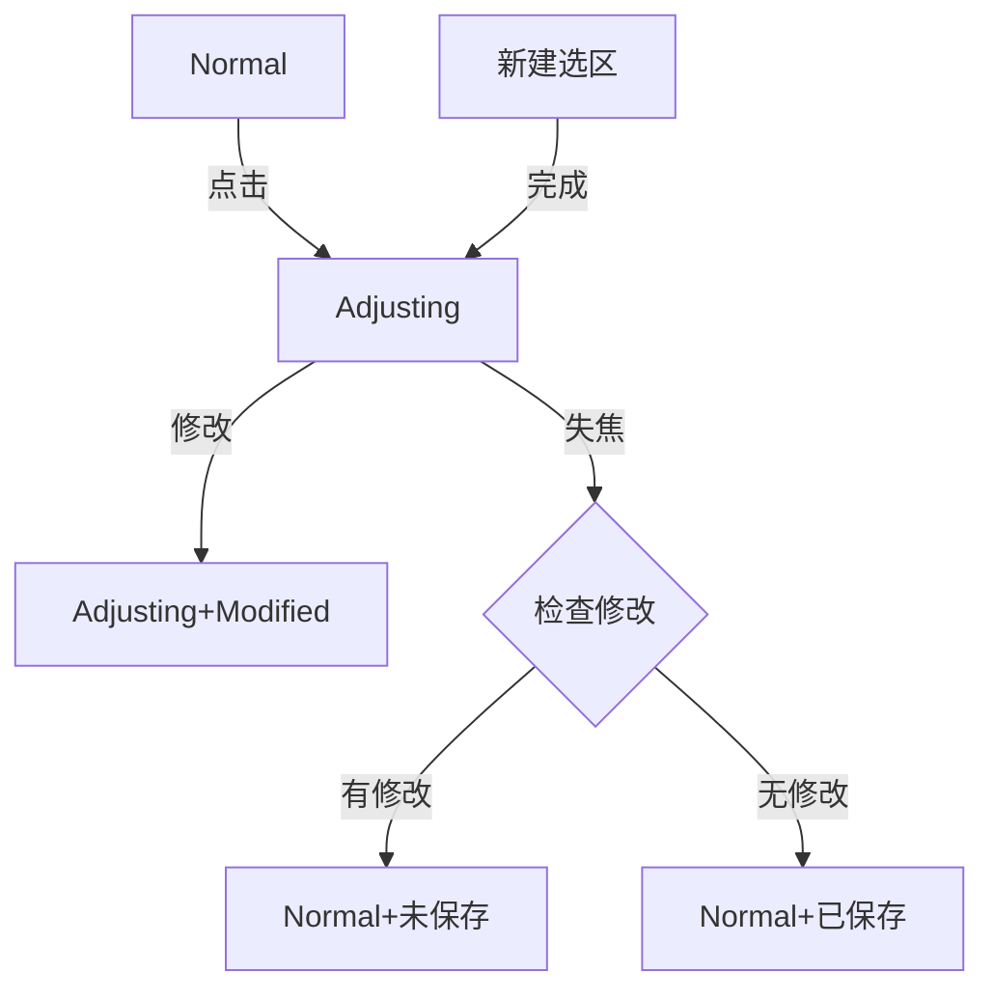
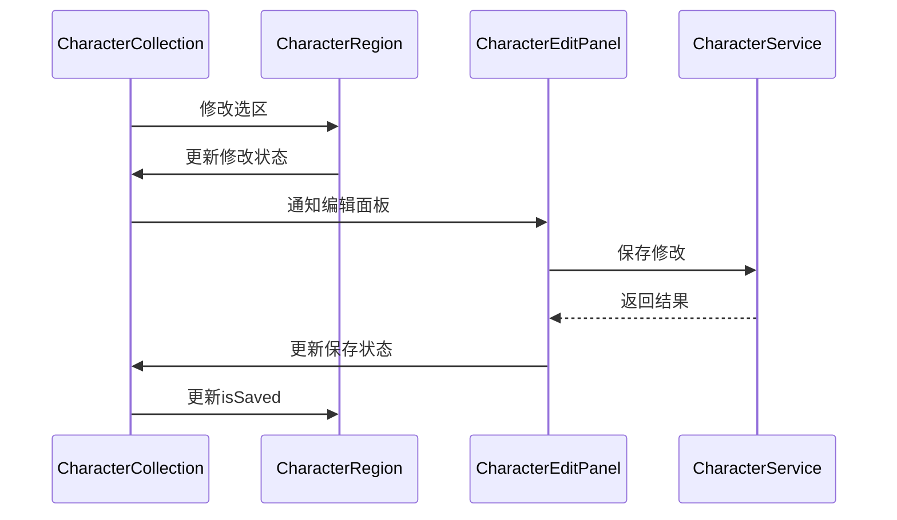

# ImagePreviewPanel 重构方案

## 1. 核心模型扩展

### 1.1 CharacterRegion 扩展

```dart
class CharacterRegion {
  // 现有属性
  String id;
  String pageId;
  Rect rect;
  double rotation;
  bool isSaved;
  
  // 新增属性
  String? characterId;  // 关联的Character ID
}
```

### 1.2 状态枚举定义

```dart
enum CharacterRegionState {
  normal,    // 普通状态
  selected,  // 选中状态（Pan模式）
  adjusting  // 调整状态（Select模式）
}
```

## 2. Provider优化

### 2.1 CharacterCollectionProvider扩展

```dart
class CharacterCollectionProvider {
  // 已有功能
  List<CharacterRegion> regions;
  Set<String> selectedIds;
  Set<String> modifiedIds;
  bool isAdjusting;
  
  // 新增状态管理方法
  void updateRegionState(String id, CharacterRegionState state) {
    // 实现状态转换逻辑
  }
  
  void handleRegionClick(String id, Tool currentTool) {
    // 实现点击处理逻辑
  }
  
  // 新增保存状态管理
  void markAsModified(String id) {
    // 添加到modifiedIds
  }
  
  void markAsSaved(String id) {
    // 从modifiedIds移除
  }
}
```

## 3. 绘制器复用

### 3.1 复用现有Painter

- RegionsPainter：用于普通状态和选中状态的绘制
- AdjustableRegionPainter：用于调整状态的绘制

### 3.2 状态与视觉映射



### 3.3 颜色状态映射

```dart
Color getRegionColor(CharacterRegion region, Tool currentTool) {
  // 复用RegionsPainter中的_getRegionColor逻辑
}

Color getBorderColor(CharacterRegion region, Tool currentTool) {
  // 复用RegionsPainter中的_getBorderColor逻辑
}
```

## 4. 状态转换实现

多选工具模式已经没有必要，删除与多选工具模式相关UI组件内容及处理逻辑

### 4.1 Pan模式



### 4.2 Select模式



### 4.3 颜色映射关系

```dart
class CharacterRegionColorScheme {
  static const normalSaved = Colors.green;
  static const normalUnsaved = Colors.blue;
  static const selected = Colors.red;
  static const adjusting = Colors.blue;
  
  static const normalSavedOpacity = 0.05;
  static const normalUnsavedOpacity = 0.1;
  static const selectedOpacity = 0.2;
  static const adjustingOpacity = 0.2;
}
```

### 4.4 同步流程



## 5. 具体实现步骤

### 5.1 阶段一：状态系统改造

1. 在CharacterRegion中添加characterId字段
2. 定义CharacterRegionState枚举
3. 扩展CharacterCollectionProvider的功能

### 5.2 阶段二：绘制系统优化

1. 复用RegionsPainter的颜色处理逻辑
2. 复用AdjustableRegionPainter的调整控件
3. 根据状态智能切换Painter

### 5.3 阶段三：交互系统实现

1. 实现状态转换逻辑
2. 处理保存状态同步
3. 优化用户体验

## 6. 关键代码示例

### 6.1 状态管理

```dart
extension StateManagement on CharacterCollectionProvider {
  void handleRegionClick(String id, Tool currentTool) {
    final region = regions.firstWhere((r) => r.id == id);
    
    switch (currentTool) {
      case Tool.pan:
        _handlePanModeClick(region);
        break;
      case Tool.select:
        _handleSelectModeClick(region);
        break;
    }
  }
  
  void _handlePanModeClick(CharacterRegion region) {
    if (selectedIds.contains(region.id)) {
      selectedIds.remove(region.id);
    } else {
      selectedIds.add(region.id);
    }
    notifyListeners();
  }
  
  void _handleSelectModeClick(CharacterRegion region) {
    setAdjusting(true);
    currentId = region.id;
    selectedIds = {region.id};
    notifyListeners();
  }
}
```

### 6.2 视图层集成

```dart
class ImagePreviewPanel extends ConsumerWidget {
  Widget build(BuildContext context, WidgetRef ref) {
    final tool = ref.watch(toolModeProvider);
    final collection = ref.watch(characterCollectionProvider);
    
    return Stack(
      children: [
        // 基础绘制层
        CustomPaint(
          painter: RegionsPainter(
            regions: collection.regions,
            selectedIds: collection.selectedIds,
            modifiedIds: collection.modifiedIds,
            currentTool: tool,
          ),
        ),
        
        // 调整层
        if (collection.isAdjusting && collection.currentId != null)
          CustomPaint(
            painter: AdjustableRegionPainter(
              region: collection.currentRegion!,
              transformer: transformer,
              isActive: true,
            ),
          ),
      ],
    );
  }
}
```

## 7. 测试计划

### 7.1 单元测试

1. CharacterRegionState状态转换测试
2. 选区管理逻辑测试
3. 保存状态同步测试

### 7.2 集成测试

1. 工具模式切换测试
2. 视觉状态更新测试
3. 数据同步测试

### 7.3 UI测试

1. 交互流程测试
2. 视觉反馈测试
3. 性能测试

## 8. 注意事项

### 8.1 状态同步

- 确保CharacterRegion和Character的保存状态同步
- 通过Provider正确传递状态变化
- 处理好状态切换的边界情况

### 8.2 性能优化

- 复用现有Painter以减少重绘
- 优化状态更新逻辑
- 实现选区缓存机制

### 8.3 容错处理

- 完善错误处理机制
- 提供状态恢复功能
- 添加日志记录
