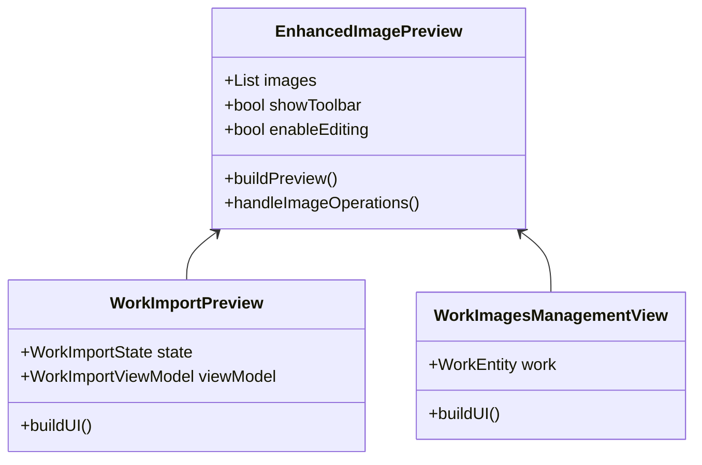

# Revised Image Preview Unification Strategy

## Core Components

### 1. ThumbnailNavigator

A standalone component for thumbnail-based navigation:

```dart
class ThumbnailNavigator extends StatelessWidget {
  final List<String> imagePaths;
  final int selectedIndex;
  final Function(int) onIndexChanged;
  final bool isEnabled;
  final bool allowReordering;
  final double height;
}
```

### 2. ZoomableImageView

A simple wrapper around InteractiveViewer for basic zoom functionality:

```dart
class ZoomableImageView extends StatefulWidget {
  final String imagePath;
  final bool enableMouseWheel;
  final double minScale;
  final double maxScale;
  final Function(double)? onScaleChanged;
}
```

## Revised Component Strategy

### 1. WorkImportPreview & WorkImagesManagementView

These share very similar functionality and can use EnhancedImagePreview:



### 2. ViewModeImagePreview

Keep simple but add zoom capability:

```dart
class ViewModeImagePreview extends ConsumerWidget {
  @override
  Widget build(BuildContext context) {
    return Column(
      children: [
        Expanded(
          child: ZoomableImageView(
            imagePath: currentImage.path,
            enableMouseWheel: true,
          ),
        ),
        ThumbnailNavigator(
          imagePaths: images.map((i) => i.path).toList(),
          selectedIndex: selectedIndex,
          onIndexChanged: onImageSelect,
        ),
      ],
    );
  }
}
```

### 3. CharacterExtractionPreview

Keep separate but integrate shared components:

```dart
class CharacterExtractionPreview extends StatefulWidget {
  @override
  Widget build(BuildContext context) {
    return Column(
      children: [
        Expanded(
          child: Row(
            children: [
              // Main content area with custom gestures
              Expanded(
                child: Stack(
                  children: [
                    ZoomableImageView(...),
                    RegionOverlay(...),
                    GestureDetector(...),
                  ],
                ),
              ),
              // Side panel
              CharacterPreviewPanel(...),
            ],
          ),
        ),
        ThumbnailNavigator(...),
      ],
    );
  }
}
```

## Implementation Priorities

1. Create Shared Components
   - Implement ThumbnailNavigator
   - Build ZoomableImageView
   - Add tests and documentation

2. Enhance Simple Previews
   - Update ViewModeImagePreview
   - Add zoom to CharacterExtractionPreview
   - Integrate ThumbnailNavigator

3. Build Enhanced Preview
   - Implement EnhancedImagePreview
   - Migrate work import/edit views
   - Add comprehensive tests

## Benefits of Revised Strategy

1. **Reduced Complexity**
   - Simpler component hierarchy
   - Clearer responsibilities
   - Easier maintenance
   - Better testability

2. **Focused Integration**
   - Unite similar components
   - Keep specialized features separate
   - Reuse common functionality
   - Maintain performance

3. **Lower Risk**
   - Gradual implementation
   - Easy rollback options
   - Independent testing
   - Simplified state management

## Component Features Matrix

| Feature                | ThumbnailNavigator | ZoomableImageView | EnhancedImagePreview | CharacterExtractionPreview |
|-----------------------|-------------------|-------------------|---------------------|--------------------------|
| Thumbnail Display     | ✓                | -                 | ✓                   | ✓ (via component)        |
| Zoom Support         | -                 | ✓                 | ✓                   | ✓ (via component)        |
| Image Operations     | -                 | -                 | ✓                   | -                        |
| Region Selection     | -                 | -                 | -                   | ✓                        |
| Mouse Wheel Zoom     | -                 | ✓                 | ✓                   | ✓ (via component)        |
| Reordering          | ✓                 | -                 | ✓                   | -                        |
| Custom Gestures      | -                 | -                 | -                   | ✓                        |
| Error Handling       | ✓                 | ✓                 | ✓                   | ✓                        |

## Migration Steps

### Phase 1: Shared Components

1. Create ThumbnailNavigator
2. Implement ZoomableImageView
3. Add tests
4. Write documentation

### Phase 2: Simple Updates

1. Update ViewModeImagePreview
2. Enhance CharacterExtractionPreview
3. Test integrations
4. Update documentation

### Phase 3: Enhanced Preview

1. Build EnhancedImagePreview
2. Migrate work import/edit
3. Comprehensive testing
4. Performance optimization

## Timeline

1. Week 1:
   - Build shared components
   - Initial integration tests

2. Week 2:
   - Update simple previews
   - Component testing

3. Week 3:
   - Enhanced preview implementation
   - Migration and testing

4. Week 4:
   - Polish and optimization
   - Documentation updates

## Success Metrics

1. **Code Quality**
   - Reduced duplication
   - Clear interfaces
   - Good test coverage
   - Clean architecture

2. **Performance**
   - Fast image loading
   - Smooth navigation
   - Efficient memory use
   - Quick interactions

3. **User Experience**
   - Consistent behavior
   - Intuitive controls
   - Reliable operation
   - Clear feedback

4. **Maintainability**
   - Easy to modify
   - Simple to test
   - Clear documentation
   - Stable operation
