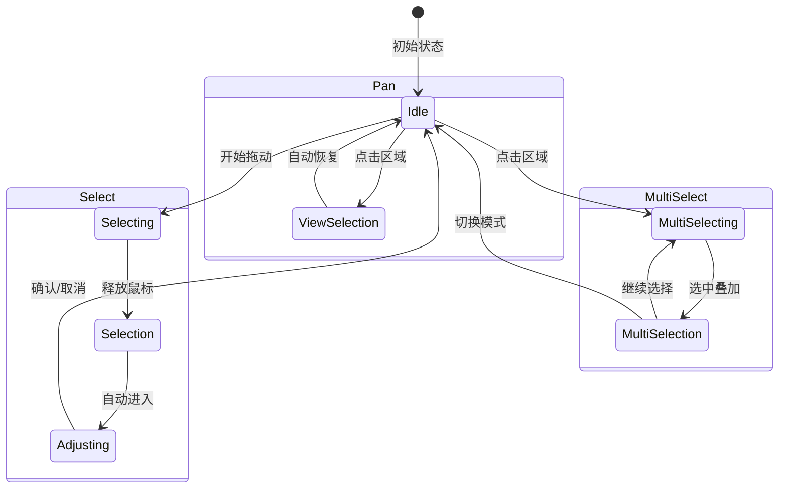
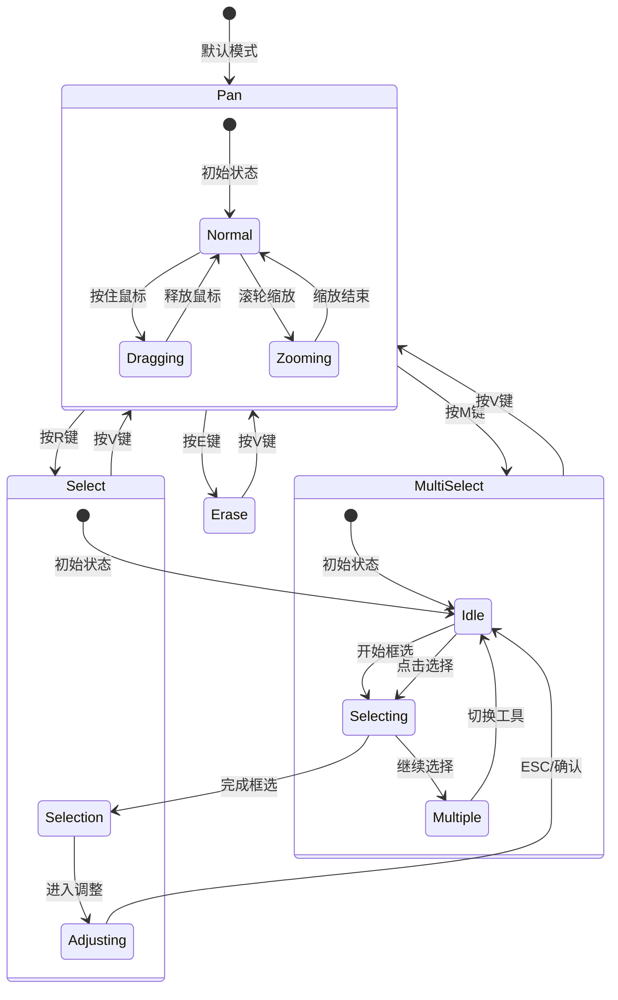
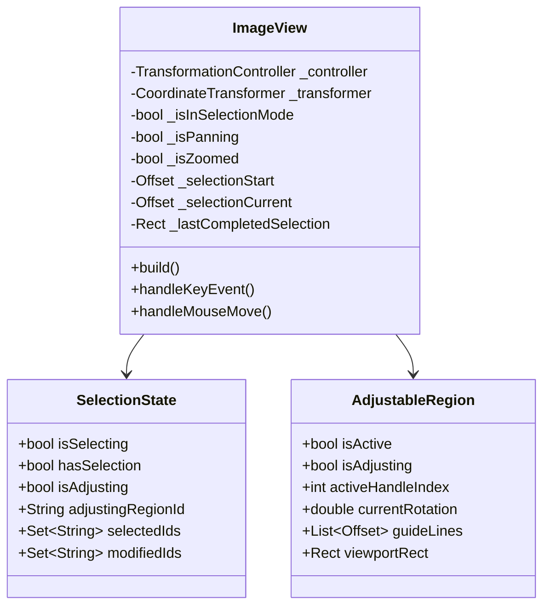
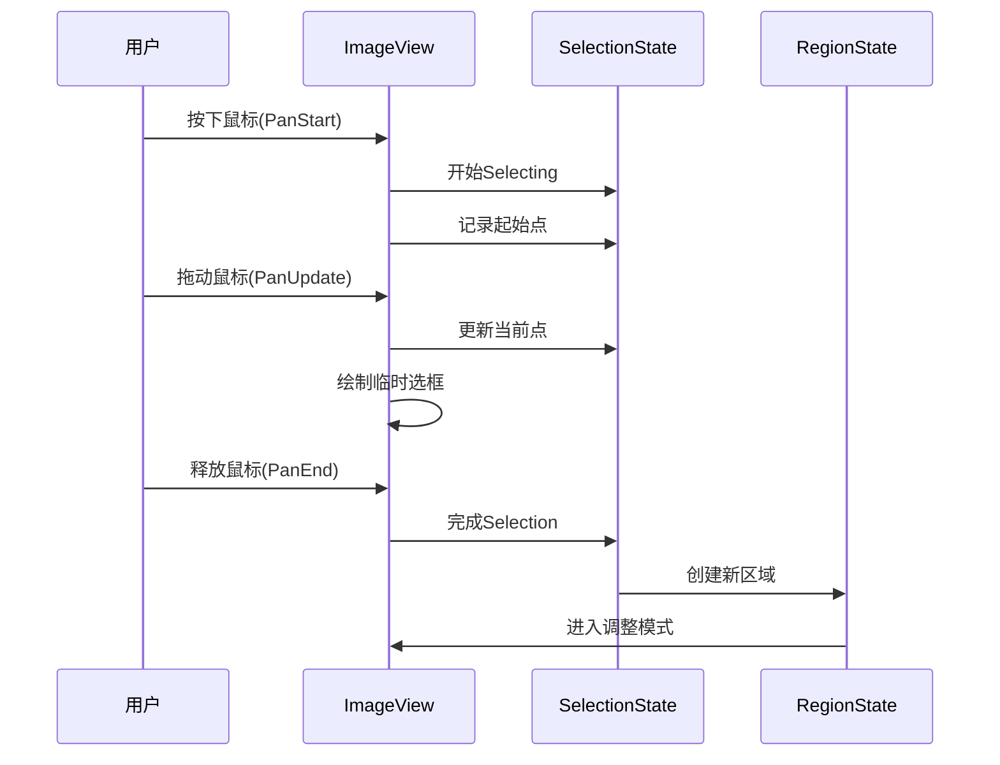
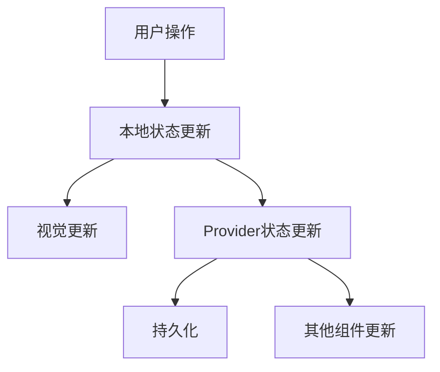

# 选区状态和切换分析

## 1. 选区状态概念

### 1.1 基本概念区分

- `Selecting`（选择过程）
  - 表示正在进行的选择动作
  - 包含鼠标拖动过程中的状态
  - 由 `_selectionStart` 和 `_selectionCurrent` 两个点定义
  - 显示为实时更新的矩形框

- `Selection`（选择结果）
  - 表示已完成的选择结果
  - 是一个确定的矩形区域
  - 存储在 `_lastCompletedSelection` 中
  - 可以进入调整模式（Adjusting）

### 1.2 模式差异

1. 框选模式 (Select)
   - Selecting: 显示蓝色半透明框，跟随鼠标实时更新
   - Selection: 完成后显示蓝色边框，可进入调整状态
   - 特点：单次选择，自动进入调整模式

2. 多选模式 (MultiSelect)
   - Selecting: 点击已有区域进行选择
   - Selection: 选中区域显示红色，可以累积多个选区
   - 特点：无调整状态，专注于多个区域的选择

3. 拖拽模式 (Pan)
   - 无 Selecting 状态
   - Selection: 点击区域时显示灰色，纯展示状态
   - 特点：不影响选区，专注于视图操作

### 1.3 状态转换

## 2. 工具模式分析

### 2.1 工具模式类型

- `pan`: 平移和缩放模式（快捷键V）
  - 主要用于视图操作
  - 选区只读展示
  - 支持缩放和平移

- `select`: 框选工具模式（快捷键R）
  - 用于精确选区创建
  - 支持选区调整
  - 包含旋转功能

- `multiSelect`: 多选工具模式（快捷键M）
  - 用于批量操作
  - 支持多个选区
  - 不支持调整

- `erase`: 擦除模式（快捷键E）
  - 用于删除操作
  - 直接作用于选区

### 2.2 模式状态机

## 3. 选区系统组件结构

## 4. 交互状态和行为

### 4.1 选区创建流程

### 4.2 选区调整状态

- 调整模式触发条件：
  - 单击已有区域（仅在select模式）
  - 完成新区域创建
  - 通过快捷键选择

- 调整操作类型：
  - 8个方向控制点调整大小
  - 旋转控制点
  - 整体移动
  - 键盘微调（方向键）

### 4.3 快捷键系统

- 工具切换：
  - V：切换到平移模式
  - R：切换到框选模式
  - M：切换到多选模式
  - E：切换到擦除模式

- 选区操作：
  - ESC：取消当前调整
  - Delete/Backspace：删除选中区域
  - 方向键：微调选区位置（1像素）
  - Shift + 方向键：大幅调整选区位置（10像素）

### 4.4 选区状态指示

- 视觉反馈：
  - 多选模式：红色，透明度0.2
  - 拖拽模式：灰色，透明度0.2
  - 调整模式：蓝色，透明度0.2
  - 未保存：蓝色，透明度0.1
  - 已保存：绿色，透明度0.05

- 信息显示：
  - 尺寸信息：宽x高
  - 旋转角度
  - 鼠标位置

## 5. 坐标系统和状态同步

### 5.1 坐标转换

### 5.2 状态同步机制

## 6. 错误处理和性能优化

### 6.1 错误处理策略

- 选区验证：
  - 最小尺寸限制（20x20像素）
  - 有效范围检查
  - 坐标转换保护

### 6.2 性能优化措施

- 渲染优化：
  - shouldRepaint 条件判断
  - 分层渲染
  - 视口裁剪
- 状态更新优化：
  - 延迟处理
  - 批量更新
  - 防抖动
