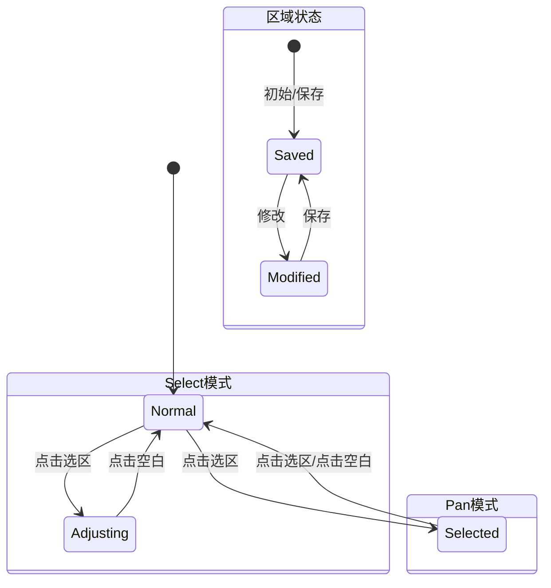
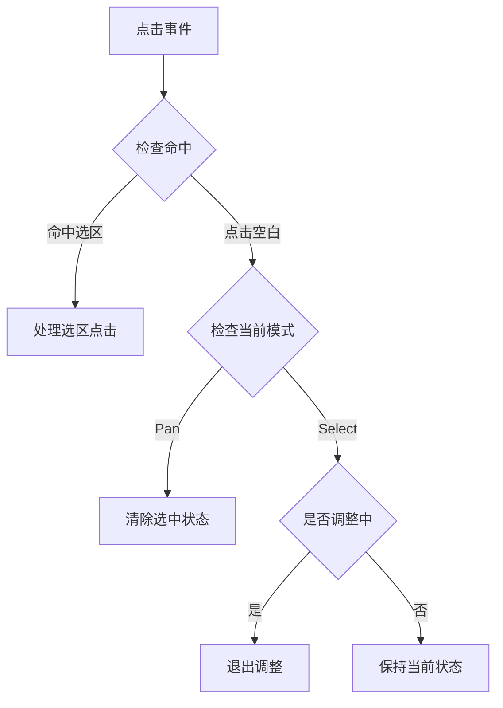

# 状态处理修复方案

## 1. 问题描述

### 1.1 当前行为

- Pan模式下点击空白区域不会清除选中状态
- 状态转换不完整，导致视觉反馈异常

### 1.2 期望行为

- Pan模式下点击空白区域应该清除所有选中状态
- 状态转换完整，视觉反馈准确

## 2. 修复方案

### 2.1 空白区域点击处理

```dart
void _onTapDown(TapDownDetails details) {
  final collection = ref.read(characterCollectionProvider);
  final hitRegion = _hitTestRegion(details.localPosition, collection.regions);
  final currentTool = ref.read(toolModeProvider);
  
  if (hitRegion != null) {
    _handleRegionTap(hitRegion.id);
  } else {
    // 点击空白区域的处理
    if (collection.isAdjusting) {
      // 如果在调整状态，退出调整
      ref.read(characterCollectionProvider.notifier).finishCurrentAdjustment();
    } else if (currentTool == Tool.pan) {
      // Pan模式下清除选择状态
      ref.read(characterCollectionProvider.notifier).selectRegion(null);
    }
  }
}
```

### 2.2 状态转换流程



### 2.3 状态检查点



## 3. 实现步骤

### 3.1 修改 ImageView

1. 更新`_onTapDown`处理逻辑
2. 确保正确调用Provider方法
3. 添加状态转换日志

### 3.2 更新 CharacterCollectionProvider

1. 确保`selectRegion(null)`正确清理状态
2. 完善`finishCurrentAdjustment`的状态重置
3. 优化状态同步机制

### 3.3 测试用例

1. Pan模式点击空白测试
2. Select模式状态转换测试
3. 多状态组合测试

## 4. 验证标准

### 4.1 Pan模式

- [ ] 点击空白区域清除所有选中状态
- [ ] 视觉反馈正确响应
- [ ] 状态转换完整记录

### 4.2 Select模式

- [ ] 调整状态正确退出
- [ ] 保存状态正确同步
- [ ] 视觉反馈及时更新

## 5. 注意事项

### 5.1 状态一致性

1. 确保Provider状态和UI状态同步
2. 避免状态更新过程中的临时异常
3. 保持状态转换的原子性

### 5.2 性能影响

1. 最小化不必要的状态更新
2. 优化状态检查逻辑
3. 减少重绘操作

### 5.3 错误处理

1. 添加状态断言
2. 完善错误日志
3. 提供状态恢复机制
