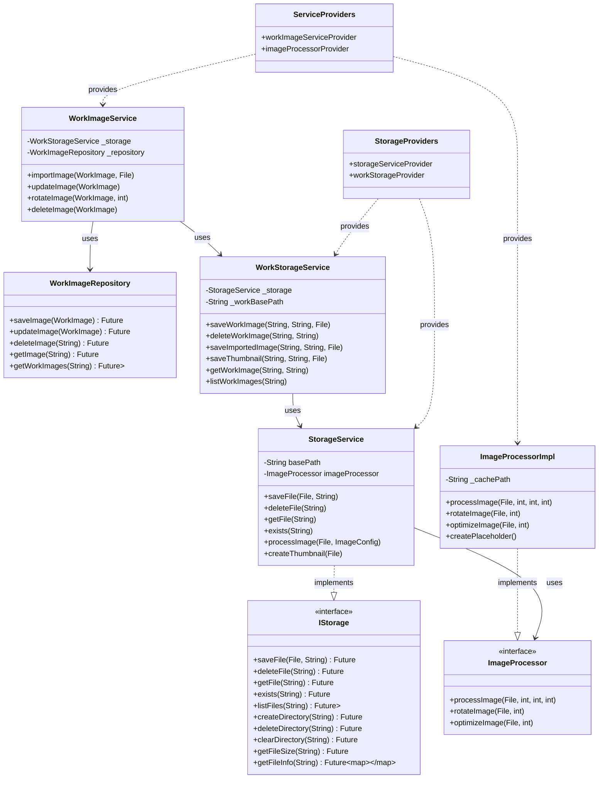

# 存储系统架构文档

## 1. 系统概述

存储系统提供了一个分层的、可扩展的文件存储和图片处理架构。系统采用文件系统存储实际文件，数据库管理元数据的方式，确保数据一致性和高效查询。

## 2. 系统结构图

## 3. 服务职责

### 3.1 StorageService

- 基础文件系统操作
- 文件和目录管理
- 路径生成和验证
- 基础错误处理

### 3.2 WorkStorageService

- 作品文件目录管理
- 作品文件命名规则
- 文件版本管理
- 图片格式处理

### 3.3 WorkImageService

- 维护图片文件与数据的一致性
- 协调存储和数据库操作
- 处理图片业务逻辑
- 管理图片生命周期

### 3.4 WorkImageRepository

- 管理图片元数据
- 提供数据库操作接口
- 维护图片索引
- 处理数据查询

## 4. 关键流程

### 4.1 图片导入流程

1. WorkImageService接收导入请求
2. 创建WorkImage记录
3. WorkStorageService处理文件存储
4. WorkImageRepository保存元数据
5. 返回处理结果

### 4.2 图片更新流程

1. WorkImageService接收更新请求
2. WorkStorageService处理新文件
3. WorkImageRepository更新元数据
4. 清理旧文件
5. 返回更新结果

### 4.3 图片删除流程

1. WorkImageService接收删除请求
2. WorkImageRepository删除元数据
3. WorkStorageService删除文件
4. 清理相关资源
5. 返回删除结果

## 5. 数据一致性

### 5.1 事务管理

- 文件操作与数据库操作同步
- 失败时回滚机制
- 临时文件清理

### 5.2 错误处理

- 文件操作异常
- 数据库操作异常
- 数据不一致修复

### 5.3 并发控制

- 文件锁定机制
- 数据库事务隔离
- 并发操作队列

## 6. 扩展性设计

### 6.1 存储扩展

- 支持不同存储介质
- 可配置存储策略
- 插件式存储实现

### 6.2 处理扩展

- 自定义处理流程
- 可配置处理参数
- 处理器插件机制

### 6.3 监控扩展

- 性能指标收集
- 操作日志记录
- 状态监控接口
