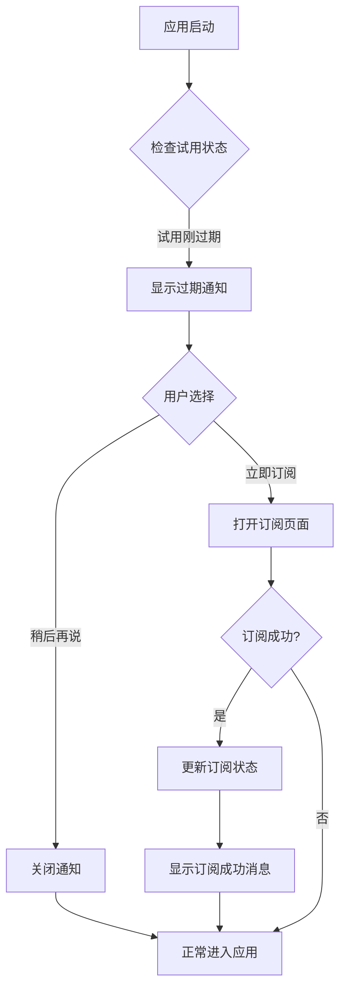
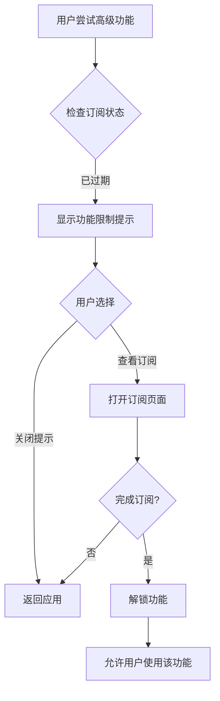
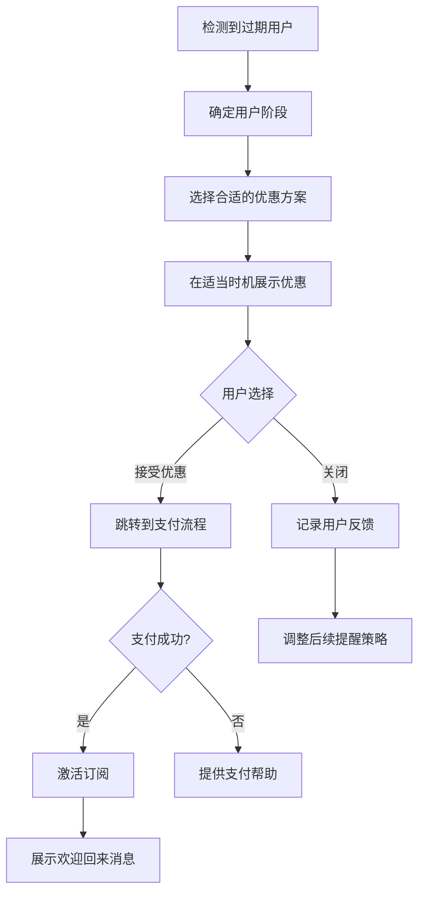

# 试用期过期转化界面设计文档

**创建日期**：2025年5月7日  
**状态**：初稿  
**作者**：技术团队  

## 1. 概述

本文档详细描述了应用程序试用期过期后引导用户转化为付费订阅用户的界面设计和交互策略。良好的过期后转化体验对于提高付费用户转化率至关重要，通过合理的设计可以帮助用户看到产品价值并作出订阅决策。

### 1.1 设计目标

- 在试用期结束后清晰地传达用户当前状态
- 提供平滑且不唐突的订阅引导体验
- 突出展示产品的价值和订阅的好处
- 提供有吸引力的特殊优惠以提高转化率
- 设计符合各平台设计规范的界面
- 在功能限制与转化引导之间找到平衡

### 1.2 用户场景

这些界面设计主要针对以下用户场景：

1. 用户试用期刚刚过期，首次启动应用
2. 试用期过期用户尝试使用高级功能时
3. 试用期过期用户在应用中浏览过程中
4. 试用期过期一段时间后的重新激活引导

## 2. 过期通知界面设计

### 2.1 首次过期启动界面

当用户试用期过期后首次打开应用时，应显示一个优雅且信息丰富的过期通知。

#### 2.1.1 布局设计

```
┌─────────────────────────────────────────────────────────┐
│                                                         │
│                       🔔                                │
│                                                         │
│               您的高级功能试用已结束                       │
│                                                         │
│    感谢您使用我们的产品试用。您的14天高级功能试用期         │
│    已经结束。现在您可以选择订阅以继续享受所有高级功能。     │
│                                                         │
│    • 继续使用您创建的所有内容                            │
│    • 无限访问高级编辑功能                               │
│    • 跨设备同步 (最多5台设备)                           │
│    • 优先客户支持                                       │
│                                                         │
│    ┌─────────────────────────────────────────────┐      │
│    │             限时优惠：首月5折                │      │
│    └─────────────────────────────────────────────┘      │
│                                                         │
│    [稍后再说]                      [立即订阅]           │
│                                                         │
└─────────────────────────────────────────────────────────┘
```

#### 2.1.2 视觉设计要点

- **整体风格**：简洁、专业，避免过度销售感
- **色彩使用**：
  - 主背景：白色/深色模式下的暗色背景
  - 强调色：品牌主色，用于突出按钮和重要信息
  - 优惠标签：温暖的强调色（如琥珀色），表示时限性
- **排版层次**：
  - 标题：大号粗体，清晰表达核心信息
  - 正文：适中大小，易读性优先
  - 功能点：使用项目符号增强可读性
  - 按钮文本：清晰、行动导向
- **图标使用**：
  - 顶部使用友好的通知图标（钟、信封等）
  - 功能点前使用复选标记或其他相关图标

#### 2.1.3 交互行为

- **主订阅按钮**：突出显示，点击直接进入订阅页面
- **稍后再说按钮**：次要样式，点击关闭对话框，允许用户继续使用有限功能
- **关闭行为**：用户可通过点击"稍后再说"或对话框外部区域关闭提示
- **不再显示选项**：提供"今天不再提醒"选项，但不提供永久关闭的选项

### 2.2 功能使用受限提示

当试用期过期的用户尝试使用高级功能时，显示针对性提示。

#### 2.2.1 上下文内嵌入式提示

```
┌─────────────────────────────────────────────┐
│ ⭐ 这是高级功能                            │
│                                             │
│ 您的试用期已结束。订阅即可使用此功能。      │
│                                             │
│ [了解详情]            [立即订阅]           │
└─────────────────────────────────────────────┘
```

#### 2.2.2 功能区域覆盖提示

```
┌───────────────────────────────────┐
│                                   │
│             🔒                    │
│                                   │
│      需要订阅才能使用此功能       │
│                                   │
│   您的试用期已结束，请订阅以      │
│   继续使用高级编辑工具。          │
│                                   │
│   [查看订阅方案]                  │
│                                   │
└───────────────────────────────────┘
```

#### 2.2.3 视觉设计要点

- **区分度**：与普通通知有明显区分，但不过分干扰
- **上下文关联**：提示应当直接关联到用户正在尝试使用的功能
- **半透明背景**：在功能区域上使用半透明背景，保持上下文可见性
- **锁定图标**：使用友好的锁定图标，而非警告图标

## 3. 持续转化引导设计

### 3.1 应用内提示策略

为避免单次提醒被忽略，设计系列提示策略：

#### 3.1.1 首页提示横幅

```
┌─────────────────────────────────────────────────────────────┐
│ 🎁 试用期结束特惠：首月订阅享5折优惠  [查看详情] [X]       │
└─────────────────────────────────────────────────────────────┘
```

#### 3.1.2 侧边栏/导航区提示

```
┌─────────────────────────┐
│                         │
│      升级到高级版       │
│    首月订阅享50%折扣    │
│      ──────────         │
│      [立即升级]         │
│                         │
└─────────────────────────┘
```

#### 3.1.3 设置项提示标记

在高级功能对应的设置项旁添加"高级"标记，点击时显示订阅引导。

```
┌───────────────────────────────────────┐
│ ⚙️ 设置                               │
│                                       │
│  通用                                 │
│  主题                                 │
│  同步 [高级]                          │
│  导出设置 [高级]                      │
│  高级编辑功能 [高级]                  │
│  账户与订阅                           │
│                                       │
└───────────────────────────────────────┘
```

### 3.2 上下文感知的功能展示

根据用户使用习惯，智能推荐可能最有价值的高级功能：

#### 3.2.1 基于使用行为的个性化推荐

```
┌─────────────────────────────────────────────────────────┐
│ 📊 根据您的使用习惯，这些高级功能可能对您很有帮助：     │
│                                                         │
│  • 大批量导出 - 您经常使用导出功能                      │
│  • 高级过滤器 - 适合您的复杂工作流                      │
│  • 云备份 - 保护您创建的42个项目                        │
│                                                         │
│                               [解锁这些功能]            │
└─────────────────────────────────────────────────────────┘
```

#### 3.2.2 实际使用场景下的价值展示

当用户多次使用某个基础功能时，展示相关高级功能如何提升效率：

```
┌─────────────────────────────────────────────────────────┐
│ 💡 提示：使用高级批处理可将此操作时间缩短80%             │
│                                                         │
│        [了解更多]                 [立即升级]            │
└─────────────────────────────────────────────────────────┘
```

### 3.3 限时特惠与返回激励

为不同阶段的试用过期用户提供针对性的优惠方案：

#### 3.3.1 过期初期优惠（1-7天）

- 首月订阅5折优惠
- 年付方案额外赠送2个月

#### 3.3.2 过期中期优惠（8-30天）

- 首3个月7折优惠
- 赠送独家模板包或资源

#### 3.3.3 长期未转化用户优惠（30天以上）

- 专属回归用户方案
- 限时特别折扣（例如首年6折）
- 一对一设置指导服务

#### 3.3.4 特惠展示界面

```
┌─────────────────────────────────────────────────────────┐
│                                                         │
│                 🎉 专属优惠方案                         │
│                                                         │
│  我们注意到您的试用期已过，特别为您提供以下订阅优惠：   │
│                                                         │
│  ┌─────────────────────────────────────┐                │
│  │   月付方案                          │                │
│  │   ¥30 ¥15/月 (首月5折)             │                │
│  │   · 包含所有高级功能                │                │
│  │   · 可随时取消                      │                │
│  │                 [选择此方案]        │                │
│  └─────────────────────────────────────┘                │
│                                                         │
│  ┌─────────────────────────────────────┐                │
│  │   年付方案 (推荐)                   │                │
│  │   ¥300 ¥210/年 (节省30%)           │                │
│  │   · 包含所有高级功能                │                │
│  │   · 额外赠送2个月                   │                │
│  │   · 优先客户支持                    │                │
│  │                 [选择此方案]        │                │
│  └─────────────────────────────────────┘                │
│                                                         │
│  📅 此优惠将于 2025年5月14日 到期                       │
│                                                         │
└─────────────────────────────────────────────────────────┘
```

## 4. 功能限制体验设计

试用期过期后，用户将回到免费版功能集。这个过渡需要明确但不刻意刁难用户。

### 4.1 有限使用与水印策略

#### 4.1.1 功能降级而非完全禁用

对于部分高级功能，可考虑降级使用而非完全禁用：

- 允许查看但不编辑高级项目
- 允许使用高级功能但有使用次数限制
- 允许导出但添加水印或降低质量

#### 4.1.2 水印与品牌展示

```
┌─────────────────────────────────────────────────────┐
│                                                     │
│                                                     │
│               用户的文档或项目内容                  │
│                                                     │
│                                                     │
│                                                     │
│     使用免费版创建                                  │
│     升级到高级版移除水印                            │
│                                                     │
└─────────────────────────────────────────────────────┘
```

### 4.2 功能对比展示

清晰展示免费版与高级版功能对比，突出用户当前缺失的价值：

```
┌─────────────────────────────────────────────────────────┐
│                                                         │
│           免费版与高级版功能对比                        │
│                                                         │
│  ┌─────────────────┬───────────────┬───────────────┐    │
│  │                 │ 免费版        │ 高级版        │    │
│  │                 │ (当前方案)    │               │    │
│  ├─────────────────┼───────────────┼───────────────┤    │
│  │ 基础编辑        │ ✓             │ ✓             │    │
│  │ 项目数量        │ 最多5个       │ 无限          │    │
│  │ 导出格式        │ 仅基本格式    │ 所有格式      │    │
│  │ 高级编辑工具    │ ✗             │ ✓             │    │
│  │ 云同步          │ ✗             │ ✓             │    │
│  │ 多设备使用      │ 1台设备       │ 最多5台设备   │    │
│  │ 批量处理        │ ✗             │ ✓             │    │
│  │ 客户支持        │ 社区支持      │ 优先支持      │    │
│  └─────────────────┴───────────────┴───────────────┘    │
│                                                         │
│                         [升级到高级版]                  │
│                                                         │
└─────────────────────────────────────────────────────────┘
```

### 4.3 进度保存与继续策略

当用户在免费版创建了需要高级功能的内容时：

```
┌─────────────────────────────────────────────────────────┐
│                                                         │
│           您的工作包含高级功能                          │
│                                                         │
│  我们已保存您的完整工作。订阅高级版即可继续编辑         │
│  包含高级功能的部分。                                   │
│                                                         │
│  您现在可以：                                           │
│                                                         │
│  [降级为基础版本]        [保存并稍后处理]        [立即订阅]  │
│                                                         │
└─────────────────────────────────────────────────────────┘
```

## 5. 交互流程设计

### 5.1 试用过期后首次启动流程



### 5.2 高级功能尝试流程



### 5.3 特惠订阅转化流程



## 6. 视觉风格指南

### 6.1 转化界面色彩系统

特定于转化界面的色彩系统，确保视觉一致性和吸引力：

- **主色调**：使用品牌主色，传达专业感
- **强调色**：
  - 行动按钮：鲜明的品牌色（如蓝色）
  - 优惠标签：温暖色调（如橙色或金色）
  - 功能锁定：中性灰色或柔和的紫色
- **文本色彩**：
  - 主要文本：深灰色（浅色模式）/ 白色（深色模式）
  - 次要文本：中等灰色
  - 强调文本：品牌主色
- **背景色彩**：
  - 主背景：白色/深灰色（取决于模式）
  - 卡片背景：轻微的对比色
  - 优惠卡片：微妙的渐变背景

### 6.2 排版层次

- **标题文本**：18-24pt，品牌字体，粗体
- **主体文本**：14-16pt，易读字体
- **强调文本**：粗体或品牌色彩
- **按钮文本**：16pt，粗体，大小写规范
- **提示文本**：12-14pt，次要颜色

### 6.3 图标和图形元素

- **状态图标**：使用统一的线条风格图标
- **功能图标**：直观表达功能特性的图标
- **装饰元素**：
  - 使用简洁的图形元素
  - 使用适当的动画增强吸引力
  - 避免过度装饰影响可用性

### 6.4 空间和布局

- **内边距**：保持一致的内边距（16-24dp）
- **元素间距**：使用8dp的倍数作为标准间距
- **对齐**：保持严格的左对齐或居中对齐
- **层次结构**：使用卡片、阴影和高度创建视觉层次

## 7. 实现细节

### 7.1 过期状态检测

```dart
class TrialExpiryManager {
  final SubscriptionService _subscriptionService;
  final NotificationService _notificationService;
  final PreferencesService _preferencesService;
  
  // 检查试用状态并显示适当的界面
  Future<void> checkAndHandleTrialExpiry() async {
    final trialStatus = await _subscriptionService.getTrialStatus();
    
    if (trialStatus.hasExpired && !trialStatus.hasShownExpiryNotice) {
      // 显示首次过期通知
      _showInitialExpiryNotice();
      await _subscriptionService.markExpiryNoticeShown();
    } else if (trialStatus.hasExpired) {
      // 确定用户处于过期后的哪个阶段
      final daysSinceExpiry = DateTime.now().difference(trialStatus.expiryDate).inDays;
      if (_shouldShowPeriodicReminder(daysSinceExpiry)) {
        // 显示阶段性提醒
        _showPeriodicExpiryReminder(daysSinceExpiry);
      }
    }
  }
  
  // 判断是否应该显示阶段性提醒
  bool _shouldShowPeriodicReminder(int daysSinceExpiry) {
    // 过期后第1天、第7天、第15天、第30天显示提醒
    if (daysSinceExpiry == 1 || daysSinceExpiry == 7 || 
        daysSinceExpiry == 15 || daysSinceExpiry == 30) {
      return true;
    }
    
    // 检查用户设置的"今天不再提醒"
    final lastReminderDate = _preferencesService.getLastReminderDate();
    if (lastReminderDate != null) {
      final today = DateTime.now();
      if (today.year == lastReminderDate.year && 
          today.month == lastReminderDate.month &&
          today.day == lastReminderDate.day) {
        return false;
      }
    }
    
    // 根据用户行为决定是否显示提醒
    // ...
    
    return false;
  }
}
```

### 7.2 功能限制检查

```dart
class PremiumFeatureGuard {
  final SubscriptionService _subscriptionService;
  
  // 检查用户是否可以访问高级功能
  Future<bool> canUseFeature(String featureId) async {
    final subscriptionStatus = await _subscriptionService.getStatus();
    
    // 如果是活跃的付费订阅用户，允许使用所有功能
    if (subscriptionStatus.isActive && !subscriptionStatus.isTrial) {
      return true;
    }
    
    // 如果是活跃的试用期用户，允许使用所有功能
    if (subscriptionStatus.isActive && subscriptionStatus.isTrial && 
        !subscriptionStatus.hasExpired) {
      return true;
    }
    
    // 检查该功能是否为免费功能
    final featureConfig = await _getFeatureConfig(featureId);
    if (featureConfig.availableInFree) {
      return true;
    }
    
    // 高级功能且无有效订阅，返回false
    return false;
  }
  
  // 显示功能受限提示
  Future<void> showFeatureRestrictedDialog(
    BuildContext context,
    String featureId,
  ) async {
    final featureConfig = await _getFeatureConfig(featureId);
    
    return showDialog(
      context: context,
      builder: (context) => FeatureRestrictedDialog(
        featureName: featureConfig.name,
        featureDescription: featureConfig.description,
        featureIcon: featureConfig.icon,
      ),
    );
  }
  
  // 获取功能配置
  Future<FeatureConfig> _getFeatureConfig(String featureId) async {
    // 实际实现中，这可能来自配置文件或后端API
    // ...
  }
}
```

### 7.3 优惠策略管理

```dart
class PromotionManager {
  final SubscriptionService _subscriptionService;
  final AnalyticsService _analyticsService;
  
  // 为特定用户获取最佳优惠方案
  Future<Promotion?> getBestPromotionForUser() async {
    final userData = await _subscriptionService.getUserData();
    
    // 试用刚过期的用户
    if (userData.trialExpiredRecently) {
      return _getRecentlyExpiredPromotion();
    }
    
    // 长期未转化的用户
    if (userData.daysSinceTrialExpired > 30) {
      return _getLongTermUserPromotion();
    }
    
    // 基于用户行为的个性化优惠
    return _getPersonalizedPromotion(userData);
  }
  
  // 记录优惠展示
  Future<void> logPromotionImpression(Promotion promotion) async {
    await _analyticsService.logEvent(
      'promotion_shown',
      {
        'promotion_id': promotion.id,
        'promotion_type': promotion.type,
        'discount_percentage': promotion.discountPercentage,
      },
    );
  }
  
  // 记录优惠转化
  Future<void> logPromotionConverted(Promotion promotion) async {
    await _analyticsService.logEvent(
      'promotion_converted',
      {
        'promotion_id': promotion.id,
        'promotion_type': promotion.type,
        'discount_percentage': promotion.discountPercentage,
      },
    );
  }
}
```

### 7.4 显示策略调整

根据用户反馈动态调整显示频率：

```dart
class ReminderStrategy {
  final PreferencesService _preferencesService;
  final AnalyticsService _analyticsService;
  
  // 获取下一次提醒的时间
  Future<DateTime> getNextReminderTime() async {
    final userData = await _getUserData();
    final baseInterval = await _getBaseInterval(userData);
    
    // 根据用户反馈调整间隔
    final adjustedInterval = _adjustIntervalBasedOnFeedback(
      baseInterval, 
      userData.reminderDismissCount
    );
    
    return DateTime.now().add(adjustedInterval);
  }
  
  // 根据用户行为调整基本间隔
  Duration _adjustIntervalBasedOnFeedback(Duration baseInterval, int dismissCount) {
    // 用户连续忽略提醒，适当延长间隔
    if (dismissCount > 3) {
      return baseInterval * 1.5;
    }
    
    // 用户查看了订阅页但未订阅，缩短间隔
    if (_userShowedInterestButDidNotSubscribe()) {
      return baseInterval * 0.7;
    }
    
    return baseInterval;
  }
  
  // 用户查看了订阅页但未订阅
  bool _userShowedInterestButDidNotSubscribe() {
    // 实现逻辑
    // ...
    return false;
  }
}
```

## 8. 特殊用户界面需求

### 8.1 重要数据提示

当用户有已创建的重要数据，但因试用过期无法完全访问时：

```
┌─────────────────────────────────────────────────────────┐
│                                                         │
│         ⚠️ 您有2个项目包含高级功能内容                  │
│                                                         │
│  您在试用期内创建的以下项目包含高级功能：              │
│  • 项目A（使用了高级编辑工具）                          │
│  • 项目B（包含多设备同步数据）                          │
│                                                         │
│  订阅后可完全访问这些内容，否则部分功能将不可用。      │
│                                                         │
│           [导出基础版本]        [恢复完整访问]          │
│                                                         │
└─────────────────────────────────────────────────────────┘
```

### 8.2 多设备用户体验

针对之前在多设备上使用的用户：

```
┌─────────────────────────────────────────────────────────┐
│                                                         │
│        您的内容在多台设备上不再同步                     │
│                                                         │
│  试用期结束后，多设备同步功能已停用。                   │
│  您之前已在以下设备上使用此应用：                       │
│                                                         │
│  • Windows PC (当前设备)                                │
│  • MacBook Pro                                          │
│  • Android Phone                                        │
│                                                         │
│  恢复订阅后，您的数据将立即在所有设备间同步。           │
│                                                         │
│                        [恢复同步功能]                   │
│                                                         │
└─────────────────────────────────────────────────────────┘
```

### 8.3 渐进式功能降级

试用过期后，通过渐进式功能降级保持用户体验：

```
┌─────────────────────────────────────────────────────────┐
│                                                         │
│            您的部分高级功能将逐步过渡                   │
│                                                         │
│  为确保您有良好的体验，以下功能将在7天内仍然可用：      │
│                                                         │
│  • 已编辑内容的查看（7天内可查看）                      │
│  • 多设备同步（3天内可同步）                            │
│  • 高级导出（3次导出机会）                              │
│                                                         │
│  订阅高级版可立即恢复所有功能且不会丢失任何数据。       │
│                                                         │
│           [了解详情]         [立即订阅]                 │
│                                                         │
└─────────────────────────────────────────────────────────┘
```

## 9. 附录

### 9.1 用户测试要点

- 测试不同引导转化界面的效果
- 收集和分析不同阶段用户的反馈
- 测试不同优惠策略的转化率
- 评估功能限制策略对用户满意度的影响

### 9.2 A/B测试计划

- 测试不同视觉风格的转化通知
- 测试不同优惠力度对转化率的影响
- 测试不同提醒频率对用户体验的影响
- 测试功能逐步降级与立即降级的用户反应差异
