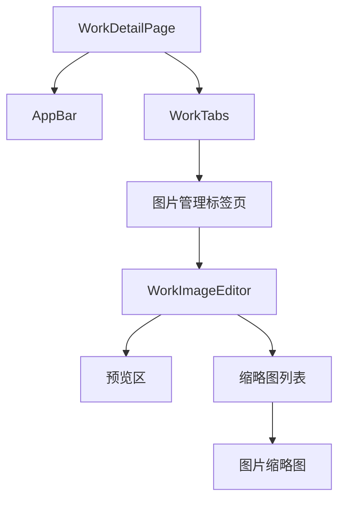

# 作品图片管理界面集成设计

## 整体布局

```
WorkDetailPage (lib/presentation/pages/works/work_detail_page.dart)
+--------------------------------+
|   AppBar [保存] [取消]          |
|--------------------------------|
|                   |            |
|                   |            |
|    图片区域       |   标签页    |
|                   |            |
|                   |            |
|                   |            |
|-------------------|            |
|   缩略图列表      |            |
|                   |            |
+--------------------------------+
```

## 详细布局

### 1. 顶部操作栏

```dart
AppBar(
  title: Text('编辑图片'),
  actions: [
    // 取消按钮
    TextButton.icon(
      icon: Icon(Icons.close),
      label: Text('取消'),
      onPressed: _handleCancel,
    ),
    // 保存按钮
    TextButton.icon(
      icon: Icon(Icons.check),
      label: Text('保存'),
      onPressed: _handleSave,
    ),
  ],
)
```

### 2. 预览区布局

```
+--------------------------------+
|     [全屏] [1/4]  [设置]       |  <- 工具栏
|--------------------------------|
|                                |
|                                |
|         图片预览内容            |  <- BaseImagePreview
|                                |
|                                |
|                                |
+--------------------------------+
```

### 3. 缩略图列表布局

```
+--------------------------------+
| [1] [2] [3] [4] [...] [+]     |  <- ThumbnailStrip
+--------------------------------+
```

## 组件层次



## 尺寸规范

### 1. 整体尺寸

```dart
class Dimensions {
  // 标签页宽度
  static const tabPanelWidth = 350.0;
  
  // 内容区边距
  static const contentPadding = EdgeInsets.all(16.0);
  
  // 缩略图尺寸
  static const thumbnailSize = Size(80.0, 80.0);
  static const thumbnailSpacing = 4.0;
  static const thumbnailStripHeight = 120.0;
}
```

### 2. 按钮尺寸

```dart
class ButtonDimensions {
  // 顶部操作按钮
  static const actionButtonHeight = 36.0;
  static const actionButtonSpacing = 8.0;
  
  // 工具栏按钮
  static const toolbarButtonSize = 40.0;
  static const toolbarButtonPadding = 8.0;
}
```

## 主题配置

### 1. 颜色定义

```dart
class ColorStyles {
  // 操作按钮
  static final saveButton = Colors.blue;
  static final cancelButton = Colors.grey;
  
  // 预览区
  static final previewBackground = Colors.grey[100];
  static final previewBorder = Colors.grey[300];
  
  // 缩略图
  static final thumbnailBorder = Colors.grey[400];
  static final selectedThumbnailBorder = Colors.blue;
}
```

### 2. 文字样式

```dart
class TextStyles {
  // 操作按钮文字
  static const actionButtonText = TextStyle(
    fontSize: 14,
    fontWeight: FontWeight.w500,
  );
  
  // 工具栏文字
  static const toolbarText = TextStyle(
    fontSize: 12,
    color: Colors.black87,
  );
}
```

## 响应式布局

### 1. 桌面布局（>= 1024px）

- 右侧标签页固定宽度 350px
- 左侧图片区域自适应

### 2. 平板布局（< 1024px）

- 标签页位于底部
- 图片区域占满宽度

## 动画效果

### 1. 按钮动画

```dart
// 保存/取消按钮
final buttonAnimation = AnimationController(
  duration: Duration(milliseconds: 200),
);

// 按钮反馈
InkWell(
  onTap: _handlePress,
  splashColor: theme.primaryColor.withOpacity(0.1),
  highlightColor: theme.primaryColor.withOpacity(0.2),
  child: button,
)
```

### 2. 切换动画

```dart
// 标签页切换
PageTransitionSwitcher(
  transitionBuilder: (child, animation, secondaryAnimation) {
    return FadeThroughTransition(
      animation: animation,
      secondaryAnimation: secondaryAnimation,
      child: child,
    );
  },
  child: currentPage,
)
