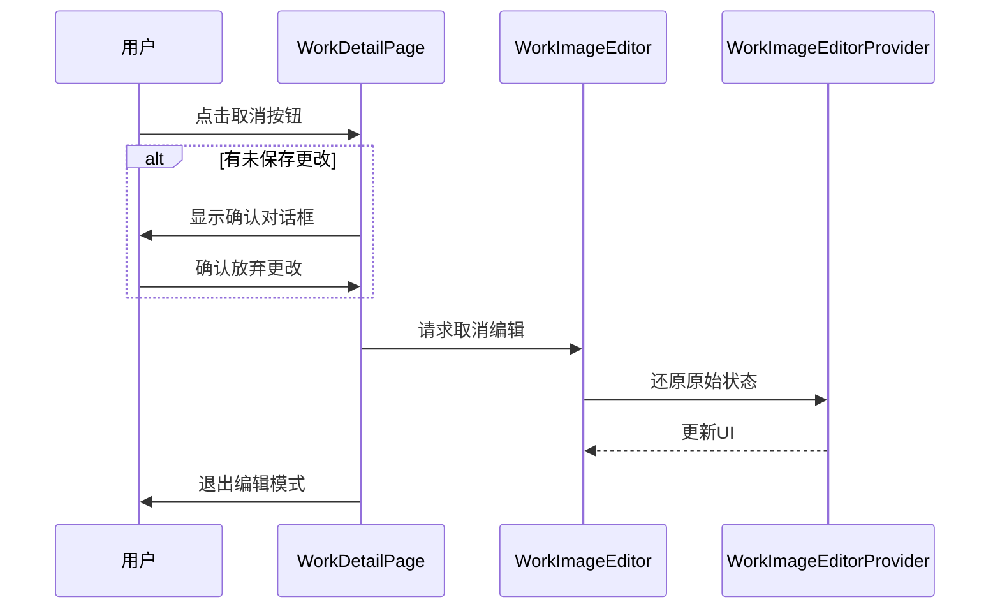
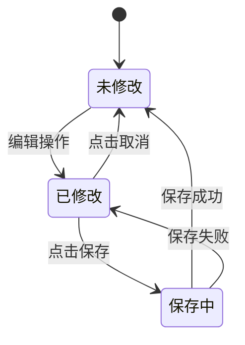

# 作品图片管理交互时序设计

[前面的内容保持不变，修改取消流程部分]

### 2. 取消流程

```mermaid
sequenceDiagram
    participant U as 用户
    participant P as WorkDetailPage
    participant E as WorkImageEditor
    participant EP as WorkImageEditorProvider
    
    U->>P: 点击取消按钮
    
    alt 有未保存更改
        P->>U: 显示确认对话框
        U->>P: 确认放弃更改
    end
    
    P->>E: 请求取消编辑
    E->>EP: 还原原始状态
    EP-->>E: 更新UI
    
    P->>U: 退出编辑模式
```

### 3. 对象状态变化

```mermaid
stateDiagram-v2
    [*] --> 未修改
    未修改 --> 已修改: 编辑操作
    已修改 --> 保存中: 点击保存
    已修改 --> 未修改: 点击取消
    保存中 --> 未修改: 保存成功
    保存中 --> 已修改: 保存失败
```

[其他内容保持不变]
