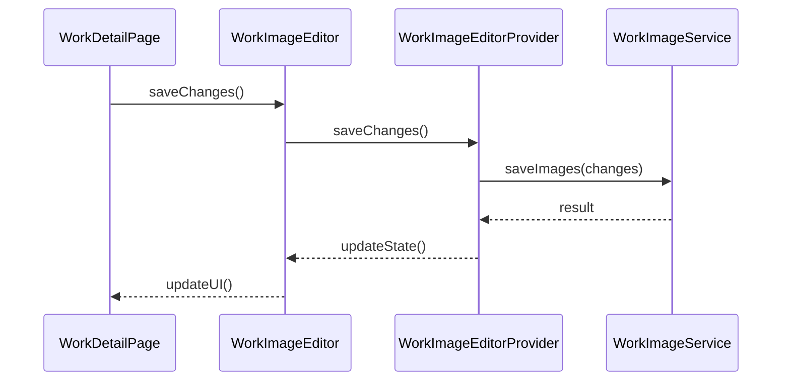
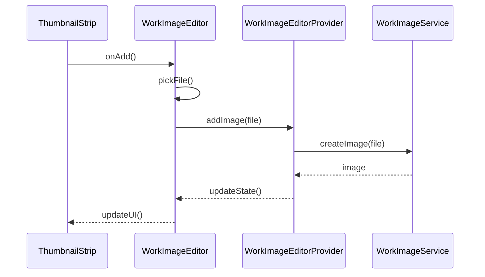
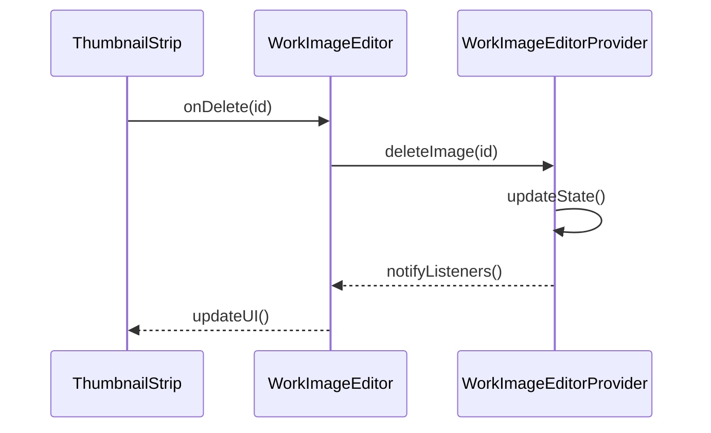

# 作品图片管理对象设计

## 文件结构

```
lib/
  ├── presentation/
  │   ├── pages/
  │   │   └── works/
  │   │       ├── work_detail_page.dart           // 作品详情页
  │   │       └── components/
  │   │           ├── work_image_editor.dart      // 图片编辑器组件
  │   │           ├── image_thumbnail.dart        // 缩略图组件
  │   │           └── thumbnail_strip.dart        // 缩略图列表组件
  │   ├── providers/
  │   │   └── work_image_editor_provider.dart     // 图片编辑状态管理
  │   └── widgets/
  │       └── base_image_preview.dart            // 基础图片预览组件
  └── application/
      └── services/
          └── work/
              └── work_image_service.dart         // 图片服务
```

## 对象定义

### 1. WorkDetailPage (work_detail_page.dart)

```dart
class WorkDetailPage extends ConsumerWidget {
  // 接口定义
  void _handleSave() async;     // 保存修改
  void _handleCancel();         // 取消修改
  void _showProgress();         // 显示进度
  void _showError();           // 显示错误
}
```

### 2. WorkImageEditor (work_image_editor.dart)

```dart
class WorkImageEditor extends ConsumerWidget {
  // 接口定义
  Future<void> saveChanges();   // 保存更改
  void cancelChanges();         // 取消更改
  Future<void> addImage(File file);    // 添加图片
  void deleteImage(String id);         // 删除图片
  void reorderImages(int oldIndex, int newIndex);  // 重排图片
}
```

### 3. WorkImageEditorProvider (work_image_editor_provider.dart)

```dart
class WorkImageEditorProvider extends StateNotifier<WorkImageEditorState> {
  // 状态管理接口
  Future<void> addImage(File file);
  void deleteImage(String id);
  void reorderImages(int oldIndex, int newIndex);
  Future<void> saveChanges();
  void cancelChanges();
  
  // 内部方法
  void _updateState(WorkImageEditorState newState);
  void _notifyParent();
}
```

### 4. ThumbnailStrip (thumbnail_strip.dart)

```dart
class ThumbnailStrip extends StatelessWidget {
  // 接口定义
  void onSelect(int index);    // 选择图片
  void onDelete(String id);    // 删除图片
  void onReorder(int oldIndex, int newIndex);  // 重排序
  void onAdd();               // 添加图片
}
```

## 调用关系

### 1. 保存流程



### 2. 添加图片流程



### 3. 删除图片流程



## 接口调用时序

### 1. 保存操作

```dart
// 1. WorkDetailPage 触发保存
void _handleSave() async {
  showProgress();
  try {
    await imageEditor.saveChanges();
    showSuccess();
    closeEditor();
  } catch (e) {
    showError(e);
  }
}

// 2. WorkImageEditor 处理保存
Future<void> saveChanges() async {
  return ref.read(workImageEditorProvider.notifier)
    .saveChanges();
}

// 3. WorkImageEditorProvider 执行保存
Future<void> saveChanges() async {
  // 3.1 获取更改
  final changes = getChanges();
  
  // 3.2 调用服务保存
  final result = await _service.saveImages(changes);
  
  // 3.3 更新状态
  updateState(result);
}

// 4. WorkImageService 处理文件
Future<List<WorkImage>> saveImages(ImageChanges changes) async {
  // 4.1 处理文件
  await processFiles(changes.files);
  
  // 4.2 更新数据库
  return await updateDatabase(changes);
}
```

### 2. 图片操作

```dart
// 1. 添加图片
ThumbnailStrip -> onAdd()
  -> WorkImageEditor.addImage()
    -> WorkImageEditorProvider.addImage()
      -> WorkImageService.createImage()

// 2. 删除图片
ThumbnailStrip -> onDelete()
  -> WorkImageEditor.deleteImage()
    -> WorkImageEditorProvider.deleteImage()
      -> updateState()

// 3. 重排图片
ThumbnailStrip -> onReorder()
  -> WorkImageEditor.reorderImages()
    -> WorkImageEditorProvider.reorderImages()
      -> updateState()
