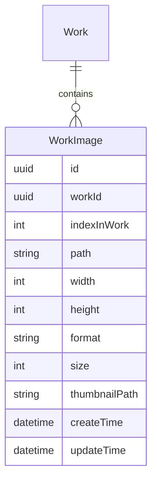

# Work图片管理重构方案

## 1. 问题分析

当前存在的问题:

- 图片顺序和引用关系直接存储在Work模型的JSON数据中
- 调整图片顺序需要修改整个Work对象
- 缺乏独立的图片表来管理图片的元数据和顺序
- 缺乏对批量操作的支持
- 图片存储路径结构不利于顺序调整

## 2. 数据库设计

### 2.1 实体关系图



### 2.2 新增work_images表

```sql
CREATE TABLE IF NOT EXISTS work_images (
  id TEXT PRIMARY KEY,           -- UUID
  workId TEXT NOT NULL,          -- 关联的作品ID
  indexInWork INTEGER NOT NULL,  -- 在作品中的顺序号
  path TEXT NOT NULL,            -- 图片路径
  width INTEGER NOT NULL,        -- 宽度
  height INTEGER NOT NULL,       -- 高度  
  format TEXT NOT NULL,          -- 格式
  size INTEGER NOT NULL,         -- 文件大小
  thumbnailPath TEXT,           -- 缩略图路径
  createTime INTEGER NOT NULL,   -- 创建时间
  updateTime INTEGER NOT NULL,   -- 更新时间
  FOREIGN KEY (workId) REFERENCES works (id) ON DELETE CASCADE
);

-- 索引
CREATE INDEX IF NOT EXISTS idx_work_images_workId ON work_images(workId);
CREATE INDEX IF NOT EXISTS idx_work_images_index ON work_images(workId, indexInWork);
```

### 2.3 Work表调整

1. 删除字段:

```sql
ALTER TABLE works DROP COLUMN images;  -- 原JSON数组字段
```

2. 保留字段:

```sql
imageCount INTEGER DEFAULT 0     -- 图片总数
```

3. 新增字段:

```sql
ALTER TABLE works ADD COLUMN firstImageId TEXT;          -- 首图ID
ALTER TABLE works ADD COLUMN lastImageUpdateTime INTEGER; -- 最后更新时间
FOREIGN KEY (firstImageId) REFERENCES work_images (id);
```

4. 新增触发器:

```sql
-- 更新imageCount触发器
CREATE TRIGGER update_work_image_count
AFTER INSERT OR DELETE ON work_images
BEGIN
  UPDATE works 
  SET imageCount = (
    SELECT COUNT(*) 
    FROM work_images 
    WHERE workId = new.workId
  )
  WHERE id = new.workId;
END;

-- 更新firstImageId触发器
CREATE TRIGGER update_work_first_image
AFTER INSERT OR DELETE OR UPDATE OF indexInWork ON work_images
BEGIN
  UPDATE works 
  SET firstImageId = (
    SELECT id
    FROM work_images
    WHERE workId = new.workId
    ORDER BY indexInWork ASC
    LIMIT 1
  )
  WHERE id = new.workId;
END;
```

## 3. 存储路径设计

### 3.1 目录结构

```
/storage
  /works
    /{workId}
      /images
        /{imageId}           # 使用UUID
          original.{ext}     # 原始图片
          imported.png       # 导入图片
          thumbnail.jpg      # 缩略图
      metadata.json
```

### 3.2 路径生成工具

```dart
class PathHelper {
  // Work图片相关路径
  static String getWorkImageDir(String workId, String imageId) {
    return join(getWorkDir(workId), 'images', imageId);
  }
  
  static String getWorkOriginalImagePath(
    String workId, 
    String imageId,
    String ext
  ) {
    return join(getWorkImageDir(workId, imageId), 'original.$ext');
  }
  
  static String getWorkImportedImagePath(String workId, String imageId) {
    return join(getWorkImageDir(workId, imageId), 'imported.png');
  }
  
  static String getWorkImageThumbnailPath(String workId, String imageId) {
    return join(getWorkImageDir(workId, imageId), 'thumbnail.jpg');
  }
}
```

## 4. 领域模型设计

### 4.1 WorkImageRepository接口

```dart
abstract class WorkImageRepository {
  /// 创建图片记录
  Future<WorkImage> create(String workId, WorkImageInput input);

  /// 批量创建
  Future<List<WorkImage>> batchCreate(String workId, List<WorkImageInput> inputs);

  /// 更新图片索引
  Future<void> updateIndex(String workId, String imageId, int newIndex);

  /// 删除图片
  Future<void> delete(String workId, String imageId);

  /// 批量删除
  Future<void> batchDelete(String workId, List<String> imageIds);

  /// 获取作品的所有图片
  Future<List<WorkImage>> findByWorkId(String workId);

  /// 获取作品的第一张图片
  Future<WorkImage?> findFirstByWorkId(String workId);

  /// 获取下一个可用的索引号
  Future<int> getNextIndex(String workId);

  /// 事务支持
  Future<T> transaction<T>(Future<T> Function() action);
}
```

### 4.2 WorkImage实体

```dart
@freezed
class WorkImage with _$WorkImage {
  const factory WorkImage({
    /// 图片路径
    required String path,
    required String thumbnailPath,

    /// 在作品中的序号
    required int index,
  }) = _WorkImage;

  /// 创建新图片
  factory WorkImage.create({
    required String path,
    required int index,
    required String thumbnailPath,
  }) {
    return WorkImage(
      path: path,
      index: index,
      thumbnailPath: thumbnailPath,
    );
  }

  factory WorkImage.fromJson(Map<String, dynamic> json) =>
      _$WorkImageFromJson(json);

  const WorkImage._();

  /// 目录路径
  String get directory => p.dirname(path);

  /// 扩展名
  String get extension {
    final ext = p.extension(path);
    return ext.isEmpty ? '' : ext.substring(1);
  }

  /// 文件名(含扩展名)
  String get filename => p.basename(path);

  /// 文件名(不含扩展名)
  String get name => p.basenameWithoutExtension(path);
}
```

### 4.3 数据传输对象

```dart
class ImageMetadata {
  final int width;
  final int height;
  final String format;
  final int size;

  const ImageMetadata({
    required this.width,
    required this.height,
    required this.format,
    required this.size,
  });
}

class WorkImageInput {
  final String originalPath;
  final ImageMetadata metadata;
  final String? importedPath;
  final String? thumbnailPath;
  final int? targetIndex;

  const WorkImageInput({
    required this.originalPath,
    required this.metadata,
    this.importedPath,
    this.thumbnailPath,
    this.targetIndex,
  });
}

class WorkImageBatchInput {
  final String workId;
  final List<WorkImageInput> images;
  final bool generateMissing;

  const WorkImageBatchInput({
    required this.workId,
    required this.images,
    this.generateMissing = true,
  });
}

class WorkImageIndexUpdate {
  final String imageId;
  final int newIndex;

  const WorkImageIndexUpdate({
    required this.imageId,
    required this.newIndex,
  });
}

class UpdateWorkInput {
  final String id;
  final String? title;
  final String? author;
  final String? remark;
  final WorkStyle? style;
  final WorkTool? tool;
  final DateTime? creationDate;
  final List<WorkImageIndexUpdate>? imageUpdates;
  final List<String>? tags;
  final List<CharacterEntity>? collectedChars;

  const UpdateWorkInput({
    required this.id,
    this.title,
    this.author,
    this.remark,
    this.style,
    this.tool,
    this.creationDate,
    this.imageUpdates,
    this.tags,
    this.collectedChars,
  });

  Work toWork() {
    return Work(
      id: id,
      title: title ?? '',
      author: author ?? '',
      style: style ?? WorkStyle.traditional,
      tool: tool ?? WorkTool.pencil,
      creationDate: creationDate ?? DateTime.now(),
      remark: remark,
      tags: tags ?? [],
      collectedChars: collectedChars ?? [],
      updateTime: DateTime.now(),
    );
  }

  Map<String, dynamic> toUpdateMap() {
    final map = <String, dynamic>{};
    
    if (title != null) map['title'] = title;
    if (author != null) map['author'] = author;
    if (remark != null) map['remark'] = remark;
    if (style != null) map['style'] = style!.value;
    if (tool != null) map['tool'] = tool!.value;
    if (creationDate != null) map['creation_date'] = creationDate!.millisecondsSinceEpoch;
    if (tags != null) map['tags'] = jsonEncode(tags);
    if (collectedChars != null) {
      map['collected_chars'] = jsonEncode(
        collectedChars!.map((c) => c.toJson()).toList(),
      );
    }
    
    map['update_time'] = DateTime.now().millisecondsSinceEpoch;
    
    return map;
  }
}

class CreateWorkInput {
  final String title;
  final String author;
  final String? remark;
  final WorkStyle style;
  final WorkTool tool;
  final DateTime creationDate;
  final List<File>? images;
  final List<String>? tags;
  final List<CharacterEntity>? collectedChars;

  const CreateWorkInput({
    required this.title,
    required this.author,
    required this.style,
    required this.tool,
    required this.creationDate,
    this.remark,
    this.images,
    this.tags,
    this.collectedChars,
  });

  Map<String, dynamic> toMap() {
    return {
      'title': title,
      'author': author,
      'remark': remark,
      'style': style.value,
      'tool': tool.value,
      'creation_date': creationDate.millisecondsSinceEpoch,
      'create_time': DateTime.now().millisecondsSinceEpoch,
      'update_time': DateTime.now().millisecondsSinceEpoch,
      'status': WorkStatus.draft.index,
      'tags': jsonEncode(tags ?? []),
      'collected_chars': jsonEncode(
        (collectedChars ?? []).map((c) => c.toJson()).toList(),
      ),
    };
  }
}
```

## 5. WorkImageService扩展

### 5.1 服务扩展

```dart
class WorkImageService {
  final IWorkImageStorage _storage;
  final IWorkImageProcessing _processor;
  final WorkImageRepository _repository;

  WorkImageService({
    required IWorkImageStorage storage,
    required IWorkImageProcessing processor,
    required WorkImageRepository repository,
  }) : _storage = storage,
      _processor = processor,
      _repository = repository;

  // 保留现有方法
  Future<void> cleanupWorkImages(String workId) async {
    return handleImageOperation(
      'cleanupWorkImages',
      () async {
        // 获取所有图片
        final images = await _repository.findByWorkId(workId);
        
        // 删除每张图片
        await _repository.transaction(() async {
          for (final image in images) {
            // 1. 删除文件
            await _storage.deleteWorkImage(workId, image.path);
            if (image.thumbnailPath.isNotEmpty) {
              await _storage.deleteWorkImage(workId, image.thumbnailPath);
            }
            
            // 2. 删除记录
            await _repository.delete(workId, image.id);
          }
        });
      },
      data: {'workId': workId},
    );
  }

  // 扩展批量处理方法
  Future<List<WorkImage>> processImagesInBatches(
    String workId,
    List<File> files, {
    int batchSize = 3,
  }) async {
    return handleImageOperation(
      'processImagesInBatches',
      () async {
        final results = <WorkImage>[];
        
        await _repository.transaction(() async {
          var currentIndex = await _repository.getNextIndex(workId);
          
          for (var i = 0; i < files.length; i += batchSize) {
            final batch = files.sublist(
              i,
              min(i + batchSize, files.length),
            );

            AppLogger.debug(
              'Processing batch ${(i ~/ batchSize) + 1}',
              tag: 'WorkImageService',
              data: {'workId': workId, 'batchSize': batch.length},
            );

            // 处理每个文件
            final batchInputs = <WorkImageInput>[];
            for (final file in batch) {
              // 1. 优化图片
              final optimized = await optimizeImage(file);
              
              // 2. 生成缩略图
              final thumbnail = await createThumbnail(optimized);
              
              // 3. 保存文件
              final originalPath = await _storage.saveWorkImage(workId, file);
              final importedPath = await _storage.saveWorkImage(workId, optimized);
              final thumbnailPath = await _storage.saveWorkImage(workId, thumbnail);
              
              // 4. 创建输入对象
              batchInputs.add(WorkImageInput(
                originalPath: originalPath,
                importedPath: importedPath,
                thumbnailPath: thumbnailPath,
                metadata: await ImageMetadata.fromFile(file),
                targetIndex: currentIndex++,
              ));
            }

            // 5. 批量创建记录
            final processedBatch = await _repository.batchCreate(workId, batchInputs);
            results.addAll(processedBatch);

            AppLogger.debug(
              'Batch processed',
              tag: 'WorkImageService',
              data: {
                'workId': workId,
                'processedCount': batch.length,
              },
            );
          }
        });

        return results;
      },
      data: {'workId': workId, 'fileCount': files.length},
    );
  }

  // 增加顺序管理方法
  Future<void> reorderImages(
    String workId,
    List<WorkImageIndexUpdate> updates
  ) async {
    return handleImageOperation(
      'reorderImages',
      () => _repository.transaction(() async {
        for (final update in updates) {
          await _repository.updateIndex(
            workId,
            update.imageId, 
            update.newIndex,
          );
        }
      }),
      data: {'workId': workId, 'updateCount': updates.length},
    );
  }
}
```

### 5.2 错误处理

```dart
class WorkImageException implements Exception {
  final String message;
  final String? details;
  final dynamic originalError;

  WorkImageException(this.message, [this.details, this.originalError]);

  @override
  String toString() => 'WorkImageException: $message${details != null ? ' ($details)' : ''}';
}

mixin WorkImageErrorHandler {
  Future<T> handleImageOperation<T>(
    String operation,
    Future<T> Function() action, {
    Map<String, dynamic>? data,
  }) async {
    try {
      return await action();
    } catch (e, stack) {
      AppLogger.error(
        'Image operation failed: $operation',
        tag: 'WorkImageService',
        error: e,
        stackTrace: stack,
        data: data,
      );

      if (e is WorkImageStorageException) {
        await _handleStorageError(e);
      } else if (e is WorkImageProcessingException) {
        await _handleProcessingError(e);
      }

      rethrow;
    }
  }

  Future<void> _handleStorageError(WorkImageStorageException e) async {
    try {
      await _cleanupIncompleteFiles(e.workId);
    } catch (cleanupError) {
      AppLogger.error(
        'Failed to cleanup after storage error',
        tag: 'WorkImageService',
        error: cleanupError,
      );
    }
  }

  Future<void> _handleProcessingError(WorkImageProcessingException e) async {
    try {
      await _cleanupTempFiles(e.workId);
    } catch (cleanupError) {
      AppLogger.error(
        'Failed to cleanup after processing error',
        tag: 'WorkImageService',
        error: cleanupError,
      );
    }
  }
}
```

## 6. Work模型适配

### 6.1 Work实体调整

```dart
@freezed
class WorkEntity with _$WorkEntity {
  const factory WorkEntity({
    required String id,
    required String title,
    required String author,
    String? remark,
    @JsonKey(fromJson: _workStyleFromJson, toJson: _workStyleToJson)
    required WorkStyle style,
    @JsonKey(fromJson: _workToolFromJson, toJson: _workToolToJson)
    required WorkTool tool,
    @JsonKey(name: 'creation_date') 
    required DateTime creationDate,
    @JsonKey(name: 'create_time') 
    required DateTime createTime,
    @JsonKey(name: 'update_time') 
    required DateTime updateTime,
    @Default(WorkStatus.draft) 
    WorkStatus status,
    
    // 新增字段
    String? firstImageId,
    int? imageCount,
    DateTime? lastImageUpdateTime,
    
    @JsonKey(name: 'collected_chars')
    @Default([])
    List<CharacterEntity> collectedChars,
    @Default([]) 
    List<String> tags,
  }) = _WorkEntity;

  const WorkEntity._();

  // 异步获取图片
  Future<List<WorkImage>> getImages(WorkImageRepository repository) async {
    return repository.findByWorkId(id);
  }

  Future<WorkImage?> getFirstImage(WorkImageRepository repository) async {
    return firstImageId != null ? 
      repository.findById(firstImageId!) : 
      repository.findFirstByWorkId(id);
  }
}
```

### 6.2 WorkService调整

```dart
class WorkService {
  final WorkRepository _repository;
  final WorkImageService _imageService;
  final WorkImageRepository _imageRepository;

  Future<Work> createWork(CreateWorkInput input) async {
    return _repository.transaction(() async {
      // 1. 创建Work记录
      final work = await _repository.create(Work(
        title: input.title,
        author: input.author,
        style: input.style,
        tool: input.tool,
        remark: input.remark,
        creationDate: input.creationDate,
      ));

      // 2. 处理图片
      if (input.images?.isNotEmpty ?? false) {
        await _imageService.processImagesInBatches(
          work.id,
          input.images!,
        );
      }

      return work;
    });
  }

  Future<void> updateWork(UpdateWorkInput input) async {
    await _repository.transaction(() async {
      // 1. 更新基本信息
      await _repository.update(input.toWork());

      // 2. 处理图片更新
      if (input.imageUpdates != null) {
        await _imageService.reorderImages(
          input.id,
          input.imageUpdates!,
        );
      }
    });
  }

  Future<void> deleteWork(String id) async {
    await _repository.transaction(() async {
      // 1. 删除图片
      await _imageService.cleanupWorkImages(id);

      // 2. 删除作品
      await _repository.delete(id);
    });
  }
}
```

## 7. Provider调整

```dart
// WorkImageRepository Provider
final workImageRepositoryProvider = Provider<WorkImageRepository>((ref) {
  final db = ref.watch(databaseProvider);
  return WorkImageRepositoryImpl(db);
});

// WorkImageService Provider
final workImageServiceProvider = Provider<WorkImageService>((ref) {
  return WorkImageService(
    storage: ref.watch(workImageStorageProvider),
    processor: ref.watch(workImageProcessorProvider),
    repository: ref.watch(workImageRepositoryProvider),
  );
});

// 图片相关的Provider
final workImagesProvider = FutureProvider.family<List<WorkImage>, String>((ref, workId) async {
  final repository = ref.watch(workImageRepositoryProvider);
  return repository.findByWorkId(workId);
});

final workFirstImageProvider = FutureProvider.family<WorkImage?, String>((ref, workId) async {
  final repository = ref.watch(workImageRepositoryProvider);
  return repository.findFirstByWorkId(workId);
});

final workThumbnailProvider = FutureProvider.family<String?, String>((ref, workId) async {
  final firstImage = await ref.watch(workFirstImageProvider(workId).future);
  return firstImage?.thumbnailPath;
});
