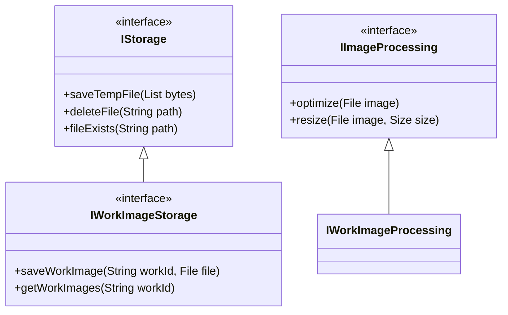

# WorkImageService 重构方案 V4 - 精确接口命名调整

## 1. 单一接口名称调整

### 1.1 接口变更说明
仅修改`IImageStorage`为`IStorage`，保持其他接口命名不变：
```diff
- abstract class IImageStorage {
+ abstract class IStorage {
    Future<String> saveTempFile(List<int> bytes);
    Future<void> deleteFile(String path);
    Future<bool> fileExists(String path);
}
```

## 2. 调整后的接口体系

### 2.1 保持不变的接口结构


## 3. 最小化实现调整

### 3.1 修改后的存储实现
```dart
// 原：class BaseImageStorage implements IImageStorage
class BaseStorage implements IStorage {
  @override
  Future<String> saveTempFile(List<int> bytes) async {
    final filename = 'temp_${DateTime.now().millisecondsSinceEpoch}.bin';
    final file = File(filename);
    await file.writeAsBytes(bytes);
    return filename;
  }

  // 保持其他方法不变...
}
```

### 3.2 依赖注入配置调整
```dart
// 修改前
final imageStorageProvider = Provider<IImageStorage>((ref) => BaseImageStorage());

// 修改后
final storageProvider = Provider<IStorage>((ref) => BaseStorage());
```

## 4. 变更影响范围

| 组件类型        | 修改前名称         | 修改后名称     | 影响范围  |
|----------------|-------------------|--------------|----------|
| 接口定义        | IImageStorage     | IStorage     | 仅接口名称 |
| 基础实现类      | BaseImageStorage  | BaseStorage  | 类名称    |
| 依赖注入标识符  | imageStorageProvider | storageProvider | 标识符名称|

## 5. 使用示例对比

### 5.1 修改前
```dart
class ImageService {
  final IImageStorage storage;

  ImageService(this.storage);
}
```

### 5.2 修改后
```dart
class ImageService {
  final IStorage storage;

  ImageService(this.storage);
}
```

## 6. 迁移步骤建议

1. **创建新接口**  
   新增`IStorage`接口并继承原`IImageStorage`
   
2. **标记废弃接口**  
   ```dart
   @Deprecated('Use IStorage instead')
   abstract class IImageStorage extends IStorage {}
   ```

3. **逐步替换引用**  
   分阶段替换代码中的`IImageStorage`为`IStorage`

4. **最终清理**  
   移除废弃的`IImageStorage`接口

## 7. 测试保障策略

```dart
// 兼容性测试用例
test('Legacy code should work with new interface', () async {
  // 旧接口实例化新实现
  final legacyStorage = BaseStorage() as IImageStorage;
  
  // 新接口使用旧实现
  final newStorage = BaseStorage() as IStorage;
  
  // 验证功能一致性
  expect(await legacyStorage.saveTempFile([]), isA<String>());
  expect(await newStorage.saveTempFile([]), isA<String>());
});
```

## 8. 文档更新说明

### 8.1 变更记录
- 2025-03-08: 重命名`IImageStorage`为`IStorage`
- 2025-03-08: 更新相关实现类名称
- 2025-03-08: 调整依赖注入配置

### 8.2 版本兼容性
| 版本 | 接口名称       | 兼容性说明                 |
|------|--------------|--------------------------|
| v1.0 | IImageStorage | 已废弃，建议升级          |
| v2.0 | IStorage      | 当前稳定版本              |