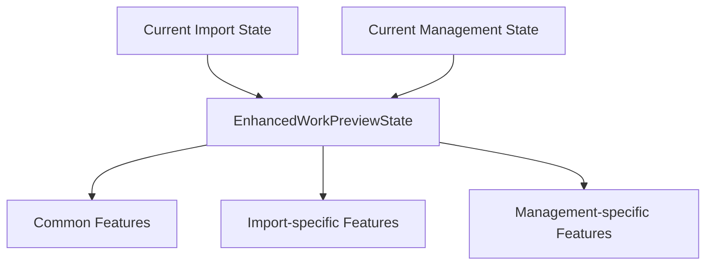
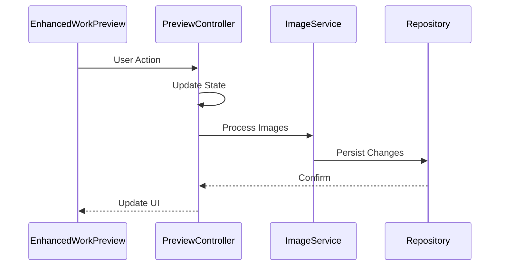

# Integration with Existing Preview Implementations

## Current Implementations Analysis

### WorkImportPreview

```dart
// Current structure
class WorkImportPreview extends StatelessWidget {
  final WorkImportState state;
  final WorkImportViewModel viewModel;
  final bool isProcessing;
  final VoidCallback? onAddImages;
}
```

### WorkImagesManagementView

```dart
// Current structure
class WorkImagesManagementView extends ConsumerStatefulWidget {
  final WorkEntity work;
}
```

## Integration Strategy

### 1. State Management Migration



#### Import State Migration

```dart
// Before
class WorkImportState {
  final List<File> images;
  final int selectedImageIndex;
  final bool isProcessing;
}

// After
class WorkImportPreviewV2 extends ConsumerWidget {
  @override
  Widget build(BuildContext context, WidgetRef ref) {
    final previewController = ref.watch(
      enhancedWorkPreviewControllerProvider(importId)
    );
    
    return EnhancedWorkPreview(
      state: previewController.state,
      mode: PreviewMode.import,
      onImageAdded: () {
        // Import-specific logic before calling controller
        previewController.addImage();
      },
      onImageDeleted: (id) {
        // Specific confirmation for import mode
        showImportDeleteConfirmation(context, () {
          previewController.deleteImage(id);
        });
      },
    );
  }
}
```

#### Management State Migration

```dart
// Current
final workImageEditorProvider = StateNotifierProvider<...>();

// New Integration
class WorkImagesManagementViewV2 extends ConsumerWidget {
  @override
  Widget build(BuildContext context, WidgetRef ref) {
    final previewController = ref.watch(
      enhancedWorkPreviewControllerProvider(work.id)
    );
    
    return EnhancedWorkPreview(
      state: previewController.state,
      mode: PreviewMode.edit,
      toolbarActions: [
        // Work management specific actions
        ToolbarAction(
          icon: Icons.settings,
          onPressed: () => showWorkSettings(context),
        ),
      ],
      onImageDeleted: (id) async {
        // Management-specific deletion logic
        await ref.read(workServiceProvider).deleteImage(id);
        previewController.deleteImage(id);
      },
    );
  }
}
```

### 2. Feature Mapping

| Feature | Import Preview | Management View | Integration Approach |
|---------|---------------|-----------------|---------------------|
| Add Images | File picker | File picker + URL | Mode-specific handlers |
| Delete | Confirm exit | Direct delete | Mode-specific confirmations |
| Reorder | Basic | Persistent | Common implementation |
| Zoom | Basic | Advanced | Use ZoomableImageView |
| Error States | Simple | Advanced retry | Common error handling |
| Processing | Loading only | Progress tracking | Enhanced state handling |

### 3. UI Component Integration

#### Shared Components

```dart
class EnhancedWorkPreview extends StatelessWidget {
  final EnhancedWorkPreviewState state;
  final PreviewMode mode;
  final List<ToolbarAction>? toolbarActions;
  
  @override
  Widget build(BuildContext context) {
    return Column(
      children: [
        _buildModeSpecificToolbar(),
        Expanded(
          child: ZoomableImageView(
            imagePath: state.currentImage.path,
            enableMouseWheel: true,
          ),
        ),
        ThumbnailStrip<WorkImage>(
          images: state.images,
          selectedIndex: state.selectedIndex,
          isEditable: _isEditableInCurrentMode(),
          // ... other props
        ),
      ],
    );
  }
  
  Widget _buildModeSpecificToolbar() {
    switch (mode) {
      case PreviewMode.import:
        return ImportModeToolbar(...);
      case PreviewMode.edit:
        return EditModeToolbar(...);
      default:
        return const SizedBox.shrink();
    }
  }
}
```

### 4. Migration Steps

1. **Preparation Phase**
   - Add EnhancedWorkPreviewState
   - Create controller
   - Set up providers

2. **Import Preview Migration**

   ```dart
   // Step 1: Add compatibility layer
   class WorkImportViewModel {
     Future<void> addImage() async {
       final controller = ref.read(
         enhancedWorkPreviewControllerProvider(importId)
       );
       await controller.addImage();
     }
   }

   // Step 2: Gradual component migration
   if (useNewImplementation) {
     return WorkImportPreviewV2(...);
   } else {
     return WorkImportPreview(...);
   }
   ```

3. **Management View Migration**

   ```dart
   // Step 1: Add state conversion
   extension on WorkImageEditorState {
     EnhancedWorkPreviewState toEnhanced() {
       return EnhancedWorkPreviewState(
         images: images,
         selectedIndex: currentIndex,
         isProcessing: isProcessing,
         // ... other props
       );
     }
   }

   // Step 2: Gradual feature migration
   ```

### 5. Data Flow



### 6. Testing Strategy

1. **Unit Tests**
   - State transitions
   - Mode-specific behaviors
   - Error handling

2. **Integration Tests**

   ```dart
   testWidgets('maintains mode-specific behavior', (tester) async {
     await tester.pumpWidget(
       EnhancedWorkPreview(
         mode: PreviewMode.import,
         // ... props
       ),
     );
     
     // Verify import-specific behavior
   });
   ```

3. **Migration Tests**
   - Compatibility checks
   - Feature parity tests
   - Performance comparisons

### 7. Rollback Strategy

1. **Feature Flags**

   ```dart
   const useEnhancedPreview = true;
   const useEnhancedManagement = true;
   ```

2. **State Preservation**
   - Keep old state providers
   - Maintain conversion layer
   - Support both implementations
