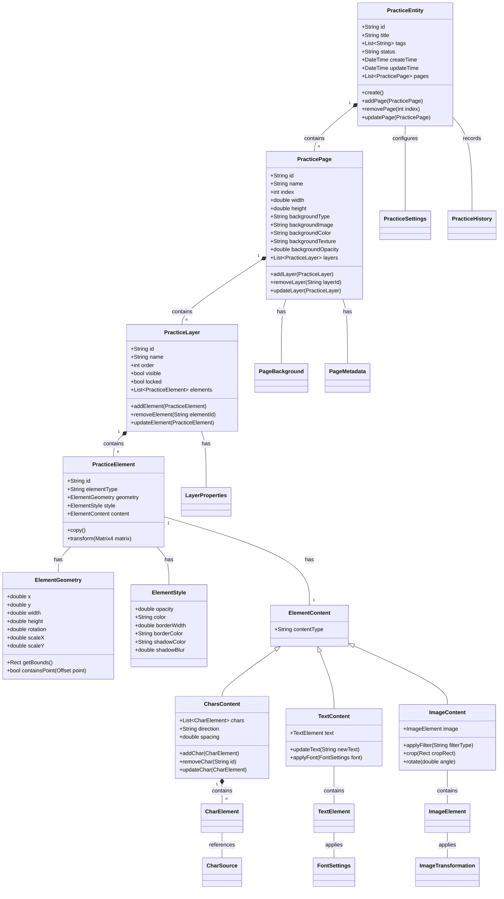
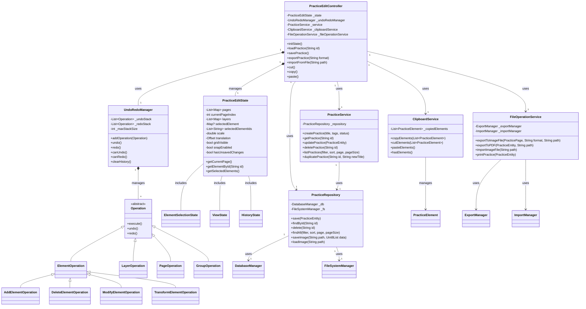
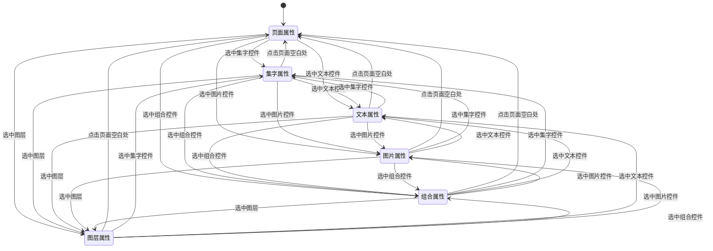
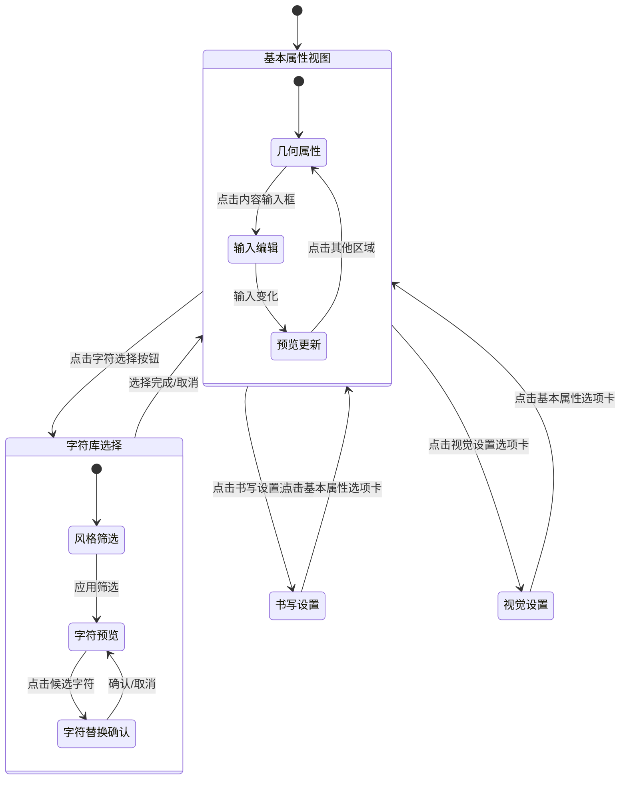
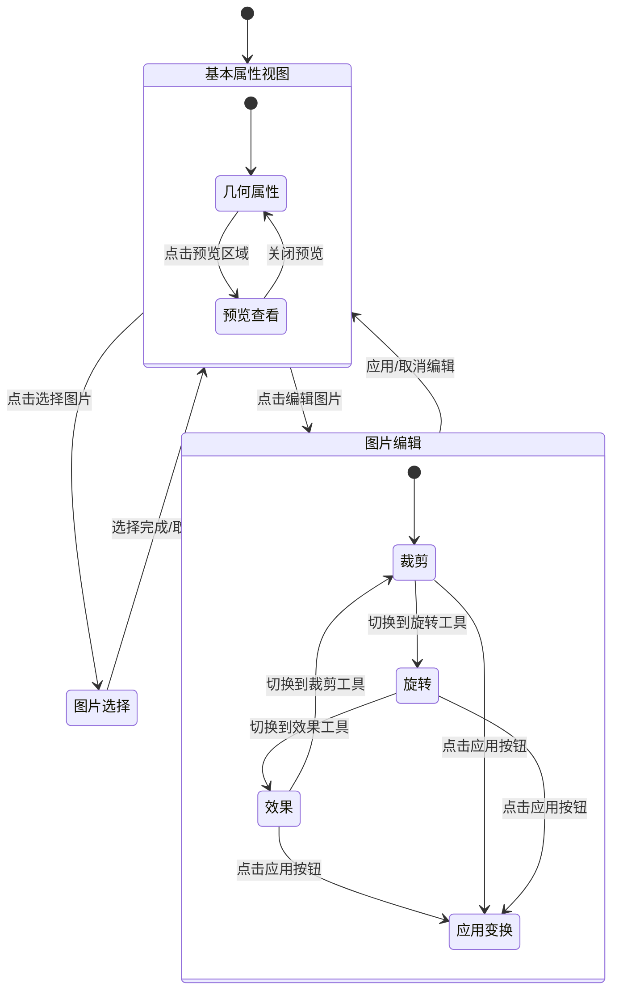
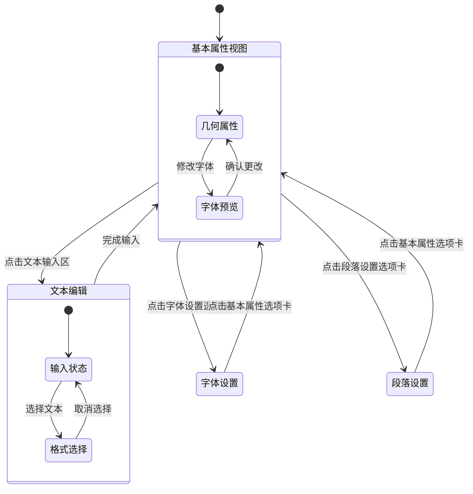
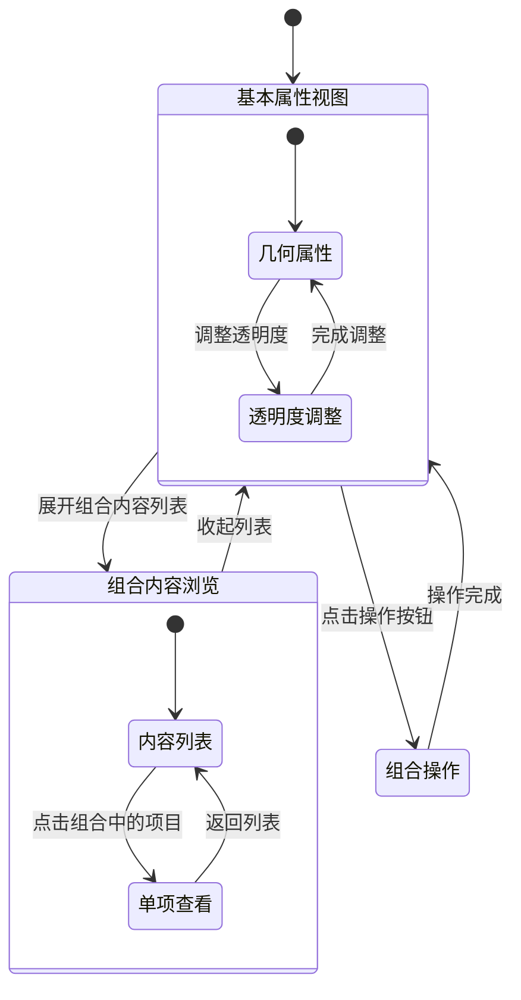

让我根据文档分析并生成一个完整的PracticeEditPage设计文档。为了获取更多上下文，我需要先了解目前项目中的实现情况。我已检索了项目中与PracticeEditPage相关的代码和文档。让我根据字帖编辑界面及交互设计文档，分析当前的实现情况并生成一个完整的设计文档。

# 字帖编辑功能设计文档

## 1. 功能概述

字帖编辑功能是本应用的核心功能之一，允许用户创建、编辑和管理字帖练习。该功能支持多页面、多图层的编辑，提供丰富的编辑工具和属性设置，使用户能够灵活地设计字帖布局和内容。

### 1.1 主要功能

- 创建、编辑和删除字帖练习
- 支持多页面管理（添加、删除、重排序）
- 多图层支持（创建、删除、显示/隐藏、锁定）
- 三种内容元素的添加与编辑：
  - 集字内容（从字库中选择汉字）
  - 文本内容（自定义文字）
  - 图片内容（添加和编辑图片）
- 元素变换（位置、大小、旋转、透明度调整）
- 组合操作（多选、组合、取消组合）
- 辅助功能（参考线、网格、智能吸附）
- 文件操作（保存、另存为、导出、打印）
- 撤销/重做操作历史

## 2. 界面设计

PracticeEditPage界面按照传统编辑软件布局分为以下几个区域：

### 2.1 顶部导航栏

- **文件组**：保存、另存为、导出、打印
- **视图组**：页面缩略图列表开关
- **操作组**：撤销、重做

### 2.2 左侧面板

- **内容控件区**：
  - 集字内容工具
  - 文本内容工具
  - 图片内容工具
- **图层管理区**：
  - 图层操作工具栏（新增、删除全部、显示全部）
  - 图层列表（选择、重排、显示/隐藏、锁定、删除、重命名）

### 2.3 中央编辑区

- **顶部工具栏**：
  - 编辑操作组（页面平移、复制/粘贴、删除、组合/取消组合）
  - 辅助功能组（参考线/网格设置、智能吸附开关）
  - **预览组**：
    - 预览按钮：切换到预览模式，隐藏所有辅助标示（边框、控制点、图层指示等）
- **中间页面编辑区**：
  - 页面平移缩放控制
  - 内容控件交互（拖放、选择、编辑、组合、删除）
- **底部页面栏**：
  - 页面缩略图
  - 页面排序
  - 页面操作（添加、删除、选择）

### 2.4 右侧属性面板

- **集字属性区**（选中集字内容时）：
  - 位置、大小、旋转角度等几何属性
  - 书写方向、对齐方式、间距、边距
  - 透明度、颜色、大小、默认集字图片类型
  - 所属图层
  - 集字内容（汉字输入、预览和候选列表）

  **界面详细设计**：

  ```
  ┌──────────────── 集字内容属性 ────────────────┐
  │ ┌─────── 几何属性 ──────┐                    │
  │ │ X: [120   ] Y: [80    ]                    │
  │ │ W: [400   ] H: [200   ]                    │
  │ │ 旋转: [0    ]°                             │
  │ └─────────────────────┘                      │
  │                                              │
  │ ┌─────── 书写设置 ──────┐                    │
  │ │ 书写方向: [左往右 ▼]  行间方向: [上往下 ▼] │
  │ │ 对齐方式: [左对齐 ▼]                       │
  │ │ 行间距: [10   ] 字间距: [5     ]           │
  │ │ 上边距: [10   ] 下边距: [10    ]           │
  │ │ 左边距: [10   ] 右边距: [10    ]           │
  │ └─────────────────────┘                      │
  │                                              │
  │ ┌─────── 视觉设置 ──────┐                    │
  │ │ 透明度: [████████  ] 80%                   │
  │ │ 字体颜色: [■] #000000                      │
  │ │ 背景颜色: [■] #FFFFFF                      │
  │ │ 字体大小: [36   ]                          │
  │ │ 默认字形: [楷书   ▼]                       │
  │ └─────────────────────┘                      │
  │                                              │
  │ ┌─────── 内容设置 ──────┐                    │
  │ │ 汉字内容:                                  │
  │ │ ┌─────────────────┐                        │
  │ │ │永字八法        │                        │
  │ │ │                │                        │
  │ │ └─────────────────┘                        │
  │ │                                            │
  │ │ 集字预览:                                  │
  │ │ ┌────┐ ┌────┐ ┌────┐ ┌────┐ ┌────┐ ┌────┐  │
  │ │ │ 永 │ │ 字 │ │ 八 │ │ 法 │ │    │ │    │  │
  │ │ └────┘ └────┘ └────┘ └────┘ └────┘ └────┘  │
  │ │                                            │
  │ │ 候选集字:                                  │
  │ │ ┌─── 筛选 ───┐                            │
  │ │ │[楷书▼][全部▼][搜索...    ]              │
  │ │ └────────────┘                            │
  │ │ ┌────┐ ┌────┐ ┌────┐ ┌────┐ ┌────┐ ┌────┐  │
  │ │ │永₁ │ │永₂ │ │永₃ │ │永₄ │ │永₅ │ │永₆ │  │
  │ │ └────┘ └────┘ └────┘ └────┘ └────┘ └────┘  │
  │ │                                            │
  │ └────────────────────┘                       │
  └──────────────────────────────────────────────┘
  ```

- **文本内容属性区**（选中文本内容时）：
  - 位置、大小、旋转角度等几何属性
  - 对齐方式、间距、边距
  - 透明度、字体、字号、颜色
  - 所属图层
  - 内容输入区

- **图片内容属性区**（选中图片内容时）：
  - 位置、大小、旋转角度等几何属性
  - 透明度、所属图层
  - 图片选择、变换（裁剪、旋转、反转、透明度）
  - 图片预览

  **界面详细设计**：

  ```
  ┌──────────────── 图片内容属性 ────────────────┐
  │ ┌─────── 几何属性 ──────┐                    │
  │ │ X: [120   ] Y: [80    ]                    │
  │ │ W: [400   ] H: [200   ]                    │
  │ │ 旋转: [0    ]°                             │
  │ └─────────────────────┘                      │
  │                                              │
  │ ┌─────── 视觉设置 ──────┐                    │
  │ │ 透明度: [████████  ] 80%                   │
  │ │ 所属图层: [图层1    ▼]                     │
  │ └─────────────────────┘                      │
  │                                              │
  │ ┌─────── 图片选择 ──────┐                    │
  │ │ [选择图片] [从作品选择] [从集字中选择]     │
  │ └─────────────────────┘                      │
  │                                              │
  │ ┌─────── 图片预览 ──────┐                    │
  │ │ ┌────────────────────┐                     │
  │ │ │                    │                     │
  │ │ │       图片         │                     │
  │ │ │       预览         │                     │
  │ │ │                    │                     │
  │ │ └────────────────────┘                     │
  │ └─────────────────────┘                      │
  │                                              │
  │ ┌─────── 图片变换 ──────┐                    │
  │ │ 裁剪:                                      │
  │ │ 上: [0  ] 下: [0  ] 左: [0  ] 右: [0  ]    │
  │ │                                            │
  │ │ 旋转: [0    ]° [+90°] [-90°] [180°]        │
  │ │                                            │
  │ │ 反转: [水平翻转] [垂直翻转]                │
  │ │                                            │
  │ │ 效果:                                      │
  │ │ [原图] [灰度] [黑白] [反相] [锐化]         │
  │ └─────────────────────┘                      │
  │                                              │
  │ [应用变换] [重置变换]                        │
  └──────────────────────────────────────────────┘
  ```

- **组合属性区**（选中组合控件时）：
  - 位置、大小、旋转角度、透明度、所属图层

- **图层属性区**（选中图层时）：
  - 背景图设置、透明度、缩略图

- **页面属性区**（选中页面或空白区时）：
  - 尺寸大小（预设、自定义）
  - 页边距调整
  - 背景设置（纹理、颜色、透明度）

### 2.5 属性区切换的触发机制

属性区的切换基于用户在编辑区中的选择操作，遵循以下规则：

1. **默认状态**：
   - 新建字帖或未选中任何内容时，显示页面属性区

2. **内容选择触发**：
   - 点击选中集字内容时，切换到集字属性区
   - 点击选中文本内容时，切换到文本属性区
   - 点击选中图片内容时，切换到图片属性区
   - 点击选中组合控件时，切换到组合属性区

3. **图层选择触发**：
   - 在左侧图层面板中选中图层时，切换到图层属性区

4. **多选状态处理**：
   - 多选不同类型内容控件时，显示组合属性区
   - 多选同类型内容控件时，显示该类型的属性区，但只编辑共有属性

5. **空白区域点击**：
   - 点击页面空白区域时，切换到页面属性区
   - 取消所有内容控件的选中状态

6. **触发状态优先级**：
   - 内容选择 > 图层选择 > 页面属性
   - 最后操作的对象具有最高属性区显示优先级

7. **属性区持久性**：
   - 在同一编辑会话中，切换回已编辑过的内容时，保持上次的属性设置状态

## 3. 交互流程

### 3.1 字帖创建流程

1. 用户点击"新建练习"按钮
2. 系统创建一个空白字帖，包含默认页面和图层
3. 用户可以设置页面属性（大小、背景等）
4. 用户通过添加内容元素开始编辑

### 3.2 内容控件交互流程

1. **添加内容控件**：
   - 用户从左侧面板选择内容类型工具
   - 在页面上拖拽确定位置和大小
   - 系统创建内容控件并默认为编辑状态

2. **选择内容控件**：
   - 单击选择单个控件（切换为编辑状态）
   - Ctrl+点击或框选多个控件（多选状态）

3. **编辑内容控件**：
   - 拖拽控制点调整大小和位置
   - 在右侧属性面板修改属性
   - 修改内容（文本、集字、图片）

4. **调整zIndex层次**：
   - 选中控件后使用工具栏中的"上移一层"/"下移一层"按钮调整zIndex
   - 使用"置于顶层"/"置于底层"按钮快速将控件移至同图层最前/最后
   - 通过属性面板中的zIndex数值微调来精确定位
   - 控件视觉上会按zIndex值从小到大的顺序叠放显示

5. **组合控件**：
   - 多选控件后点击工具栏"组合"按钮
   - 组合控件可作为整体操作
   - 组合控件可以嵌套组合

6. **删除控件**：
   - 选中控件后按Delete键或点击工具栏删除按钮

### 3.3 页面管理流程

1. **添加页面**：
   - 点击底部页面栏的"添加页面"按钮
   - 系统创建新页面并自动切换到该页面

2. **删除页面**：
   - 在底部页面栏选中页面
   - 点击"删除"按钮，确认后删除

3. **页面顺序调整**：
   - 在底部页面栏拖拽页面缩略图调整顺序

### 3.4 图层管理流程

1. **添加图层**：
   - 点击图层面板的"新增图层"按钮
   - 系统创建新图层并默认选中

2. **删除图层**：
   - 选中图层后点击"删除"按钮
   - 确认后删除图层及其上的所有元素

3. **图层操作**：
   - 显示/隐藏：点击图层的可见性图标
   - 锁定/解锁：点击图层的锁定图标
   - 调整顺序：拖拽图层改变其上下位置

### 3.5 保存和导出流程

1. **保存字帖**：
   - 点击"保存"按钮
   - 如果是新建字帖，弹出命名对话框
   - 系统保存字帖到数据库

2. **导出字帖**：
   - 点击"导出"按钮
   - 选择导出格式和位置
   - 系统导出字帖为指定格式

## 4. 对象关系

### 4.1 核心对象模型

1. **PracticeEntity**：字帖实体对象
   - ID、标题、标签、状态、创建/更新时间
   - 包含多个PracticePage对象

2. **PracticePage**：字帖页面对象
   - ID、名称、索引、宽高
   - 背景属性（类型、图片、颜色、纹理、透明度）
   - 包含多个PracticeLayer对象

3. **PracticeLayer**：字帖图层对象
   - ID、名称、顺序、可见性、锁定状态
   - 包含多个PracticeElement对象

4. **PracticeElement**：字帖元素对象
   - 核心特性：
     - 使用Freezed库实现的密封类(sealed class)，支持多态
     - 提供四种具体实现：CollectionElement、TextElement、ImageElement、GroupElement
     - 所有元素类型共享基础属性：ID、位置(x,y)、尺寸(width,height)、旋转角度、所属图层ID、锁定状态、透明度
     - **zIndex**：元素在图层内的叠放顺序，值越大显示越靠前
   - 各类型特有属性：
     - **CollectionElement**：用于显示集字内容
       - 汉字内容(characters)、排列方向(direction)、流向(flowDirection)
       - 字符间距、行间距、内边距、对齐方式
       - 字体颜色、背景颜色、字符大小、默认字形
     - **TextElement**：用于显示文本内容
       - 文本内容(text)、字体(fontFamily)、字号(fontSize)
       - 文本颜色、背景颜色、对齐方式、行高、字间距
       - 文本样式（粗体、斜体、下划线）
     - **ImageElement**：用于显示图片内容
       - 图片URL、图片ID、原始尺寸(width,height)
       - 裁剪区域、翻转(水平/垂直)、适应方式(fit)
       - MIME类型、自定义属性
     - **GroupElement**：用于组合多个元素
       - 子元素列表(children)，可包含任意类型的PracticeElement
       - 作为整体进行移动、缩放和旋转

5. **ElementGeometry**：元素几何属性 (已废弃，被整合到PracticeElement中)
   - 位置（x, y）、大小（宽, 高）、旋转角度

6. **ElementStyle**：元素样式属性 (已废弃，被整合到PracticeElement中)
   - 透明度、可见性、锁定状态
   - 自定义样式属性

7. **ElementContent**：元素内容 (已废弃，被整合到PracticeElement中)
   - CharsContent、TextContent、ImageContent

### 4.2 对象复用与重构说明

项目实现过程中对对象模型进行了重构，主要变化如下：

1. **已废弃的对象**：
   - ElementGeometry、ElementStyle、ElementContent等辅助类已被废弃
   - 这些属性已直接整合到PracticeElement及其子类中
   - 旧的JSON序列化/反序列化逻辑仍然保留以兼容历史数据

2. **对象复用策略**：
   - **复用现有对象**：
     - PracticeEntity、PracticePage、PracticeLayer等核心领域对象保持不变
     - 保留这些对象的基本结构和接口，确保兼容性
   - **新建对象**：
     - 重构后的PracticeElement类及其子类（TextElement、ImageElement等）
     - 专用的状态管理类（PracticeEditState、UndoRedoManager等）
     - 新增的控制器类（ElementOperations、LayerOperations等）
   - **适配层**：
     - 在PracticeEditState中提供了在旧实现和新实现之间转换的适配方法
     - 例如practiceElementToMap()和mapToPracticeElement()等方法

3. **状态管理优化**：
   - 使用不可变(immutable)数据模型支持撤销/重做功能
   - 每个元素提供copyWith方法进行属性更新，确保状态追踪
   - 操作被封装为Operation对象，支持撤销和重做

### 4.3 全面对象关系图

#### 4.3.1 领域对象关系图




#### 4.3.2 UI组件对象关系图


#### 4.3.3 控制器和服务对象关系图




#### 4.4 状态管理

#### 4.4.1 内容控件状态转换图


### 内容控件状态详细规范

各状态下控件的视觉呈现有明确的规范，确保用户界面的一致性和交互清晰度：

#### 状态与视觉样式对照表

| 状态 | 边框颜色 | 边框样式 | 边框宽度 | 控制点 | 交互行为 |
|------|---------|---------|---------|--------|---------|
| 普通状态 | 灰色<br>(#9E9E9E) | 实线 | 1px | 无 | 可点击选中 |
| 编辑状态 | 蓝色<br>(#2196F3) | 实线 | 2px | 8个调整控制点<br>1个旋转控制点 | 可拖拽、调整大小、旋转 |
| 选中状态 | 蓝色<br>(#2196F3) | 实线 | 2px | 无 | 作为多选的一部分 |
| 拖放预览 | 蓝色<br>(#2196F3) | 虚线 | 1px | 无 | 跟随鼠标移动 |

#### 组合控件与子控件状态关系

当多个被选中的内容控件（包含控件A）点击组合按钮后，组合成控件B：

1. **状态传递规则**：
   - 当B处于编辑状态或选中状态时，A自动切换为选中状态
   - 当B处于普通状态时，A也切换为普通状态

2. **视觉呈现**：
   - 组合控件B显示标准的编辑状态边框和控制点
   - 子控件A同时显示选中状态的边框（当B处于编辑或选中状态）
   - 当B取消选中时，所有子控件边框一同隐藏

3. **交互行为**：
   - B作为整体可以移动、缩放和旋转
   - 子控件A不能单独操作，除非取消组合

#### 特殊状态处理

1. **锁定控件**：
   - 显示锁定图标 (位于控件右上角)
   - 边框颜色为橙色 (#FF9800)
   - 不响应拖拽、调整大小、旋转操作

2. **隐藏控件**：
   - 编辑模式下显示半透明轮廓 (50% 透明度)
   - 预览模式下完全隐藏

3. **错误状态**：
   - 加载失败或渲染错误时边框为红色 (#F44336)
   - 控件内显示错误提示图标

#### 4.4.2 属性面板状态转换图

属性面板的状态转换是复杂的，为了增强清晰度，我们将按不同类型的属性面板分别说明：

##### 4.4.2.1 整体属性面板状态转换




##### 4.4.2.2 集字属性面板状态转换




##### 4.4.2.3 图片属性面板状态转换




##### 4.4.2.4 文本属性面板状态转换




##### 4.4.2.5 组合属性面板状态转换




### 4.5 控制器和状态

1. **PracticeEditController**：编辑控制器
   - 管理编辑状态
   - 处理用户交互
   - 管理撤销/重做操作

2. **PracticeEditState**：编辑状态
   - 当前页面、当前图层、当前选中的元素
   - 撤销/重做栈
   - 网格和辅助功能状态

3. **操作管理器**：
   - UndoRedoManager：管理撤销/重做操作
   - ElementOperations：管理元素操作
   - LayerOperations：管理图层操作
   - PageOperations：管理页面操作

## 5. 存储和数据访问

### 5.1 数据持久化

- **本地数据库**：使用SQLite存储字帖数据
- **文件存储**：图片内容存储为文件，数据库存储引用路径

### 5.2 存储结构

- **PracticeRepository**：字帖仓库，处理字帖的CRUD操作
- **PracticeService**：字帖服务，提供业务逻辑处理

### 5.3 数据同步

- **自动保存**：定时自动保存到临时存储
- **退出检查**：退出前检查未保存内容

## 6. 渲染设计

### 6.1 中央编辑区渲染架构

中央编辑区的渲染是字帖编辑功能中最复杂的部分，采用多层次渲染架构以确保高效渲染和交互流畅性。

#### 6.1.1 渲染层次结构

1. **底层背景渲染**
   - 负责渲染页面背景（颜色、纹理、网格）
   - 使用`BackgroundPainter`实现，优先级最低

2. **中层内容渲染**
   - 按照图层顺序从下至上渲染各图层内容
   - 每个图层内部再按Z顺序渲染元素
   - 使用`LayerContentPainter`系列实现

3. **顶层交互控制渲染**
   - 渲染选择框、变换控制点、拖拽指示等辅助UI
   - 使用`InteractionOverlayPainter`实现，优先级最高

4. **缩略图渲染**
   - 使用缓存和降采样技术快速渲染页面缩略图
   - 用于底部页面栏的页面预览

#### 6.1.2 渲染优化策略

1. **分层缓存机制**

   ```dart
   class CachedLayerPainter extends CustomPainter {
     ui.Picture? _cachedPicture;
     Size? _cachedSize;
     bool _needsRepaint = true;
     
     @override
     void paint(Canvas canvas, Size size) {
       if (_needsRepaint || _cachedSize != size || _cachedPicture == null) {
         // 重新渲染并缓存
         final recorder = ui.PictureRecorder();
         final cacheCanvas = Canvas(recorder);
         
         // 实际绘制逻辑
         _renderContents(cacheCanvas, size);
         
         _cachedPicture = recorder.endRecording();
         _cachedSize = size;
         _needsRepaint = false;
       }
       
       // 使用缓存的图像进行渲染
       if (_cachedPicture != null) {
         canvas.drawPicture(_cachedPicture!);
       }
     }
     
     // 子类实现具体渲染逻辑
     void _renderContents(Canvas canvas, Size size);
   }
   ```

2. **选择性渲染**
   - 仅渲染可见图层
   - 仅渲染视口内的元素
   - 根据缩放级别调整渲染细节

3. **异步渲染**
   - 复杂元素（如高分辨率图片）采用异步加载
   - 先显示占位符，后加载细节
   - 使用`compute`分离耗时操作

4. **渲染质量调整**

   ```dart
   void _adjustRenderingQuality(Canvas canvas, double scale) {
     if (scale < 0.5) {
       // 低细节模式
       canvas.save();
       canvas.scale(1.0, 1.0);  // 比例不变但使用更简单的渲染方式
       canvas.drawImage(...);  // 低分辨率图像
       canvas.restore();
     } else {
       // 高细节模式
       canvas.save();
       canvas.scale(scale, scale);
       canvas.drawImage(...);  // 原始分辨率图像
       canvas.restore();
     }
   }
   ```

#### 6.1.3 元素渲染实现

1. **集字内容渲染**

   ```dart
   void _renderCharsContent(Canvas canvas, CharsContent content, ElementGeometry geometry) {
     final double scale = geometry.scaleX;
     final double rotation = geometry.rotation * (pi / 180);
     
     // 应用几何变换
     canvas.save();
     canvas.translate(geometry.x, geometry.y);
     canvas.rotate(rotation);
     canvas.scale(scale, scale);
     
     // 渲染每个字符
     for (int i = 0; i < content.chars.length; i++) {
       final charElement = content.chars[i];
       final position = _calculateCharPosition(i, content.direction, content.spacing);
       
       // 渲染字符图像或占位符
       if (charElement.imageData != null) {
         final image = _getCharImage(charElement);
         if (image != null) {
           canvas.drawImage(image, position, Paint());
         } else {
           _drawPlaceholder(canvas, position, charElement.char);
         }
       } else {
         _drawPlaceholder(canvas, position, charElement.char);
       }
     }
     
     canvas.restore();
   }
   ```

2. **文本内容渲染**

   ```dart
   void _renderTextContent(Canvas canvas, TextContent content, ElementGeometry geometry) {
     // 类似实现，处理文本排版和渲染
   }
   ```

3. **图片内容渲染**

   ```dart
   void _renderImageContent(Canvas canvas, ImageContent content, ElementGeometry geometry) {
     // 类似实现，处理图像加载和渲染
   }
   ```

#### 6.1.4 交互控制渲染

1. **选择框渲染**

   ```dart
   void _renderSelectionBox(Canvas canvas, Rect bounds, bool isEditing) {
     final paint = Paint()
       ..color = isEditing ? Colors.blue : Colors.grey
       ..style = PaintingStyle.stroke
       ..strokeWidth = 2.0;
     
     canvas.drawRect(bounds, paint);
     
     if (isEditing) {
       // 绘制变换控制点
       _renderControlPoints(canvas, bounds);
     }
   }
   ```

2. **群组选择渲染**

   ```dart
   void _renderGroupSelection(Canvas canvas, List<Rect> elementBounds) {
     // 计算包围所有元素的矩形
     final Rect groupBounds = _calculateGroupBounds(elementBounds);
     
     // 绘制群组选择框和控制点
     _renderSelectionBox(canvas, groupBounds, true);
     
     // 为每个元素绘制标识框（虚线）
     final dashedPaint = Paint()
       ..color = Colors.grey
       ..style = PaintingStyle.stroke
       ..strokeWidth = 1.0;
     
     for (final bounds in elementBounds) {
       _drawDashedRect(canvas, bounds, dashedPaint);
     }
   }
   ```

3. **拖拽指示渲染**

   ```dart
   void _renderDragIndicator(Canvas canvas, Offset position, Size size) {
     // 绘制拖拽过程中的半透明指示器
     final paint = Paint()
       ..color = Colors.blue.withOpacity(0.3)
       ..style = PaintingStyle.fill;
     
     canvas.drawRect(
       Rect.fromLTWH(position.dx, position.dy, size.width, size.height),
       paint
     );
   }
   ```

### 6.2 渲染与交互协同

1. **命中测试**

   ```dart
   PracticeElement? _hitTestElement(Offset position) {
     // 从上到下（Z序）遍历元素进行命中测试
     for (int i = _elements.length - 1; i >= 0; i--) {
       final element = _elements[i];
       if (_isPointInElement(position, element)) {
         return element;
       }
     }
     return null;
   }
   ```

2. **变换矩阵管理**

   ```dart
   Matrix4 _calculateTransformMatrix(ElementGeometry geometry) {
     return Matrix4.identity()
       ..translate(geometry.x, geometry.y)
       ..rotateZ(geometry.rotation * (pi / 180))
       ..scale(geometry.scaleX, geometry.scaleY);
   }
   ```

3. **拖拽变换处理**

   ```dart
   void _handleControlPointDrag(int pointIndex, Offset delta) {
     final element = _selectedElement;
     if (element == null) return;
     
     // 根据控制点索引计算新的几何属性
     final newGeometry = _calculateNewGeometry(element.geometry, pointIndex, delta);
     
     // 更新元素几何属性
     _updateElementGeometry(element.id, newGeometry);
     
     // 标记需要重绘
     _needsRepaint = true;
   }
   ```

### 6.3 分辨率自适应

1. **像素比处理**

   ```dart
   void _setupCanvas(Canvas canvas, Size size) {
     final devicePixelRatio = window.devicePixelRatio;
     
     // 考虑设备像素比进行缩放
     if (devicePixelRatio != 1.0) {
       canvas.scale(1 / devicePixelRatio, 1 / devicePixelRatio);
     }
   }
   ```

2. **图像质量处理**

   ```dart
   ui.Image _prepareImageForRendering(ui.Image original, double viewScale) {
     // 根据视图缩放，决定使用哪个分辨率的图像
     if (viewScale < 0.5) {
       return _downsampleImage(original, 0.5);
     } else {
       return original;
     }
   }
   ```

### 6.4 预览模式实现

预览模式是一个特殊的显示状态，在该状态下所有辅助显示元素（如边框、控制点、图层指示等）都将被隐藏，以便用户能够准确预览最终效果。

#### 6.4.1 预览模式切换

```dart
class PreviewManager {
  bool _isPreviewMode = false;
  VoidCallback? _onPreviewModeChanged;
  
  bool get isPreviewMode => _isPreviewMode;
  
  void togglePreviewMode() {
    _isPreviewMode = !_isPreviewMode;
    if (_onPreviewModeChanged != null) {
      _onPreviewModeChanged!();
    }
  }
  
  void setPreviewModeListener(VoidCallback listener) {
    _onPreviewModeChanged = listener;
  }
}
```

#### 6.4.2 预览模式下的渲染差异

在预览模式下，渲染逻辑需要跳过所有辅助UI元素的渲染，专注于内容本身：

```dart
@override
void paint(Canvas canvas, Size size) {
  // 渲染页面背景
  _renderBackground(canvas, size);
  
  // 按Z序渲染图层内容
  _renderLayersContent(canvas, size);
  
  // 仅在非预览模式下渲染辅助UI
  if (!_previewManager.isPreviewMode) {
    // 渲染选择框和控制点
    _renderSelectionUI(canvas, size);
    
    // 渲染图层边界指示
    _renderLayerBoundaries(canvas, size);
    
    // 渲染参考线和网格
    _renderGuidesAndGrid(canvas, size);
  }
}
```

#### 6.4.3 预览模式下的交互处理

在预览模式下，同样需要禁用部分交互功能：

```dart
@override
void onTapDown(TapDownDetails details) {
  if (_previewManager.isPreviewMode) {
    // 在预览模式下，点击任意位置退出预览模式
    _previewManager.togglePreviewMode();
    return;
  }
  
  // 正常的点击处理逻辑
  final hitElement = _hitTestElement(details.localPosition);
  if (hitElement != null) {
    _selectElement(hitElement);
  } else {
    _clearSelection();
  }
}
```

#### 6.4.4 预览模式UI指示

为了让用户清楚当前是否处于预览模式，UI需要提供明确的视觉指示：

```dart
Widget _buildToolbar() {
  return Row(
    children: [
      // 其他工具按钮
      // ...
      
      // 预览模式按钮
      IconButton(
        icon: Icon(_previewManager.isPreviewMode 
          ? Icons.visibility_off
          : Icons.visibility),
        onPressed: () => _previewManager.togglePreviewMode(),
        tooltip: _previewManager.isPreviewMode 
          ? '退出预览模式' 
          : '进入预览模式',
        color: _previewManager.isPreviewMode 
          ? Colors.blue 
          : null,
      ),
    ],
  );
}
```

#### 6.4.5 预览模式的性能优化

预览模式下，由于不需要渲染辅助UI元素，可以进行额外的性能优化：

```dart
void _optimizeForPreviewMode() {
  if (_previewManager.isPreviewMode) {
    // 启用更高级别的缓存
    _enableContentCaching = true;
    
    // 禁用不必要的重绘
    _disableUnnecessaryRepaints();
    
    // 优化渲染质量
    _setOptimalRenderingQuality();
  } else {
    // 恢复正常编辑模式设置
    _resetEditModeSettings();
  }
}
```

预览模式提供了一个接近最终输出效果的视图，帮助用户更好地评估设计效果，同时为实际输出和打印提供参考。

## 7. 测试策略

### 7.1 单元测试

- 测试核心业务逻辑（编辑操作、撤销/重做等）
- 测试数据模型和转换功能

### 7.2 集成测试

- 测试UI交互和数据流
- 测试多页面和图层交互

### 7.3 用户测试

- 测试常见用户场景
- 性能和内存使用测试

## 8. 实施计划

### 8.1 阶段一：基础框架和数据模型

- 实现核心数据模型
- 创建基础界面框架
- 建立数据访问层

### 8.2 阶段二：界面和交互实现

- 实现编辑区交互
- 完成属性面板功能
- 开发图层管理系统

### 8.3 阶段三：高级功能和优化

- 实现撤销/重做系统
- 添加辅助功能（网格、吸附）
- 性能优化和错误处理

## 9. 结论

字帖编辑功能是一个复杂而强大的系统，支持用户创建专业的字帖练习。通过多页面、多图层和丰富的内容元素，用户可以灵活设计各种字帖布局。该功能的实现需要考虑性能、易用性和可扩展性，以满足不同用户的需求。

---

这份设计文档基于现有的字帖编辑界面及交互设计文档，结合了项目中已有的PracticeEditPage实现情况进行分析和整理。文档包含了功能说明、界面设计、交互流程、对象关系以及存储和数据访问等核心内容，为开发团队提供了全面的设计参考。
