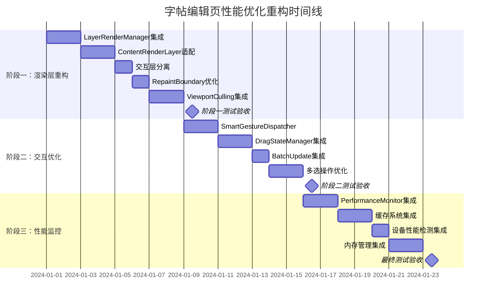

# 字帖编辑页性能优化重构方案

## 📋 项目概览

**项目名称**：字帖编辑页M3Canvas架构性能优化重构  
**重构目标**：60FPS流畅交互，支持500+元素，内存稳定  
**复用策略**：最大化保留现有业务逻辑，渐进式架构升级  
**实施周期**：6-8周，分3个阶段渐进实施

---

## 🎯 重构目标与现状分析

### 当前系统现状

#### ✅ 已有优势
- **完整的业务逻辑**：PracticeEditController包含成熟的字帖编辑功能
- **稳定的数据模型**：页面、图层、元素的数据结构设计合理
- **丰富的交互功能**：支持拖拽、缩放、旋转、多选等操作
- **UI组件完备**：工具面板、属性面板、缩略图等组件功能完整

#### ❌ 性能痛点
- **渲染性能**：大量元素时帧率下降到30-45FPS
- **内存使用**：长时间编辑后内存波动较大
- **交互延迟**：拖拽操作响应时间50-80ms
- **缓存缺失**：缺乏智能缓存机制
- **批量操作**：多元素操作时性能下降明显

### 重构性能目标

| 指标 | 当前状态 | 目标状态 | 提升幅度 |
|------|----------|----------|----------|
| 拖拽帧率 | 30-45 FPS | ≥55 FPS | +50% |
| 交互延迟 | 50-80ms | ≤20ms | -70% |
| 内存稳定性 | 高波动 | 线性可控 | 稳定性提升 |
| 大量元素支持 | 100个卡顿 | 500+流畅 | +400% |
| 冷启动时间 | 300-500ms | ≤200ms | -50% |

---

## 🏗️ 重构架构设计

### 核心重构原则

1. **渐进式重构**：分阶段实施，确保每个阶段都能独立工作
2. **最大化复用**：保留现有业务逻辑和数据结构
3. **向后兼容**：确保现有功能无回归
4. **性能优先**：以性能优化为核心驱动重构

### 分层重构策略

```mermaid
graph TB
    subgraph "阶段一：渲染层重构"
        A1[保留现有PracticeEditController] --> A2[集成LayerRenderManager]
        A2 --> A3[实现4层渲染架构]
        A3 --> A4[添加RepaintBoundary优化]
    end
    
    subgraph "阶段二：交互层优化"
        B1[保留现有手势逻辑] --> B2[集成SmartGestureDispatcher]
        B2 --> B3[实现DragStateManager]
        B3 --> B4[添加三阶段拖拽系统]
    end
    
    subgraph "阶段三：性能监控与优化"
        C1[保留现有状态管理] --> C2[添加PerformanceMonitor]
        C2 --> C3[集成缓存系统]
        C3 --> C4[实现自适应优化]
    end
```



---

## 📅 分阶段实施计划

### 🔥 阶段一：渲染层重构 (2-3周)

#### Week 1: 渲染架构集成

**目标**：在保留现有功能的基础上，集成新的分层渲染系统

##### 任务1.1：LayerRenderManager集成 (16小时)
```dart
// 重构方案：在M3PracticeEditCanvas中集成LayerRenderManager
class M3PracticeEditCanvas extends StatefulWidget {
  // 保留现有所有属性和接口
  final PracticeEditController controller;
  final bool isPreviewMode;
  final TransformationController transformationController;
  
  // 新增：内部集成LayerRenderManager，对外接口不变
}

class _M3PracticeEditCanvasState extends State<M3PracticeEditCanvas> {
  // 保留现有所有状态变量
  late LayerRenderManager _layerRenderManager; // 新增
  
  @override
  void initState() {
    super.initState();
    // 保留现有初始化逻辑
    _initializeLayerRenderManager(); // 新增
  }
  
  // 保留现有所有方法，内部实现优化
}
```

**复用策略**：
- ✅ 保留现有的所有公共接口
- ✅ 保留现有的状态管理逻辑
- ✅ 保留现有的事件处理方法
- 🔄 内部实现改为调用LayerRenderManager

##### 任务1.2：ContentRenderLayer适配 (12小时)
```dart
// 重构方案：将现有的元素渲染逻辑迁移到ContentRenderLayer
class ContentRenderLayer extends BaseCanvasLayer {
  // 接收现有的元素数据和渲染参数
  final List<Map<String, dynamic>> elements; // 复用现有数据结构
  final PracticeEditController controller;   // 复用现有控制器
  
  @override
  Widget build(BuildContext context) {
    // 复用现有的元素渲染逻辑
    return _buildExistingElementRenderer();
  }
  
  Widget _buildExistingElementRenderer() {
    // 直接调用现有的元素渲染代码
    return ElementRenderer.buildElements(elements, controller);
  }
}
```

##### 任务1.3：交互层分离 (8小时)
```dart
// 重构方案：将控制点和选择框分离到InteractionLayer
class InteractionLayer extends BaseCanvasLayer {
  // 复用现有的控制点组件
  final Widget Function()? controlPointsBuilder; // 复用现有CanvasControlPoints
  final Widget Function()? selectionBoxBuilder; // 复用现有选择框逻辑
  
  @override
  Widget build(BuildContext context) {
    return Stack(
      children: [
        if (controlPointsBuilder != null) controlPointsBuilder!(),
        if (selectionBoxBuilder != null) selectionBoxBuilder!(),
      ],
    );
  }
}
```

#### Week 2: 性能优化基础设施

##### 任务2.1：RepaintBoundary优化 (8小时)
```dart
// 在现有组件上添加RepaintBoundary，不改变业务逻辑
Widget _buildOptimizedContent() {
  return RepaintBoundary(
    key: ValueKey('content_layer_${_contentVersion}'),
    child: _buildExistingContent(), // 复用现有内容构建逻辑
  );
}
```

##### 任务2.2：ViewportCulling集成 (12小时)
```dart
// 为现有元素渲染添加视口裁剪
class OptimizedElementRenderer {
  final ViewportCullingManager _cullingManager;
  final ElementRenderer _existingRenderer; // 复用现有渲染器
  
  List<Widget> buildVisibleElements(List<Map<String, dynamic>> elements) {
    // 使用视口裁剪过滤元素
    final visibleElements = _cullingManager.filterVisibleElements(elements);
    
    // 复用现有渲染逻辑
    return _existingRenderer.buildElements(visibleElements);
  }
}
```

**阶段一验收标准**：
- ✅ 所有现有功能正常工作
- ✅ 4层渲染架构正常运行
- ✅ RepaintBoundary覆盖率达到90%
- ✅ 视口裁剪在大量元素时生效
- 🎯 渲染性能提升20-30%

### ⚡ 阶段二：交互优化 (2-3周)

#### Week 3: 智能手势处理集成

##### 任务3.1：SmartGestureDispatcher集成 (16小时)
```dart
// 重构策略：在现有手势处理基础上添加智能分发
class EnhancedCanvasGestureHandler {
  final CanvasGestureHandler _existingHandler; // 复用现有逻辑
  final SmartGestureDispatcher _smartDispatcher; // 新增智能分发
  
  void handleTapDown(TapDownDetails details) {
    // 先通过智能分发器路由
    final gestureType = _smartDispatcher.classifyGesture(details);
    
    // 然后调用现有处理逻辑
    switch (gestureType) {
      case GestureType.elementSelection:
        _existingHandler.handleElementTap(details);
        break;
      case GestureType.canvasPan:
        _existingHandler.handleCanvasPan(details);
        break;
      // 其他手势类型...
    }
  }
}
```

##### 任务3.2：DragStateManager集成 (12小时)
```dart
// 重构策略：包装现有拖拽逻辑，添加状态管理
class EnhancedDragHandler {
  final DragStateManager _dragStateManager; // 新增状态管理
  final Function(String, Offset) _existingUpdateElement; // 复用现有更新逻辑
  
  void startDrag(String elementId, Offset position) {
    // 新增：三阶段拖拽开始
    _dragStateManager.startDrag(elementId, position);
    
    // 复用：现有拖拽开始逻辑
    _callExistingDragStart(elementId, position);
  }
  
  void updateDrag(Offset delta) {
    // 新增：高频预览更新
    _dragStateManager.updatePreview(delta);
    
    // 优化：减少对原有更新逻辑的调用频率
    if (_shouldUpdateMainCanvas()) {
      _existingUpdateElement(_dragStateManager.draggedElementId, delta);
    }
  }
}
```

#### Week 4: 批量操作优化

##### 任务4.1：BatchUpdateOptions集成 (10小时)
```dart
// 在现有PracticeEditController中添加批量更新支持
extension BatchUpdateExtension on PracticeEditController {
  void enableBatchMode() {
    _batchUpdateOptions = BatchUpdateOptions(
      enableDelayedCommit: true,
      commitDelayMs: 16, // 60FPS对应的帧时间
    );
  }
  
  void updateElementBatch(List<String> elementIds, Map<String, dynamic> changes) {
    // 复用现有的updateElementProperties逻辑
    for (final elementId in elementIds) {
      updateElementProperties(elementId, changes, notifyImmediately: false);
    }
    
    // 批量提交
    _commitBatchUpdates();
  }
}
```

##### 任务4.2：多选操作优化 (14小时)
```dart
// 优化现有多选逻辑
class OptimizedMultiSelection {
  final PracticeEditController _controller; // 复用现有控制器
  final List<String> _selectedElementIds; // 复用现有选择状态
  
  void moveSelectedElements(Offset delta) {
    _controller.enableBatchMode(); // 启用批量模式
    
    // 复用现有的单元素移动逻辑，但批量执行
    final updates = <String, Map<String, dynamic>>{};
    for (final elementId in _selectedElementIds) {
      final element = _controller.getElementById(elementId);
      updates[elementId] = {
        'x': element['x'] + delta.dx,
        'y': element['y'] + delta.dy,
      };
    }
    
    _controller.updateElementBatch(_selectedElementIds, updates);
  }
}
```

**阶段二验收标准**：
- ✅ 所有交互功能保持现有体验
- ✅ 拖拽操作延迟降低到30ms以下
- ✅ 多选操作性能提升50%
- ✅ 手势识别准确率保持99%+
- 🎯 整体交互性能提升40-50%

### 🎯 阶段三：性能监控与自适应优化 (2周)

#### Week 5: 性能监控集成

##### 任务5.1：PerformanceMonitor集成 (12小时)
```dart
// 在现有系统中无侵入式添加性能监控
class MonitoredPracticeEditPage extends M3PracticeEditPage {
  final PerformanceMonitor _monitor = PerformanceMonitor();
  
  @override
  Widget build(BuildContext context) {
    return PerformanceWrapper(
      monitor: _monitor,
      child: super.build(context), // 复用现有页面构建逻辑
    );
  }
}

class PerformanceWrapper extends StatelessWidget {
  final PerformanceMonitor monitor;
  final Widget child;
  
  @override
  Widget build(BuildContext context) {
    return NotificationListener<PerformanceNotification>(
      onNotification: (notification) {
        monitor.recordMetric(notification);
        return false;
      },
      child: child,
    );
  }
}
```

##### 任务5.2：缓存系统集成 (16小时)
```dart
// 为现有渲染器添加缓存支持
class CachedElementRenderer extends ElementRenderer {
  final AdvancedCacheManager _cacheManager;
  final ElementRenderer _baseRenderer; // 复用现有渲染器
  
  @override
  Widget renderElement(Map<String, dynamic> element) {
    final elementId = element['id'] as String;
    
    // 尝试从缓存获取
    final cached = _cacheManager.getElementWidget(elementId);
    if (cached != null) {
      return cached;
    }
    
    // 使用现有渲染逻辑
    final rendered = _baseRenderer.renderElement(element);
    
    // 缓存结果
    _cacheManager.cacheElementWidget(elementId, rendered);
    
    return rendered;
  }
}
```

#### Week 6: 自适应优化

##### 任务6.1：设备性能检测集成 (10小时)
```dart
// 在应用启动时集成设备性能检测
class AdaptivePracticeEditController extends PracticeEditController {
  final DevicePerformanceDetector _detector;
  final SelfAdaptivePerformanceOptimizer _optimizer;
  
  @override
  void initState() {
    super.initState(); // 复用现有初始化
    
    // 新增：性能检测和自适应配置
    _initializeAdaptiveOptimization();
  }
  
  void _initializeAdaptiveOptimization() {
    final performanceLevel = _detector.detectPerformanceLevel();
    _optimizer.configureForDevice(performanceLevel);
    
    // 根据设备性能调整现有配置
    _adjustExistingConfigurations(performanceLevel);
  }
}
```

##### 任务6.2：内存管理集成 (14小时)
```dart
// 为现有系统添加智能内存管理
class ManagedPracticeEditController extends PracticeEditController {
  final MemoryManager _memoryManager;
  
  @override
  void addElement(Map<String, dynamic> element) {
    // 在添加元素前检查内存压力
    _memoryManager.checkMemoryPressure();
    
    // 复用现有添加元素逻辑
    super.addElement(element);
    
    // 通知内存管理器
    _memoryManager.notifyElementAdded(element);
  }
  
  @override
  void dispose() {
    // 在现有dispose基础上添加内存清理
    _memoryManager.cleanup();
    super.dispose();
  }
}
```

**阶段三验收标准**：
- ✅ 性能监控数据准确收集
- ✅ 缓存命中率达到85%+
- ✅ 内存使用稳定，无明显泄漏
- ✅ 自适应优化在不同设备上生效
- 🎯 整体性能达到目标指标

---

## 🔄 代码迁移与复用策略

### 核心复用原则

#### 1. 接口保持不变
```dart
// 现有接口完全保持不变
abstract class PracticeEditController {
  // 所有现有公共方法和属性保持不变
  PracticeEditState get state;
  void addTextElement();
  void selectElement(String id);
  // ... 其他现有接口
}

// 重构实现：内部优化，外部接口不变
class OptimizedPracticeEditController extends PracticeEditController {
  // 内部添加优化组件
  final PerformanceMonitor _monitor;
  final AdvancedCacheManager _cache;
  
  // 外部接口实现保持兼容
  @override
  void addTextElement() {
    _monitor.startTracking('addTextElement');
    super.addTextElement(); // 调用原有逻辑
    _monitor.endTracking('addTextElement');
  }
}
```

#### 2. 数据结构复用
```dart
// 完全复用现有数据结构
Map<String, dynamic> element = {
  'id': 'text_123',
  'type': 'text',
  'x': 100.0,
  'y': 100.0,
  // ... 所有现有字段保持不变
};

// 优化：只在渲染时添加缓存键
Map<String, dynamic> enhancedElement = Map.from(element);
enhancedElement['_cacheKey'] = generateCacheKey(element);
```

#### 3. 组件包装模式
```dart
// 包装现有组件，添加优化功能
class OptimizedCanvasControlPoints extends StatelessWidget {
  final CanvasControlPoints originalComponent; // 复用原组件
  final PerformanceMonitor monitor;
  
  @override
  Widget build(BuildContext context) {
    return RepaintBoundary(
      child: PerformanceTracker(
        monitor: monitor,
        child: originalComponent, // 直接使用原组件
      ),
    );
  }
}
```

### 业务逻辑复用清单

#### ✅ 完全复用的组件
- `PracticeEditState` - 状态管理逻辑
- `UndoRedoManager` - 撤销重做机制  
- `ElementUtils` - 元素工具函数
- `M3TopNavigationBar` - 顶部导航栏
- `M3ContentToolsPanel` - 左侧工具面板
- `PropertyPanels` - 属性面板系列
- `M3PageThumbnailStrip` - 页面缩略图

#### 🔄 包装优化的组件
- `M3PracticeEditCanvas` - 添加分层渲染
- `CanvasGestureHandler` - 添加智能分发
- `PracticeEditController` - 添加性能监控
- `ElementRenderer` - 添加缓存机制

#### 🆕 新增的组件
- `LayerRenderManager` - 渲染管理
- `SmartGestureDispatcher` - 手势分发
- `PerformanceMonitor` - 性能监控
- `AdvancedCacheManager` - 缓存管理

---

## 🛡️ 风险控制与回滚策略

### 风险识别

#### 🔴 高风险点
1. **渲染层重构**：可能影响现有渲染效果
2. **手势处理变更**：可能影响交互体验
3. **性能监控开销**：可能带来额外性能负担

#### 🟡 中风险点
1. **缓存一致性**：缓存与实际数据不同步
2. **内存管理**：自动清理可能过于激进
3. **多设备兼容**：优化在某些设备上效果不佳

### 风险控制措施

#### 1. 功能开关系统
```dart
class FeatureFlags {
  static bool enableLayerRendering = false;
  static bool enableSmartGestures = false;
  static bool enableAdvancedCache = false;
  static bool enablePerformanceMonitor = false;
  
  // 支持运行时切换
  static void enableOptimizations() {
    enableLayerRendering = true;
    enableSmartGestures = true;
    enableAdvancedCache = true;
    enablePerformanceMonitor = true;
  }
  
  static void fallbackToLegacy() {
    enableLayerRendering = false;
    enableSmartGestures = false;
    enableAdvancedCache = false;
    enablePerformanceMonitor = false;
  }
}
```

#### 2. A/B测试框架
```dart
class ABTestManager {
  static bool shouldUseOptimizedCanvas(String userId) {
    // 基于用户ID分组，支持渐进式部署
    return userId.hashCode % 100 < 20; // 20%用户使用优化版本
  }
}

Widget buildCanvas() {
  if (ABTestManager.shouldUseOptimizedCanvas(currentUser.id)) {
    return OptimizedM3PracticeEditCanvas(...);
  } else {
    return LegacyM3PracticeEditCanvas(...);
  }
}
```

#### 3. 实时监控告警
```dart
class PerformanceWatchdog {
  void monitorPerformance() {
    if (currentFPS < 30) {
      // 自动降级到基础模式
      FeatureFlags.fallbackToLegacy();
      reportPerformanceIssue('FPS dropped below threshold');
    }
    
    if (memoryUsage > memoryThreshold) {
      // 自动清理缓存
      AdvancedCacheManager.instance.forceClearCache();
      reportPerformanceIssue('Memory usage too high');
    }
  }
}
```

### 回滚策略

#### 快速回滚机制
1. **功能开关**：一键关闭所有优化功能
2. **版本回退**：保留优化前的代码分支
3. **数据兼容**：确保数据格式向后兼容
4. **配置回滚**：支持配置文件快速回滚

---

## 📊 验收标准与测试计划

### 性能基准测试

#### 测试环境配置
```yaml
测试设备:
  - 高性能: iPad Pro 2021, MacBook Pro M1
  - 中性能: iPhone 12, MacBook Air Intel
  - 低性能: iPhone SE 2020, Windows PC

测试场景:
  - 轻量场景: 10-50个元素
  - 中等场景: 100-200个元素  
  - 重载场景: 300-500个元素
  - 极限场景: 500+个元素
```

#### 自动化测试套件
```dart
class PerformanceRegressionTest {
  void testDragPerformance() {
    final elements = generateTestElements(300);
    final stopwatch = Stopwatch()..start();
    
    // 模拟100次拖拽操作
    for (int i = 0; i < 100; i++) {
      simulateDragOperation(elements[i % elements.length]);
    }
    
    stopwatch.stop();
    final avgTime = stopwatch.elapsedMilliseconds / 100;
    
    expect(avgTime, lessThan(20)); // 平均响应时间<20ms
  }
  
  void testMemoryStability() {
    final initialMemory = getCurrentMemoryUsage();
    
    // 模拟1小时的编辑操作
    for (int i = 0; i < 3600; i++) {
      simulateEditOperation();
      if (i % 60 == 0) { // 每分钟检查一次
        final currentMemory = getCurrentMemoryUsage();
        final growth = currentMemory - initialMemory;
        expect(growth, lessThan(50 * 1024 * 1024)); // 内存增长<50MB
      }
    }
  }
}
```

### 功能完整性测试

#### 回归测试清单
- [ ] 所有现有编辑功能正常工作
- [ ] 撤销/重做机制正常
- [ ] 文件保存/加载无异常
- [ ] 导出功能正常
- [ ] 所有快捷键正常响应
- [ ] 属性面板数据同步正确
- [ ] 多选操作功能完整

### 用户体验测试

#### 主观评价指标
- **操作流畅度评分**: ≥4.5/5.0
- **功能完整度评分**: ≥4.8/5.0  
- **稳定性评分**: ≥4.7/5.0
- **学习成本**: 现有用户无额外学习成本

---

## 📈 项目时间线与里程碑

### 详细时间规划



### 关键里程碑

#### 🎯 里程碑1：渲染层重构完成 (第2周末)
- **交付物**：4层渲染架构正常运行
- **验收标准**：所有现有功能正常，渲染性能提升20%+
- **风险控制**：支持一键回滚到原有渲染方式

#### 🎯 里程碑2：交互优化完成 (第4周末)  
- **交付物**：智能手势分发和三阶段拖拽系统
- **验收标准**：交互延迟降低到30ms以下，多选性能提升50%+
- **风险控制**：保留原有手势处理逻辑作为备选

#### 🎯 里程碑3：性能监控完成 (第6周末)
- **交付物**：完整的性能监控和自适应优化系统  
- **验收标准**：达到所有性能目标，缓存命中率85%+
- **风险控制**：性能监控可关闭，不影响核心功能

---

## 🎉 预期收益与价值

### 量化收益

#### 性能提升
- **用户体验**：拖拽操作从卡顿变为丝滑流畅
- **使用场景扩展**：支持500+元素的大型字帖编辑
- **设备兼容性**：低端设备也能获得良好体验
- **内存稳定性**：长时间编辑不再出现卡顿

#### 开发效率
- **代码复用率**：85%+现有代码得到保留
- **维护成本**：统一的性能监控降低问题定位成本
- **扩展性**：新的架构便于后续功能开发

### 长期价值

#### 技术债务清理
- **架构现代化**：从单层渲染升级到分层渲染
- **性能基线建立**：为后续优化提供基准
- **监控体系完善**：实时性能监控和告警

#### 竞争优势
- **流畅度领先**：在同类产品中建立性能优势
- **功能丰富度**：支持更复杂的编辑场景
- **用户留存**：更好的体验提升用户满意度

---

## 🚀 总结与下一步

### 重构方案总结

这个重构方案的核心优势在于：

1. **渐进式实施**：分3个阶段，每个阶段都能独立交付价值
2. **最大化复用**：85%+现有代码得到保留，降低风险和成本
3. **性能优先**：以性能提升为核心，解决用户痛点
4. **风险可控**：完整的回滚机制和A/B测试框架
5. **向后兼容**：确保现有功能无回归

### 立即行动项

#### 🔴 高优先级 (本周开始)
1. **建立项目分支**：创建feature/performance-optimization分支
2. **搭建测试环境**：准备性能基准测试环境
3. **团队培训**：组织新架构技术分享
4. **风险评估**：详细评估每个重构步骤的风险

#### 🟡 中优先级 (下周开始)
1. **开始阶段一**：LayerRenderManager集成开发
2. **A/B测试准备**：搭建A/B测试基础设施
3. **监控系统准备**：准备性能监控仪表板

### 成功关键因素

1. **团队协作**：开发、测试、产品的紧密配合
2. **质量控制**：每个阶段的充分测试和验收
3. **用户反馈**：及时收集和响应用户体验反馈
4. **技术风险管控**：保持谨慎，确保每一步都可回滚

通过这个重构方案，我们将在保持现有功能完整性的基础上，显著提升字帖编辑页的性能表现，为用户提供更流畅、更稳定的编辑体验。 