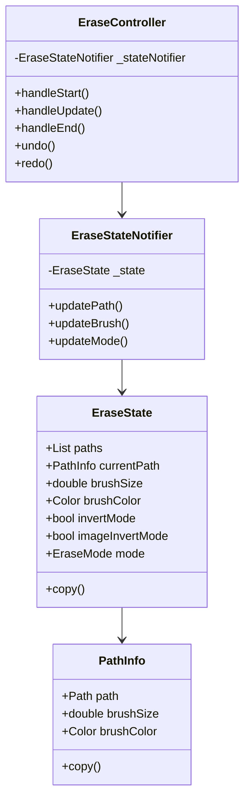
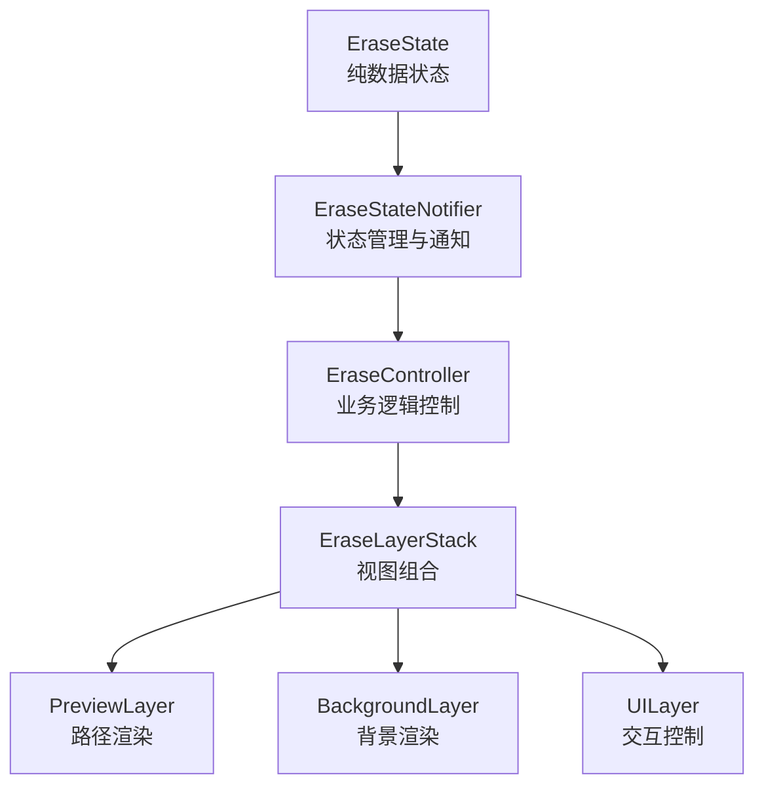
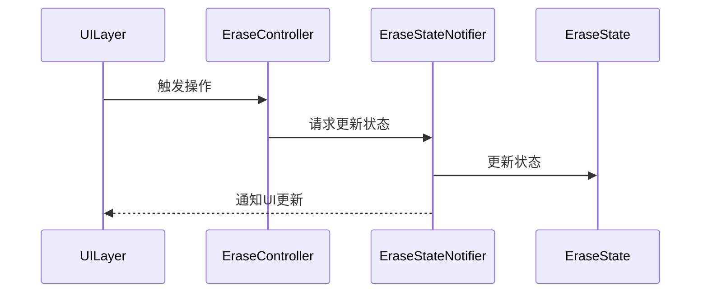

# 擦除功能状态管理重构方案

## 当前问题

1. 状态管理分散
   - EraseState: 基础状态（画笔大小、模式等）
   - EraseController: 路径状态和操作管理
   - EraseLayerStack: 重复的路径管理
   - 导致状态同步困难，容易出现不一致

2. 职责边界模糊
   - 控制器混合了状态管理和业务逻辑
   - 视图层包含状态管理代码
   - 渲染逻辑和状态耦合

3. 复杂的状态更新流程
   - 多处维护路径信息
   - 颜色更新逻辑分散
   - 依赖多层状态通知

## 重构目标

1. 统一状态管理
2. 明确组件职责
3. 简化状态更新流程
4. 提高代码可维护性

## 重构方案

### 1. 状态管理架构



### 2. 组件职责划分



### 3. 具体改进

#### 3.1 状态统一

- 将所有状态统一到 EraseState 中
- 路径信息（paths、currentPath）集中管理
- 通过 StateNotifier 进行状态更新

#### 3.2 状态更新流程



#### 3.3 关键实现细节

1. EraseState 改进

```dart
class EraseState {
    final List<PathInfo> paths;
    final PathInfo? currentPath;
    final double brushSize;
    final bool invertMode;
    final bool imageInvertMode;
    final EraseMode mode;

    // 使用不可变的状态模式
    EraseState copyWith({
        List<PathInfo>? paths,
        PathInfo? currentPath,
        double? brushSize,
        bool? invertMode,
        bool? imageInvertMode,
        EraseMode? mode,
    });
}
```

2. StateNotifier 实现

```dart
class EraseStateNotifier extends ChangeNotifier {
    EraseState _state;
    
    void updatePath(PathUpdate update) {
        _state = update(_state);
        notifyListeners();
    }
    
    void updateBrush(BrushUpdate update) {
        _state = update(_state);
        notifyListeners();
    }
}
```

3. EraseController 职责

- 处理用户输入
- 执行业务逻辑
- 通过 StateNotifier 更新状态
- 不直接维护状态

4. 视图层职责

- EraseLayerStack：组合各层级视图
- PreviewLayer：纯视图渲染，从props获取所需数据
- UILayer：处理用户交互，回调至控制器

### 4. 迁移策略

1. 阶段一：状态重构

- 创建新的状态管理类
- 重构 EraseState
- 实现 StateNotifier

2. 阶段二：控制器改造

- 移除状态维护代码
- 重构为使用 StateNotifier
- 保持公共API不变

3. 阶段三：视图层适配

- 移除本地状态
- 改用统一状态源
- 更新渲染逻辑

4. 阶段四：清理和优化

- 移除废弃代码
- 优化状态更新
- 完善错误处理

## 预期效果

1. 状态管理更清晰

- 单一状态源
- 可预测的更新流程
- 便于调试和维护

2. 性能提升

- 减少不必要的重绘
- 优化状态更新
- 降低内存占用

3. 代码质量提升

- 职责分明
- 逻辑清晰
- 易于测试

## 后续优化方向

1. 考虑使用 Redux/Bloc 等成熟状态管理方案
2. 添加状态持久化支持
3. 引入单元测试
4. 性能监控和优化
