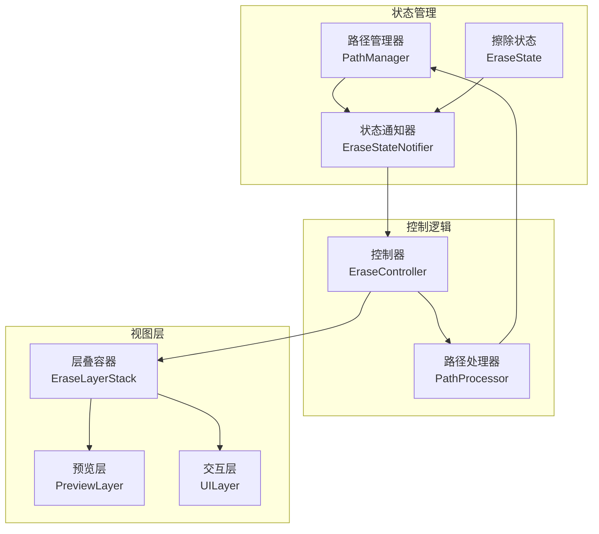
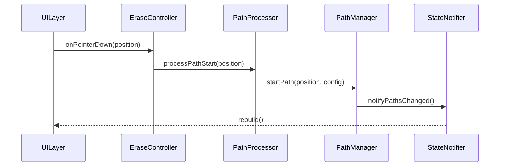
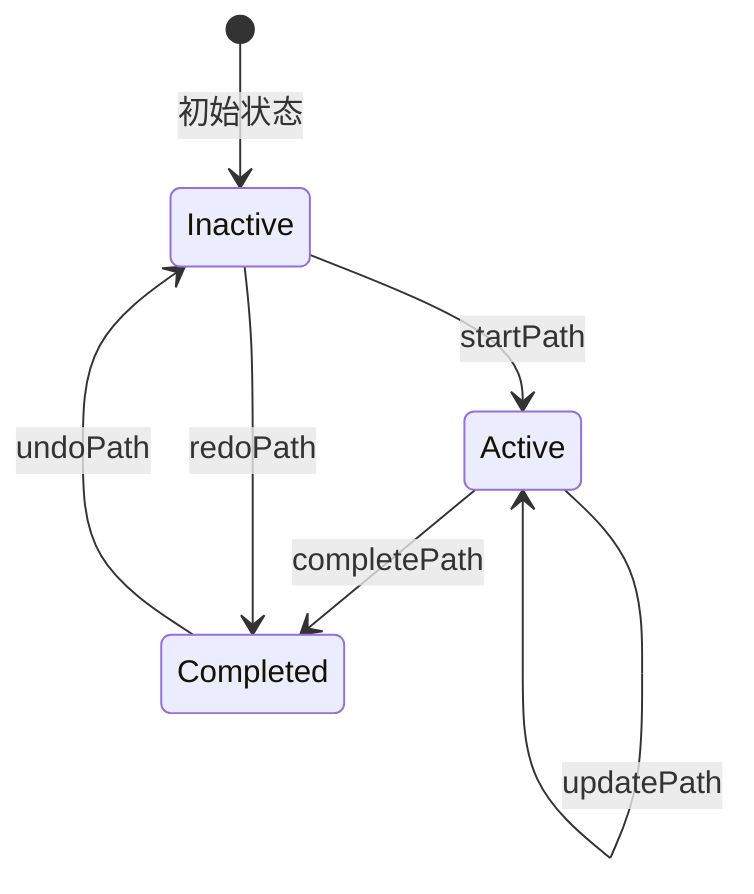

# 擦除功能状态管理重构方案 V2

## 当前问题分析

### 1. 路径状态管理混乱

- EraseController: 维护_paths和_currentPath
- EraseLayerStack: 重复维护_paths和_currentPath
- PreviewLayer: 负责路径渲染，但依赖外部传入完整路径状态
- 导致状态同步和一致性问题

### 2. 组件职责不清

- EraseLayerStack同时处理状态管理和视图组合
- UILayer只需要光标信息，但被传入多余的状态
- PreviewLayer需要处理路径合并和渲染优化

### 3. 路径生命周期管理分散

- 路径创建逻辑分布在多处
- 路径更新和完成逻辑重复
- 缺乏统一的路径状态转换管理

## 重构方案

### 1. 分离关注点



### 2. 组件职责定义

#### PathManager

```dart
class PathManager {
  // 路径集合管理
  final List<PathInfo> _completedPaths;
  final PathInfo? _activePath;
  
  // 路径操作
  void startPath(Offset position, BrushConfig brush);
  void updatePath(Offset position);
  void completePath();
  void undoPath();
  void redoPath();
  
  // 路径查询
  List<PathInfo> getVisiblePaths();
  PathBounds getPathBounds();
}

class BrushConfig {
  final double size;
  final Color color;
  final bool inverted;
}
```

#### EraseState

```dart
@freezed
class EraseState with _$EraseState {
  factory EraseState({
    required BrushConfig brushConfig,
    required bool imageInverted,
    required bool showOutline,
    required EraseMode mode,
  }) = _EraseState;
}
```

#### EraseStateNotifier

```dart
class EraseStateNotifier extends StateNotifier<EraseState> {
  final PathManager _pathManager;
  
  // 状态更新方法
  void updateBrushConfig(BrushConfig config);
  void updateMode(EraseMode mode);
  
  // 路径状态通知
  void notifyPathsChanged();
}
```

### 3. 视图层优化

#### PreviewLayer

```dart
class PreviewLayer extends StatelessWidget {
  final PathRenderData renderData;
  
  @override
  Widget build(BuildContext context) {
    return CustomPaint(
      painter: PathPainter(renderData),
    );
  }
}

class PathRenderData {
  final List<PathInfo> completedPaths;
  final PathInfo? activePath;
  final PathBounds? dirtyBounds;
}
```

#### UILayer

```dart
class UILayer extends StatelessWidget {
  final BrushConfig brushConfig;
  final CursorData cursorData;
  final InteractionCallbacks callbacks;
}
```

### 4. 状态更新流程



### 5. 路径生命周期



## 迁移策略

### 第一阶段：基础设施

1. 实现PathManager
2. 实现新的EraseState
3. 实现EraseStateNotifier

### 第二阶段：控制层改造

1. 重构EraseController
2. 实现PathProcessor
3. 更新状态管理逻辑

### 第三阶段：视图层适配

1. 简化EraseLayerStack
2. 优化PreviewLayer渲染
3. 重构UILayer

## 预期收益

1. 更清晰的状态管理
   - 路径状态集中管理
   - 状态更新流程可预测
   - 更容易调试和测试

2. 更高的性能
   - 优化路径渲染
   - 减少不必要的重建
   - 更精确的重绘区域控制

3. 更好的可维护性
   - 职责划分清晰
   - 代码组织结构化
   - 易于扩展新功能

## 风险与缓解

1. 重构范围较大
   - 分阶段实施
   - 保持向后兼容
   - 充分测试

2. 性能影响
   - 路径管理优化
   - 渲染策略改进
   - 性能监控

3. 学习成本
   - 完善文档
   - 代码示例
   - 渐进式迁移
