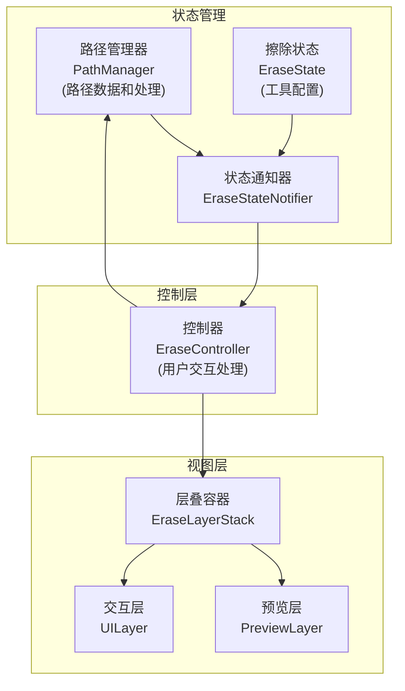
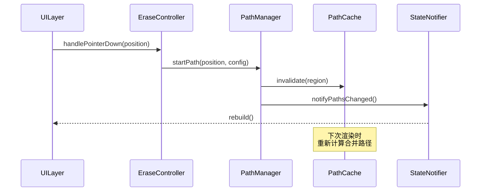
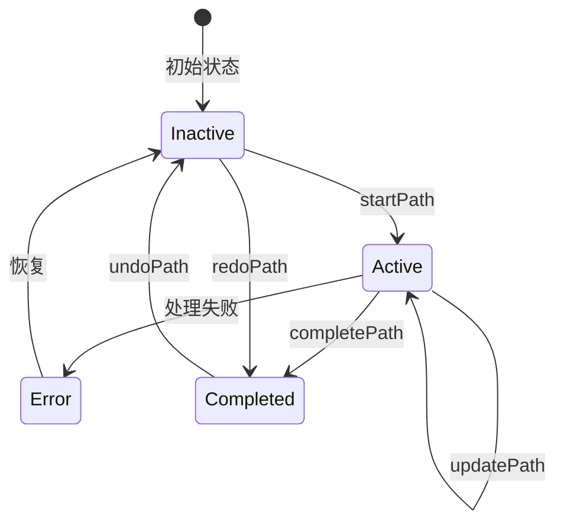

# 擦除功能状态管理重构方案 V3

## 架构简化



## 组件职责

### PathManager

```dart
class PathManager {
  // 路径数据
  final List<PathInfo> _completedPaths;
  final PathInfo? _activePath;
  final PathCache _cache;  // 新增：路径缓存
  
  // 路径生命周期管理
  void startPath(Offset position, BrushConfig brush);
  void updatePath(Offset position);
  void completePath();
  void undoPath();
  void redoPath();
  
  // 路径处理
  Path mergePaths(List<PathInfo> paths);  // 从Controller移入
  Path createSmoothPath(List<Offset> points);  // 从Controller移入
  void transformPath(PathInfo path, Matrix4 transform);  // 新增：路径变换
  
  // 路径查询
  List<PathInfo> getVisiblePaths();
  PathBounds getPathBounds();
  
  // 错误处理
  PathResult<T> tryOperation<T>(Future<T> Function() operation);
}

// 新增：路径缓存
class PathCache {
  Path? mergedCompletedPaths;
  Rect? dirtyRegion;
  
  void invalidate([Rect? region]);
  bool shouldRecompute(List<PathInfo> paths);
}

// 新增：操作结果类型
class PathResult<T> {
  final T? data;
  final PathError? error;
  final bool isSuccess;
}

// 新增：错误类型
enum PathError {
  invalidPath,
  mergeError,
  transformError,
  // ...
}
```

### EraseController

```dart
class EraseController {
  final EraseStateNotifier _stateNotifier;
  final PathManager _pathManager;
  
  // 用户交互处理
  void handlePointerDown(Offset position);
  void handlePointerMove(Offset position);
  void handlePointerUp();
  
  // 工具配置
  void updateBrushConfig(BrushConfig config);
  void updateMode(EraseMode mode);
  
  // 简单的委托方法
  void undo() => _pathManager.undoPath();
  void redo() => _pathManager.redoPath();
}
```

### PreviewLayer

```dart
class PreviewLayer extends StatelessWidget {
  final PathRenderData renderData;
  
  @override
  Widget build(BuildContext context) {
    return CustomPaint(
      painter: PathPainter(renderData),
    );
  }
}

// 新增：渲染数据类
class PathRenderData {
  final Path? mergedCompletedPaths;  // 使用缓存的合并路径
  final PathInfo? activePath;
  final Rect? dirtyBounds;
  final BrushConfig brushConfig;
  
  bool get needsUpdate => mergedCompletedPaths == null;
}

class PathPainter extends CustomPainter {
  final PathRenderData _data;
  
  @override
  void paint(Canvas canvas, Size size) {
    // 使用缓存的合并路径进行渲染
    if (_data.mergedCompletedPaths != null) {
      _drawCachedPaths(canvas);
    }
    if (_data.activePath != null) {
      _drawActivePath(canvas);
    }
  }
  
  @override
  bool shouldRepaint(PathPainter old) {
    return _data.needsUpdate || 
           _data.activePath != old._data.activePath ||
           _data.dirtyBounds != old._data.dirtyBounds;
  }
}
```

## 状态更新流程



## 路径生命周期（更新）



## 主要改进

1. 移除了多余的PathProcessor层
2. 将路径处理逻辑集中到PathManager
3. 增加了路径缓存机制
4. 增加了错误处理
5. 支持路径变换操作
6. 优化了渲染性能

## 迁移策略（简化为三阶段）

1. 核心重构
   - 实现PathManager（包含缓存）
   - 实现新的错误处理
   - 重构路径处理逻辑

2. 控制层精简
   - 简化EraseController
   - 移除冗余代码
   - 更新状态管理

3. 视图层优化
   - 实现缓存机制
   - 优化渲染逻辑
   - 更新组件接口
