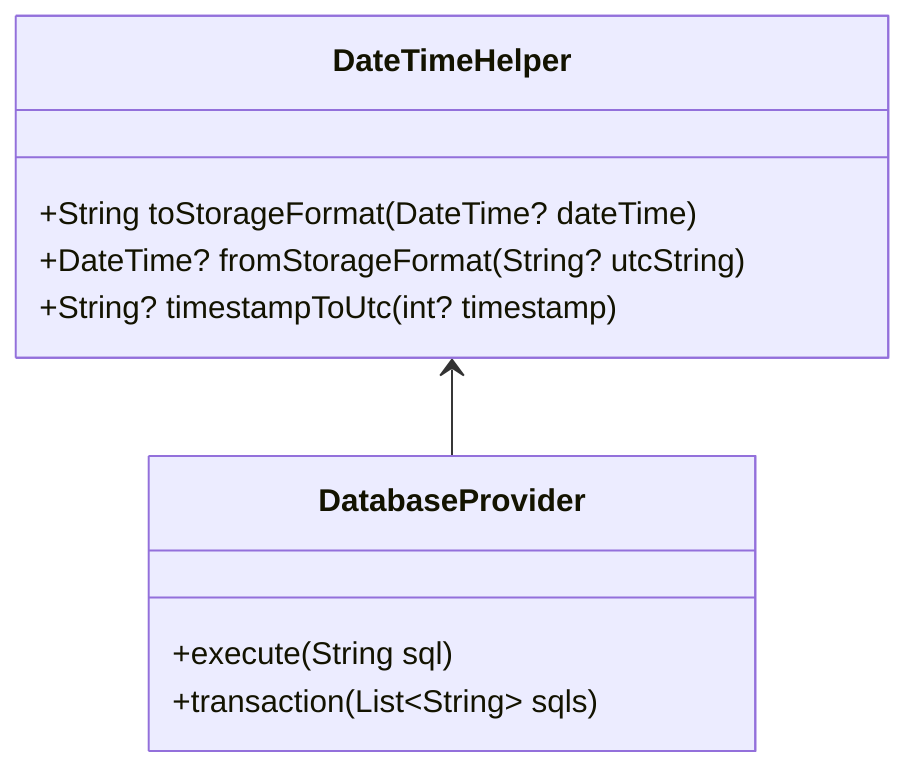
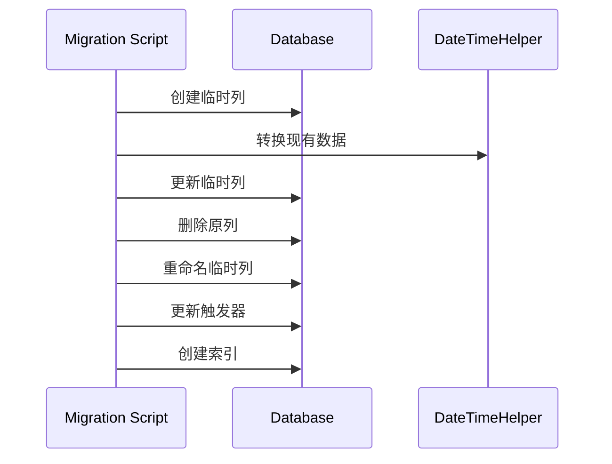

# 日期时间字段UTC迁移方案

## 1. 背景与目标

### 1.1 当前状况

- 数据库中使用INTEGER类型存储时间戳(毫秒)
- Repository层转换为ISO8601字符串
- 实体层使用DateTime类型
- 触发器使用strftime生成时间戳

### 1.2 存在的问题

- 时间戳存储不直观，难以直接查看和调试
- 需要在代码层做额外的转换
- 时区处理不统一
- 触发器生成的时间戳可能存在精度问题

### 1.3 迁移目标

- 统一使用UTC时间的ISO8601字符串格式
- 提高数据可读性与可维护性
- 简化时间处理逻辑
- 确保时区一致性

## 2. 技术方案

### 2.1 基础设施更新



#### 2.1.1 DateTimeHelper实现

```dart
class DateTimeHelper {
  /// 转换为存储格式(UTC ISO8601)
  static String toStorageFormat(DateTime? dateTime) {
    if (dateTime == null) return null;
    return dateTime.toUtc().toIso8601String();
  }

  /// 从存储格式解析
  static DateTime? fromStorageFormat(String? utcString) {
    if (utcString == null) return null;
    return DateTime.parse(utcString).toLocal();
  }
  
  /// 时间戳转UTC字符串
  static String? timestampToUtc(int? timestamp) {
    if (timestamp == null) return null;
    return DateTime.fromMillisecondsSinceEpoch(timestamp)
        .toUtc()
        .toIso8601String();
  }
}
```

### 2.2 数据库迁移步骤



#### 2.2.1 Works表迁移

```sql
-- 1. 添加临时列
ALTER TABLE works ADD COLUMN creationDate_new TEXT;
ALTER TABLE works ADD COLUMN createTime_new TEXT;
ALTER TABLE works ADD COLUMN updateTime_new TEXT;
ALTER TABLE works ADD COLUMN lastImageUpdateTime_new TEXT;

-- 2. 转换数据
UPDATE works SET 
  creationDate_new = datetime(creationDate/1000, 'unixepoch'),
  createTime_new = datetime(createTime/1000, 'unixepoch'),
  updateTime_new = datetime(updateTime/1000, 'unixepoch'),
  lastImageUpdateTime_new = 
    CASE 
      WHEN lastImageUpdateTime IS NOT NULL 
      THEN datetime(lastImageUpdateTime/1000, 'unixepoch')
      ELSE NULL 
    END;

-- 3. 删除原列
ALTER TABLE works DROP COLUMN creationDate;
ALTER TABLE works DROP COLUMN createTime;
ALTER TABLE works DROP COLUMN updateTime;
ALTER TABLE works DROP COLUMN lastImageUpdateTime;

-- 4. 重命名新列
ALTER TABLE works RENAME COLUMN creationDate_new TO creationDate;
ALTER TABLE works RENAME COLUMN createTime_new TO createTime;
ALTER TABLE works RENAME COLUMN updateTime_new TO updateTime;
ALTER TABLE works RENAME COLUMN lastImageUpdateTime_new TO lastImageUpdateTime;

-- 5. 创建索引
CREATE INDEX idx_works_creationDate ON works(creationDate);
CREATE INDEX idx_works_createTime ON works(createTime);
CREATE INDEX idx_works_updateTime ON works(updateTime);
```

#### 2.2.2 Work Images表迁移

```sql
-- 1. 添加临时列
ALTER TABLE work_images ADD COLUMN createTime_new TEXT;
ALTER TABLE work_images ADD COLUMN updateTime_new TEXT;

-- 2. 转换数据
UPDATE work_images SET 
  createTime_new = datetime(createTime/1000, 'unixepoch'),
  updateTime_new = datetime(updateTime/1000, 'unixepoch');

-- 3. 删除原列
ALTER TABLE work_images DROP COLUMN createTime;
ALTER TABLE work_images DROP COLUMN updateTime;

-- 4. 重命名新列
ALTER TABLE work_images RENAME COLUMN createTime_new TO createTime;
ALTER TABLE work_images RENAME COLUMN updateTime_new TO updateTime;

-- 5. 创建索引
CREATE INDEX idx_work_images_createTime ON work_images(createTime);
CREATE INDEX idx_work_images_updateTime ON work_images(updateTime);
```

#### 2.2.3 Characters表迁移

```sql
-- 1. 添加临时列
ALTER TABLE characters ADD COLUMN createTime_new TEXT;
ALTER TABLE characters ADD COLUMN updateTime_new TEXT;

-- 2. 转换数据
UPDATE characters SET 
  createTime_new = datetime(createTime/1000, 'unixepoch'),
  updateTime_new = datetime(updateTime/1000, 'unixepoch');

-- 3. 删除原列
ALTER TABLE characters DROP COLUMN createTime;
ALTER TABLE characters DROP COLUMN updateTime;

-- 4. 重命名新列
ALTER TABLE characters RENAME COLUMN createTime_new TO createTime;
ALTER TABLE characters RENAME COLUMN updateTime_new TO updateTime;

-- 5. 创建索引
CREATE INDEX idx_characters_createTime ON characters(createTime);
CREATE INDEX idx_characters_updateTime ON characters(updateTime);
```

#### 2.2.4 Practices表迁移

```sql
-- 1. 添加临时列
ALTER TABLE practices ADD COLUMN createTime_new TEXT;
ALTER TABLE practices ADD COLUMN updateTime_new TEXT;

-- 2. 转换数据
UPDATE practices SET 
  createTime_new = datetime(createTime/1000, 'unixepoch'),
  updateTime_new = datetime(updateTime/1000, 'unixepoch');

-- 3. 删除原列
ALTER TABLE practices DROP COLUMN createTime;
ALTER TABLE practices DROP COLUMN updateTime;

-- 4. 重命名新列
ALTER TABLE practices RENAME COLUMN createTime_new TO createTime;
ALTER TABLE practices RENAME COLUMN updateTime_new TO updateTime;

-- 5. 创建索引
CREATE INDEX idx_practices_createTime ON practices(createTime);
CREATE INDEX idx_practices_updateTime ON practices(updateTime);
```

#### 2.2.5 Settings表迁移

```sql
-- 1. 添加临时列
ALTER TABLE settings ADD COLUMN updateTime_new TEXT;

-- 2. 转换数据
UPDATE settings SET 
  updateTime_new = datetime(updateTime/1000, 'unixepoch');

-- 3. 删除原列
ALTER TABLE settings DROP COLUMN updateTime;

-- 4. 重命名新列
ALTER TABLE settings RENAME COLUMN updateTime_new TO updateTime;

-- 5. 创建索引
CREATE INDEX idx_settings_updateTime ON settings(updateTime);
```

#### 2.2.6 更新触发器

```sql
-- 更新图片更新时间触发器
DROP TRIGGER IF EXISTS update_work_first_image_on_insert;
CREATE TRIGGER update_work_first_image_on_insert 
AFTER INSERT ON work_images
BEGIN
  UPDATE works 
  SET firstImageId = (
    SELECT id
    FROM work_images
    WHERE workId = NEW.workId
    ORDER BY indexInWork ASC
    LIMIT 1
  ),
  lastImageUpdateTime = strftime('%Y-%m-%dT%H:%M:%fZ', 'now')
  WHERE id = NEW.workId;
END;

DROP TRIGGER IF EXISTS update_work_first_image_on_update;
CREATE TRIGGER update_work_first_image_on_update 
AFTER UPDATE OF indexInWork ON work_images
BEGIN
  UPDATE works 
  SET firstImageId = (
    SELECT id
    FROM work_images
    WHERE workId = NEW.workId
    ORDER BY indexInWork ASC
    LIMIT 1
  ),
  lastImageUpdateTime = strftime('%Y-%m-%dT%H:%M:%fZ', 'now')
  WHERE id = NEW.workId;
END;

DROP TRIGGER IF EXISTS update_work_first_image_on_delete;
CREATE TRIGGER update_work_first_image_on_delete 
AFTER DELETE ON work_images
BEGIN
  UPDATE works 
  SET firstImageId = (
    SELECT id FROM work_images 
    WHERE workId = OLD.workId 
    ORDER BY indexInWork ASC 
    LIMIT 1
  ),
  lastImageUpdateTime = strftime('%Y-%m-%dT%H:%M:%fZ', 'now')
  WHERE id = OLD.workId;
END;
```

### 2.3 代码更新

#### 2.3.1 Repository层更新

- 移除时间戳转换逻辑
- 直接使用ISO8601字符串
- 更新查询条件构建

```dart
// 示例: WorkRepositoryImpl更新
class WorkRepositoryImpl implements WorkRepository {
  // ...
  
  Map<String, dynamic> _convertDates(Map<String, dynamic> data) {
    return {
      ...data,
      'tags': data['tags']
              ?.toString()
              .split(',')
              .where((tag) => tag.isNotEmpty)
              .toList() ??
          const [],
      // 直接使用存储的ISO8601字符串
      'creationDate': data['creationDate'],
      'createTime': data['createTime'],
      'updateTime': data['updateTime'], 
      'lastImageUpdateTime': data['lastImageUpdateTime'],
    };
  }

  Map<String, dynamic> _toTableJson(WorkEntity work) {
    return {
      // ...其他字段...
      'creationDate': DateTimeHelper.toStorageFormat(work.creationDate),
      'createTime': DateTimeHelper.toStorageFormat(work.createTime),
      'updateTime': DateTimeHelper.toStorageFormat(work.updateTime),
      'lastImageUpdateTime': DateTimeHelper.toStorageFormat(work.lastImageUpdateTime),
    };
  }
}
```

#### 2.3.2 查询条件更新

```dart
// 日期范围查询示例
if (filter.dateRange != null) {
  final start = filter.dateRange?.start;
  final end = filter.dateRange?.end;
  if (start != null && end != null) {
    conditions.add(DatabaseQueryCondition(
      field: 'creationDate',
      operator: '>=',
      value: DateTimeHelper.toStorageFormat(start),
    ));

    conditions.add(DatabaseQueryCondition(
      field: 'creationDate',
      operator: '<=',
      value: DateTimeHelper.toStorageFormat(end),
    ));
  }
}
```

## 3. 迁移实施计划

### 3.1 准备阶段

1. 创建DateTimeHelper工具类
2. 实现并测试工具方法
3. 准备数据库备份脚本
4. 准备回滚脚本

### 3.2 执行阶段

1. 备份数据库
2. 执行数据库迁移脚本
3. 更新Repository实现
4. 更新查询条件构建
5. 更新单元测试

### 3.3 验证阶段

1. 验证数据转换准确性
2. 验证时区处理
3. 验证查询功能
4. 验证触发器
5. 性能测试

### 3.4 回滚预案

1. 保留原有数据库备份
2. 准备回滚SQL脚本
3. 保留原有代码分支

## 4. 测试计划

### 4.1 单元测试

- 时间转换函数测试
- Repository CRUD测试
- 查询条件测试
- 边界条件测试

### 4.2 集成测试

- 数据迁移测试
- 跨时区操作测试
- 并发操作测试
- 性能测试

### 4.3 验收标准

1. 所有时间字段正确转换为UTC ISO8601格式
2. 现有功能正常工作
3. 查询性能符合要求
4. 时区处理准确
5. 数据一致性保持

## 5. 风险与应对措施

### 5.1 潜在风险

1. 数据转换过程中的精度损失
2. 大量数据迁移的性能问题
3. 跨时区数据不一致
4. 与现有代码的兼容性问题

### 5.2 应对措施

1. 使用高精度时间格式
2. 分批处理大量数据
3. 严格的时区处理测试
4. 完整的回滚方案

## 6. 时间节点

1. 准备阶段：1天
   - 工具类开发
   - 迁移脚本准备
   - 测试用例编写

2. 执行阶段：1天
   - 数据迁移
   - 代码更新
   - 初步测试

3. 验证阶段：2天
   - 功能验证
   - 性能测试
   - 问题修复

4. 上线阶段：1天
   - 生产环境部署
   - 监控与应急响应

总计：5个工作日
