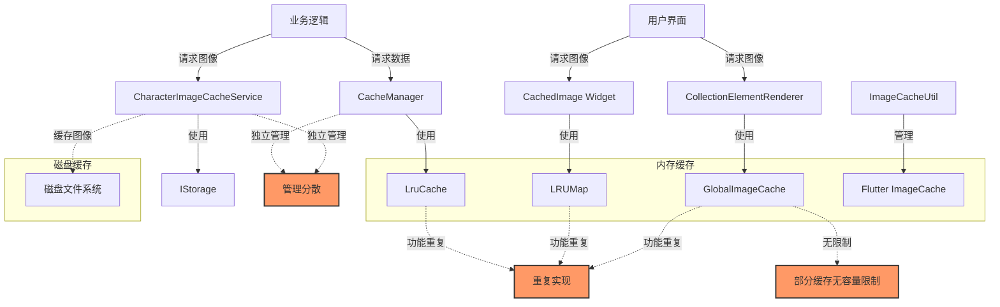
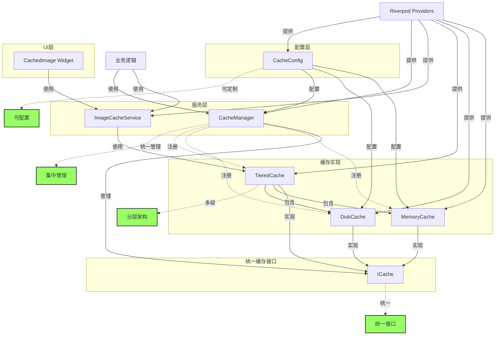
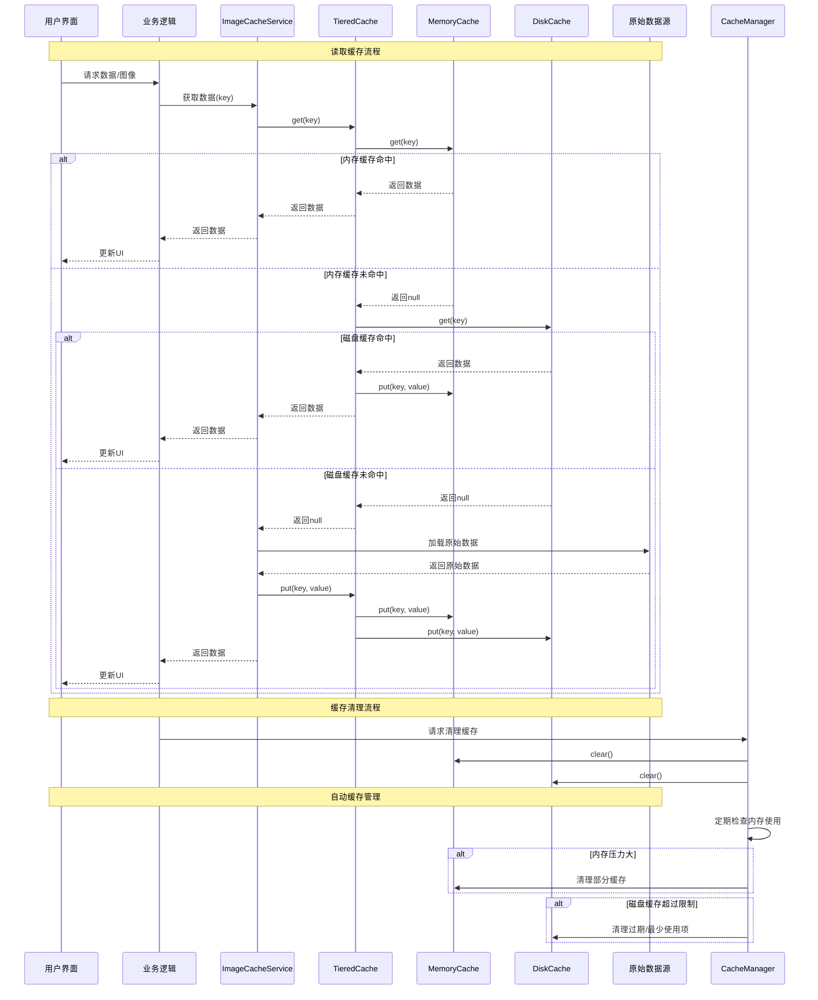

# 缓存优化方案

## 背景

项目当前使用了多种缓存机制，包括内存缓存、磁盘缓存和Flutter内置的图像缓存。这些缓存机制分散在不同的模块中，存在重复实现和管理分散的问题。本方案旨在优化现有缓存架构，提高性能并增强可维护性。

## 现状分析

### 现有缓存机制

1. **多个LRU缓存实现**
   - `LruCache` 类 (在 `CacheManager` 中)
   - `LRUMap` 类 (在 `CachedImage` 中)
   - 功能相似但不共享代码

2. **多层次的图像缓存**
   - `GlobalImageCache` 全局静态缓存
   - `CachedImage` 组件的内部缓存
   - Flutter内置的 `ImageCache`
   - `CharacterImageCacheService` 专用缓存

3. **分散的缓存管理**
   - 每个缓存实现都有自己的清理机制
   - 缺乏统一的缓存监控和管理

### 当前缓存对象关系图



### 存在的问题

1. **代码重复**：多个相似功能的缓存实现
2. **管理分散**：缺乏统一的缓存管理机制
3. **内存风险**：部分缓存没有容量限制
4. **一致性问题**：不同缓存使用不同的键生成和失效策略
5. **可维护性差**：缓存逻辑分散，难以统一维护和优化

## 优化方案

### 优化后的缓存对象关系图



### 1. 缓存架构优化

#### 1.1 统一缓存接口

创建统一的缓存接口，作为所有缓存实现的基础：

```dart
/// 通用缓存接口
abstract class ICache<K, V> {
  /// 获取缓存项
  Future<V?> get(K key);

  /// 存储缓存项
  Future<void> put(K key, V value);

  /// 移除缓存项
  Future<void> invalidate(K key);

  /// 清空缓存
  Future<void> clear();

  /// 获取缓存大小
  Future<int> size();
}
```

#### 1.2 分层缓存实现

实现统一的多级缓存系统：

```dart
/// 多级缓存实现
class TieredCache<K, V> implements ICache<K, V> {
  final ICache<K, V> _primaryCache;   // 内存缓存
  final ICache<K, V> _secondaryCache; // 磁盘缓存

  TieredCache({
    required ICache<K, V> primaryCache,
    required ICache<K, V> secondaryCache,
  }) : _primaryCache = primaryCache,
       _secondaryCache = secondaryCache;

  @override
  Future<V?> get(K key) async {
    // 先从内存缓存获取
    final primaryResult = await _primaryCache.get(key);
    if (primaryResult != null) {
      return primaryResult;
    }

    // 再从磁盘缓存获取
    final secondaryResult = await _secondaryCache.get(key);
    if (secondaryResult != null) {
      // 更新内存缓存
      await _primaryCache.put(key, secondaryResult);
      return secondaryResult;
    }

    return null;
  }

  @override
  Future<void> put(K key, V value) async {
    // 同时更新内存和磁盘缓存
    await _primaryCache.put(key, value);
    await _secondaryCache.put(key, value);
  }

  @override
  Future<void> invalidate(K key) async {
    // 同时从内存和磁盘缓存移除
    await _primaryCache.invalidate(key);
    await _secondaryCache.invalidate(key);
  }

  @override
  Future<void> clear() async {
    // 清空所有缓存
    await _primaryCache.clear();
    await _secondaryCache.clear();
  }

  @override
  Future<int> size() async {
    // 返回主缓存大小
    return await _primaryCache.size();
  }
}
```

### 2. 具体缓存实现优化

#### 2.1 内存缓存统一

整合现有的多个LRU实现，创建一个通用的内存缓存：

```dart
/// 通用LRU内存缓存
class MemoryCache<K, V> implements ICache<K, V> {
  final int _capacity;
  final Map<K, V> _cache = {};
  final List<K> _keys = [];

  MemoryCache({required int capacity}) : _capacity = capacity;

  @override
  Future<V?> get(K key) async {
    if (!_cache.containsKey(key)) return null;

    // 更新访问顺序
    _keys.remove(key);
    _keys.add(key);

    return _cache[key];
  }

  @override
  Future<void> put(K key, V value) async {
    if (_cache.containsKey(key)) {
      _keys.remove(key);
    } else if (_keys.length >= _capacity) {
      // 移除最近最少使用的项
      final oldestKey = _keys.removeAt(0);
      _cache.remove(oldestKey);
    }

    _cache[key] = value;
    _keys.add(key);
  }

  @override
  Future<void> invalidate(K key) async {
    _cache.remove(key);
    _keys.remove(key);
  }

  @override
  Future<void> clear() async {
    _cache.clear();
    _keys.clear();
  }

  @override
  Future<int> size() async {
    return _cache.length;
  }
}
```

#### 2.2 磁盘缓存统一

整合现有的磁盘缓存实现：

```dart
/// 通用磁盘缓存
class DiskCache<K, V> implements ICache<K, V> {
  final String _cachePath;
  final int _maxSize;
  final Duration _maxAge;
  final ValueEncoder<V> _encoder;
  final ValueDecoder<V> _decoder;
  final KeyHasher<K> _keyHasher;

  DiskCache({
    required String cachePath,
    required int maxSize,
    required Duration maxAge,
    required ValueEncoder<V> encoder,
    required ValueDecoder<V> decoder,
    required KeyHasher<K> keyHasher,
  }) : _cachePath = cachePath,
       _maxSize = maxSize,
       _maxAge = maxAge,
       _encoder = encoder,
       _decoder = decoder,
       _keyHasher = keyHasher;

  @override
  Future<V?> get(K key) async {
    final filePath = _getFilePath(key);
    final file = File(filePath);

    if (await file.exists()) {
      // 检查是否过期
      final stat = await file.stat();
      final now = DateTime.now();
      final fileAge = now.difference(stat.modified);

      if (fileAge > _maxAge) {
        // 缓存已过期，删除文件
        await file.delete();
        return null;
      }

      // 读取并解码数据
      final bytes = await file.readAsBytes();
      return await _decoder(bytes);
    }

    return null;
  }

  @override
  Future<void> put(K key, V value) async {
    final filePath = _getFilePath(key);
    final file = File(filePath);

    // 确保目录存在
    final dir = Directory(path.dirname(filePath));
    if (!await dir.exists()) {
      await dir.create(recursive: true);
    }

    // 编码并写入数据
    final bytes = await _encoder(value);
    await file.writeAsBytes(bytes);

    // 检查缓存大小并清理
    await _trimCacheIfNeeded();
  }

  @override
  Future<void> invalidate(K key) async {
    final filePath = _getFilePath(key);
    final file = File(filePath);

    if (await file.exists()) {
      await file.delete();
    }
  }

  @override
  Future<void> clear() async {
    final dir = Directory(_cachePath);
    if (await dir.exists()) {
      await dir.delete(recursive: true);
      await dir.create();
    }
  }

  @override
  Future<int> size() async {
    int totalSize = 0;
    final dir = Directory(_cachePath);

    if (await dir.exists()) {
      await for (final entity in dir.list(recursive: true)) {
        if (entity is File) {
          totalSize += await entity.length();
        }
      }
    }

    return totalSize;
  }

  // 获取缓存文件路径
  String _getFilePath(K key) {
    final hashedKey = _keyHasher(key);
    return path.join(_cachePath, hashedKey);
  }

  // 清理过大的缓存
  Future<void> _trimCacheIfNeeded() async {
    final currentSize = await size();

    if (currentSize > _maxSize) {
      final dir = Directory(_cachePath);
      if (!await dir.exists()) return;

      // 获取所有缓存文件及其修改时间
      final files = <File, DateTime>{};
      await for (final entity in dir.list(recursive: true)) {
        if (entity is File) {
          final stat = await entity.stat();
          files[entity] = stat.modified;
        }
      }

      // 按修改时间排序
      final sortedFiles = files.entries.toList()
        ..sort((a, b) => a.value.compareTo(b.value));

      // 删除最旧的文件，直到缓存大小合适
      int deletedSize = 0;
      for (final entry in sortedFiles) {
        if (currentSize - deletedSize <= _maxSize * 0.8) {
          // 已经删除足够多，保留80%的空间
          break;
        }

        final file = entry.key;
        final fileSize = await file.length();
        await file.delete();
        deletedSize += fileSize;
      }
    }
  }
}

/// 值编码器接口
typedef ValueEncoder<V> = Future<Uint8List> Function(V value);

/// 值解码器接口
typedef ValueDecoder<V> = Future<V> Function(Uint8List data);

/// 键哈希器接口
typedef KeyHasher<K> = String Function(K key);
```

### 3. 图像缓存优化

#### 3.1 统一图像缓存服务

整合现有的多个图像缓存实现：

```dart
/// 统一图像缓存服务
class ImageCacheService {
  final ICache<String, Uint8List> _binaryCache;
  final ICache<String, ui.Image> _uiImageCache;

  // Flutter内置缓存的引用
  final ImageCache _flutterImageCache;

  ImageCacheService({
    required ICache<String, Uint8List> binaryCache,
    required ICache<String, ui.Image> uiImageCache,
  }) : _binaryCache = binaryCache,
       _uiImageCache = uiImageCache,
       _flutterImageCache = PaintingBinding.instance.imageCache;

  /// 获取二进制图像数据
  Future<Uint8List?> getBinaryImage(String key) async {
    return await _binaryCache.get(key);
  }

  /// 缓存二进制图像数据
  Future<void> cacheBinaryImage(String key, Uint8List data) async {
    await _binaryCache.put(key, data);
  }

  /// 获取UI图像对象
  Future<ui.Image?> getUiImage(String key) async {
    return await _uiImageCache.get(key);
  }

  /// 缓存UI图像对象
  Future<void> cacheUiImage(String key, ui.Image image) async {
    await _uiImageCache.put(key, image);
  }

  /// 从Flutter缓存中移除图像
  void evictFromFlutterCache(ImageProvider provider) {
    _flutterImageCache.evict(provider);
  }

  /// 清除所有图像缓存
  Future<void> clearAll() async {
    await _binaryCache.clear();
    await _uiImageCache.clear();
    _flutterImageCache.clear();
    _flutterImageCache.clearLiveImages();
  }

  /// 生成缓存键
  String generateCacheKey(String id, String type, Map<String, dynamic> transform) {
    final transformString = jsonEncode(transform);
    final transformHash = md5.convert(utf8.encode(transformString)).toString();
    return '$id-$type-$transformHash';
  }
}
```

#### 3.2 优化CachedImage组件

改进现有的CachedImage组件，使用统一的缓存服务：

```dart
/// 缓存图像组件
class CachedImage extends StatefulWidget {
  final String path;
  final BoxFit? fit;
  final double? width;
  final double? height;
  final Widget Function(BuildContext, Object, StackTrace?)? errorBuilder;

  const CachedImage({
    Key? key,
    required this.path,
    this.fit,
    this.width,
    this.height,
    this.errorBuilder,
  }) : super(key: key);

  @override
  State<CachedImage> createState() => _CachedImageState();
}

class _CachedImageState extends State<CachedImage> {
  late final ImageCacheService _cacheService;
  ImageProvider? _imageProvider;
  Object? _error;
  StackTrace? _stackTrace;

  @override
  void initState() {
    super.initState();
    _cacheService = context.read(imageCacheServiceProvider);
    _loadImage();
  }

  @override
  void didUpdateWidget(CachedImage oldWidget) {
    super.didUpdateWidget(oldWidget);
    if (oldWidget.path != widget.path) {
      _loadImage();
    }
  }

  void _loadImage() {
    try {
      final file = File(widget.path);
      if (!file.existsSync()) {
        setState(() {
          _error = Exception('文件不存在');
          _imageProvider = null;
        });
        return;
      }

      _imageProvider = FileImage(file);
      _error = null;
      _stackTrace = null;
    } catch (e, stackTrace) {
      setState(() {
        _error = e;
        _stackTrace = stackTrace;
        _imageProvider = null;
      });
    }
  }

  @override
  Widget build(BuildContext context) {
    if (_error != null && widget.errorBuilder != null) {
      return widget.errorBuilder!(context, _error!, _stackTrace);
    }

    if (_imageProvider == null) {
      return const SizedBox.shrink();
    }

    return Image(
      image: _imageProvider!,
      fit: widget.fit,
      width: widget.width,
      height: widget.height,
      errorBuilder: widget.errorBuilder,
    );
  }
}
```

### 4. 缓存管理优化

#### 4.1 全局缓存管理器

创建全局缓存管理器，统一管理所有缓存：

```dart
/// 全局缓存管理器
class CacheManager {
  final List<ICache> _registeredCaches = [];

  /// 注册缓存
  void registerCache(ICache cache) {
    _registeredCaches.add(cache);
  }

  /// 清除所有缓存
  Future<void> clearAll() async {
    for (final cache in _registeredCaches) {
      await cache.clear();
    }
  }

  /// 监控内存使用
  void startMemoryMonitoring() {
    // 定期检查内存使用情况
    Timer.periodic(const Duration(minutes: 5), (_) {
      _checkMemoryUsage();
    });
  }

  /// 检查内存使用情况
  Future<void> _checkMemoryUsage() async {
    // 这里可以添加内存压力检测逻辑
    // 如果内存压力大，可以清理部分缓存

    // 示例：如果总缓存大小超过阈值，清理部分缓存
    final totalSize = await getTotalCacheSize();
    if (totalSize > 200 * 1024 * 1024) { // 200MB
      await _trimCaches();
    }
  }

  /// 裁剪缓存大小
  Future<void> _trimCaches() async {
    // 可以实现更复杂的裁剪策略
    // 这里简单地清理一半的缓存
    for (final cache in _registeredCaches) {
      // 清理操作
    }
  }

  /// 获取总缓存大小
  Future<int> getTotalCacheSize() async {
    int total = 0;
    for (final cache in _registeredCaches) {
      total += await cache.size();
    }
    return total;
  }
}
```

#### 4.2 缓存配置中心

创建统一的缓存配置中心：

```dart
/// 缓存配置
class CacheConfig {
  // 内存缓存配置
  final int memoryImageCacheCapacity;
  final int memoryDataCacheCapacity;

  // 磁盘缓存配置
  final int maxDiskCacheSize;
  final Duration diskCacheTtl;

  // 自动清理配置
  final bool autoCleanupEnabled;
  final Duration autoCleanupInterval;

  const CacheConfig({
    this.memoryImageCacheCapacity = 100,
    this.memoryDataCacheCapacity = 50,
    this.maxDiskCacheSize = 100 * 1024 * 1024, // 100MB
    this.diskCacheTtl = const Duration(days: 7),
    this.autoCleanupEnabled = true,
    this.autoCleanupInterval = const Duration(hours: 24),
  });
}

/// 缓存配置提供者
final cacheConfigProvider = Provider<CacheConfig>((ref) {
  final prefs = ref.watch(sharedPreferencesProvider);

  // 从SharedPreferences加载配置
  return CacheConfig(
    memoryImageCacheCapacity: prefs.getInt('memory_image_cache_capacity') ?? 100,
    memoryDataCacheCapacity: prefs.getInt('memory_data_cache_capacity') ?? 50,
    maxDiskCacheSize: prefs.getInt('max_disk_cache_size') ?? 100 * 1024 * 1024,
    diskCacheTtl: Duration(days: prefs.getInt('disk_cache_ttl_days') ?? 7),
    autoCleanupEnabled: prefs.getBool('auto_cleanup_enabled') ?? true,
    autoCleanupInterval: Duration(hours: prefs.getInt('auto_cleanup_interval_hours') ?? 24),
  );
});
```

### 5. 依赖注入与服务提供

使用Riverpod进行依赖注入：

```dart
/// 内存缓存提供者
final memoryImageCacheProvider = Provider<ICache<String, Uint8List>>((ref) {
  final config = ref.watch(cacheConfigProvider);
  return MemoryCache<String, Uint8List>(capacity: config.memoryImageCacheCapacity);
});

/// 磁盘缓存提供者
final diskImageCacheProvider = Provider<ICache<String, Uint8List>>((ref) {
  final config = ref.watch(cacheConfigProvider);
  final storage = ref.watch(initializedStorageProvider);

  return DiskCache<String, Uint8List>(
    cachePath: path.join(storage.getAppDataPath(), 'cache', 'images'),
    maxSize: config.maxDiskCacheSize,
    maxAge: config.diskCacheTtl,
    encoder: (data) async => data,
    decoder: (data) async => data,
    keyHasher: (key) => md5.convert(utf8.encode(key)).toString(),
  );
});

/// 多级图像缓存提供者
final tieredImageCacheProvider = Provider<ICache<String, Uint8List>>((ref) {
  final memoryCache = ref.watch(memoryImageCacheProvider);
  final diskCache = ref.watch(diskImageCacheProvider);

  return TieredCache<String, Uint8List>(
    primaryCache: memoryCache,
    secondaryCache: diskCache,
  );
});

/// 图像缓存服务提供者
final imageCacheServiceProvider = Provider<ImageCacheService>((ref) {
  final binaryCache = ref.watch(tieredImageCacheProvider);
  final uiImageCache = ref.watch(memoryUiImageCacheProvider);

  return ImageCacheService(
    binaryCache: binaryCache,
    uiImageCache: uiImageCache,
  );
});

/// 全局缓存管理器提供者
final cacheManagerProvider = Provider<CacheManager>((ref) {
  final manager = CacheManager();

  // 注册所有缓存
  manager.registerCache(ref.read(memoryImageCacheProvider));
  manager.registerCache(ref.read(diskImageCacheProvider));
  // 注册其他缓存...

  // 启动内存监控
  if (ref.read(cacheConfigProvider).autoCleanupEnabled) {
    manager.startMemoryMonitoring();
  }

  return manager;
});
```

## 缓存数据流程图

以下流程图展示了优化后缓存系统中的数据流动：



## 实施路径

### 1. 分阶段实施计划

#### 第一阶段：接口定义与基础实现（2周）

- 定义统一缓存接口
- 实现基础的内存和磁盘缓存类
- 编写单元测试确保基础功能正常

#### 第二阶段：服务整合（2周）

- 实现图像缓存服务
- 整合现有的缓存实现
- 创建适配器连接新旧系统

#### 第三阶段：组件适配（2周）

- 更新UI组件使用新的缓存服务
- 移除旧的缓存实现
- 进行性能测试确保没有性能下降

#### 第四阶段：管理与监控（1周）

- 实现全局缓存管理器
- 添加缓存监控和自动清理功能
- 完善配置系统

### 2. 兼容性考虑

为确保平滑过渡，可以采用适配器模式，使新的缓存接口兼容现有代码：

```dart
/// 旧缓存到新接口的适配器
class LegacyCacheAdapter<K, V> implements ICache<K, V> {
  final LegacyCache _legacyCache;

  LegacyCacheAdapter(this._legacyCache);

  @override
  Future<V?> get(K key) async {
    return await _legacyCache.get(key) as V?;
  }

  // 其他适配方法...
}
```

## 预期收益

1. **代码简化**：减少重复实现，降低代码量
2. **性能提升**：统一的缓存策略可以更高效地利用内存
3. **可维护性提高**：统一接口使代码更易于理解和维护
4. **内存使用优化**：更好的缓存管理可以减少内存泄漏风险
5. **扩展性增强**：基于接口的设计使添加新的缓存策略更容易

## 风险与缓解措施

1. **风险**：重构过程中可能引入新的bug
   **缓解**：编写全面的单元测试，确保新实现与旧实现行为一致

2. **风险**：性能可能暂时下降
   **缓解**：进行性能基准测试，确保新实现不会降低性能

3. **风险**：现有代码依赖于特定缓存实现
   **缓解**：使用适配器模式确保兼容性，逐步迁移

## 项目涉及的具体修改点

### 1. 新增文件

1. **缓存接口与基础实现**
   - `lib/infrastructure/cache/interfaces/i_cache.dart` - 定义统一缓存接口
   - `lib/infrastructure/cache/implementations/memory_cache.dart` - 内存缓存实现
   - `lib/infrastructure/cache/implementations/disk_cache.dart` - 磁盘缓存实现
   - `lib/infrastructure/cache/implementations/tiered_cache.dart` - 多级缓存实现

2. **缓存服务**
   - `lib/infrastructure/cache/services/image_cache_service.dart` - 统一图像缓存服务
   - `lib/infrastructure/cache/services/cache_manager.dart` - 全局缓存管理器

3. **配置与提供者**
   - `lib/infrastructure/cache/config/cache_config.dart` - 缓存配置类
   - `lib/infrastructure/providers/cache_providers.dart` - 缓存相关提供者

### 2. 修改文件

1. **UI组件**
   - `lib/presentation/widgets/image/cached_image.dart` - 更新使用新的缓存服务
   - `lib/presentation/widgets/practice/collection_element_renderer.dart` - 更新使用新的缓存服务

2. **服务类**
   - `lib/infrastructure/services/character_image_service.dart` - 更新使用新的缓存服务
   - `lib/application/services/character/character_service.dart` - 更新使用新的缓存服务

3. **工具类**
   - `lib/utils/image/image_cache_util.dart` - 更新使用新的缓存管理器

4. **提供者**
   - `lib/application/providers/service_providers.dart` - 更新缓存相关提供者
   - `lib/application/di/character_image_providers.dart` - 更新图像缓存提供者

### 3. 移除或弃用文件

1. **弃用的缓存实现**
   - `lib/application/services/storage/cache_manager.dart` - 被新实现替代
   - `lib/infrastructure/cache/character_image_cache_service.dart` - 被新实现替代
   - `lib/utils/cache/path_cache.dart` - 功能整合到新的缓存系统

### 4. 代码修改统计

| 修改类型 | 文件数量 | 代码行数 |
|---------|---------|---------|
| 新增文件 | 8 | ~800 |
| 修改文件 | 7 | ~300 |
| 弃用文件 | 3 | ~400 |
| **总计** | **18** | **~1500** |

### 5. 测试修改

1. **单元测试**
   - 为新增的缓存接口和实现添加单元测试
   - 更新现有测试以适应新的缓存系统

2. **集成测试**
   - 添加缓存系统的集成测试
   - 测试缓存在不同场景下的性能和可靠性

## 结论

本优化方案通过统一缓存接口和实现，减少了系统复杂性，提高了可维护性和可扩展性。分阶段实施计划确保了平稳过渡，同时保持系统的稳定性和性能。实施后，项目将拥有一个更加健壮和高效的缓存系统，为未来的功能扩展提供更好的基础。

通过对18个文件约1500行代码的修改，我们将完成缓存系统的全面优化，解决当前存在的重复实现、管理分散和内存风险等问题，为应用提供更可靠的性能保障。
