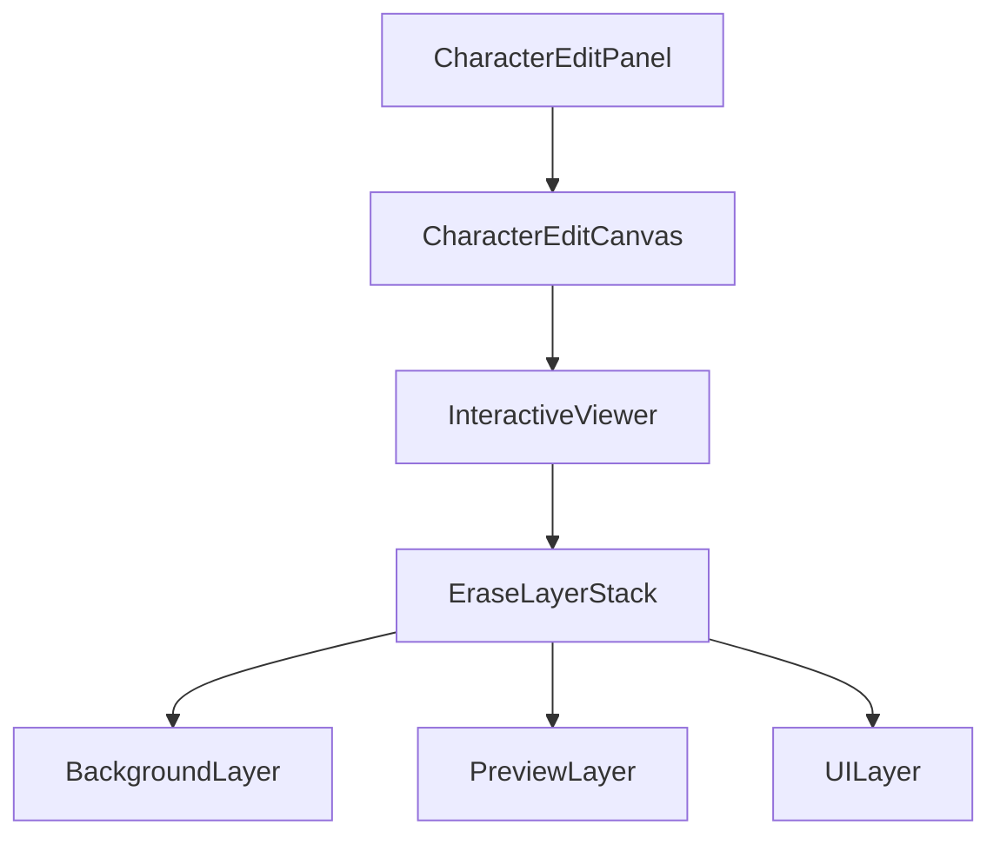

# EraseToolWidget 重构计划

## 1. 目标架构



## 2. 重构步骤

### 2.1 创建CharacterEditCanvas

1. 从CharacterEditPanel中提取画布相关功能
2. 实现TransformationController的管理
3. 处理画布尺寸和缩放逻辑

### 2.2 重构EraseLayerStack

1. 从EraseToolWidget中提取图层管理功能
2. 实现InteractiveViewer的集成
3. 优化图层渲染性能

### 2.3 调整图层组件

1. 优化BackgroundLayer实现
2. 完善PreviewLayer功能
3. 重构UILayer的事件处理

### 2.4 更新EraseToolWidget

1. 简化为纯工具管理组件
2. 将图层功能交给EraseLayerStack
3. 保留工具状态管理

## 3. 实现顺序

1. 第一阶段：基础架构调整
   - 创建新的组件框架
   - 调整组件层次结构
   - 确保基本功能可用

2. 第二阶段：功能迁移
   - 迁移画布管理功能
   - 迁移图层管理功能
   - 迁移事件处理逻辑

3. 第三阶段：优化和测试
   - 优化性能
   - 完善错误处理
   - 添加必要的测试

## 4. 关键改动

### 4.1 CharacterEditCanvas

```dart
class CharacterEditCanvas extends StatelessWidget {
  final Widget child;
  final TransformationController controller;
  final void Function(Size)? onSizeChanged;

  // 负责画布管理
}
```

### 4.2 EraseLayerStack

```dart
class EraseLayerStack extends StatelessWidget {
  final ui.Image image;
  final TransformationController transformationController;
  
  // 负责图层管理
}
```

### 4.3 优化后的EraseToolWidget

```dart
class EraseToolWidget extends ConsumerWidget {
  // 简化为工具管理
  // 使用EraseLayerStack处理渲染
}
```

## 5. 注意事项

1. 保持向后兼容
2. 确保性能不受影响
3. 维持现有功能完整性
4. 优化代码可维护性

## 6. 验证标准

1. 功能验证
   - Alt + 拖动可以移动和缩放
   - 擦除功能正常工作
   - 图层正确渲染

2. 性能验证
   - 渲染性能不下降
   - 内存使用合理
   - 交互响应及时
