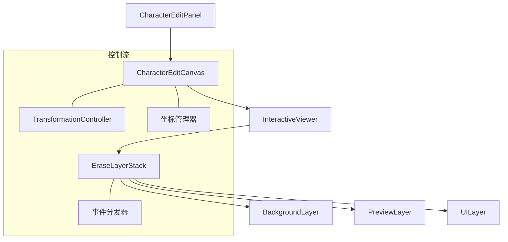

# EraseToolWidget 全新实现计划 V2

## 1. 项目概述

### 1.1 背景与目标

- 重新设计并实现EraseToolWidget
- 采用优化的性能架构
- 提供流畅的用户体验

### 1.2 目标架构



## 2. 设计方案

### 2.1 组件职责

#### 2.1.1 CharacterEditCanvas

```dart
class CharacterEditCanvas extends StatefulWidget {
  // 核心功能
  - 管理TransformationController
  - 处理坐标转换
  - 响应式布局适配
  - 设备像素比处理

  // 关键方法
  Offset canvasToLocal(Offset canvasOffset);
  Offset localToCanvas(Offset localOffset);
  void fitToScreen();
  void setScale(double scale);
}
```

#### 2.1.2 EraseLayerStack

```dart
class EraseLayerStack extends StatelessWidget {
  // 核心功能
  - 图层管理和组织
  - 基础事件分发
  - 层级渲染优化

  // 事件处理
  final layerEventHandlers = <LayerType, LayerEventHandler>{};
  
  // 图层注册
  void registerLayer(LayerType type, LayerEventHandler handler);
  bool dispatchEvent(LayerEvent event);
}
```

#### 2.1.3 各图层职责

```dart
abstract class BaseLayer extends StatelessWidget {
  // 共同特性
  - RepaintBoundary封装
  - 性能监控支持
  - 标准化事件处理
}

class BackgroundLayer extends BaseLayer {
  // 静态内容渲染
  - 图像显示
  - 缓存机制
}

class PreviewLayer extends BaseLayer {
  // 动态内容
  - 实时预览
  - 局部更新
}

class UILayer extends BaseLayer {
  // 交互处理
  - 手势识别
  - 状态反馈
}
```

### 2.2 图层实现细节

#### 2.2.1 图层缓存与优化策略

```dart
class BackgroundLayer extends BaseLayer {
  // 缓存机制实现
  ui.Picture? _cachedPicture;
  ui.Size? _cachedSize;
  
  @override
  bool shouldRepaint(CustomPainter oldDelegate) {
    // 只有在图像真正变化时才重绘
    return image != (oldDelegate as BackgroundLayer).image;
  }
  
  @override
  void paint(Canvas canvas, Size size) {
    if (_cachedPicture == null || _cachedSize != size || _imageChanged) {
      // 重新生成缓存
      final recorder = ui.PictureRecorder();
      final cacheCanvas = Canvas(recorder);
      
      // 绘制背景图像到缓存
      _paintBackground(cacheCanvas, size);
      
      _cachedPicture = recorder.endRecording();
      _cachedSize = size;
      _imageChanged = false;
    }
    
    // 使用缓存直接绘制
    canvas.drawPicture(_cachedPicture!);
  }
}
```

#### 2.2.2 RepaintBoundary放置策略

```dart
class EraseLayerStack extends StatelessWidget {
  @override
  Widget build(BuildContext context) {
    return RepaintBoundary(
      // 整个图层栈外部放置一个RepaintBoundary
      child: Stack(
        children: [
          // 背景图层 - 静态内容，使用RepaintBoundary隔离
          RepaintBoundary(
            child: BackgroundLayer(image: image),
          ),
          
          // 预览图层 - 频繁局部更新，使用RepaintBoundary隔离
          RepaintBoundary(
            child: PreviewLayer(
              strokePath: currentStroke,
              onUpdate: _handlePreviewUpdate,
            ),
          ),
          
          // UI图层 - 交互元素，使用RepaintBoundary隔离
          RepaintBoundary(
            child: UILayer(
              onPointerDown: _handlePointerDown,
              onPointerMove: _handlePointerMove,
              onPointerUp: _handlePointerUp,
            ),
          ),
        ],
      ),
    );
  }
}
```

#### 2.2.3 性能优化考量

```dart
// 性能监控与图层优化的集成
abstract class BaseLayer extends StatelessWidget {
  @override
  Widget build(BuildContext context) {
    return CustomPaint(
      painter: _createPainter(),
      isComplex: isComplexPainting, // 提示Flutter复杂绘制
      willChange: willChangePainting, // 提示Flutter将会频繁更新
      size: Size.infinite,
    );
  }
  
  // 子类需要实现的抽象方法
  CustomPainter _createPainter();
  bool get isComplexPainting => false; // 默认不复杂
  bool get willChangePainting => false; // 默认不频繁更新
}
```

### 2.3 状态管理与依赖注入

#### 2.3.1 状态管理方案

- 使用Provider/Riverpod管理全局状态
- 使用ValueNotifier管理局部状态
- 考虑使用Freezed实现不可变状态对象

#### 2.3.2 依赖注入

```dart
// 定义接口
abstract class ICoordinateTransformer {
  Offset canvasToLocal(Offset canvasOffset);
  Offset localToCanvas(Offset localOffset);
}

// 实现依赖注入
final coordinateTransformerProvider = Provider<ICoordinateTransformer>((ref) {
  return CoordinateTransformer();
});

// 在组件中使用
final transformer = ref.watch(coordinateTransformerProvider);
```

### 2.4 PreviewCanvas 功能整合

现有的 PreviewCanvas 组件提供了以下关键功能，需要整合到新架构中：

- 图像查看和处理
- 轮廓检测和显示
- 擦除操作和笔触追踪
- 区域裁剪和选择
- 图像转换和处理

整合策略:

```dart
// PreviewCanvas 核心功能映射
class CharacterEditCanvas {
  // 1. 坐标转换功能由 CoordinateTransformer 承担
  final CoordinateTransformer transformer;
  
  // 2. 图层管理由 EraseLayerStack 负责
  final EraseLayerStack layerStack;
  
  // 3. 轮廓检测功能由专门的 OutlineDetector 处理
  final OutlineDetector outlineDetector;
  
  // 4. 擦除点追踪整合到 PreviewLayer 中
  void trackErasePoints(List<Offset> points) {
    previewLayer.updateErasePoints(points);
  }
}
```

### 3.3 PreviewCanvas 功能迁移详细计划

#### 3.3.1 图像渲染功能迁移

| 功能 | 源代码位置 | 目标位置 | 迁移策略 |
|-----|-----------|----------|---------|
| 图像显示 | `PreviewCanvas._buildEraseToolLayer` | `BackgroundLayer` | 提取图像渲染逻辑，简化为纯UI渲染 |
| 图像缓存 | `PreviewCanvas._cachedPicture` | `BackgroundLayer._cachedPicture` | 直接移植缓存机制，优化重绘性能 |
| 居中适配 | `PreviewCanvas` 的图像居中逻辑 | `BackgroundLayer._renderCache` | 保留图像适配算法并优化 |

#### 3.3.2 擦除功能迁移

| 功能 | 源代码位置 | 目标位置 | 迁移策略 |
|-----|-----------|----------|---------|
| 路径跟踪 | `PreviewCanvas._currentErasePoints` | `EraseController` | 使用集中式控制器管理擦除状态 |
| 笔触渲染 | `ErasePainter` | `PreviewLayer` | 移植绘制算法，增加脏区域优化 |
| 手势处理 | `PreviewCanvas._handlePointer*` | `UILayer` + `EraseController` | 分离手势捕获和业务逻辑 |

#### 3.3.3 坐标系统迁移

| 功能 | 源代码位置 | 目标位置 | 迁移策略 |
|-----|-----------|----------|---------|
| 坐标转换 | `PreviewCanvas._transformToImageCoordinates` | `CoordinateTransformer` | 抽取为独立服务，支持更复杂变换 |
| 缩放管理 | `PreviewCanvas._transformationController` | `CharacterEditCanvas` | 提升到画布级别统一管理 |
| 屏幕适配 | 视口计算逻辑 | `CoordinateTransformer` | 增强支持多设备和像素比处理 |

#### 3.3.4 轮廓显示迁移

| 功能 | 源代码位置 | 目标位置 | 迁移策略 |
|-----|-----------|----------|---------|
| 轮廓绘制 | `OutlinePainter` | `UILayer` 专用渲染器 | 集成为UI层的可选功能 |
| 轮廓数据 | `_currentOutline` | 通过Provider提供 | 使用依赖注入解耦数据和视图 |

#### 3.3.5 性能优化迁移

| 功能 | 源代码位置 | 目标位置 | 迁移策略 |
|-----|-----------|----------|---------|
| 重绘控制 | `ErasePainter.shouldRepaint` | 各Layer的shouldRepaint | 更细粒度的重绘控制 |
| 异步处理 | `_prepareImageAsync` | 工具类方法 | 集中到工具类便于复用 |
| 缓存策略 | 各种缓存实现 | 各图层内部 | 重设计缓存失效策略 |

### 3.4 功能迁移验证清单

- [ ] 图像正确渲染
- [ ] 擦除笔触精确追踪
- [ ] 坐标转换准确无误
- [ ] 缩放平移流畅响应
- [ ] 轮廓准确显示
- [ ] 性能达到或超过原实现
- [ ] 内存使用优化
- [ ] 异常处理全面覆盖

## 3. 实施计划

### 3.1 实现阶段

#### 3.1.1 第一阶段：基础组件（3-4天）

- 重构独立图层
- 创建EraseLayerStack
- 构建CharacterEditCanvas框架

#### 3.1.2 第二阶段：组件集成（2-3天）

- 完善EraseLayerStack
- 整合CharacterEditCanvas
- 更新EraseToolWidget

#### 3.1.3 第三阶段：优化和测试（2-3天）

- 性能优化
- 测试与验证
- 文档和示例

### 3.2 功能迁移映射表

| 原PreviewCanvas功能 | 新架构对应模块 |
|-------------------|--------------|
| 图像显示 | BackgroundLayer |
| 轮廓显示 | UILayer中的OutlineRenderer |
| 擦除功能 | PreviewLayer + EraseController |
| 坐标转换 | CoordinateTransformer |
| 缩放平移 | InteractiveViewer + TransformationController |
| 性能优化 | RepaintBoundary + 脏区域检测 |
| 图像处理 | ImageProcessor工具类 |

## 4. 质量保障

### 4.1 测试策略

#### 4.1.1 单元测试

```dart
// 坐标转换测试
void testCoordinateConversion() {
  final canvas = CharacterEditCanvas();
  final localPoint = Offset(100, 100);
  final canvasPoint = canvas.localToCanvas(localPoint);
  final reconvertedPoint = canvas.canvasToLocal(canvasPoint);
  
  expect(reconvertedPoint, equals(localPoint));
}

// 图层事件测试
void testLayerEventDispatch() {
  final stack = EraseLayerStack();
  final mockHandler = MockLayerEventHandler();
  
  stack.registerLayer(LayerType.preview, mockHandler);
  stack.dispatchEvent(TapEvent(position: Offset(10, 10)));
  
  verify(mockHandler.handleEvent(any)).called(1);
}
```

#### 4.1.2 集成测试

- 测试全流程擦除功能
- 测试各组件协同工作
- 测试边界情况和错误处理

### 4.2 性能监控

#### 4.2.1 监控点设置

```dart
class PerformanceMonitor {
  static void logFrameTime(String tag, Duration duration) {
    if (kDebugMode) print('$tag: ${duration.inMilliseconds}ms');
  }

  static void logMemoryUsage(String tag) {
    // 内存使用监控
  }

  static void logEventLatency(String tag, Duration latency) {
    // 事件响应延迟监控
  }
}
```

#### 4.2.2 性能指标

- 渲染帧率 ≥ 60fps
- 事件响应 ≤ 16ms
- 内存峰值 ≤ 200MB

### 4.3 代码质量指标

- 代码覆盖率目标: >80%
- 圈复杂度: <15
- 依赖深度: <5
- 类代码行数: <500行
- 方法代码行数: <30行

## 5. 风险管理

### 5.1 边界情况处理

#### 5.1.1 错误处理

- 图像加载失败
- 坐标转换异常
- 内存不足

#### 5.1.2 状态恢复

- 异常中断恢复
- 状态保存/恢复
- 清理策略

### 5.2 技术债务处理

#### 5.2.1 识别技术债务

- 过度复杂的方法(超过50行)
- 重复代码
- 弃用API使用
- 未处理的TODO注释

#### 5.2.2 债务解决方案

- 提取公共方法
- 应用设计模式简化复杂逻辑
- 更新到最新API
- 重构而非重写

### 5.3 回滚计划

1. 代码仓库使用功能分支
2. 每个阶段结束时创建标记(tag)
3. 保留关键节点的测试快照
4. 准备数据迁移和回滚脚本

## 6. 验证与上线

### 6.1 功能验证

- [ ] 基础绘制功能
- [ ] 图层正确渲染
- [ ] 事件正确分发
- [ ] 坐标转换准确
- [ ] 缩放平移正常

### 6.2 性能验证

- [ ] 帧率达标
- [ ] 内存使用合理
- [ ] 响应延迟达标
- [ ] 无内存泄漏

### 6.3 异常验证

- [ ] 错误处理正确
- [ ] 状态恢复有效
- [ ] 边界条件处理
- [ ] 资源释放正确

## 7. 技术附录

### 7.1 代码组织结构

#### 7.1.1 目录结构

```
lib/
  ├── widgets/
  │   └── character_edit/
  │       ├── character_edit_panel.dart      # 主面板
  │       ├── character_edit_canvas.dart     # 画布组件
  │       └── layers/                        # 图层相关组件目录
  │           ├── erase_layer_stack.dart     # 图层栈
  │           ├── base_layer.dart            # 图层基类
  │           ├── background_layer.dart      # 背景图层
  │           ├── preview_layer.dart         # 预览图层
  │           ├── ui_layer.dart              # UI图层
  │           └── events/                    # 图层事件目录
  │               ├── layer_event.dart       # 事件基类
  │               └── event_dispatcher.dart  # 事件分发器
  │
  ├── tools/
  │   └── erase/
  │       ├── erase_tool_widget.dart         # 擦除工具组件
  │       ├── erase_controller.dart          # 擦除控制器
  │       └── erase_state.dart               # 擦除状态
  │
  └── utils/
      └── performance/
          ├── performance_monitor.dart       # 性能监控核心
          ├── frame_logger.dart              # 帧率记录
          └── memory_tracker.dart            # 内存监控
```

#### 7.1.2 模块划分原则

1. **关注点分离**：每个文件只负责一个功能点
2. **内聚性**：相关功能放在同一目录
3. **依赖方向**：上层组件依赖下层组件，避免循环依赖
4. **接口隔离**：通过抽象类和接口隔离实现细节

#### 7.1.3 导入规范

```dart
// 1. Dart内置库
import 'dart:ui';
import 'dart:async';

// 2. 第三方包
import 'package:flutter/material.dart';
import 'package:flutter_riverpod/flutter_riverpod.dart';

// 3. 本地共享工具
import 'package:demo/utils/performance/performance_monitor.dart';

// 4. 本地组件
import 'package:demo/widgets/character_edit/layers/base_layer.dart';
```

### 7.2 可复用组件及路径

#### 7.2.1 坐标系统组件

| 组件名称 | 文件路径 | 复用方式 | 主要功能 |
|---------|----------|---------|---------|
| CoordinateTransformer | lib/utils/coordinate_transformer.dart | 修改复用 | 坐标转换、视口计算、缩放处理 |

#### 7.2.2 图层系统组件

| 组件名称 | 文件路径 | 复用方式 | 主要功能 |
|---------|----------|---------|---------|
| BaseLayer | lib/widgets/character_edit/layers/base_layer.dart | 完全复用 | 图层基类、绘制抽象 |
| BackgroundLayer | lib/widgets/character_edit/layers/background_layer.dart | 完全复用 | 背景图像渲染与缓存 |
| PreviewLayer | lib/widgets/character_edit/layers/preview_layer.dart | 完全复用 | 擦除预览效果渲染 |
| UILayer | lib/widgets/character_edit/layers/ui_layer.dart | 完全复用 | 交互处理、鼠标光标 |
| EraseLayerStack | lib/widgets/character_edit/layers/erase_layer_stack.dart | 完全复用 | 图层组合管理 |

#### 7.2.3 事件处理组件

| 组件名称 | 文件路径 | 复用方式 | 主要功能 |
|---------|----------|---------|---------|
| LayerEvent | lib/widgets/character_edit/layers/events/layer_event.dart | 完全复用 | 事件基类与派生事件 |
| EventDispatcher | lib/widgets/character_edit/layers/events/event_dispatcher.dart | 完全复用 | 事件分发与处理 |

#### 7.2.4 编辑组件

| 组件名称 | 文件路径 | 复用方式 | 主要功能 |
|---------|----------|---------|---------|
| CharacterEditCanvas | lib/widgets/character_edit/character_edit_canvas.dart | 完全复用 | 画布管理、缩放控制 |
| CharacterEditPanel | lib/widgets/character_edit/character_edit_panel.dart | 完全复用 | 编辑面板、工具栏 |

#### 7.2.5 擦除控制组件

| 组件名称 | 文件路径 | 复用方式 | 主要功能 |
|---------|----------|---------|---------|
| EraseController | lib/tools/erase/erase_controller.dart | 完全复用 | 擦除状态控制 |
| EraseState | lib/tools/erase/erase_state.dart | 完全复用 | 擦除参数管理 |
| EraseToolWidget | lib/tools/erase/erase_tool_widget.dart | 完全复用 | 擦除工具入口 |

#### 7.2.6 性能监控工具

| 组件名称 | 文件路径 | 复用方式 | 主要功能 |
|---------|----------|---------|---------|
| PerformanceMonitor | lib/utils/performance/performance_monitor.dart | 完全复用 | 通用性能监控 |
| FrameLogger | lib/utils/performance/frame_logger.dart | 完全复用 | 帧率监控 |
| MemoryTracker | lib/utils/performance/memory_tracker.dart | 完全复用 | 内存使用监控 |

#### 7.2.7 从PreviewCanvas迁移的组件

| 组件名称 | 源位置 | 目标位置 | 复用方式 | 主要功能 |
|---------|--------|----------|---------|---------|
| ErasePainter | PreviewCanvas中内部类 | PreviewLayer中 | 修改复用 | 擦除路径绘制 |
| OutlinePainter | PreviewCanvas中内部类 | UILayer或专用类 | 修改复用 | 字符轮廓绘制 |
| 坐标转换方法 | PreviewCanvas._transformToImageCoordinates | CoordinateTransformer | 修改复用 | 视口到图像坐标转换 |
| 图像处理函数 | PreviewCanvas相关方法 | ImageProcessor工具类 | 修改复用 | 图像裁剪和处理 |

### 7.3 需要新建的对象及文件路径

#### 7.3.1 复用现有组件

| 组件名称 | 文件路径 | 功能 | 对应的新架构模块 |
|---------|----------|------|-----------------|
| CharacterImageProcessor | lib/application/services/image/character_image_processor.dart | 图像处理和轮廓检测 | 图像处理器、轮廓检测 |
| characterImageProcessorProvider | lib/application/providers/service_providers.dart | 提供图像处理器实例 | 依赖注入 |

#### 7.3.2 仍需新建的组件

| 对象名称 | 建议文件路径 | 主要功能 |
|---------|------------|---------|
| ImageCache | lib/tools/image/image_cache.dart | 图像缓存管理 |
| RegionData | lib/models/region_data.dart | 区域数据模型（如果现有实现不兼容） |
| PathConverter | lib/tools/erase/path_converter.dart | 路径数据转换工具 |
| EraseResult | lib/tools/erase/erase_result.dart | 擦除结果封装 |
