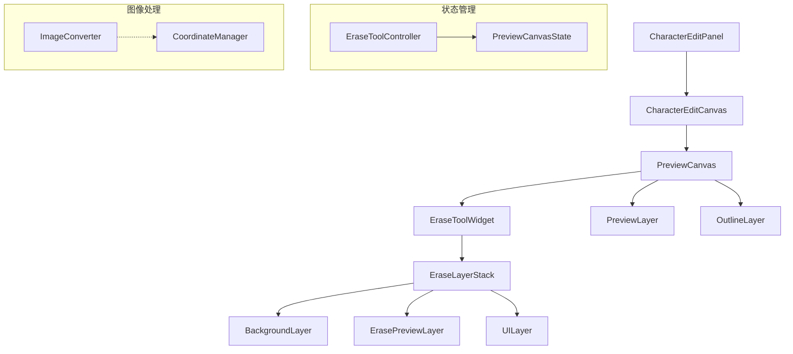

# EraseToolWidget 重构计划 V4

## 1. 系统架构



## 2. 组件职责

### 2.1 PreviewCanvas

```dart
class PreviewCanvas {
  // 核心功能
  - 图像加载和处理
  - 坐标系统管理
  - 状态同步
  - 交互事件分发
  
  // 图像处理
  - 反色处理
  - 轮廓检测
  - 擦除操作
}
```

### 2.2 EraseLayerStack

```dart
class EraseLayerStack {
  // 核心功能
  - 图层管理
  - 事件路由
  - 性能优化
  
  // 图层组织
  - BackgroundLayer (底图)
  - ErasePreviewLayer (擦除预览)
  - UILayer (交互界面)
}
```

### 2.3 共享功能

```dart
class SharedFeatures {
  // 坐标转换
  - 设备坐标 -> 逻辑坐标
  - 逻辑坐标 -> 图像坐标
  
  // 性能监控
  - 帧率监控
  - 内存使用
  - 渲染性能
}
```

## 3. 实现策略

### 3.1 第一阶段：基础框架（3天）

1. 重构PreviewCanvas
   - 简化内部逻辑
   - 提取共享功能
   - 优化状态管理

2. 优化EraseLayerStack
   - 实现标准图层接口
   - 添加事件路由系统
   - 集成性能监控

3. 完善控制器
   - 统一状态管理
   - 优化事件处理
   - 添加错误处理

### 3.2 第二阶段：功能集成（2天）

1. 图层整合
   - 实现BackgroundLayer
   - 优化PreviewLayer
   - 改进UILayer

2. 交互优化
   - Alt键功能
   - 手势处理
   - 坐标转换

3. 性能优化
   - 缓存机制
   - 局部更新
   - 内存管理

### 3.3 第三阶段：测试和优化（2天）

1. 单元测试
   - 坐标转换测试
   - 事件处理测试
   - 图层渲染测试

2. 集成测试
   - 功能集成测试
   - 性能压力测试
   - 内存泄漏测试

## 4. 关键实现点

### 4.1 PreviewCanvas重构

```dart
class PreviewCanvas {
  // 状态管理优化
  final _state = PreviewCanvasState();
  
  // 事件处理简化
  void handlePointerEvent(PointerEvent event) {
    if (!_shouldHandleEvent(event)) return;
    _state.processEvent(event);
  }
  
  // 图层管理
  Widget buildLayers() {
    return Stack(
      children: [
        _buildBackgroundLayer(),
        _buildEraseLayer(),
        _buildUILayer(),
      ],
    );
  }
}
```

### 4.2 性能优化机制

```dart
class PerformanceOptimization {
  // 局部更新策略
  Rect? getDirtyRegion() {
    return _calculateUpdateRegion();
  }
  
  // 缓存管理
  void manageCache() {
    _cleanupUnusedCache();
    _updateActiveCache();
  }
  
  // 内存监控
  void monitorMemory() {
    _checkMemoryUsage();
    _triggerCleanupIfNeeded();
  }
}
```

### 4.3 错误处理

```dart
class ErrorHandler {
  // 错误恢复
  Future<void> handleError(Exception e) async {
    await _saveState();
    _notifyError(e);
    await _restoreLastStable();
  }
  
  // 状态恢复
  Future<void> restoreState() async {
    final snapshot = await _loadLastSnapshot();
    await _applySnapshot(snapshot);
  }
}
```

## 5. 交付标准

### 5.1 功能验证

- [ ] 基础图像显示正常
- [ ] 反色处理正确
- [ ] 轮廓显示准确
- [ ] 擦除功能流畅
- [ ] Alt键功能正常
- [ ] 交互响应及时

### 5.2 性能指标

- [ ] 渲染帧率 ≥ 58fps
- [ ] 内存峰值 ≤ 200MB
- [ ] 响应延迟 ≤ 16ms
- [ ] 加载时间 ≤ 1s

### 5.3 代码质量

- [ ] 测试覆盖率 ≥ 80%
- [ ] 无内存泄漏
- [ ] 文档完整
- [ ] 代码规范

## 6. 风险管理

### 6.1 技术风险

- 图像处理性能问题
- 内存使用过高
- 状态同步异常

### 6.2 解决方案

1. 性能优化
   - 使用缓存策略
   - 实现局部更新
   - 优化内存使用

2. 稳定性保证
   - 完善错误处理
   - 添加状态恢复
   - 实现性能监控

3. 用户体验
   - 优化响应速度
   - 添加加载提示
   - 实现平滑过渡
