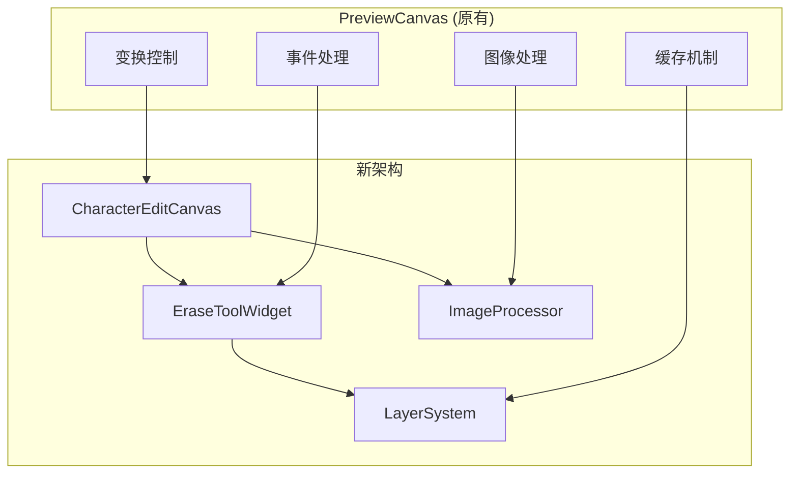

# EraseToolWidget 重构计划 V5

## 1. 功能迁移关系图



## 2. 新组件职责

### 2.1 CharacterEditCanvas

```dart
class CharacterEditCanvas extends StatefulWidget {
  // 从PreviewCanvas迁移功能
  - 图像加载和管理
  - 变换控制
  - 图像处理调度
  - 状态管理
}
```

### 2.2 EraseToolWidget

```dart
class EraseToolWidget extends StatefulWidget {
  // 核心功能
  - 图层系统管理
  - 擦除操作处理
  - 事件路由
  - 性能优化
}
```

### 2.3 图层系统

```dart
abstract class BaseLayer {
  // 基础功能
  - 渲染管理
  - 缓存控制
  - 事件处理
  - 状态同步
}

// 具体图层实现
class BackgroundLayer extends BaseLayer {
  - 图像显示
  - 反色处理
  - 缓存优化
}

class OutlineLayer extends BaseLayer {
  - 轮廓渲染
  - 实时更新
}

class EraseLayer extends BaseLayer {
  - 擦除预览
  - 路径管理
}
```

## 3. 实现步骤

### 3.1 第一阶段：基础迁移（3天）

1. 创建新的基础架构
   - 实现CharacterEditCanvas
   - 搭建图层系统
   - 设置事件路由

2. 移植核心功能
   - 图像处理逻辑
   - 缓存机制
   - 交互处理

3. 状态管理迁移
   - 创建状态管理器
   - 迁移状态逻辑
   - 实现状态同步

### 3.2 第二阶段：功能完善（2天）

1. 实现图层系统
   - 背景图层
   - 轮廓图层
   - 擦除图层

2. 优化性能
   - 实现智能缓存
   - 优化渲染逻辑
   - 改进事件处理

3. 完善交互
   - Alt键功能
   - 手势处理
   - 反馈机制

### 3.3 第三阶段：优化和测试（2天）

1. 性能优化
   - 内存使用优化
   - 渲染性能优化
   - 交互响应优化

2. 测试验证
   - 功能测试
   - 性能测试
   - 内存测试

## 4. 关键实现细节

### 4.1 图像处理服务

```dart
class ImageProcessor {
  // 处理流程
  Future<ProcessedImage> process(ImageData input) async {
    final result = await compute(_processInIsolate, input);
    return ProcessedImage(
      image: result.image,
      outline: result.outline,
      metadata: result.metadata,
    );
  }

  // 缓存机制
  final _cache = ImageCache();
  
  // 性能优化
  void optimizeMemory() {
    _cache.clear();
    _triggerGC();
  }
}
```

### 4.2 图层管理

```dart
class LayerManager {
  // 图层注册
  void registerLayer(BaseLayer layer) {
    _layers.add(layer);
    _setupLayerCallbacks(layer);
  }

  // 更新处理
  void updateLayers() {
    for (final layer in _layers) {
      if (layer.needsUpdate) {
        layer.update();
      }
    }
  }

  // 事件分发
  void dispatchEvent(LayerEvent event) {
    for (final layer in _layers.reversed) {
      if (layer.handleEvent(event)) break;
    }
  }
}
```

### 4.3 状态同步

```dart
class StateManager {
  // 状态定义
  final _state = StateNotifier<EditState>();
  
  // 状态更新
  void updateState(EditState newState) {
    _state.value = newState;
    _notifyListeners();
  }
  
  // 状态恢复
  Future<void> restoreState(StateSnapshot snapshot) async {
    await _applySnapshot(snapshot);
    _notifyListeners();
  }
}
```

## 5. 迁移策略

### 5.1 功能迁移顺序

1. 基础功能
   - 图像加载
   - 变换控制
   - 事件处理

2. 增强功能
   - 反色处理
   - 轮廓检测
   - 擦除操作

3. 优化功能
   - 缓存机制
   - 性能优化
   - 错误处理

### 5.2 兼容性保证

1. 接口兼容
   - 保持原有API
   - 渐进式替换
   - 向后兼容

2. 数据兼容
   - 状态迁移
   - 数据转换
   - 缓存迁移

### 5.3 性能保证

1. 性能监控
   - 帧率监控
   - 内存监控
   - 响应延迟

2. 优化措施
   - 智能缓存
   - 局部更新
   - 异步处理

## 6. 验收标准

### 6.1 功能完整性

- [ ] 所有PreviewCanvas功能迁移完成
- [ ] 新增功能正常工作
- [ ] 无功能退化

### 6.2 性能指标

- [ ] 渲染性能不低于原有实现
- [ ] 内存使用得到优化
- [ ] 交互响应更流畅

### 6.3 代码质量

- [ ] 结构清晰
- [ ] 代码可维护
- [ ] 测试完善

## 7. 回滚预案

### 7.1 快速回滚

1. 保留原有代码
2. 使用特性开关
3. 监控异常

### 7.2 数据恢复

1. 状态备份
2. 数据迁移
3. 缓存恢复
