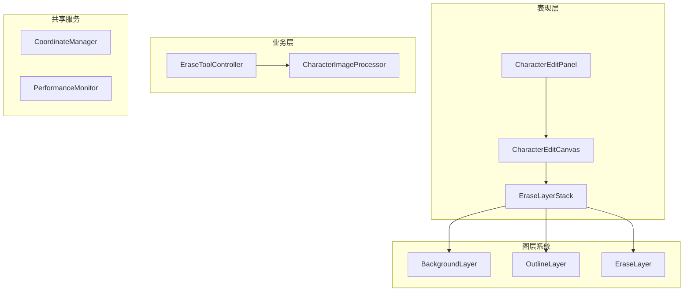

# EraseToolWidget 重构计划 V6

## 1. 系统架构



## 2. 复用策略

### 2.1 直接复用

```dart
// CharacterImageProcessor中的功能
- 图像处理逻辑
- 缓存机制
- 异步处理
- 错误处理
```

### 2.2 需要适配

```dart
// 改造原有功能
class CharacterEditCanvas {
  final characterImageProcessor = ref.watch(characterImageProcessorProvider);
  
  Future<void> processImage() async {
    final result = await characterImageProcessor.previewProcessing(
      imageData,
      region,
      options,
      erasePoints,
    );
    // 更新UI
  }
}
```

## 3. 实现步骤

### 3.1 第一阶段：基础框架（2天）

1. 创建图层架构
   - 实现BaseLayer
   - 设置图层管理
   - 配置事件系统

2. 集成图像处理
   - 复用CharacterImageProcessor
   - 添加处理回调
   - 实现结果更新

### 3.2 第二阶段：交互功能（2天）

1. 实现Alt功能
   - 键盘事件处理
   - 模式切换
   - 光标管理

2. 坐标转换
   - 设备坐标转换
   - 图像坐标映射
   - 缩放处理

### 3.3 第三阶段：优化（2天）

1. 性能优化
   - 使用RepaintBoundary
   - 实现局部更新
   - 添加缓存机制

2. 异常处理
   - 错误恢复
   - 状态同步
   - 日志记录

## 4. 具体实现

### 4.1 CharacterEditCanvas

```dart
class CharacterEditCanvas extends ConsumerStatefulWidget {
  final characterImageProcessor = ref.watch(characterImageProcessorProvider);
  
  @override
  ConsumerState<CharacterEditCanvas> createState() {
    return _CharacterEditCanvasState();
  }
}

class _CharacterEditCanvasState extends ConsumerState<CharacterEditCanvas> {
  // 状态管理
  late final _transformationController = TransformationController();
  
  // 图像处理
  Future<void> _processImage() async {
    final result = await widget.characterImageProcessor.previewProcessing(
      imageData,
      currentRegion,
      currentOptions,
      currentErasePoints,
    );
    
    if (mounted) {
      setState(() {
        _processedImage = result.processedImage;
        _currentOutline = result.outline;
      });
    }
  }
}
```

### 4.2 LayerManager

```dart
class LayerManager {
  // 图层注册
  void registerLayer(BaseLayer layer) {
    _layers[layer.type] = layer;
  }
  
  // 更新管理
  void updateLayer(LayerType type, {Rect? region}) {
    final layer = _layers[type];
    if (layer != null) {
      layer.update(region: region);
    }
  }
  
  // 性能优化
  void optimizeLayers() {
    for (final layer in _layers.values) {
      layer.optimize();
    }
  }
}
```

### 4.3 EraseToolController

```dart
class EraseToolController extends StateNotifier<EraseToolState> {
  final CharacterImageProcessor _processor;
  
  Future<void> handleErase(List<Offset> points) async {
    // 处理擦除
    final result = await _processor.previewProcessing(
      state.imageData,
      state.region,
      state.options,
      points,
    );
    
    // 更新状态
    state = state.copyWith(
      processedImage: result.processedImage,
      outline: result.outline,
    );
  }
}
```

## 5. 测试策略

### 5.1 单元测试

```dart
void main() {
  group('CharacterEditCanvas Tests', () {
    test('should correctly process image', () async {
      final canvas = CharacterEditCanvas();
      final result = await canvas.processImage();
      expect(result, isNotNull);
    });
  });
}
```

### 5.2 集成测试

```dart
void main() {
  testWidgets('should handle erase operation', (tester) async {
    await tester.pumpWidget(CharacterEditPanel());
    await tester.tap(find.byType(EraseToolWidget));
    await tester.pump();
    
    expect(find.byType(EraseLayer), findsOneWidget);
  });
}
```

## 6. 注意事项

### 6.1 性能优化

- 使用Isolate处理图像
- 实现智能缓存
- 优化重绘区域

### 6.2 内存管理

- 及时释放资源
- 控制缓存大小
- 监控内存使用

### 6.3 错误处理

- 优雅降级
- 状态恢复
- 用户反馈
