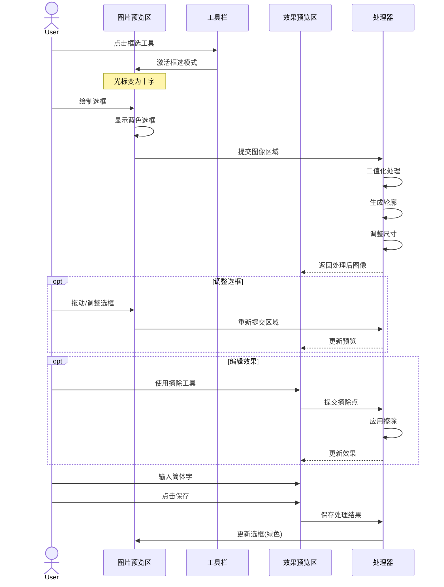
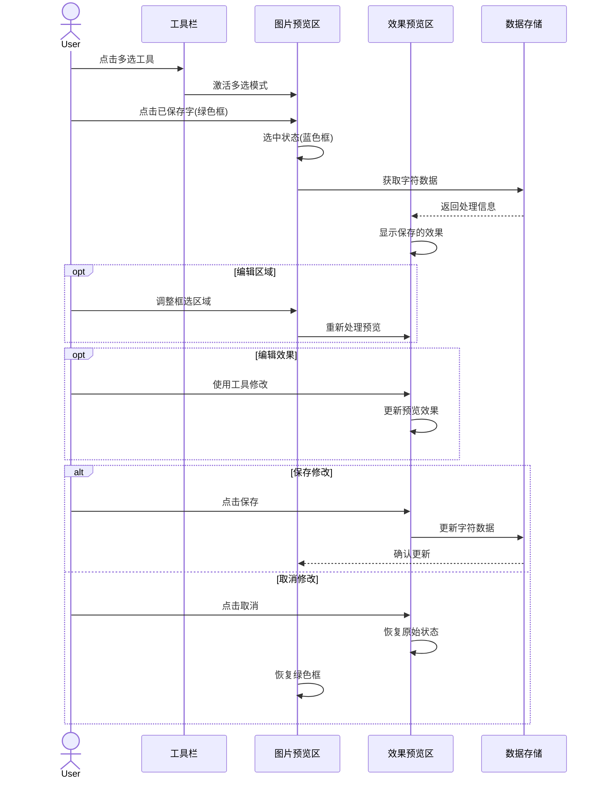
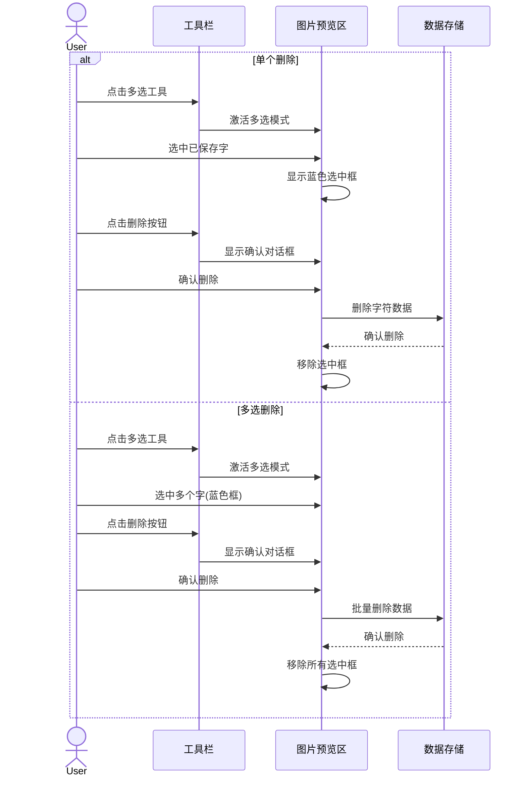
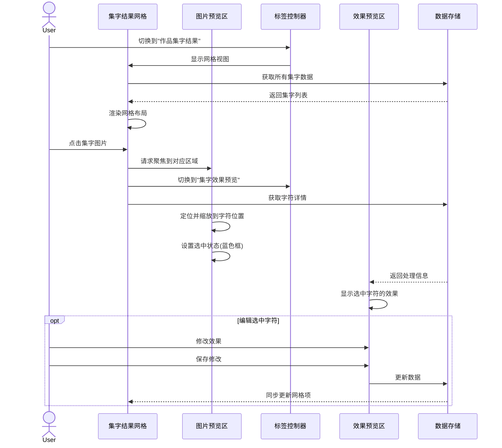

# 集字功能实现方案（修订版）

根据需求和现有文档，我设计了以下集字功能的实现方案：

## 一、界面设计

### 主界面布局

```text
+--------------------------------------------------------------+
| 导航栏 [返回] [集字功能] [帮助]          [最小化] [关闭]    |
+--------------------------------------------------------------+
|                          |                                    |
|      图片预览区          |         右侧面板（标签页）         |
|                          |  [集字效果预览] [作品集字结果]     |
| [✋] [□] [▣] [🗑️]       | +--------------------------------+ |
| +----------------------+ | |                                | |
| |                      | | |        内容区域                | |
| |      原始图片        | | |                                | |
| |                      | | |  * 标签页1: 集字效果预览       | |
| |    * 已保存框线      | | |    - 二值化显示                | |
| |    * 当前选择框      | | |    - 擦除区域                  | |
| |    * 缩放/平移       | | |    - 轮廓线显示                | |
| |                      | | |    - [工具栏]                  | |
| +----------------------+ | |  * 标签页2: 作品集字结果       | |
|                          | |    - 网格展示集字图片          | |
| 缩略图区域:              | |    - 点击跳转到对应字          | |
| [缩略图1][缩略图2]...    | |                                | |
|                          | +--------------------------------+ |
+--------------------------------------------------------------+
```

### 导航栏设计

导航栏包含以下元素：

- **返回按钮**：点击返回上一页面（作品详情页）
- **页面标题**：显示"集字功能"标题
- **帮助按钮**：点击显示集字功能操作指南弹窗
- **扩展菜单**（可选）：包含高级选项如导出、重置等

导航栏在不同状态下的变化：

- **未保存状态**：显示退出确认提示
- **批量操作状态**：显示选中数量和批量操作按钮
- **处理中状态**：显示进度指示器
  
### 标签页设计

右侧面板分为两个标签页：

1. **集字效果预览标签页**
   - 顶部工具栏：[◐反转] [☆轮廓] [✎擦除] [撤销] [重做]
   - 中部预览区：显示当前处理的字符效果
   - 底部信息区：当前尺寸、字符输入、操作按钮

2. **作品集字结果标签页**

- 以网格方式展示当前作品的所有集字图片
- 每个集字图片下方显示对应的汉字
- 提供搜索、筛选功能（可选）
- 支持批量操作（可选）

### 状态变化示意

1. **默认状态**
   - 预览区显示原图，已收集字显示绿色框线
   - 工具栏待选状态，拖拽工具激活
   - 导航栏显示基本导航元素

2. **框选状态**
   - 框选工具激活（蓝色高亮）
   - 鼠标显示为十字光标
   - 拖动时显示蓝色选框
   - 右侧实时显示处理效果
   - 导航栏显示"框选模式"状态提示

3. **编辑已保存字状态**
   - 选中的绿色框变为蓝色
   - 右侧显示该字的处理效果
   - 可调整框大小和位置
   - 导航栏显示"编辑模式"和字符信息

4. **多选状态**
   - 多选工具激活
   - 点击选中的框线变为蓝色
   - 右侧显示最后选中字的效果
   - 导航栏显示已选中的字符数量

5. **擦除状态**
   - 擦除工具激活
   - 右侧预览区可进行擦除操作
   - 显示擦除轨迹，实时更新效果
   - 导航栏显示"擦除模式"状态提示

6. **集字结果浏览状态**
   - 右侧标签页切换到"作品集字结果"
   - 网格展示所有已集字图片
   - 点击某个集字图片时：

   - 左侧预览区自动聚焦到该字所在位置
   - 该字区域线框变为选中状态（蓝色）
   - 右侧标签页自动切换回"集字效果预览"显示该字

## 二、组件结构

```dart
CharacterCollectionPage
├── NavigationBar                 // 导航栏（替换原AppBar）
│   ├── BackButton                // 返回按钮
│   ├── PageTitle                 // 页面标题
│   ├── HelpButton                // 帮助按钮
│   └── ContextActions            // 上下文操作按钮
│
├── Row
│   ├── ImagePreviewPanel          // 左侧图片预览区
│   │   ├── PreviewToolbar         // 工具栏
│   │   ├── ImageView              // 图片显示
│   │   │   └── SelectionOverlay   // 选框层
│   │   └── ThumbnailList          // 缩略图列表（考虑复用EnhancedWorkPreview组件）
│   │
│   └── RightPanel                 // 右侧面板（使用TabBarView）
│       ├── TabBar                 // 标签栏
│       │   ├── Tab("集字效果预览")
│       │   └── Tab("作品集字结果")
│       │
│       └── TabBarView             // 标签内容
│           ├── CharacterEditPanel // 标签1: 集字效果预览
│           │   ├── EditToolbar    // 编辑工具栏
│           │   ├── PreviewCanvas  // 预览画布
│           │   │   ├── BinaryImage // 二值化图像
│           │   │   ├── OutlineLayer // 轮廓层
│           │   │   └── EraseLayer // 擦除层
│           │   ├── SizeIndicator  // 尺寸指示器
│           │   ├── CharacterInput // 字符输入
│           │   └── ActionButtons  // 操作按钮
│           │
│           └── CharacterGridView  // 标签2: 作品集字结果
│               ├── SearchBar      // 搜索栏（可选）
│               ├── FilterOptions  // 筛选选项（可选）
│               └── CharacterGrid  // 集字网格
│                   └── CharacterTile // 集字图片项
```

## 三、交互流程

### 1. 框选新字流程



### 2. 编辑已保存字流程



### 3. 删除操作流程



### 4. 集字结果浏览流程



## 四、数据处理流程

### 1. 图像处理流程

```text
原图区域 → 裁剪 → 二值化 → 去噪 → 轮廓检测 → 尺寸调整 → 效果预览
```

处理步骤详解：

1. **裁剪**：从原图框选区域裁剪图像
2. **二值化**：将图像转换为黑白二值图像
   - 使用自适应阈值或Otsu算法
   - 支持反转功能处理黑底白字
3. **去噪处理**：
   - 去除小型噪点
   - 形态学操作（腐蚀/膨胀）清理边缘
4. **轮廓检测**：
   - 检测文字主要轮廓
   - 生成包围文字的最小矩形
5. **尺寸调整**：
   - 等比例缩放至300x300
   - 不足部分填充透明背景

### 2. 擦除处理

```text
用户擦除操作 → 收集擦除点 → 应用Alpha蒙版 → 更新轮廓 → 更新预览
```

- 使用路径记录擦除轨迹
- 应用可配置宽度的擦除笔刷
- 支持撤销/重做操作历史记录

### 3集字结果展示处理流程

```text
获取集字列表 → 加载缩略图 → 渲染网格 → 响应选择 → 同步到预览区
```

处理步骤详解：

1. **获取集字列表**：
    - 从数据库加载所有与当前作品相关的集字记录
    - 支持按字符、收藏状态等筛选
2. **加载集字缩略图**：
   - 异步加载所有缩略图
   - 使用占位符显示加载中状态
   - 采用延迟加载策略减轻初始加载负担
3. **渲染网格视图**：
   - 采用GridView实现网格布局
   - 支持响应式布局调整列数
   - 显示字符信息和快捷操作按钮
4. **响应选择操作**：
   - 记录当前选中的字符ID
   - 触发标签页切换
   - 发送聚焦请求到图片预览区
5. **同步更新**：
   - 集字修改后自动更新网格视图
   - 保持数据一致性

## 五、数据模型

```dart
// 集字区域模型
class CharacterRegion {
  final String id;
  final String pageId;
  final Rect rect;           // 选框位置和大小
  final double rotation;     // 旋转角度
  final String character;    // 对应的汉字
  final DateTime createdAt;
  final DateTime updatedAt;
  
  // 处理相关参数
  final ProcessingOptions options;
  final List<Offset>? erasePoints;  // 擦除点
}

// 处理选项
class ProcessingOptions {
  final bool inverted;       // 是否反转
  final bool showContour;    // 是否显示轮廓
  final double threshold;    // 二值化阈值
  final double noiseReduction; // 降噪程度
}

// 集字图片类
class CharacterImage {
  final String id;
  final String originalPath;    // 原始裁剪图路径
  final String binaryPath;      // 二值化图路径
  final String thumbnailPath;   // 缩略图路径
  final String svgPath;         // SVG轮廓路径
  final Size originalSize;      // 原始尺寸
  final ProcessingOptions options;
}
```

## 六、文件存储结构

```text
storage/
├── characters/
│   └── {charId}/
│       ├── original.png     # 原图裁剪 (实际尺寸)
│       ├── binary.png       # 二值化图像 (300x300)
│       ├── thumbnail.jpg    # 缩略图 (50x50)
│       └── outline.svg      # SVG轮廓
└── cache/
    └── processing/          # 处理缓存
        └── temp/            # 临时文件
```

## 七、性能优化策略

### 1. 图像处理优化

- **增量处理**：只处理变化的部分
- **后台处理**：使用Isolate在后台线程处理图像
- **缓存机制**：缓存处理结果避免重复计算
- **延迟加载**：仅在需要时加载高分辨率图像

### 2. UI渲染优化

- **自定义绘制**：使用CustomPainter高效绘制选框和轮廓
- **局部刷新**：使用RepaintBoundary隔离频繁刷新区域
- **显示优化**：图片处理过程中显示低分辨率预览

### 3. 内存管理

```dart
// 缓存管理示例
class ImageCacheManager {
  // 限制缓存大小
  final int maxCacheSize = 50 * 1024 * 1024; // 50MB
  int currentSize = 0;
  
  // LRU缓存策略
  final Map<String, CacheEntry> _cache = LinkedHashMap<String, CacheEntry>();
  
  // 缓存清理
  void _trimCache() {
    if (currentSize > maxCacheSize) {
      // 移除最早使用的项目直到缓存大小合适
    }
  }
  
  // 资源监控
  void monitorMemory() {
    // 定期检查内存使用情况
    // 在内存压力大时主动清理缓存
  }
}
```

## 八、代码实现示例

### 1. 框选工具实现

```dart
class SelectionTool extends StatefulWidget {
  final Function(Rect) onSelectionChanged;
  
  const SelectionTool({Key? key, required this.onSelectionChanged}) : super(key: key);
  
  @override
  _SelectionToolState createState() => _SelectionToolState();
}

class _SelectionToolState extends State<SelectionTool> {
  Offset? _startPoint;
  Rect? _currentRect;
  
  @override
  Widget build(BuildContext context) {
    return GestureDetector(
      onPanStart: (details) {
        setState(() {
          _startPoint = details.localPosition;
          _currentRect = Rect.fromPoints(_startPoint!, _startPoint!);
        });
      },
      onPanUpdate: (details) {
        if (_startPoint != null) {
          setState(() {
            _currentRect = Rect.fromPoints(_startPoint!, details.localPosition);
          });
          widget.onSelectionChanged(_currentRect!);
        }
      },
      onPanEnd: (_) {
        // 完成选择
        _startPoint = null;
      },
      child: CustomPaint(
        painter: SelectionPainter(_currentRect),
        child: Container(
          color: Colors.transparent,
          width: double.infinity,
          height: double.infinity,
        ),
      ),
    );
  }
}

class SelectionPainter extends CustomPainter {
  final Rect? rect;
  
  SelectionPainter(this.rect);
  
  @override
  void paint(Canvas canvas, Size size) {
    if (rect == null) return;
    
    final paint = Paint()
      ..color = Colors.blue
      ..style = PaintingStyle.stroke
      ..strokeWidth = 2.0;
      
    canvas.drawRect(rect!, paint);
  }
  
  @override
  bool shouldRepaint(SelectionPainter oldDelegate) => rect != oldDelegate.rect;
}
```

### 2. 处理服务实现

```dart
class ProcessingService {
  final CacheManager _cacheManager;
  
  ProcessingService(this._cacheManager);
  
  Future<ProcessingResult> processCharacterRegion(
    Uint8List imageData, 
    Rect region, 
    ProcessingOptions options
  ) async {
    // 生成缓存键
    final cacheKey = _generateCacheKey(imageData, region, options);
    
    // 检查缓存
    final cachedResult = await _cacheManager.get(cacheKey);
    if (cachedResult != null) {
      return cachedResult;
    }
    
    // 在Isolate中处理图像
    final result = await compute(_processImage, {
      'imageData': imageData,
      'region': region,
      'options': options,
    });
    
    // 缓存结果
    await _cacheManager.put(cacheKey, result);
    
    return result;
  }
  
  // 在隔离的线程中处理图像
  static Future<ProcessingResult> _processImage(Map<String, dynamic> params) async {
    final imageData = params['imageData'] as Uint8List;
    final region = params['region'] as Rect;
    final options = params['options'] as ProcessingOptions;
    
    // 1. 裁剪区域
    final croppedImage = await _cropImage(imageData, region);
    
    // 2. 二值化处理
    final binaryImage = await _binarize(croppedImage, options.threshold, options.inverted);
    
    // 3. 去噪处理
    final denoisedImage = await _denoise(binaryImage, options.noiseReduction);
    
    // 4. 检测轮廓
    final outline = await _detectOutline(denoisedImage);
    
    // 5. 尺寸调整
    final resizedImage = await _resizeToTarget(denoisedImage, 300, 300);
    
    // 6. 生成SVG轮廓
    final svgPath = await _generateSvgPath(outline);
    
    // 7. 生成缩略图
    final thumbnail = await _createThumbnail(resizedImage, 50, 50);
    
    return ProcessingResult(
      originalCrop: croppedImage,
      binaryImage: resizedImage,
      thumbnail: thumbnail,
      svgOutline: svgPath,
      boundingBox: outline
    );
  }
  
  // 其他处理方法...
}
```

### 3. 状态管理

```dart
@riverpod
class CharacterCollectionNotifier extends _$CharacterCollectionNotifier {
  late final CharacterService _service = ref.read(characterServiceProvider);
  
  @override
  FutureOr<CharacterCollectionState> build() async {
    return const CharacterCollectionState(
      regions: [],
      selectedIds: {},
      currentTool: Tool.pan,
      options: ProcessingOptions(
        inverted: false,
        showContour: false,
        threshold: 128,
        noiseReduction: 1.0,
      ),
      undoStack: [],
      processing: false,
    );
  }
  
  // 切换工具
  void setTool(Tool tool) {
    state = AsyncData(state.value!.copyWith(currentTool: tool));
  }
  
  // 创建新区域
  Future<void> createRegion(Rect rect) async {
    state = AsyncData(state.value!.copyWith(processing: true));
    
    try {
      final region = await _service.createRegion(rect);
      
      state = AsyncData(state.value!.copyWith(
        regions: [...state.value!.regions, region],
        currentId: region.id,
        processing: false,
      ));
    } catch (e) {
      state = AsyncData(state.value!.copyWith(
        error: e.toString(),
        processing: false,
      ));
    }
  }
  
  // 保存字符
  Future<void> saveCharacter(String character) async {
    final currentId = state.value!.currentId;
    if (currentId == null) return;
    
    state = AsyncData(state.value!.copyWith(processing: true));
    
    try {
      await _service.saveCharacter(currentId, character);
      
      // 更新区域列表
      final updatedRegions = state.value!.regions.map((region) {
        if (region.id == currentId) {
          return region.copyWith(character: character);
        }
        return region;
      }).toList();
      
      state = AsyncData(state.value!.copyWith(
        regions: updatedRegions,
        processing: false,
      ));
    } catch (e) {
      state = AsyncData(state.value!.copyWith(
        error: e.toString(),
        processing: false,
      ));
    }
  }
  
  // 更多方法...
}
```

### 4. 集字结果网格视图实现

```dart

class CharacterGridView extends StatelessWidget {
  final List<CharacterViewModel> characters;
  final Function(String id) onCharacterSelected;
  
  const CharacterGridView({
    Key? key,
    required this.characters,
    required this.onCharacterSelected,
  }) : super(key: key);
  
  @override
  Widget build(BuildContext context) {
    return Column(
      children: [
        // 可选的搜索和筛选UI
        Padding(
          padding: const EdgeInsets.all(8.0),
          child: TextField(
            decoration: InputDecoration(
              hintText: '搜索字符...',
              prefixIcon: Icon(Icons.search),
              border: OutlineInputBorder(
                borderRadius: BorderRadius.circular(8.0),
              ),
            ),
            // 搜索逻辑
          ),
        ),
        
        // 网格视图
        Expanded(
          child: GridView.builder(
            padding: const EdgeInsets.all(8.0),
            gridDelegate: SliverGridDelegateWithFixedCrossAxisCount(
              crossAxisCount: 4, // 可根据屏幕宽度动态调整
              childAspectRatio: 1.0,
              crossAxisSpacing: 8.0,
              mainAxisSpacing: 8.0,
            ),
            itemCount: characters.length,
            itemBuilder: (context, index) {
              final char = characters[index];
              return CharacterTile(
                character: char,
                onTap: () => onCharacterSelected(char.id),
              );
            },
          ),
        ),
      ],
    );
  }
}

class CharacterTile extends StatelessWidget {
  final CharacterViewModel character;
  final VoidCallback onTap;
  
  const CharacterTile({
    Key? key,
    required this.character,
    required this.onTap,
  }) : super(key: key);
  
  @override
  Widget build(BuildContext context) {
    final theme = Theme.of(context);
    
    return InkWell(
      onTap: onTap,
      borderRadius: BorderRadius.circular(8.0),
      child: Container(
        decoration: BoxDecoration(
          border: Border.all(color: theme.dividerColor),
          borderRadius: BorderRadius.circular(8.0),
        ),
        child: Column(
          mainAxisAlignment: MainAxisAlignment.center,
          children: [
            // 集字图片
            Expanded(
              child: Padding(
                padding: const EdgeInsets.all(4.0),
                child: Image.file(
                  File(character.thumbnailPath),
                  fit: BoxFit.contain,
                ),
              ),
            ),
            
            // 字符信息
            Container(
              width: double.infinity,
              padding: const EdgeInsets.symmetric(vertical: 4.0),
              color: theme.colorScheme.surfaceVariant,
              child: Text(
                character.character,
                textAlign: TextAlign.center,
                style: theme.textTheme.bodyMedium,
              ),
            ),
          ],
        ),
      ),
    );
  }
}
```

### 5. 标签页控制器实现

```dart
class RightPanelTabController extends StatefulWidget {
  final Widget editPanel;
  final Widget gridPanel;
  final int initialIndex;
  final Function(int) onTabChanged;
  
  const RightPanelTabController({
    Key? key,
    required this.editPanel,
    required this.gridPanel,
    this.initialIndex = 0,
    required this.onTabChanged,
  }) : super(key: key);
  
  @override
  _RightPanelTabControllerState createState() => _RightPanelTabControllerState();
}

class _RightPanelTabControllerState extends State<RightPanelTabController> with SingleTickerProviderStateMixin {
  late TabController _tabController;
  
  @override
  void initState() {
    super.initState();
    _tabController = TabController(
      length: 2,
      vsync: this,
      initialIndex: widget.initialIndex,
    );
    
    _tabController.addListener(() {
      if (!_tabController.indexIsChanging) {
        widget.onTabChanged(_tabController.index);
      }
    });
  }
  
  @override
  void dispose() {
    _tabController.dispose();
    super.dispose();
  }
  
  @override
  Widget build(BuildContext context) {
    final theme = Theme.of(context);
    
    return Column(
      children: [
        // 标签栏
        TabBar(
          controller: _tabController,
          tabs: [
            Tab(text: '集字效果预览'),
            Tab(text: '作品集字结果'),
          ],
          labelColor: theme.colorScheme.primary,
          unselectedLabelColor: theme.colorScheme.onSurface,
          indicatorColor: theme.colorScheme.primary,
        ),
        
        // 标签内容
        Expanded(
          child: TabBarView(
            controller: _tabController,
            children: [
              widget.editPanel,
              widget.gridPanel,
            ],
          ),
        ),
      ],
    );
  }
}

```

## 九、注意事项与挑战

1. **性能挑战**
   - 图像处理操作计算量大，需做好异步和缓存
   - 实时预览要保证低延迟反馈
   - 大图加载和处理需考虑内存限制

2. **用户体验优化**
   - 提供加载状态反馈
   - 重操作需要确认对话框
   - 操作错误提供撤销机制

3. **边界情况处理**
   - 图像质量不佳时提供手动调整选项
   - 处理失败时的恢复机制
   - 大体量数据的性能退化处理

通过以上设计和实现，可以实现一个功能完备、性能良好的集字功能模块，满足用户从图片中提取和管理汉字的需求。
