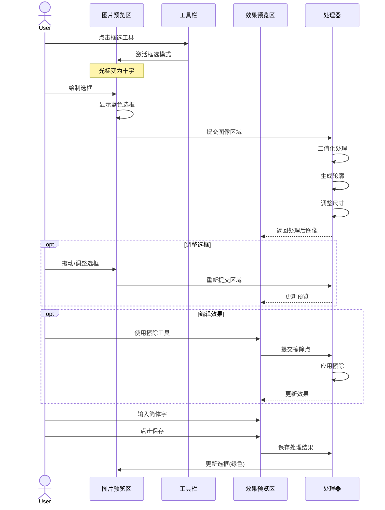
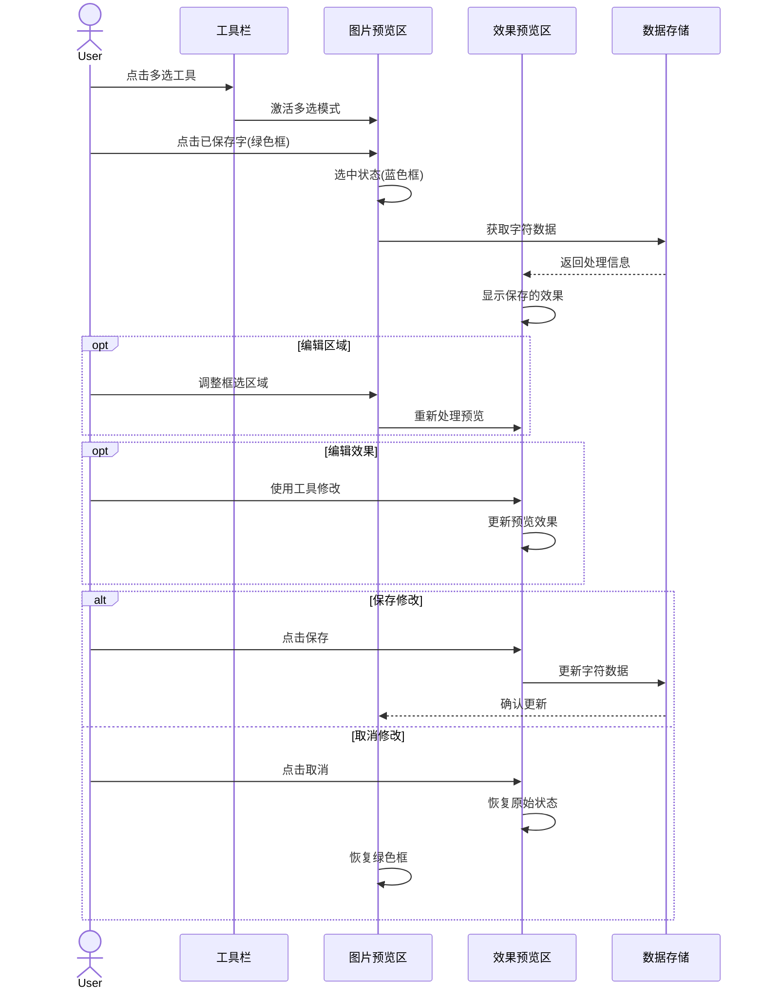
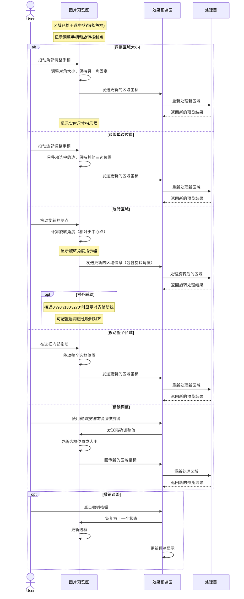
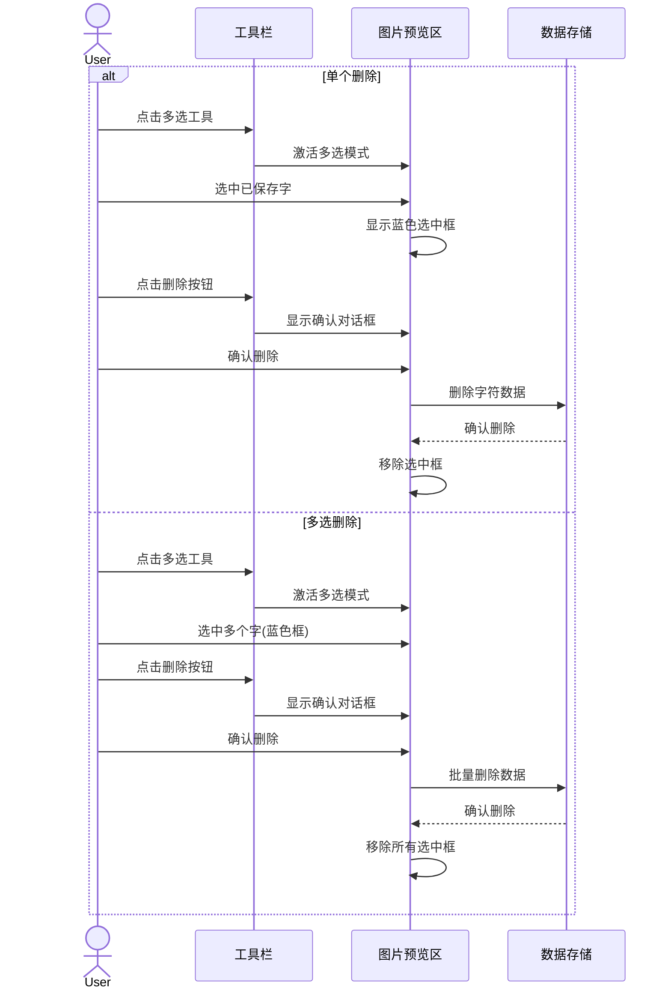
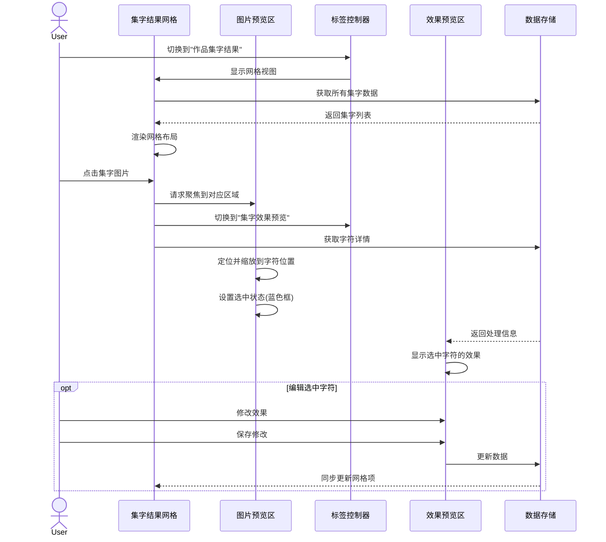
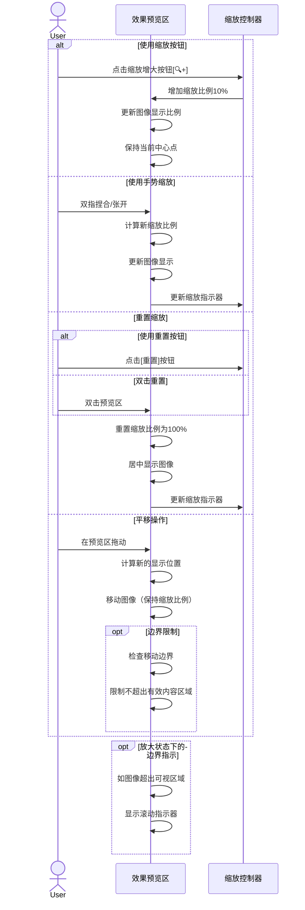

# 集字功能交互流程

本文档详细描述集字功能的主要交互流程，包括框选新字、编辑已保存字、删除操作和结果浏览等流程。

## 1. 框选新字流程

这个流程描述了用户如何从图片中框选并保存新的字符。

### 流程说明

1. **工具选择**：
   - 用户点击工具栏中的框选工具
   - 系统激活框选模式，图片预览区的光标变为十字形

2. **绘制选框**：
   - 用户在图片上拖动鼠标绘制选框
   - 系统显示蓝色的选框边界
   - 系统将选中的图像区域提交给处理器
   - 处理器进行初步处理并返回效果预览

3. **调整选框**（可选）：
   - 用户可以调整选框的大小和位置
   - 系统实时更新预览效果

4. **编辑效果**（可选）：
   - 用户可以使用擦除工具修改预览效果
   - 系统实时应用擦除操作并更新预览

5. **保存字符**：
   - 用户输入对应的简体汉字
   - 用户点击保存按钮
   - 系统保存处理结果
   - 图片预览区更新选框为已保存状态（绿色）

## 2. 编辑已保存字流程

这个流程描述了用户如何编辑已经保存的字符。

### 流程说明

1. **选择多选工具**：
   - 用户点击工具栏中的多选工具
   - 系统激活多选模式

2. **选择已保存字**：
   - 用户点击图片上已保存的字符（绿色框）
   - 系统将选中的框变为蓝色，表示选中状态
   - 系统从数据存储中获取该字符的处理信息
   - 效果预览区显示保存的效果

3. **编辑区域**（可选）：
   - 用户可以调整框选区域的大小和位置
   - 系统重新处理并更新预览效果

4. **编辑效果**（可选）：
   - 用户可以使用工具修改预览效果
   - 系统实时更新预览效果

5. **保存或取消**：
   - 如果用户点击保存，系统更新数据存储中的字符数据
   - 如果用户点击取消，系统恢复原始状态，选框恢复为绿色

### 区域调整详细交互流程

以下详细说明了如何调整已选中区域的大小、位置和旋转角度：

#### 调整操作详细说明

1. **调整区域大小**：
   - 当鼠标悬停在角部调整手柄上时，光标变为对角调整指针（↖↘或↗↙）
   - 拖动角部手柄时，对角点保持固定，实现非等比调整
   - 按住Shift键拖动时，保持选框宽高比例不变
   - 系统实时显示调整后的尺寸值

2. **调整单边位置**：
   - 当鼠标悬停在边部手柄上时，光标变为对应方向的调整指针（↔或↕）
   - 拖动时只调整对应边位置，保持其他三边固定
   - 适合做细微的边界调整

3. **旋转区域**：
   - 旋转控制点位于选框顶部中央偏上位置
   - 拖动旋转点时，以选框中心为旋转中心
   - 系统显示当前旋转角度值（0°-359°）
   - 按住Shift键旋转时，以15°为增量进行吸附对齐
   - 双击旋转点可快速重置为0°（不旋转状态）

4. **移动整个区域**：
   - 鼠标位于选框内部时，光标变为移动指针（十字箭头）
   - 拖动时移动整个选框位置，保持大小和旋转角度不变
   - 选框接近图像边界或其他选框时出现对齐辅助线

5. **精确调整**：
   - 右侧面板提供坐标、大小和角度的数值输入框
   - 支持直接输入精确值或点击上下调整按钮
   - 键盘方向键可实现像素级微调
   - 适合需要精确调整的场景

6. **撤销/重做**：
   - 系统记录调整历史
   - 用户可通过撤销/重做按钮或Ctrl+Z/Ctrl+Y快捷键恢复之前的调整状态

## 3. 删除操作流程

这个流程描述了用户如何删除已保存的字符，包括单个删除和批量删除。

### 流程说明

1. **单个删除**：
   - 用户点击多选工具并激活多选模式
   - 用户选中一个已保存的字符（蓝色框）
   - 用户点击删除按钮
   - 系统显示确认对话框
   - 用户确认删除
   - 系统从数据存储中删除字符数据
   - 系统从图片预览区移除选中框

2. **多选删除**：
   - 用户点击多选工具并激活多选模式
   - 用户选中多个已保存的字符（蓝色框）
   - 用户点击删除按钮
   - 系统显示确认对话框
   - 用户确认删除
   - 系统从数据存储中批量删除字符数据
   - 系统从图片预览区移除所有选中框

## 4. 集字结果浏览流程

这个流程描述了用户如何浏览和管理集字结果。

### 流程说明

1. **切换到结果视图**：
   - 用户点击标签切换到"作品集字结果"
   - 系统显示网格视图
   - 系统从数据存储中获取所有集字数据
   - 系统渲染网格布局，显示所有集字图片

2. **查看特定字符**：
   - 用户点击网格中的某个集字图片
   - 系统向图片预览区发送聚焦请求
   - 系统切换回"集字效果预览"标签
   - 系统从数据存储中获取字符详情

3. **聚焦显示**：
   - 图片预览区定位并缩放到字符位置
   - 系统设置选中状态（蓝色框）
   - 系统在效果预览区显示选中字符的效果

4. **编辑选中字符**（可选）：
   - 用户可以修改效果并保存
   - 系统更新数据存储
   - 系统同步更新网格视图中的对应项

## 5. 预览区缩放与平移流程

这个流程描述了用户如何在效果预览区缩放和平移查看字符细节。

### 流程说明

1. **使用缩放按钮**：
   - 用户点击界面上的缩放增大[🔍+]或缩小[🔍-]按钮
   - 系统以10%的增量调整缩放比例
   - 缩放以预览区中心点为基准
   - 系统更新缩放比例指示器

2. **使用手势缩放**：
   - 用户在预览区使用双指捏合/张开手势
   - 系统根据手势计算新的缩放比例
   - 缩放以手指中心点为基准
   - 缩放比例限制在50%-300%范围内
   - 系统更新缩放比例指示器

3. **重置缩放**：
   - 用户可以通过点击[重置]按钮或双击预览区重置视图
   - 系统将缩放比例重置为100%
   - 系统将图像居中显示
   - 系统更新缩放比例指示器

4. **平移操作**：
   - 当图像处于放大状态时，用户可以在预览区拖动
   - 系统根据拖动方向和距离计算新的显示位置
   - 系统移动图像，保持当前缩放比例不变
   - 系统限制平移范围，确保有效内容区域不会完全移出视图

5. **边界指示**：
   - 当图像超出可视区域时，系统显示滚动指示器
   - 指示器显示在相应边缘，提示用户图像可以继续平移
   - 当达到边界限制时，拖动不再产生移动效果

### 缩放与平移的应用场景

1. **细节检查**：
   - 放大查看字形细节，特别是复杂字符
   - 检查二值化效果是否保留了关键笔画细节

2. **擦除操作辅助**：
   - 放大后进行精细擦除操作，提高准确性
   - 配合擦除工具使用，可更精确地修改图像细节

3. **轮廓检查**：
   - 放大查看轮廓线的准确性
   - 识别潜在的噪点或笔画断裂

4. **比较视图**：
   - 在编辑已保存字时，放大比较原始处理效果和当前处理效果

## 6. 处理中状态与错误处理流程

以下流程说明了处理中状态和错误处理的交互：

1. **处理中状态**：
   - 进行耗时操作时，显示进度指示器
   - 用户界面响应性保持，允许取消操作
   - 完成后自动更新UI

2. **错误处理**：
   - 出现错误时显示错误消息
   - 提供重试和回退选项
   - 错误日志记录和可选的错误报告

3. **恢复机制**：
   - 保存操作历史以支持撤销/重做
   - 定期自动保存临时状态
   - 提供手动恢复选项

## 7. 快捷键与手势支持

为提高用户操作效率，系统支持以下快捷键和手势：

1. **键盘快捷键**：
   - `Ctrl+Z`：撤销
   - `Ctrl+Y`/`Ctrl+Shift+Z`：重做
   - `Delete`/`Backspace`：删除选中
   - `Escape`：取消当前操作/关闭对话框
   - `Ctrl+S`：保存当前操作

2. **触摸手势**：
   - 双指缩放：缩放图片
   - 双指平移：移动图片
   - 单指拖动：移动选框或图片
   - 单指轻点：选择对象
   - 双击：快速选中已有字符或重置缩放
