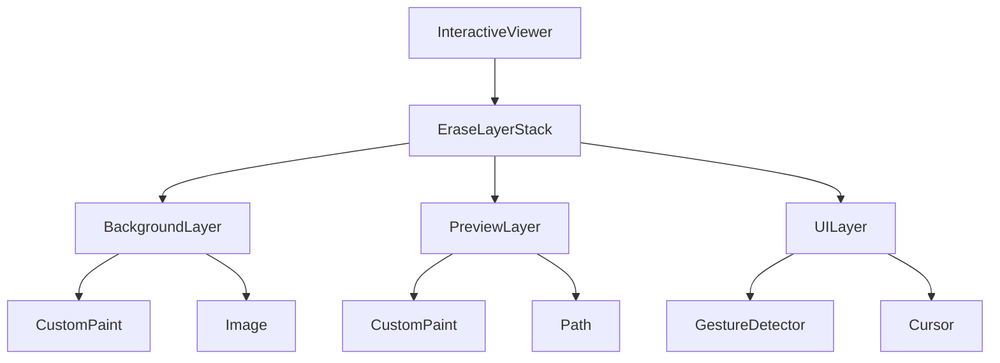
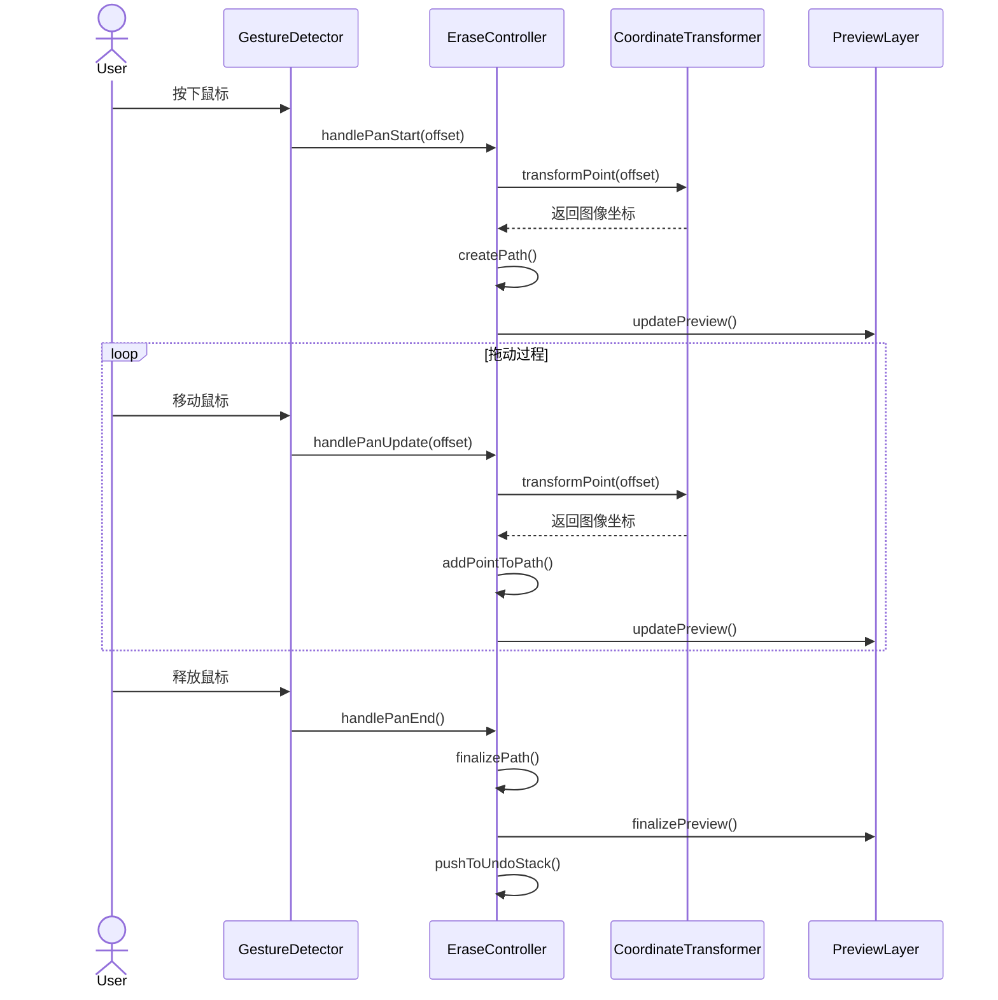
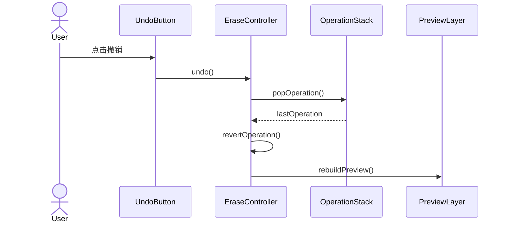
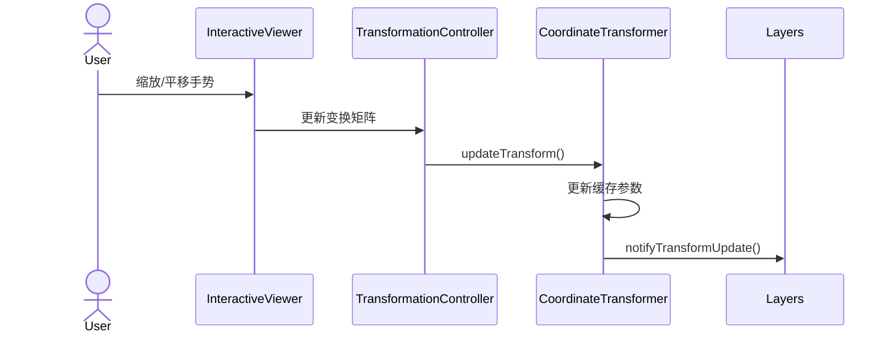

# CharacterEditPanel实现细节设计

## 1. 图层渲染架构详细设计

### 1.1 核心组件关系



### 1.2 组件功能说明

```dart
class EraseLayerStack extends StatelessWidget {
  final Widget backgroundLayer;  // 显示原始图像
  final Widget previewLayer;     // 显示擦除效果
  final Widget uiLayer;          // 处理交互和光标
  
  // 变换控制器，管理缩放和平移
  final TransformationController transformationController;
  
  // 视口大小变化监听
  final LayoutCallback onLayoutChanged;
}
```

## 2. 核心功能交互时序

### 2.1 擦除操作流程



### 2.2 撤销/重做操作



### 2.3 缩放平移响应



## 3. 坐标系统设计

### 3.1 坐标空间定义


### 3.2 坐标转换实现

```dart
class CoordinateTransformer {
  // 基础参数
  final Size viewportSize;
  final Size imageSize;
  Matrix4 transform;
  final double devicePixelRatio;
  
  // 缓存的变换参数
  double _scale = 1.0;
  Offset _translation = Offset.zero;
  
  // 计算实际缩放比例
  double get effectiveScale {
    return _scale * devicePixelRatio;
  }
  
  // 视口坐标到图像坐标的转换
  Offset viewportToImage(Offset viewportPoint) {
    // 1. 应用设备像素比
    final physicalPoint = viewportPoint * devicePixelRatio;
    
    // 2. 应用变换矩阵
    final transformedPoint = _transformPoint(physicalPoint);
    
    // 3. 应用偏移和缩放
    return (transformedPoint - _translation) / effectiveScale;
  }
  
  // 更新变换参数
  void updateTransform(Matrix4 newTransform) {
    transform = newTransform;
    _updateTransformParameters();
    _notifyListeners();
  }
  
  // 计算图像在容器中的布局信息
  Rect getImageLayoutRect() {
    final scale = _getEffectiveScale();
    final size = imageSize * scale;
    final offset = _calculateCenterOffset(size);
    return offset & size;
  }
}
```

### 3.3 窗体大小变化处理

```dart
void handleSizeChange(Size newSize) {
  // 1. 更新视口大小
  _viewportSize = newSize;
  
  // 2. 重新计算缩放比例
  _updateScale();
  
  // 3. 调整图像位置
  _adjustImagePosition();
  
  // 4. 更新所有依赖布局的组件
  _notifyLayoutDependents();
}
```

## 4. 性能优化策略

### 4.1 渲染优化

```dart
class OptimizedPreviewLayer extends CustomPainter {
  // 脏区域追踪
  final Rect? _dirtyRect;
  
  // 路径缓存
  final List<Path> _cachedPaths;
  final Path? _currentPath;
  
  @override
  void paint(Canvas canvas, Size size) {
    // 1. 应用裁剪区域
    if (_dirtyRect != null) {
      canvas.clipRect(_dirtyRect!);
    }
    
    // 2. 绘制缓存的路径
    for (final path in _cachedPaths) {
      _drawPath(canvas, path);
    }
    
    // 3. 绘制当前路径
    if (_currentPath != null) {
      _drawPath(canvas, _currentPath!);
    }
  }
  
  @override
  bool shouldRepaint(covariant OptimizedPreviewLayer oldDelegate) {
    // 智能判断是否需要重绘
    if (_dirtyRect != oldDelegate._dirtyRect) return true;
    if (_currentPath != oldDelegate._currentPath) return true;
    if (_cachedPaths.length != oldDelegate._cachedPaths.length) return true;
    return false;
  }
}
```

### 4.2 内存管理

```dart
class EraseOperationManager {
  // 操作历史栈大小限制
  static const int maxOperations = 50;
  
  // 路径点缓冲区
  final Queue<Offset> _pointBuffer = Queue<Offset>();
  static const int maxBufferSize = 1000;
  
  // 智能清理策略
  void cleanup() {
    // 1. 清理过旧的操作
    while (_operations.length > maxOperations) {
      final op = _operations.removeFirst();
      op.dispose();
    }
    
    // 2. 清理点缓冲区
    while (_pointBuffer.length > maxBufferSize) {
      _pointBuffer.removeFirst();
    }
    
    // 3. 触发垃圾回收
    _scheduleGC();
  }
}
```

### 4.3 手势优化

```dart
class OptimizedGestureHandler {
  // 使用节流控制更新频率
  static const throttleDuration = Duration(milliseconds: 16);
  DateTime _lastUpdate = DateTime.now();
  
  // 点采样优化
  static const double minDistance = 5.0;
  Offset? _lastPoint;
  
  void handlePanUpdate(DragUpdateDetails details) {
    final now = DateTime.now();
    if (now.difference(_lastUpdate) < throttleDuration) {
      return;
    }
    
    final point = details.localPosition;
    if (_lastPoint != null) {
      final distance = (point - _lastPoint!).distance;
      if (distance < minDistance) {
        return;
      }
    }
    
    _lastPoint = point;
    _lastUpdate = now;
    _processUpdate(details);
  }
}
```

## 5. 异常处理机制

### 5.1 资源加载异常

```dart
Future<void> loadImage() async {
  try {
    final image = await _loadImageData();
    _initializeWithImage(image);
  } catch (e) {
    _handleLoadError(e);
    _fallbackToErrorState();
  } finally {
    _updateLoadingState(false);
  }
}
```

### 5.2 操作错误恢复

```dart
void handleOperationError(dynamic error) {
  // 1. 记录错误状态
  _logError(error);
  
  // 2. 回滚到上一个稳定状态
  _rollbackToLastStable();
  
  // 3. 恢复图层状态
  _resetLayerStates();
  
  // 4. 通知用户
  _notifyError(error);
}
```

## 6. 监控与调试

### 6.1 性能指标

- 擦除操作响应时间 < 30ms
- 内存使用峰值 < 200MB
- 帧率保持 60fps
- 图层切换延迟 < 16ms

### 6.2 监控实现

```dart
class PerformanceMonitor {
  // 性能追踪
  void trackOperation(String name, Function operation) {
    final startTime = DateTime.now().microsecondsSinceEpoch;
    operation();
    final endTime = DateTime.now().microsecondsSinceEpoch;
    
    final duration = (endTime - startTime) / 1000; // 转换为毫秒
    _logMetric(name, duration);
    
    // 检查是否超过阈值
    if (duration > 30) {
      _reportPerformanceIssue(name, duration);
    }
  }
  
  // 内存监控
  void checkMemoryUsage() {
    final usage = _getCurrentMemoryUsage();
    if (usage > 200 * 1024 * 1024) { // 200MB
      _triggerMemoryWarning();
    }
  }
  
  // 帧率监控
  void monitorFrameRate() {
    final fps = _getCurrentFPS();
    if (fps < 55) {
      _reportLowFPS(fps);
    }
  }
}
```

### 6.3 调试功能

```dart
class DebugOptions {
  // 调试选项
  final bool showGrid;
  final bool showTouchPoints;
  final bool showUpdateRegions;
  final bool logCoordinates;
  
  // 调试绘制
  void debugPaint(Canvas canvas, Size size) {
    if (showGrid) {
      _drawDebugGrid(canvas, size);
    }
    
    if (showTouchPoints) {
      _drawTouchPoints(canvas);
    }
    
    if (showUpdateRegions) {
      _drawUpdateRegions(canvas);
    }
  }
  
  // 调试日志
  void debugLog(String message) {
    if (!kReleaseMode) {
      print('🔍 DEBUG: $message');
    }
  }
}
```

## 7. 测试策略

### 7.1 单元测试

```dart
void main() {
  group('CoordinateTransformer Tests', () {
    test('should correctly transform viewport to image coordinates', () {
      final transformer = CoordinateTransformer(
        viewportSize: Size(800, 600),
        imageSize: Size(1000, 750),
      );
      
      final result = transformer.viewportToImage(Offset(400, 300));
      expect(result, closeToOffset(Offset(500, 375), 0.1));
    });
  });
}
```

### 7.2 性能测试

```dart
void main() {
  test('should maintain performance under load', () async {
    final controller = EraseToolController();
    
    // 模拟连续擦除操作
    final stopwatch = Stopwatch()..start();
    for (int i = 0; i < 1000; i++) {
      await controller.handlePanUpdate(TestPoint(i));
      
      if (stopwatch.elapsedMilliseconds > 16) {
        fail('Frame took too long: ${stopwatch.elapsedMilliseconds}ms');
      }
      stopwatch.reset();
    }
  });
}
```

### 7.3 集成测试

```dart
void main() {
  testWidgets('should handle complete erase workflow',
      (WidgetTester tester) async {
    await tester.pumpWidget(CharacterEditPanel());
    
    // 1. 初始化测试
    await tester.pump();
    expect(find.byType(EraseLayerStack), findsOneWidget);
    
    // 2. 模拟擦除操作
    await tester.dragFrom(Offset(100, 100), Offset(200, 200));
    await tester.pump();
    
    // 3. 验证结果
