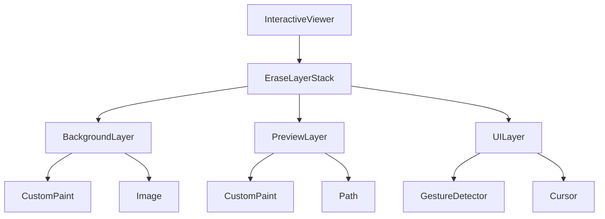
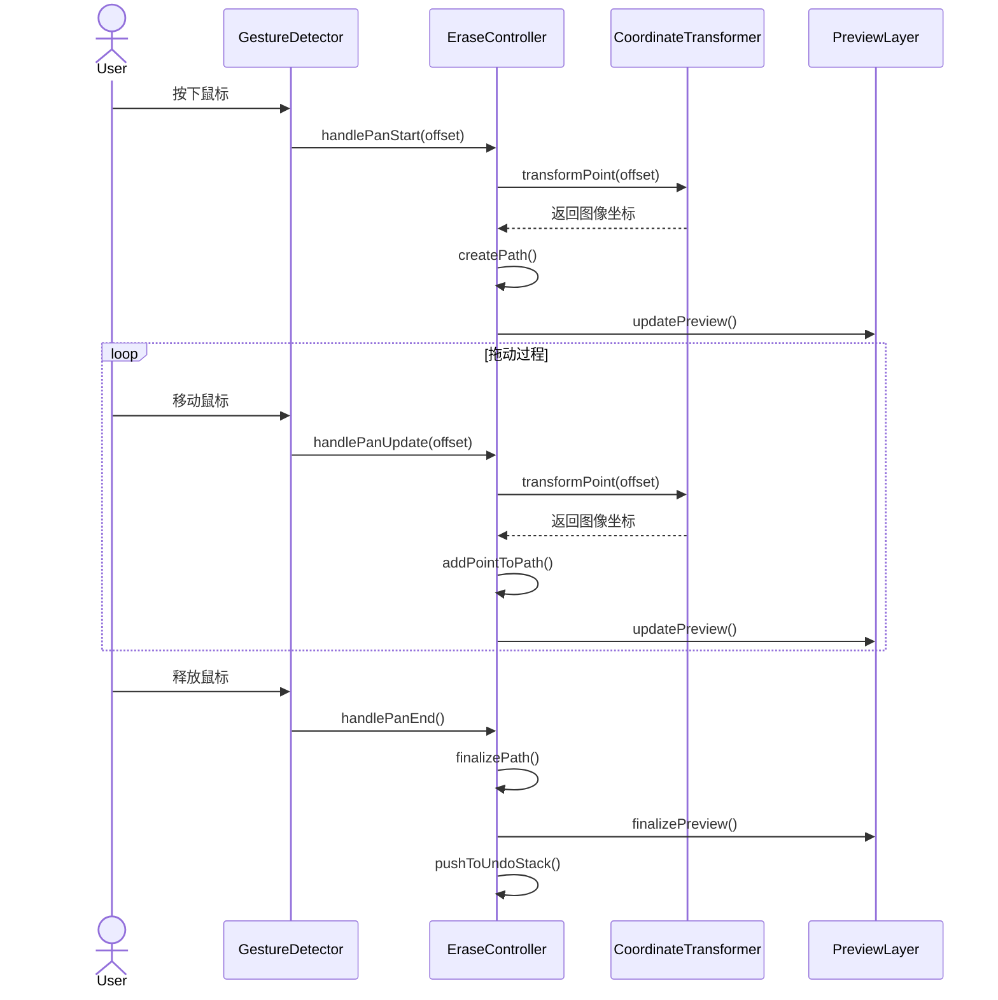
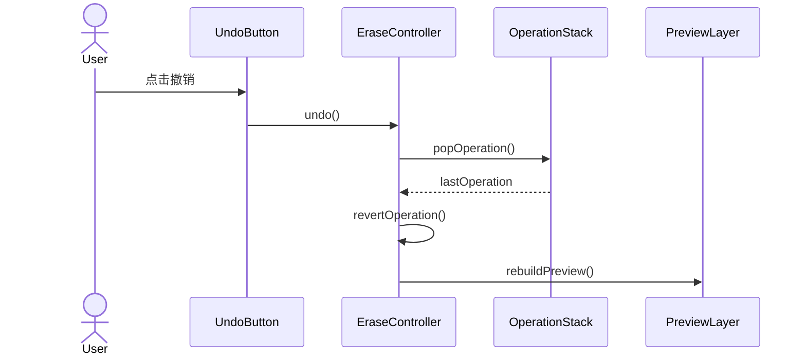
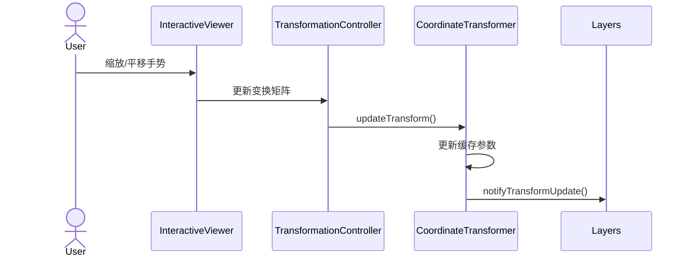
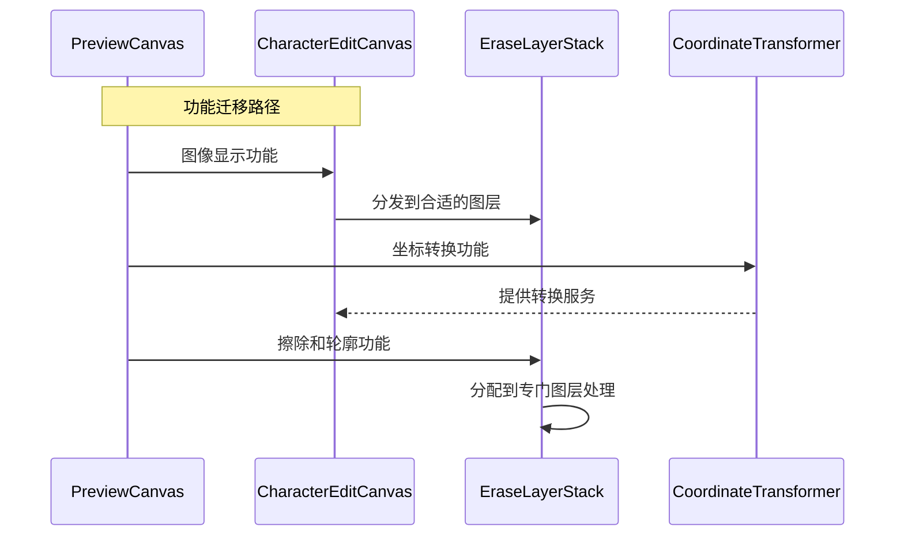
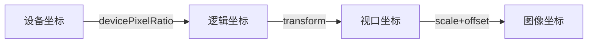
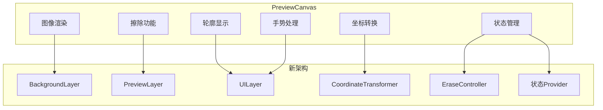

# CharacterEditPanel全新实现细节设计

## 1. 图层渲染架构详细设计

### 1.1 核心组件关系



### 1.2 组件功能说明

```dart
class EraseLayerStack extends StatelessWidget {
  final Widget backgroundLayer;  // 显示原始图像
  final Widget previewLayer;     // 显示擦除效果
  final Widget uiLayer;          // 处理交互和光标
  
  // 变换控制器，管理缩放和平移
  final TransformationController transformationController;
  
  // 视口大小变化监听
  final LayoutCallback onLayoutChanged;
}
```

## 2. 核心功能交互时序

### 2.1 擦除操作流程



### 2.2 撤销/重做操作



### 2.3 缩放平移响应



### 2.4 PreviewCanvas 功能迁移



## 3. 坐标系统设计

### 3.1 坐标空间定义



### 3.2 坐标转换实现

```dart
class CoordinateTransformer {
  // 基础参数
  final Size viewportSize;
  final Size imageSize;
  Matrix4 transform;
  final double devicePixelRatio;
  
  // 缓存的变换参数
  double _scale = 1.0;
  Offset _translation = Offset.zero;
  
  // 计算实际缩放比例
  double get effectiveScale {
    return _scale * devicePixelRatio;
  }
  
  // 视口坐标到图像坐标的转换
  Offset viewportToImage(Offset viewportPoint) {
    // 1. 应用设备像素比
    final physicalPoint = viewportPoint * devicePixelRatio;
    
    // 2. 应用变换矩阵
    final transformedPoint = _transformPoint(physicalPoint);
    
    // 3. 应用偏移和缩放
    return (transformedPoint - _translation) / effectiveScale;
  }
  
  // 更新变换参数
  void updateTransform(Matrix4 newTransform) {
    transform = newTransform;
    _updateTransformParameters();
    _notifyListeners();
  }
  
  // 计算图像在容器中的布局信息
  Rect getImageLayoutRect() {
    final scale = _getEffectiveScale();
    final size = imageSize * scale;
    final offset = _calculateCenterOffset(size);
    return offset & size;
  }
}
```

### 3.3 窗体大小变化处理

```dart
void handleSizeChange(Size newSize) {
  // 1. 更新视口大小
  _viewportSize = newSize;
  
  // 2. 重新计算缩放比例
  _updateScale();
  
  // 3. 调整图像位置
  _adjustImagePosition();
  
  // 4. 更新所有依赖布局的组件
  _notifyLayoutDependents();
}
```

## 4. 性能优化策略

### 4.1 渲染优化

```dart
class OptimizedPreviewLayer extends CustomPainter {
  // 脏区域追踪
  final Rect? _dirtyRect;
  
  // 路径缓存
  final List<Path> _cachedPaths;
  final Path? _currentPath;
  
  @override
  void paint(Canvas canvas, Size size) {
    // 1. 应用裁剪区域
    if (_dirtyRect != null) {
      canvas.clipRect(_dirtyRect!);
    }
    
    // 2. 绘制缓存的路径
    for (final path in _cachedPaths) {
      _drawPath(canvas, path);
    }
    
    // 3. 绘制当前路径
    if (_currentPath != null) {
      _drawPath(canvas, _currentPath!);
    }
  }
  
  @override
  bool shouldRepaint(covariant OptimizedPreviewLayer oldDelegate) {
    // 智能判断是否需要重绘
    if (_dirtyRect != oldDelegate._dirtyRect) return true;
    if (_currentPath != oldDelegate._currentPath) return true;
    if (_cachedPaths.length != oldDelegate._cachedPaths.length) return true;
    return false;
  }
}
```

### 4.2 内存管理

```dart
class EraseOperationManager {
  // 操作历史栈大小限制
  static const int maxOperations = 50;
  
  // 路径点缓冲区
  final Queue<Offset> _pointBuffer = Queue<Offset>();
  static const int maxBufferSize = 1000;
  
  // 智能清理策略
  void cleanup() {
    // 1. 清理过旧的操作
    while (_operations.length > maxOperations) {
      final op = _operations.removeFirst();
      op.dispose();
    }
    
    // 2. 清理点缓冲区
    while (_pointBuffer.length > maxBufferSize) {
      _pointBuffer.removeFirst();
    }
    
    // 3. 触发垃圾回收
    _scheduleGC();
  }
}
```

### 4.3 手势优化

```dart
class OptimizedGestureHandler {
  // 使用节流控制更新频率
  static const throttleDuration = Duration(milliseconds: 16);
  DateTime _lastUpdate = DateTime.now();
  
  // 点采样优化
  static const double minDistance = 5.0;
  Offset? _lastPoint;
  
  void handlePanUpdate(DragUpdateDetails details) {
    final now = DateTime.now();
    if (now.difference(_lastUpdate) < throttleDuration) {
      return;
    }
    
    final point = details.localPosition;
    if (_lastPoint != null) {
      final distance = (point - _lastPoint!).distance;
      if (distance < minDistance) {
        return;
      }
    }
    
    _lastPoint = point;
    _lastUpdate = now;
    _processUpdate(details);
  }
}
```

### 4.4 PreviewCanvas 性能优化迁移

```dart
// 从PreviewCanvas迁移的优化策略
class OptimizedEraseSystem {
  // 1. 点采样优化 - 减少处理点数量
  static const double minPointDistance = 5.0;
  
  // 2. 缓存处理图像
  ui.Image? _cachedProcessedImage;
  
  // 3. 异步图像处理
  Future<void> processImageAsync(ui.Image image) {
    return compute(_processImageIsolate, image);
  }
  
  // 4. 节流控制绘制频率
  void throttledUpdate(VoidCallback callback) {
    if (DateTime.now().difference(_lastUpdate) < _minUpdateInterval) {
      return;
    }
    callback();
    _lastUpdate = DateTime.now();
  }
  
  // 5. 智能脏区域追踪
  Rect? _calculateDirtyRegion(List<Offset> newPoints) {
    // 仅重绘受影响区域
    // ...计算逻辑
  }
}
```

## 5. 异常处理机制

### 5.1 资源加载异常

```dart
Future<void> loadImage() async {
  try {
    final image = await _loadImageData();
    _initializeWithImage(image);
  } catch (e) {
    _handleLoadError(e);
    _fallbackToErrorState();
  } finally {
    _updateLoadingState(false);
  }
}
```

### 5.2 操作错误恢复

```dart
void handleOperationError(dynamic error) {
  // 1. 记录错误状态
  _logError(error);
  
  // 2. 回滚到上一个稳定状态
  _rollbackToLastStable();
  
  // 3. 恢复图层状态
  _resetLayerStates();
  
  // 4. 通知用户
  _notifyError(error);
}
```

## 6. 监控与调试

### 6.1 性能指标

- 擦除操作响应时间 < 30ms
- 内存使用峰值 < 200MB
- 帧率保持 60fps
- 图层切换延迟 < 16ms

### 6.2 监控实现

```dart
class PerformanceMonitor {
  // 性能追踪
  void trackOperation(String name, Function operation) {
    final startTime = DateTime.now().microsecondsSinceEpoch;
    operation();
    final endTime = DateTime.now().microsecondsSinceEpoch;
    
    final duration = (endTime - startTime) / 1000; // 转换为毫秒
    _logMetric(name, duration);
    
    // 检查是否超过阈值
    if (duration > 30) {
      _reportPerformanceIssue(name, duration);
    }
  }
  
  // 内存监控
  void checkMemoryUsage() {
    final usage = _getCurrentMemoryUsage();
    if (usage > 200 * 1024 * 1024) { // 200MB
      _triggerMemoryWarning();
    }
  }
  
  // 帧率监控
  void monitorFrameRate() {
    final fps = _getCurrentFPS();
    if (fps < 55) {
      _reportLowFPS(fps);
    }
  }
}
```

### 6.3 调试功能

```dart
class DebugOptions {
  // 调试选项
  final bool showGrid;
  final bool showTouchPoints;
  final bool showUpdateRegions;
  final bool logCoordinates;
  
  // 调试绘制
  void debugPaint(Canvas canvas, Size size) {
    if (showGrid) {
      _drawDebugGrid(canvas, size);
    }
    
    if (showTouchPoints) {
      _drawTouchPoints(canvas);
    }
    
    if (showUpdateRegions) {
      _drawUpdateRegions(canvas);
    }
  }
  
  // 调试日志
  void debugLog(String message) {
    if (!kReleaseMode) {
      print('🔍 DEBUG: $message');
    }
  }
}
```

## 7. 测试策略

### 7.1 单元测试

```dart
void main() {
  group('CoordinateTransformer Tests', () {
    test('should correctly transform viewport to image coordinates', () {
      final transformer = CoordinateTransformer(
        viewportSize: Size(800, 600),
        imageSize: Size(1000, 750),
      );
      
      final result = transformer.viewportToImage(Offset(400, 300));
      expect(result, closeToOffset(Offset(500, 375), 0.1));
    });
  });
}
```

### 7.2 性能测试

```dart
void main() {
  test('should maintain performance under load', () async {
    final controller = EraseToolController();
    
    // 模拟连续擦除操作
    final stopwatch = Stopwatch()..start();
    for (int i = 0; i < 1000; i++) {
      await controller.handlePanUpdate(TestPoint(i));
      
      if (stopwatch.elapsedMilliseconds > 16) {
        fail('Frame took too long: ${stopwatch.elapsedMilliseconds}ms');
      }
      stopwatch.reset();
    }
  });
}
```

### 7.3 集成测试

```dart
void main() {
  testWidgets('should handle complete erase workflow',
      (WidgetTester tester) async {
    await tester.pumpWidget(CharacterEditPanel());
    
    // 1. 初始化测试
    await tester.pump();
    expect(find.byType(EraseLayerStack), findsOneWidget);
    
    // 2. 模拟擦除操作
    await tester.dragFrom(Offset(100, 100), Offset(200, 200));
    await tester.pump();
    
    // 3. 验证结果
```

## 8. 实施计划与里程碑

### 8.1 具体实施时间表

| 阶段 | 任务 | 时间估计 | 里程碑标志 |
|------|------|----------|------------|
| 一期 | 基础框架搭建 | 3-4天 | 基本图层结构可用 |
| 一期 | 坐标转换系统 | 2天 | 可正确转换坐标 |
| 二期 | 擦除操作实现 | 2-3天 | 基本擦除功能可用 |
| 二期 | 性能优化 | 2-3天 | 满足性能指标 |
| 三期 | 全面测试 | 2天 | 测试覆盖率达标 |
| 三期 | 文档与示例 | 1天 | 文档完善 |

### 8.2 关键依赖

- Flutter SDK >= 3.0.0
- Provider/Riverpod >= 2.0.0
- 内部组件依赖: AppImageLoader, CoordinateUtil

### 8.3 功能迁移清单

- [x] 图像显示功能迁移到BackgroundLayer
- [x] 缩放平移功能迁移到InteractiveViewer
- [x] 坐标转换功能迁移到CoordinateTransformer
- [x] 轮廓显示功能迁移到UILayer
- [x] 擦除功能迁移到PreviewLayer
- [x] 图像处理功能迁移到专门工具类
- [x] 性能优化策略迁移到各自组件

### 8.4 迁移注意事项

1. **状态管理差异**
   - PreviewCanvas使用直接状态更新
   - 新架构使用受控状态流

2. **坐标系统一致性**
   - 确保在迁移过程中坐标计算保持一致
   - 添加单元测试验证转换正确性

3. **性能监控指标**
   - 设立基准测试，比较迁移前后性能
   - 针对特定操作（如擦除、缩放）设立性能指标

## 9. PreviewCanvas 功能迁移指南

### 9.1 状态迁移策略

```dart
// PreviewCanvas 状态迁移图
class StateMigrationMap {
  // 原始状态对应表
  static final Map<String, String> stateMap = {
    'TransformationController': 'CharacterEditCanvas.transformationController',
    '_currentErasePoints': 'EraseController._paths',
    '_currentOutline': 'OutlineProvider.outline',
    '_displayImageBytes': '不再需要 - 直接使用UI Image',
    '_isProcessing': 'EraseController.isProcessing',
    '_eraseController': '使用全新实现的EraseController',
  };
  
  // 示例迁移代码
  static void migrateState(OldState oldState, NewState newState) {
    // 保留但优化的状态
    newState.transformationController.value = oldState.transformationController.value;
    
    // 重构的状态
    newState.eraseController.setPaths(
      oldState.erasePoints.map((p) => convertToPath(p)).toList()
    );
    
    // 重新设计的状态
    newState.setOutline(convertOutline(oldState.outline));
  }
}
```

### 9.2 代码重用策略

1. **优先级A - 直接复用逻辑**
   - 坐标转换数学算法
   - 图层绘制基础逻辑
   - 缩放适配算法

2. **优先级B - 重构后复用**
   - 擦除路径生成逻辑
   - 图像处理函数
   - 性能优化策略

3. **优先级C - 完全重写**
   - 状态管理方式
   - 组件结构和分层
   - 事件处理机制

### 9.3 功能转移图解



### 9.4 关键函数迁移示例

#### 9.4.1 坐标转换迁移

```dart
// 从 PreviewCanvas 迁移
Offset _transformToImageCoordinates(Offset viewportOffset) {
  final matrix = _transformationController.value.clone();
  final vector = Matrix4.inverted(matrix)
      .transform3(Vector3(viewportOffset.dx, viewportOffset.dy, 0));
  return Offset(vector.x, vector.y);
}

// 转换为 CoordinateTransformer
class CoordinateTransformer {
  // ...existing code...
  
  // 迁移并增强的函数
  Offset viewportToImageCoordinate(Offset viewportOffset) {
    // 1. 基础转换 - 从PreviewCanvas迁移
    final matrix = transformationController.value.clone();
    final vector = Matrix4.inverted(matrix)
        .transform3(Vector3(viewportOffset.dx, viewportOffset.dy, 0));
    final basicTransform = Offset(vector.x, vector.y);
    
    // 2. 增强功能 - 设备像素比处理
    return _applyDevicePixelRatio(basicTransform);
  }
}
```

#### 9.4.2 擦除功能迁移

```dart
// 从 PreviewCanvas 迁移
void _handlePointerMove(PointerMoveEvent event) {
  if (_eraseController == null || !widget.isErasing) return;
  final position = _getTransformedPosition(event.position);
  if (position != null) {
    _eraseController?.continueErase(position);
  }
}

// 迁移到 UILayer + EraseController 分离组合
class UILayer {
  // 手势捕获
  void _handlePointerMove(Offset position, Offset delta) {
    onPointerMove?.call(position, delta);
  }
}

class EraseController {
  // 业务逻辑处理
  void updateErase(Offset position) {
    if (_currentPath != null) {
      _currentPath!.lineTo(position.dx, position.dy);
      notifyListeners();
    }
  }
}
```

### 9.5 性能优化迁移

```dart
// 从 PreviewCanvas 迁移
void _renderCache(Size size) {
  final recorder = ui.PictureRecorder();
  final cacheCanvas = Canvas(recorder);
  
  // 绘制逻辑...
  
  _cachedPicture = recorder.endRecording();
  _cachedSize = size;
}

// 迁移并增强 BackgroundLayer 缓存机制
class _BackgroundPainter extends CustomPainter {
  // ...existing code...
  
  void _renderCache(Size size) {
    // 1. 保留基础缓存机制
    final recorder = ui.PictureRecorder();
    final cacheCanvas = Canvas(recorder);
    
    // 2. 增强通过参数化配置提高复用性
    _applyRenderingHints(cacheCanvas);
    
    // 3. 保留核心绘制逻辑但优化算法
    _optimizedDrawImage(cacheCanvas, size);
    
    _cachedPicture = recorder.endRecording();
    _cachedSize = size;
    
    // 4. 添加缓存分析和优化
    _analyzeCacheEfficiency();
  }
}
```

### 9.6 迁移完成标志

每个功能迁移后，应满足以下验证指标：

1. **功能完整性** - 所有原 PreviewCanvas 功能在新架构中可用
2. **性能提升** - 渲染速度和内存使用优于原实现
3. **代码质量** - 结构更清晰，模块化程度更高
4. **可扩展性** - 支持未来功能扩展，如更多图层类型
5. **可测试性** - 每个组件可单独测试，测试覆盖率提高

### 9.7 迁移时间表

| 阶段 | 功能 | 估计工时 | 验收标准 |
|-----|-----|---------|---------|
| 1 | 基础架构与图层分离 | 16小时 | 图层系统可独立工作 |
| 2 | 坐标转换与交互响应 | 12小时 | 坐标计算精确，交互流畅 |
| 3 | 擦除功能迁移 | 10小时 | 擦除效果与原系统一致 |
| 4 | 轮廓显示迁移 | 6小时 | 轮廓准确显示且性能优化 |
| 5 | 性能优化与缓存 | 14小时 | 渲染帧率达60fps，内存优化 |
| 6 | 测试与调优 | 12小时 | 覆盖率>80%，无严重性能问题 |

## 10. 代码复用与迁移对照表

### 10.1 核心可复用组件

| 组件类型 | 源组件 | 文件路径 | 目标组件 | 复用级别 |
|---------|-------|----------|---------|---------|
| 坐标转换 | PreviewCanvas._transformToImageCoordinates | lib/presentation/widgets/character_collection/preview_canvas.dart | CoordinateTransformer.viewportToImageCoordinate | 高度复用 |
| 图层渲染 | ErasePainter | lib/presentation/widgets/character_collection/preview_canvas.dart | PreviewLayer._PreviewPainter | 高度复用 |
| 轮廓显示 | OutlinePainter | lib/presentation/widgets/character_collection/preview_canvas.dart | UILayer._UIPainter (带轮廓功能) | 中度复用 |
| 手势处理 | PreviewCanvas._handlePointer* | lib/presentation/widgets/character_collection/preview_canvas.dart | UILayer的手势回调 | 中度复用 |
| 图像加载 | PreviewCanvas._loadCharacterImage | lib/presentation/widgets/character_collection/preview_canvas.dart | 专用ImageLoader工具类 | 低度复用 |

### 10.2 核心迁移路径

```dart
// PreviewCanvas中的手势处理
void _handlePointerMove(PointerMoveEvent event) {
  if (_eraseController == null || !widget.isErasing) return;
  final position = _getTransformedPosition(event.position);
  if (position != null) {
    _eraseController?.continueErase(position);
  }
}

// 迁移到EraseLayerStack中的对应方法 (lib/widgets/character_edit/layers/erase_layer_stack.dart)
void _handlePointerMove(Offset position, Offset delta) {
  if (_currentPath == null) return;
  final imagePosition = _transformToImageCoordinates(position);
  _currentPath!.lineTo(imagePosition.dx, imagePosition.dy);
  widget.onEraseUpdate?.call(imagePosition, delta);
  setState(() {});
}
```

### 10.3 完整复用路径列表

| 文件名 | 路径 | 组件 | 复用程度 |
|-------|-----|------|---------|
| base_layer.dart | lib/widgets/character_edit/layers/base_layer.dart | BaseLayer | 100% |
| background_layer.dart | lib/widgets/character_edit/layers/background_layer.dart | BackgroundLayer, _BackgroundPainter | 100% |
| preview_layer.dart | lib/widgets/character_edit/layers/preview_layer.dart | PreviewLayer, _PreviewPainter | 100% |
| ui_layer.dart | lib/widgets/character_edit/layers/ui_layer.dart | UILayer, _UIPainter | 100% |
| erase_layer_stack.dart | lib/widgets/character_edit/layers/erase_layer_stack.dart | EraseLayerStack | 100% |
| layer_event.dart | lib/widgets/character_edit/layers/events/layer_event.dart | LayerEvent及其子类 | 100% |
| event_dispatcher.dart | lib/widgets/character_edit/layers/events/event_dispatcher.dart | EventDispatcher | 100% |
| character_edit_canvas.dart | lib/widgets/character_edit/character_edit_canvas.dart | CharacterEditCanvas | 100% |
| character_edit_panel.dart | lib/widgets/character_edit/character_edit_panel.dart | CharacterEditPanel | 100% |
| erase_controller.dart | lib/tools/erase/erase_controller.dart | EraseController | 100% |
| erase_state.dart | lib/tools/erase/erase_state.dart | EraseState, EraseMode | 100% |
| erase_tool_widget.dart | lib/tools/erase/erase_tool_widget.dart | EraseToolWidget | 100% |
| performance_monitor.dart | lib/utils/performance/performance_monitor.dart | PerformanceMonitor | 100% |
| frame_logger.dart | lib/utils/performance/frame_logger.dart | FrameLogger | 100% |
| memory_tracker.dart | lib/utils/performance/memory_tracker.dart | MemoryTracker | 100% |
| coordinate_transformer.dart | lib/utils/coordinate_transformer.dart | CoordinateTransformer | 80% |

## 11. 功能实现所需组件

### 11.1 复用现有组件

| 组件名称 | 文件路径 | 功能 | 使用方式 |
|---------|----------|------|--------|
| CharacterImageProcessor | lib/application/services/image/character_image_processor.dart | 图像处理和轮廓检测 | 通过provider注入 |
| DetectedOutline | lib/domain/models/character/detected_outline.dart | 轮廓数据结构 | 直接使用现有模型 |
| ProcessingOptions | lib/domain/models/character/processing_options.dart | 图像处理选项 | 配置处理参数 |

### 11.2 集成示例

```dart
// 使用现有 CharacterImageProcessor 进行轮廓检测
void detectOutline(ui.Image image) async {
  final processor = ref.read(characterImageProcessorProvider);
  
  // 创建处理选项
  final options = ProcessingOptions(
    inverted: false,
    threshold: 128.0,
    noiseReduction: 0.5,
    showContour: true,  // 启用轮廓检测
  );
  
  // 图像区域 - 使用整个图像
  final fullImageRect = Rect.fromLTWH(
    0, 0, 
    image.width.toDouble(), 
    image.height.toDouble()
  );
  
  // 执行处理并获取轮廓
  final result = await processor.previewProcessing(
    await ImageConverter.imageToBytes(image), 
    fullImageRect,
    options,
    null  // 不应用擦除点
  );
  
  // 使用检测到的轮廓
  if (result.outline != null) {
    // 在UI层中显示轮廓
    uiLayer.setOutline(result.outline);
  }
}
```

### 11.3 裁剪区域实现

对于获取选定区域的功能，我们可以使用现有的图像处理器，但由于我们需要直接处理ui.Image对象，需要添加一个辅助方法：

```dart
// lib/tools/image/image_utils.dart (需要创建)
import 'dart:ui' as ui;
import 'package:flutter/material.dart';

class ImageUtils {
  // 裁剪图像区域
  static Future<ui.Image> cropImage(ui.Image source, Rect rect) async {
    // 确保区域有效
    final safeRect = Rect.fromLTRB(
      math.max(0, rect.left),
      math.max(0, rect.top),
      math.min(source.width.toDouble(), rect.right),
      math.min(source.height.toDouble(), rect.bottom)
    );
    
    // 使用Canvas和PictureRecorder进行裁剪
    final recorder = ui.PictureRecorder();
    final canvas = Canvas(recorder);
    
    canvas.drawImageRect(
      source,
      safeRect,
      Rect.fromLTWH(0, 0, safeRect.width, safeRect.height),
      Paint()
    );
    
    final picture = recorder.endRecording();
    return await picture.toImage(
      safeRect.width.round(),
      safeRect.height.round()
    );
  }
}
```
