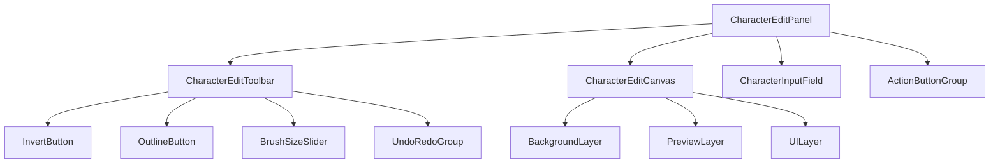
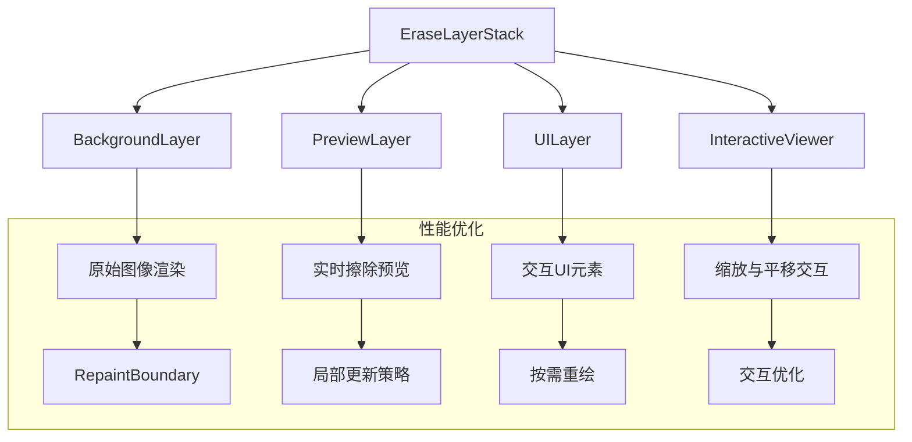

# CharacterEditPanel 全新实现方案

## 1. 组件结构设计



## 2. 性能优化设计

### 2.1 渲染优化策略

- 使用`RepaintBoundary`严格控制重绘范围
- 实现自定义`CustomPainter`降低渲染复杂度
- 优化图层合成策略，减少透明度计算
- 目标：擦除操作延迟控制在30ms以内

### 2.2 状态管理优化

- 分离UI状态和业务状态
- 实现高效的状态更新机制
- 优化撤销/重做操作的内存使用

### 2.3 图层渲染架构



## 3. 交互设计改进

### 3.1 工具栏交互

- 优化按钮反馈动效
- 改进滑块操作体验
- 添加快捷键支持

### 3.2 画布交互

- 鼠标滚轮：缩放
- Alt + 拖动：平移
- 鼠标拖动：擦除

## 4. 核心实现策略

### 4.1 擦除工具优化

```dart
class EraseOperation {
  final Path path;
  final double brushSize;
  final Rect bounds;

  // 计算最小更新区域
  Rect getUpdateRegion() {
    return path.getBounds().inflate(brushSize);
  }
}
```

### 4.2 实时渲染优化

```dart
class OptimizedPreviewLayer extends CustomPainter {
  // 局部更新策略
  bool shouldRepaint(covariant CustomPainter oldDelegate) {
    if (updateRegion == null) return false;
    return oldDelegate.updateRegion?.overlaps(updateRegion) ?? true;
  }

  // 优化绘制逻辑
  void paint(Canvas canvas, Size size) {
    if (updateRegion != null) {
      canvas.clipRect(updateRegion!);
    }
    // 绘制逻辑
  }
}
```

### 4.3 坐标转换优化

```dart
class OptimizedCoordinateTransformer {
  // 缓存变换矩阵
  Matrix4? _cachedTransform;
  
  // 优化坐标转换
  Offset transformPoint(Offset point) {
    if (_cachedTransform != null) {
      return _cachedTransform!.transform(point);
    }
    // 计算新变换
  }
}
```

## 5. 实现步骤

1. **第一阶段：基础框架搭建（1-2天）**
   - 创建新的组件结构
   - 实现基本布局
   - 搭建状态管理框架

2. **第二阶段：核心功能实现（2-3天）**
   - 实现优化后的擦除功能
   - 开发画布交互功能
   - 完善工具栏功能

3. **第三阶段：性能优化（2-3天）**
   - 实现渲染优化
   - 优化状态管理
   - 改进交互体验

4. **第四阶段：测试和调优（1-2天）**
   - 进行性能测试
   - 优化用户体验
   - 处理边缘情况

## 6. 注意事项

### 6.1 性能监控

- 实时监控渲染延迟
- 定期进行性能检查
- 建立性能基准

### 6.2 兼容性处理

- 保持数据格式兼容
- 确保功能向后兼容
- 平滑升级策略

### 6.3 可维护性

- 清晰的代码结构
- 完善的注释文档
- 合理的抽象分层
