## 8. 详细交互时序

字符编辑面板(CharacterEditPanel)是一个用于编辑和处理单个汉字图像的界面组件。它提供了直观的擦除工具、图像处理选项和实时预览功能。

## 2. 界面结构

### 2.1 整体布局

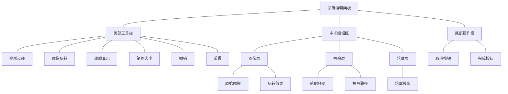

### 2.2 组件详细规格

#### 工具栏 (60px高)

```
┌────────────────────────────────────────────┐
│ ⚫ ⚪ ◯  |====○====| 10 ↩ ↪               │
└────────────────────────────────────────────┘
  ① ② ③     ④      ⑤  ⑥ ⑦

① 笔刷反转按钮    ⑤ 笔刷大小数值
② 图像反转按钮    ⑥ 撤销按钮
③ 轮廓显示按钮    ⑦ 重做按钮
④ 笔刷大小滑块
```

#### 编辑区域

```
┌────────────────────────────────────────────┐
│     缩放范围: 0.1x - 5.0x                 │
│     ┌──────────────────┐                  │
│     │                  │                  │
│     │    图像层        │                  │
│     │    擦除层        │                  │
│     │    轮廓层        │                  │
│     │                  │                  │
│     └──────────────────┘                  │
│                                          │
└────────────────────────────────────────────┘
```

#### 底部操作栏 (60px高)

```
┌────────────────────────────────────────────┐
│ [取消]                            [完成]   │
└────────────────────────────────────────────┘
```

## 3. 详细功能说明

### 3.1 擦除功能

#### 3.1.1 点击擦除

- 触发方式：鼠标左键单击
- 擦除效果：
  - 在点击位置创建圆形擦除区域
  - 圆形直径等于当前笔刷大小
  - 瞬时生效，无过渡动画
- 反馈：
  - 触觉反馈（轻触）
  - 视觉反馈（立即显示擦除效果）
- 撤销/重做：
  - 每次点击作为独立操作
  - 可以单独撤销/重做

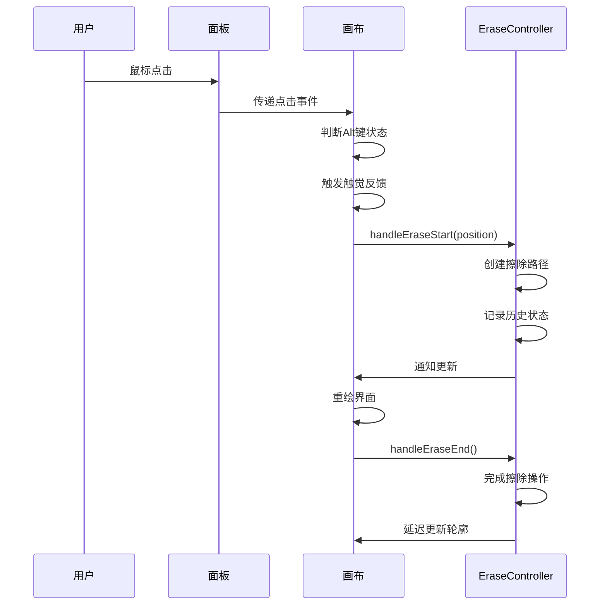

#### 3.1.2 拖动擦除

- 触发方式：鼠标左键按住拖动
- 擦除效果：
  - 生成连续的擦除路径
  - 路径宽度等于笔刷大小
  - 实时显示擦除效果
- 路径优化：
  - 点密度控制：每隔笔刷大小/2采样一个点
  - 路径平滑：自动插入3个插值点
  - 实时绘制：跟随鼠标移动即时显示
- 操作控制：
  - 开始：按下左键
  - 结束：松开左键
  - 中断：按下Alt键
- 撤销/重做：
  - 整段路径作为一个操作
  - 可以完整撤销/重做
  
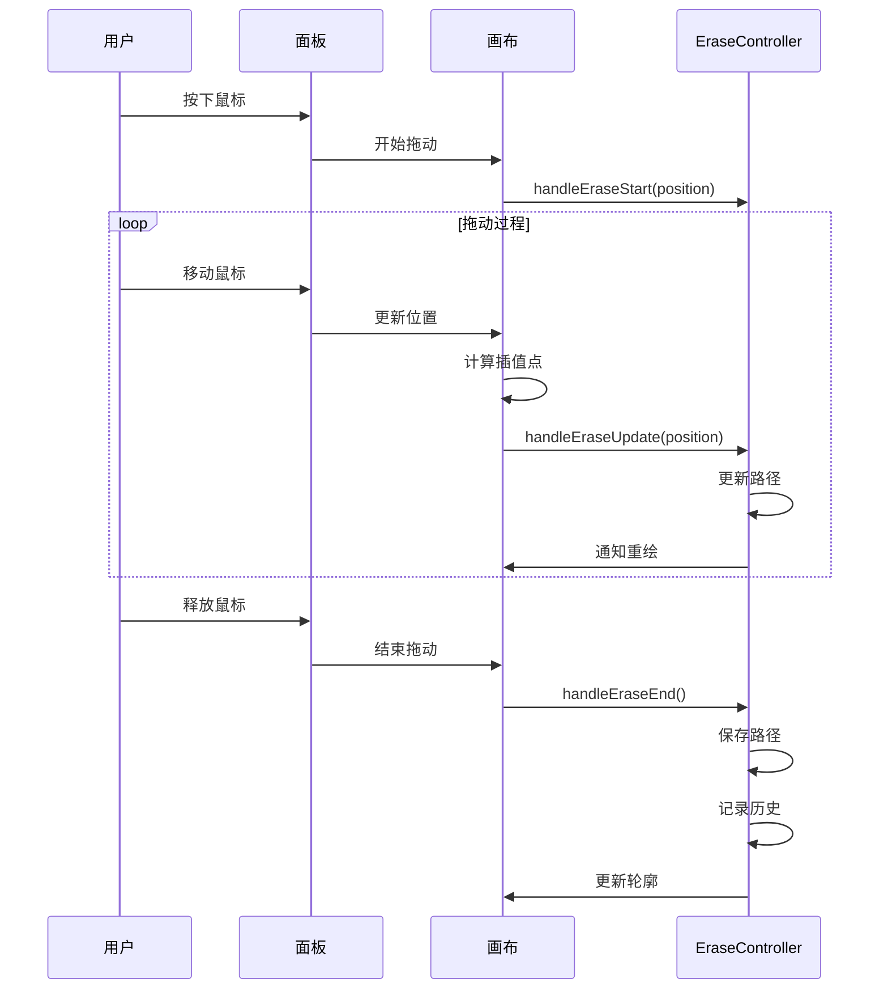

#### 3.1.3 撤销/重做机制

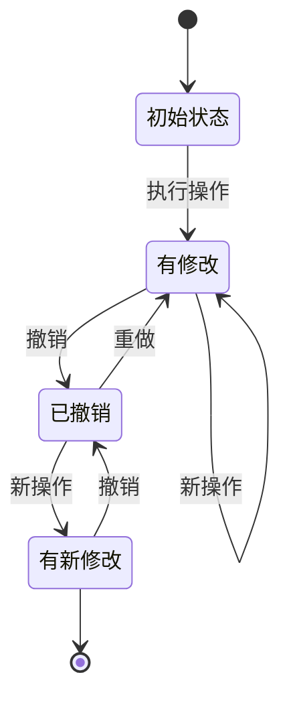

- 操作历史结构：

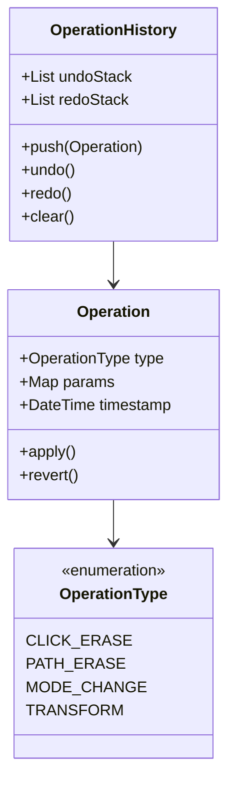

### 3.2 图像处理模式

#### 3.2.1 轮廓显示模式

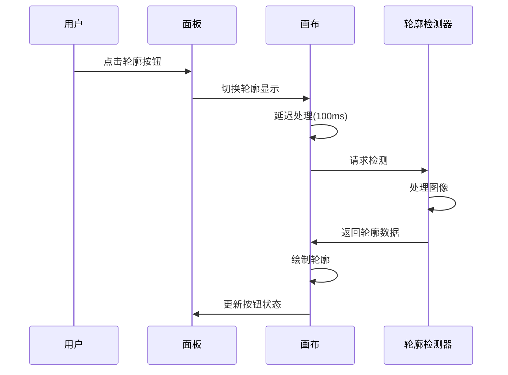

- 开启效果：
  - 实时检测和显示字符轮廓
  - 轮廓线条使用蓝色显示
  - 更新延迟：100ms（防抖）
- 关闭效果：
  - 隐藏轮廓显示
  - 保持当前擦除状态
- 轮廓检测参数：
  - 阈值：128
  - 降噪：0.5
  - 检测范围：整个可见区域
- 性能优化：
  - 增量更新
  - 仅在必要时重新检测
  - 检测过程不阻塞UI

#### 3.2.2 图像反转模式

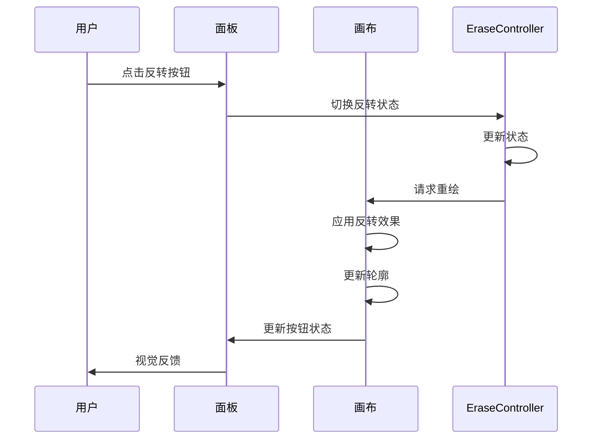

- 开启效果：
  - 图像明暗反转
  - 实时预览
  - 影响轮廓检测结果
- 关闭效果：
  - 恢复原始明暗
  - 实时预览
  - 重新计算轮廓
- 图像处理：
  - 不修改原始数据
  - 仅影响显示效果
  - 可与擦除效果叠加

#### 3.2.3 笔刷反转模式

- 开启效果：
  - 笔刷由擦除变为填充
  - 视觉效果相反
  - 实时预览
- 关闭效果：
  - 恢复标准擦除模式
  - 保持已有编辑效果
- 操作特点：
  - 可随时切换
  - 不影响已完成的编辑
  - 与其他模式可组合

### 3.3 图像显示控制

#### 3.3.1 缩放操作

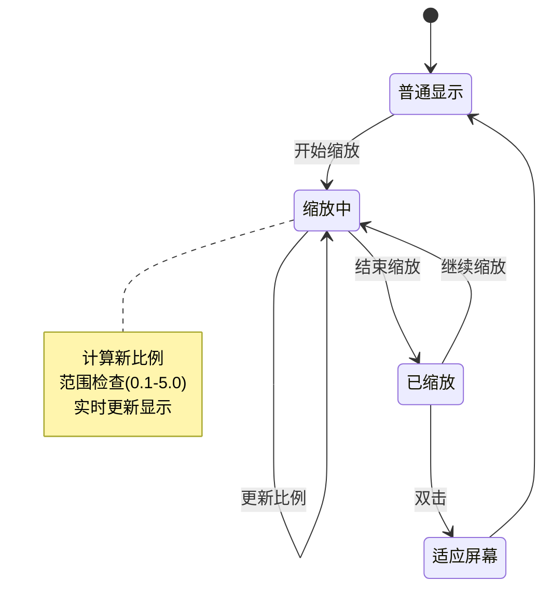

- 缩放方式：
  1. 鼠标滚轮
     - 向上：放大
     - 向下：缩小
  2. 手势缩放
     - 双指操作
     - 平滑过渡
- 范围控制：
  - 最小：0.1倍
  - 最大：5.0倍
  - 步进：连续

#### 3.3.2 平移操作

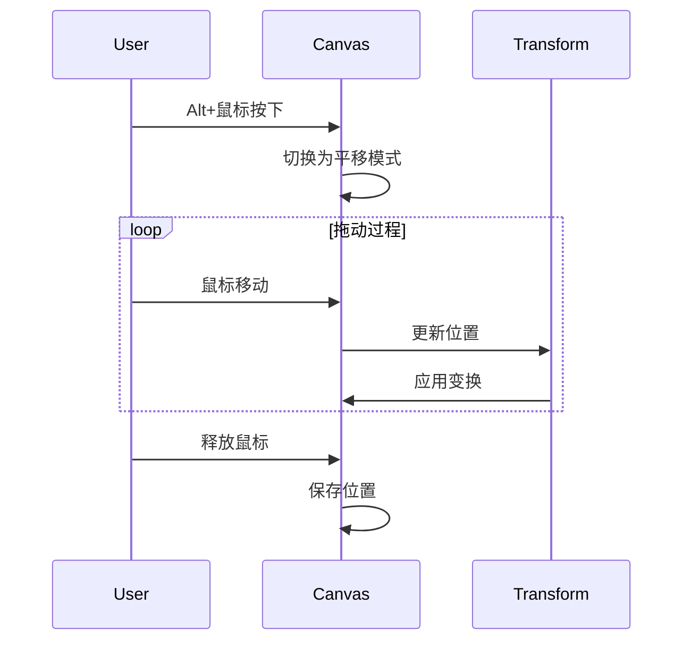

- 触发方式：Alt+鼠标拖动
- 响应特点：
  - 实时跟随
  - 无边界限制
  - 惯性滚动
- 状态保持：
  - 记住上次位置
  - 支持回弹
  - 自动边界检查

## 4. 性能优化

### 4.1 路径处理优化

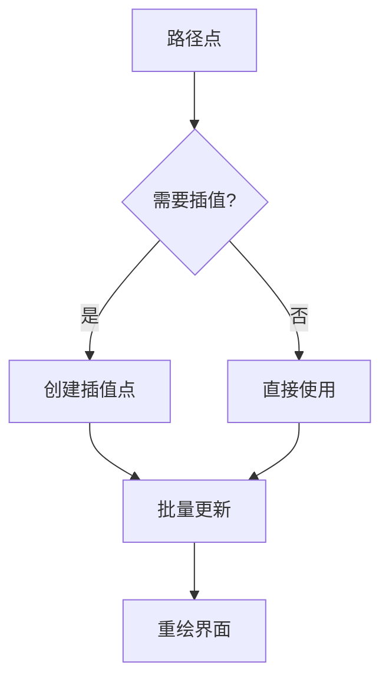

### 4.2 轮廓更新优化

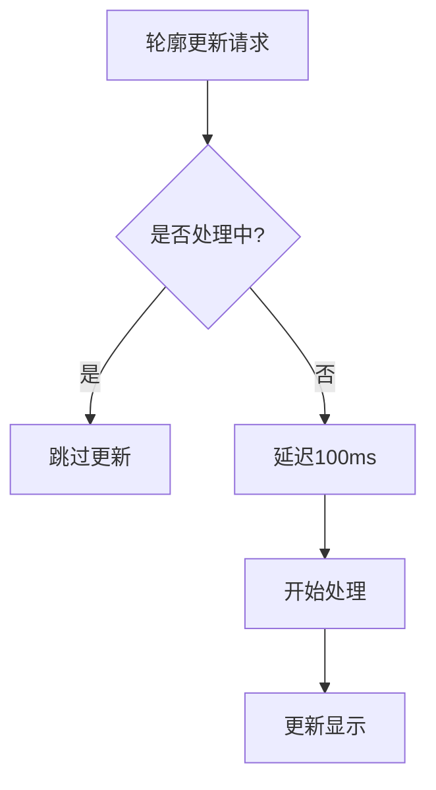

## 5. 数据流

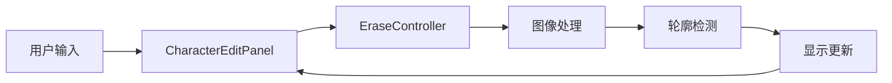

## 6. 错误处理

### 6.1 图像处理错误

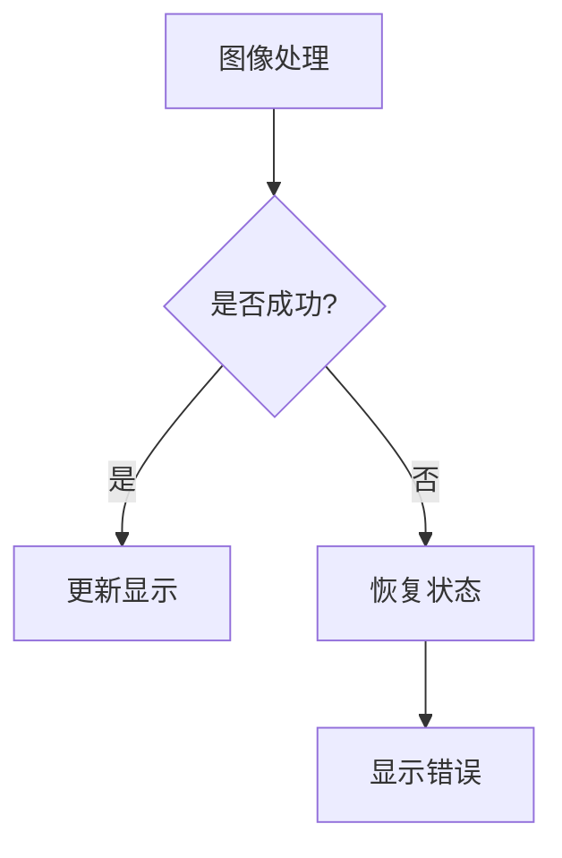

## 7. 注意事项

1. 图像处理
   - 所有编辑操作在单独图层
   - 保持原始图像不变
   - 确保图像质量不损失

2. 性能考虑
   - 大图像处理优化
   - 内存使用监控
   - 响应时间控制

3. 用户体验
   - 操作连贯性
   - 实时反馈
   - 状态清晰可见
